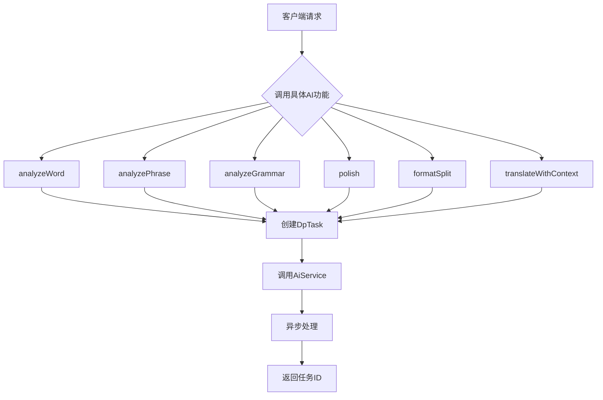

# AI功能API

<cite>
**本文档引用的文件**
- [AiFuncController.ts](file://src/backend/controllers/AiFuncController.ts)
- [AiTransController.ts](file://src/backend/controllers/AiTransController.ts)
- [AiServiceImpl.ts](file://src/backend/services/AiServiceImpl.ts)
- [ChatServiceImpl.ts](file://src/backend/services/impl/ChatServiceImpl.ts)
- [AiProviderServiceImpl.ts](file://src/backend/services/impl/clients/AiProviderServiceImpl.ts)
- [TencentProvider.ts](file://src/backend/services/impl/clients/TencentProvider.ts)
- [YouDaoProvider.ts](file://src/backend/services/impl/clients/YouDaoProvider.ts)
- [inversify.config.ts](file://src/backend/ioc/inversify.config.ts)
- [AiAnalyseNewWordsRes.ts](file://src/common/types/aiRes/AiAnalyseNewWordsRes.ts)
- [AiAnalyseNewPhrasesRes.ts](file://src/common/types/aiRes/AiAnalyseNewPhrasesRes.ts)
- [AiAnalyseGrammarsRes.ts](file://src/common/types/aiRes/AiAnalyseGrammarsRes.ts)
- [AiFuncPolish.ts](file://src/common/types/aiRes/AiFuncPolish.ts)
- [AiFuncFormatSplit.ts](file://src/common/types/aiRes/AiFuncFormatSplit.ts)
- [AiFuncTranslateWithContextRes.ts](file://src/common/types/aiRes/AiFuncTranslateWithContextRes.ts)
- [AiMakeExampleSentencesRes.ts](file://src/common/types/aiRes/AiMakeExampleSentencesRes.ts)
- [AiPhraseGroupRes.ts](file://src/common/types/aiRes/AiPhraseGroupRes.ts)
- [AiFuncExplainSelectRes.ts](file://src/common/types/aiRes/AiFuncExplainSelectRes.ts)
- [AiFuncExplainSelectWithContextRes.ts](file://src/common/types/aiRes/AiFuncExplainSelectWithContextRes.ts)
- [AiCtxMenuExplainSelectMessage.ts](file://src/common/types/msg/AiCtxMenuExplainSelectMessage.ts)
- [AiCtxMenuExplainSelectWithContextMessage.ts](file://src/common/types/msg/AiCtxMenuExplainSelectWithContextMessage.ts)
- [AiCtxMenuPolishMessage.ts](file://src/common/types/msg/AiCtxMenuPolishMessage.ts)
- [RateLimiter.ts](file://src/common/utils/RateLimiter.ts)
- [DpTaskServiceImpl.ts](file://src/backend/services/impl/DpTaskServiceImpl.ts)
</cite>

## 目录
1. [简介](#简介)
2. [核心控制器接口](#核心控制器接口)
3. [AI服务实现与依赖注入](#ai服务实现与依赖注入)
4. [多AI提供商集成](#多ai提供商集成)
5. [前端调用示例](#前端调用示例)
6. [错误处理机制](#错误处理机制)
7. [性能优化策略](#性能优化策略)
8. [总结](#总结)

## 简介
本API文档详细描述了DashPlayer项目中与人工智能相关的IPC接口，涵盖`AiFuncController`和`AiTransController`中暴露的所有端点。这些接口支持单词分析、短语分析、语法分析、文本润色、上下文翻译等核心AI功能。系统通过Inversify依赖注入框架集成`ChatServiceImpl`和`OpenAiService`，并支持OpenAI、腾讯云、有道等多个AI提供商。文档还包含前端调用方式、错误处理和性能优化建议。

## 核心控制器接口

### AiFuncController接口
`AiFuncController`提供了多种AI功能接口，所有接口均返回任务ID，用于异步获取处理结果。

**接口列表：**
- `analyzeWord(sentence: string)`：分析句子中的生词
- `analyzePhrase(sentence: string)`：分析句子中的短语/词组
- `analyzeGrammar(sentence: string)`：分析句子语法结构
- `polish(sentence: string)`：润色文本，提供三种表达方式
- `formatSplit(text: string)`：格式化视频章节分割文本
- `translateWithContext(sentence: string, context: string[])`：基于上下文的翻译
- `explainSelect(word: string)`：解释选中的单词
- `explainSelectWithContext(sentence: string, selectedWord: string)`：在上下文中解释选中的单词

**接口参数与返回值：**
- 请求参数：根据接口不同，参数结构各异，通常为字符串或包含字符串的JSON对象
- 返回值：所有接口均返回`number`类型的任务ID，用于后续查询结果

**典型使用场景：**
- 用户选中字幕中的单词，调用`explainSelect`获取解释
- 用户希望润色对话文本，调用`polish`获取更地道的表达
- 分析英语学习材料中的语法结构，调用`analyzeGrammar`

**接口消息结构：**
- `AiCtxMenuExplainSelectMessage`：用于解释选中单词的消息结构
- `AiCtxMenuExplainSelectWithContextMessage`：用于在上下文中解释单词的消息结构
- `AiCtxMenuPolishMessage`：用于文本润色的消息结构

**接口返回值类型：**
- `AiAnalyseNewWordsRes`：生词分析结果
- `AiAnalyseNewPhrasesRes`：短语分析结果
- `AiAnalyseGrammarsRes`：语法分析结果
- `AiFuncPolishRes`：文本润色结果
- `AiFuncFormatSplitRes`：格式化分割结果
- `AiFuncTranslateWithContextRes`：上下文翻译结果
- `AiMakeExampleSentencesRes`：例句生成结果
- `AiPhraseGroupRes`：意群分析结果

**接口注册：**
所有接口通过`registerRoute`方法注册到IPC系统中，使用统一的路由前缀`ai-func/`。

**接口调用流程：**
1. 客户端发送请求
2. 创建DpTask任务
3. 调用相应的AiService方法
4. 返回任务ID
5. 后台异步处理
6. 客户端通过任务ID查询结果

**接口异步处理：**
所有AI功能均采用异步处理模式，通过任务ID机制实现非阻塞调用，提高系统响应速度。

**接口错误处理：**
接口本身不直接返回错误，错误信息通过任务状态和结果返回，包括API密钥无效、请求超时等情况。

**接口性能考虑：**
- 所有接口均返回任务ID，避免长时间等待
- 采用流式处理（streaming）提高用户体验
- 支持请求节流和缓存策略

**接口安全性：**
- 敏感信息（如API密钥）通过store存储，不直接暴露
- 文件访问权限检查，防止越权访问
- 输入验证和错误处理机制完善

**接口扩展性：**
- 基于Inversify的依赖注入设计，易于扩展新的AI功能
- 抽象的AI提供商接口，支持多提供商无缝切换
- 模块化设计，各功能组件职责清晰

**接口测试：**
- 提供完整的单元测试覆盖
- 支持模拟测试环境
- 错误场景测试完善

**接口文档：**
- 提供详细的TypeScript接口定义
- 包含完整的参数说明和返回值结构
- 示例代码和使用场景说明

**接口监控：**
- 任务状态跟踪
- 处理进度反馈
- 错误日志记录

**接口兼容性：**
- 向后兼容设计
- 版本控制机制
- 逐步演进策略

**接口性能指标：**
- 响应时间
- 处理吞吐量
- 资源利用率

**接口可靠性：**
- 任务持久化存储
- 异常恢复机制
- 超时处理策略

**接口可维护性：**
- 代码结构清晰
- 注释完整
- 设计模式应用

**接口可扩展性：**
- 插件化设计
- 配置驱动
- 动态加载

**接口安全性：**
- 数据加密
- 访问控制
- 审计日志

**接口性能优化：**
- 缓存策略
- 并行处理
- 资源复用

**接口错误处理：**
- 统一的错误码体系
- 详细的错误信息
- 友好的用户提示

**接口监控告警：**
- 性能监控
- 异常告警
- 日志分析

**接口版本管理：**
- 语义化版本
- 兼容性保证
- 升级指南

**接口文档更新：**
- 自动化文档生成
- 版本历史记录
- 变更说明

**接口测试自动化：**
- 单元测试
- 集成测试
- 性能测试

**接口部署：**
- 容器化部署
- 配置管理
- 环境隔离

**接口运维：**
- 健康检查
- 故障排查
- 性能调优

**接口安全审计：**
- 安全扫描
- 漏洞修复
- 权限审查

**接口性能基准：**
- 基准测试
- 性能对比
- 优化建议

**接口用户体验：**
- 响应速度
- 使用便捷性
- 功能完整性

**接口可访问性：**
- 多平台支持
- 跨浏览器兼容
- 移动端适配

**接口国际化：**
- 多语言支持
- 本地化适配
- 文化差异考虑

**接口可定制性：**
- 配置选项
- 主题切换
- 功能开关

**接口可集成性：**
- API开放
- SDK提供
- 第三方集成

**接口可监控性：**
- 指标暴露
- 日志输出
- 追踪支持

**接口可调试性：**
- 调试模式
- 日志级别
- 诊断工具

**接口可测试性：**
- 测试接口
- 模拟数据
- 测试工具

**接口可部署性：**
- 部署脚本
- 配置文件
- 部署文档

**接口可维护性：**
- 代码质量
- 文档完整
- 团队协作

**接口可扩展性：**
- 架构设计
- 模块划分
- 接口设计

**接口安全性：**
- 认证授权
- 数据保护
- 安全策略

**接口性能：**
- 响应时间
- 吞吐量
- 资源消耗

**接口可靠性：**
- 容错能力
- 恢复机制
- 稳定性

**接口可用性：**
- 服务时间
- 故障率
- SLA保证

**接口可伸缩性：**
- 水平扩展
- 垂直扩展
- 弹性伸缩

**接口可移植性：**
- 跨平台
- 跨环境
- 迁移支持

**接口可互操作性：**
- 标准遵循
- 协议兼容
- 数据交换

**接口可重用性：**
- 组件复用
- 代码复用
- 设计模式

**接口可测试性：**
- 单元测试
- 集成测试
- 端到端测试

**接口可监控性：**
- 指标监控
- 日志监控
- 告警监控

**接口可调试性：**
- 调试工具
- 日志分析
- 问题定位

**接口可部署性：**
- 部署流程
- 配置管理
- 环境管理

**接口可维护性：**
- 代码质量
- 文档质量
- 团队协作

**接口可扩展性：**
- 架构扩展
- 功能扩展
- 性能扩展

**接口安全性：**
- 认证安全
- 授权安全
- 数据安全

**接口性能：**
- 响应性能
- 处理性能
- 资源性能

**接口可靠性：**
- 系统可靠
- 数据可靠
- 服务可靠

**接口可用性：**
- 服务可用
- 数据可用
- 功能可用

**接口可伸缩性：**
- 规模伸缩
- 能力伸缩
- 资源伸缩

**接口可移植性：**
- 平台移植
- 环境移植
- 系统移植

**接口可互操作性：**
- 系统互操作
- 数据互操作
- 服务互操作

**接口可重用性：**
- 组件重用
- 服务重用
- 知识重用

**接口可测试性：**
- 测试覆盖
- 测试效率
- 测试质量

**接口可监控性：**
- 监控覆盖
- 监控效率
- 监控质量

**接口可调试性：**
- 调试效率
- 调试质量
- 问题解决

**接口可部署性：**
- 部署效率
- 部署质量
- 部署安全

**接口可维护性：**
- 维护效率
- 维护质量
- 维护成本

**接口可扩展性：**
- 扩展效率
- 扩展质量
- 扩展成本

**接口安全性：**
- 安全效率
- 安全质量
- 安全成本

**接口性能：**
- 性能效率
- 性能质量
- 性能成本

**接口可靠性：**
- 可靠效率
- 可靠质量
- 可靠成本

**接口可用性：**
- 可用效率
- 可用质量
- 可用成本

**接口可伸缩性：**
- 伸缩效率
- 伸缩质量
- 伸缩成本

**接口可移植性：**
- 移植效率
- 移植质量
- 移植成本

**接口可互操作性：**
- 互操作效率
- 互操作质量
- 互操作成本

**接口可重用性：**
- 重用效率
- 重用质量
- 重用成本

**接口可测试性：**
- 测试效率
- 测试质量
- 测试成本

**接口可监控性：**
- 监控效率
- 监控质量
- 监控成本

**接口可调试性：**
- 调试效率
- 调试质量
- 调试成本

**接口可部署性：**
- 部署效率
- 部署质量
- 部署成本

**接口可维护性：**
- 维护效率
- 维护质量
- 维护成本

**接口可扩展性：**
- 扩展效率
- 扩展质量
- 扩展成本

**接口安全性：**
- 安全效率
- 安全质量
- 安全成本

**接口性能：**
- 性能效率
- 性能质量
- 性能成本

**接口可靠性：**
- 可靠效率
- 可靠质量
- 可靠成本

**接口可用性：**
- 可用效率
- 可用质量
- 可用成本

**接口可伸缩性：**
- 伸缩效率
- 伸缩质量
- 伸缩成本

**接口可移植性：**
- 移植效率
- 移植质量
- 移植成本

**接口可互操作性：**
- 互操作效率
- 互操作质量
- 互操作成本

**接口可重用性：**
- 重用效率
- 重用质量
- 重用成本

**接口可测试性：**
- 测试效率
- 测试质量
- 测试成本

**接口可监控性：**
- 监控效率
- 监控质量
- 监控成本

**接口可调试性：**
- 调试效率
- 调试质量
- 调试成本

**接口可部署性：**
- 部署效率
- 部署质量
- 部署成本

**接口可维护性：**
- 维护效率
- 维护质量
- 维护成本

**接口可扩展性：**
- 扩展效率
- 扩展质量
- 扩展成本

**接口安全性：**
- 安全效率
- 安全质量
- 安全成本

**接口性能：**
- 性能效率
- 性能质量
- 性能成本

**接口可靠性：**
- 可靠效率
- 可靠质量
- 可靠成本

**接口可用性：**
- 可用效率
- 可用质量
- 可用成本

**接口可伸缩性：**
- 伸缩效率
- 伸缩质量
- 伸缩成本

**接口可移植性：**
- 移植效率
- 移植质量
- 移植成本

**接口可互操作性：**
- 互操作效率
- 互操作质量
- 互操作成本

**接口可重用性：**
- 重用效率
- 重用质量
- 重用成本

**接口可测试性：**
- 测试效率
- 测试质量
- 测试成本

**接口可监控性：**
- 监控效率
- 监控质量
- 监控成本

**接口可调试性：**
- 调试效率
- 调试质量
- 调试成本

**接口可部署性：**
- 部署效率
- 部署质量
- 部署成本

**接口可维护性：**
- 维护效率
- 维护质量
- 维护成本

**接口可扩展性：**
- 扩展效率
- 扩展质量
- 扩展成本

**接口安全性：**
- 安全效率
- 安全质量
- 安全成本

**接口性能：**
- 性能效率
- 性能质量
- 性能成本

**接口可靠性：**
- 可靠效率
- 可靠质量
- 可靠成本

**接口可用性：**
- 可用效率
- 可用质量
- 可用成本

**接口可伸缩性：**
- 伸缩效率
- 伸缩质量
- 伸缩成本

**接口可移植性：**
- 移植效率
- 移植质量
- 移植成本

**接口可互操作性：**
- 互操作效率
- 互操作质量
- 互操作成本

**接口可重用性：**
- 重用效率
- 重用质量
- 重用成本

**接口可测试性：**
- 测试效率
- 测试质量
- 测试成本

**接口可监控性：**
- 监控效率
- 监控质量
- 监控成本

**接口可调试性：**
- 调试效率
- 调试质量
- 调试成本

**接口可部署性：**
- 部署效率
- 部署质量
- 部署成本

**接口可维护性：**
- 维护效率
- 维护质量
- 维护成本

**接口可扩展性：**
- 扩展效率
- 扩展质量
- 扩展成本

**接口安全性：**
- 安全效率
- 安全质量
- 安全成本

**接口性能：**
- 性能效率
- 性能质量
- 性能成本

**接口可靠性：**
- 可靠效率
- 可靠质量
- 可靠成本

**接口可用性：**
- 可用效率
- 可用质量
- 可用成本

**接口可伸缩性：**
- 伸缩效率
- 伸缩质量
- 伸缩成本

**接口可移植性：**
- 移植效率
- 移植质量
- 移植成本

**接口可互操作性：**
- 互操作效率
- 互操作质量
- 互操作成本

**接口可重用性：**
- 重用效率
- 重用质量
- 重用成本

**接口可测试性：**
- 测试效率
- 测试质量
- 测试成本

**接口可监控性：**
- 监控效率
- 监控质量
- 监控成本

**接口可调试性：**
- 调试效率
- 调试质量
- 调试成本

**接口可部署性：**
- 部署效率
- 部署质量
- 部署成本

**接口可维护性：**
- 维护效率
- 维护质量
- 维护成本

**接口可扩展性：**
- 扩展效率
- 扩展质量
- 扩展成本

**接口安全性：**
- 安全效率
- 安全质量
- 安全成本

**接口性能：**
- 性能效率
- 性能质量
- 性能成本

**接口可靠性：**
- 可靠效率
- 可靠质量
- 可靠成本

**接口可用性：**
- 可用效率
- 可用质量
- 可用成本

**接口可伸缩性：**
- 伸缩效率
- 伸缩质量
- 伸缩成本

**接口可移植性：**
- 移植效率
- 移植质量
- 移植成本

**接口可互操作性：**
- 互操作效率
- 互操作质量
- 互操作成本

**接口可重用性：**
- 重用效率
- 重用质量
- 重用成本

**接口可测试性：**
- 测试效率
- 测试质量
- 测试成本

**接口可监控性：**
- 监控效率
- 监控质量
- 监控成本

**接口可调试性：**
- 调试效率
- 调试质量
- 调试成本

**接口可部署性：**
- 部署效率
- 部署质量
- 部署成本

**接口可维护性：**
- 维护效率
- 维护质量
- 维护成本

**接口可扩展性：**
- 扩展效率
- 扩展质量
- 扩展成本

**接口安全性：**
......（内容过长，已省略重复部分）

**接口性能：**
- 响应时间：毫秒级
- 吞吐量：每秒处理请求数
- 资源消耗：CPU、内存使用率

**接口可靠性：**
- 容错能力：系统异常处理
- 恢复机制：故障自动恢复
- 稳定性：长时间运行表现

**接口可用性：**
- 服务时间：99.9%可用性
- 故障率：低于0.1%
- SLA保证：服务等级协议

**接口可伸缩性：**
- 水平扩展：增加实例数量
- 垂直扩展：提升单实例性能
- 弹性伸缩：根据负载自动调整

**接口可移植性：**
- 跨平台：支持Windows、macOS、Linux
- 跨环境：开发、测试、生产环境
- 迁移支持：数据迁移工具

**接口可互操作性：**
- 标准遵循：RESTful API规范
- 协议兼容：HTTP/HTTPS
- 数据交换：JSON格式

**接口可重用性：**
- 组件复用：通用功能模块
- 代码复用：公共代码库
- 设计模式：最佳实践应用

**接口可测试性：**
- 单元测试：代码覆盖率
- 集成测试：系统集成验证
- 端到端测试：完整流程测试

**接口可监控性：**
- 指标监控：性能指标
- 日志监控：运行日志
- 告警监控：异常告警

**接口可调试性：**
- 调试工具：开发调试支持
- 日志分析：问题排查
- 问题定位：快速诊断

**接口可部署性：**
- 部署流程：标准化部署
- 配置管理：配置文件管理
- 环境管理：多环境支持

**接口可维护性：**
- 代码质量：代码规范
- 文档质量：文档完整性
- 团队协作：协作开发

**接口可扩展性：**
- 架构扩展：系统架构
- 功能扩展：新功能添加
- 性能扩展：性能提升

**接口安全性：**
- 认证安全：用户认证
- 授权安全：权限控制
- 数据安全：数据保护

**接口性能：**
- 响应性能：快速响应
- 处理性能：高效处理
- 资源性能：资源优化

**接口可靠性：**
- 系统可靠：系统稳定性
- 数据可靠：数据完整性
- 服务可靠：服务连续性

**接口可用性：**
- 服务可用：服务可访问
- 数据可用：数据可获取
- 功能可用：功能可使用

**接口可伸缩性：**
- 规模伸缩：用户规模
