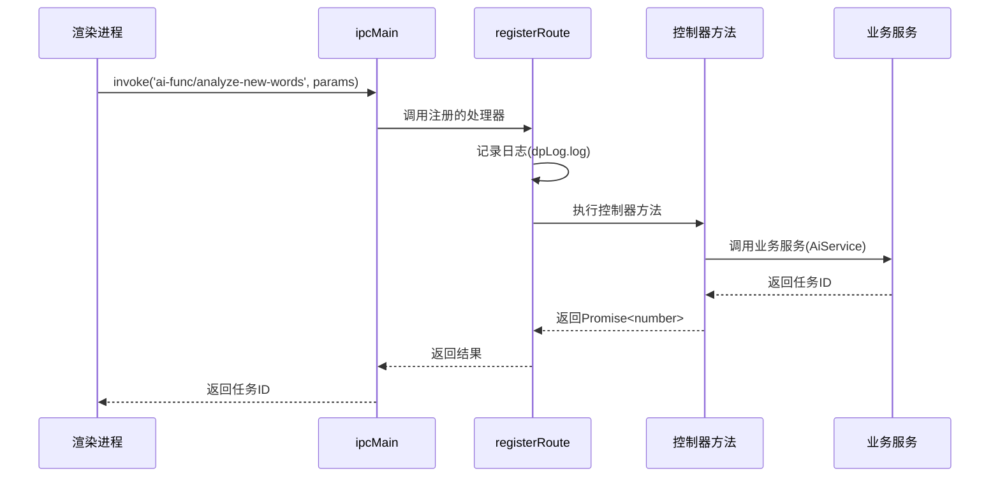

# API参考

<cite>
**本文档中引用的文件**  
- [api-def.ts](file://src/common/api/api-def.ts)
- [register.ts](file://src/common/api/register.ts)
- [AiFuncController.ts](file://src/backend/controllers/AiFuncController.ts)
- [DownloadVideoController.ts](file://src/backend/controllers/DownloadVideoController.ts)
- [DpTaskController.ts](file://src/backend/controllers/DpTaskController.ts)
- [WatchHistoryController.ts](file://src/backend/controllers/WatchHistoryController.ts)
- [SubtitleController.ts](file://src/backend/controllers/SubtitleController.ts)
- [StorageController.ts](file://src/backend/controllers/StorageController.ts)
- [TagController.ts](file://src/backend/controllers/TagController.ts)
- [FavoriteClipsController.ts](file://src/backend/controllers/FavoriteClipsController.ts)
- [ConvertController.ts](file://src/backend/controllers/ConvertController.ts)
- [AiAnalyseNewWordsRes.ts](file://src/common/types/aiRes/AiAnalyseNewWordsRes.ts)
- [AiAnalyseNewPhrasesRes.ts](file://src/common/types/aiRes/AiAnalyseNewPhrasesRes.ts)
- [AiMakeExampleSentencesRes.ts](file://src/common/types/aiRes/AiMakeExampleSentencesRes.ts)
- [AiFuncPolish.ts](file://src/common/types/aiRes/AiFuncPolish.ts)
- [AiFuncFormatSplit.ts](file://src/common/types/aiRes/AiFuncFormatSplit.ts)
- [AiPhraseGroupRes.ts](file://src/common/types/aiRes/AiPhraseGroupRes.ts)
- [AiFuncExplainSelectRes.ts](file://src/common/types/aiRes/AiFuncExplainSelectRes.ts)
- [AiFuncExplainSelectWithContextRes.ts](file://src/common/types/aiRes/AiFuncExplainSelectWithContextRes.ts)
- [AiFuncTranslateWithContextRes.ts](file://src/common/types/aiRes/AiFuncTranslateWithContextRes.ts)
</cite>

## 目录
1. [引言](#引言)
2. [路由注册机制](#路由注册机制)
3. [控制器接口列表](#控制器接口列表)
   - [AiFuncController](#aifunccontroller)
   - [DownloadVideoController](#downloadvideocontroller)
   - [DpTaskController](#dptaskcontroller)
   - [WatchHistoryController](#watchhistorycontroller)
   - [SubtitleController](#subtitlecontroller)
   - [StorageController](#storagecontroller)
   - [TagController](#tagcontroller)
   - [FavoriteClipsController](#favoriteclipscontroller)
   - [ConvertController](#convertcontroller)
4. [调用示例与错误处理](#调用示例与错误处理)
5. [附录：数据传输对象（DTO）定义](#附录数据传输对象dto定义)

## 引言
本API参考文档详细描述了DashPlayer项目中所有内部IPC（进程间通信）接口。文档基于`api-def.ts`中定义的类型系统，涵盖所有可用的API端点，包括其唯一标识符、请求参数、返回值结构和可能的错误码。每个接口均与对应的控制器方法绑定，通过`register.ts`中的注册机制暴露为Electron IPC处理器。本文档旨在为开发者提供集成和调试的核心依据，确保前后端通信的准确性和稳定性。

## 路由注册机制

`register.ts`文件定义了统一的IPC路由注册函数`registerRoute`，该函数利用Electron的`ipcMain.handle`方法将TypeScript函数绑定到特定的IPC通道。当渲染进程通过`ipcRenderer.invoke`调用某个通道时，主进程会执行对应的异步函数，并返回结果或抛出错误。

该机制包含以下关键特性：
- **日志记录**：每次API调用都会被记录，便于调试。
- **错误处理**：函数执行中的任何错误都会被捕获，通过`SystemService`发送到渲染进程，并重新抛出以中断调用。
- **依赖注入**：注册的函数通常来自通过InversifyJS注入的控制器实例。



**图例来源**
- [register.ts](file://src/common/api/register.ts#L5-L20)
- [AiFuncController.ts](file://src/backend/controllers/AiFuncController.ts#L12-L129)

**本节来源**
- [register.ts](file://src/common/api/register.ts#L1-L21)

## 控制器接口列表

### AiFuncController
`AiFuncController`负责处理所有与AI功能相关的异步任务。它通过创建`DpTask`来管理每个AI操作的生命周期，并返回一个任务ID，前端可通过该ID查询任务结果。

**本节来源**
- [AiFuncController.ts](file://src/backend/controllers/AiFuncController.ts#L12-L129)

#### ai-func/analyze-new-words
分析输入句子中的生词。

- **唯一标识符**: `ai-func/analyze-new-words`
- **请求参数**: `string` (待分析的句子)
- **返回值**: `Promise<number>` (任务ID)
- **业务用途**: 识别句子中的新词汇，用于词汇学习。
- **返回值结构 (AiAnalyseNewWordsRes)**:
```typescript
interface AiAnalyseNewWordsRes {
    hasNewWord: boolean;
    words: {
        word: string;
        phonetic: string;
        meaning: string;
    }[];
}
```

#### ai-func/analyze-new-phrases
分析输入句子中的新词组。

- **唯一标识符**: `ai-func/analyze-new-phrases`
- **请求参数**: `string` (待分析的句子)
- **返回值**: `Promise<number>` (任务ID)
- **业务用途**: 识别句子中的新短语，用于短语学习。
- **返回值结构 (AiAnalyseNewPhrasesRes)**:
```typescript
interface AiAnalyseNewPhrasesRes {
    hasPhrase: boolean;
    phrases: {
        phrase: string;
        meaning: string;
    }[];
}
```

#### ai-func/analyze-grammars
分析输入句子中的语法结构。

- **唯一标识符**: `ai-func/analyze-grammars`
- **请求参数**: `string` (待分析的句子)
- **返回值**: `Promise<number>` (任务ID)
- **业务用途**: 识别句子中的语法点。
- **返回值结构 (AiAnalyseGrammarsRes)**: `z.infer<typeof AiAnalyseGrammarsPrompt['schema']>`

#### ai-func/make-example-sentences
为指定句子和重点词汇生成例句。

- **唯一标识符**: `ai-func/make-example-sentences`
- **请求参数**: `{ sentence: string, point: string[] }`
- **返回值**: `Promise<number>` (任务ID)
- **业务用途**: 为学习者生成包含重点词汇的例句。
- **返回值结构 (AiMakeExampleSentencesRes)**:
```typescript
interface AiMakeExampleSentencesRes {
    sentences: {
        sentence: string;
        meaning: string;
        points: string[];
    }[];
}
```

#### ai-func/polish
润色输入的句子。

- **唯一标识符**: `ai-func/polish`
- **请求参数**: `string` (待润色的句子)
- **返回值**: `Promise<number>` (任务ID)
- **业务用途**: 提供三种不同风格的句子润色建议。
- **返回值结构 (AiFuncPolishRes)**: `z.infer<typeof AiFuncPolishPrompt['schema']>`

#### ai-func/format-split
格式化视频章节分割文本。

- **唯一标识符**: `ai-func/format-split`
- **请求参数**: `string` (用户输入的章节文本)
- **返回值**: `Promise<number>` (任务ID)
- **业务用途**: 修正用户输入的章节文本格式，使其符合`hh:mm:ss Title`的规范。
- **返回值结构 (AiFuncFormatSplitRes)**: `z.infer<typeof AiFuncFormatSplitPrompt['schema']>`

#### ai-func/phrase-group
分析输入句子中的词组。

- **唯一标识符**: `ai-func/phrase-group`
- **请求参数**: `string` (待分析的句子)
- **返回值**: `Promise<number>` (任务ID)
- **业务用途**: 识别句子中的固定搭配或词组。
- **返回值结构 (AiPhraseGroupRes)**: `z.infer<typeof AiPhraseGroupPrompt['schema']>`

#### ai-func/explain-select
解释选中的单词。

- **唯一标识符**: `ai-func/explain-select`
- **请求参数**: `{ word: string }`
- **返回值**: `Promise<number>` (任务ID)
- **业务用途**: 在上下文菜单中解释用户选中的单词。
- **返回值结构 (AiFuncExplainSelectRes)**: `z.infer<typeof AiFuncExplainSelectPrompt['schema']>`

#### ai-func/explain-select-with-context
结合上下文解释选中的单词。

- **唯一标识符**: `ai-func/explain-select-with-context`
- **请求参数**: `{ sentence: string, selectedWord: string }`
- **返回值**: `Promise<number>` (任务ID)
- **业务用途**: 结合句子上下文，更准确地解释用户选中的单词。
- **返回值结构 (AiFuncExplainSelectWithContextRes)**: `z.infer<typeof AiFuncExplainSelectWithContextPrompt['schema']>`

#### ai-func/translate-with-context
结合上下文翻译句子。

- **唯一标识符**: `ai-func/translate-with-context`
- **请求参数**: `{ sentence: string, context: string[] }`
- **返回值**: `Promise<number>` (任务ID)
- **业务用途**: 利用上下文信息提高句子翻译的准确性。
- **返回值结构 (AiFuncTranslateWithContextRes)**: `z.infer<typeof AiFuncTranslateWithContextPrompt['schema']>`

#### ai-func/tts
将文本转换为语音。

- **唯一标识符**: `ai-func/tts`
- **请求参数**: `string` (要转换的文本)
- **返回值**: `Promise<string>` (生成的音频文件URL)
- **业务用途**: 提供文本朗读功能。

#### ai-func/chat
处理聊天消息。

- **唯一标识符**: `ai-func/chat`
- **请求参数**: `{ msgs: MsgT[] }` (消息历史)
- **返回值**: `Promise<number>` (任务ID)
- **业务用途**: 驱动AI聊天功能。

#### ai-func/transcript
转录音频文件。

- **唯一标识符**: `ai-func/transcript`
- **请求参数**: `{ filePath: string }` (音频文件路径)
- **返回值**: `Promise<number>` (任务ID)
- **业务用途**: 使用Whisper模型将音频文件转换为文本。

### DownloadVideoController
`DownloadVideoController`负责处理视频下载任务。

**本节来源**
- [DownloadVideoController.ts](file://src/backend/controllers/DownloadVideoController.ts#L9-L35)

#### download-video/url
根据提供的URL和Cookie下载视频。

- **唯一标识符**: `download-video/url`
- **请求参数**: `{ url: string, cookies: COOKIE }`
- **返回值**: `Promise<number>` (任务ID)
- **业务用途**: 启动一个视频下载任务，下载文件将保存在系统视频库文件夹中。

### DpTaskController
`DpTaskController`提供对后台任务（`DpTask`）的查询和管理功能。

**本节来源**
- [DpTaskController.ts](file://src/backend/controllers/DpTaskController.ts#L11-L34)

#### dp-task/detail
获取单个任务的详细信息。

- **唯一标识符**: `dp-task/detail`
- **请求参数**: `number` (任务ID)
- **返回值**: `Promise<DpTask | null>` (任务对象或null)
- **业务用途**: 查询特定任务的当前状态、类型和结果。

#### dp-task/details
批量获取多个任务的详细信息。

- **唯一标识符**: `dp-task/details`
- **请求参数**: `number[]` (任务ID数组)
- **返回值**: `Promise<Map<number, DpTask>>` (任务ID到任务对象的映射)
- **业务用途**: 高效地查询多个任务的状态。

#### dp-task/cancel
取消一个正在运行的任务。

- **唯一标识符**: `dp-task/cancel`
- **请求参数**: `number` (任务ID)
- **返回值**: `Promise<void>`
- **业务用途**: 终止指定的后台任务。

### WatchHistoryController
`WatchHistoryController`管理用户的观看历史记录。

**本节来源**
- [WatchHistoryController.ts](file://src/backend/controllers/WatchHistoryController.ts#L9-L68)

#### watch-history/list
列出指定分组下的所有观看历史。

- **唯一标识符**: `watch-history/list`
- **请求参数**: `string` (分组ID)
- **返回值**: `Promise<WatchHistoryVO[]>` (历史记录数组)
- **业务用途**: 获取用户在特定分组中的视频观看列表。

#### watch-history/progress/update
更新视频的播放进度。

- **唯一标识符**: `watch-history/progress/update`
- **请求参数**: `{ file: string, currentPosition: number }` (文件路径, 当前播放时间)
- **返回值**: `Promise<void>`
- **业务用途**: 保存用户在视频中的播放位置。

#### watch-history/create
创建新的观看历史记录。

- **唯一标识符**: `watch-history/create`
- **请求参数**: `string[]` (视频文件路径数组)
- **返回值**: `Promise<string[]>` (成功创建的记录ID数组)
- **业务用途**: 将新的视频文件添加到观看历史中。

#### watch-history/create/from-library
从媒体库创建观看历史记录。

- **唯一标识符**: `watch-history/create/from-library`
- **请求参数**: `string[]` (媒体库中的相对路径数组)
- **返回值**: `Promise<string[]>` (成功创建的记录ID数组)
- **业务用途**: 将媒体库中的文件批量添加到观看历史。

#### watch-history/group-delete
删除整个分组的观看历史。

- **唯一标识符**: `watch-history/group-delete`
- **请求参数**: `string` (分组ID)
- **返回值**: `Promise<void>`
- **业务用途**: 清理不再需要的观看历史分组。

#### watch-history/detail
获取单个观看历史记录的详细信息。

- **唯一标识符**: `watch-history/detail`
- **请求参数**: `string` (记录ID)
- **返回值**: `Promise<WatchHistoryVO | null>` (记录对象或null)
- **业务用途**: 查询特定视频的详细信息，如字幕路径、播放进度等。

#### watch-history/attach-srt
为视频关联字幕文件。

- **唯一标识符**: `watch-history/attach-srt`
- **请求参数**: `{ videoPath: string, srtPath: string | 'same' }`
- **返回值**: `Promise<void>`
- **业务用途**: 将SRT字幕文件与视频文件绑定。

#### watch-history/suggest-srt
为视频建议可用的字幕文件。

- **唯一标识符**: `watch-history/suggest-srt`
- **请求参数**: `string` (视频文件路径)
- **返回值**: `Promise<string[]>` (建议的字幕文件路径数组)
- **业务用途**: 在视频目录下查找同名或相似名称的SRT文件。

#### watch-history/analyse-folder
分析文件夹中的媒体文件。

- **唯一标识符**: `watch-history/analyse-folder`
- **请求参数**: `string` (文件夹路径)
- **返回值**: `Promise<{ supported: number, unsupported: number }>` (支持和不支持的文件数量)
- **业务用途**: 扫描文件夹，统计可被DashPlayer识别的视频文件数量。

### SubtitleController
`SubtitleController`提供字幕文件解析功能。

**本节来源**
- [SubtitleController.ts](file://src/backend/controllers/SubtitleController.ts#L8-L21)

#### subtitle/srt/parse-to-sentences
解析SRT字幕文件为句子对象数组。

- **唯一标识符**: `subtitle/srt/parse-to-sentences`
- **请求参数**: `string` (SRT文件内容)
- **返回值**: `Promise<SrtSentence | null>` (解析后的句子结构或null)
- **业务用途**: 将原始SRT文本转换为程序内部使用的结构化数据。

### StorageController
`StorageController`提供应用设置和本地存储的读写功能。

**本节来源**
- [StorageController.ts](file://src/backend/controllers/StorageController.ts#L9-L37)

#### storage/put
存储一个键值对。

- **唯一标识符**: `storage/put`
- **请求参数**: `{ key: SettingKey, value: string }`
- **返回值**: `Promise<void>`
- **业务用途**: 保存用户设置或应用状态。

#### storage/get
读取一个键对应的值。

- **唯一标识符**: `storage/get`
- **请求参数**: `SettingKey` (键名)
- **返回值**: `Promise<string>` (存储的值)
- **业务用途**: 读取用户设置或应用状态。

#### storage/cache/size
查询缓存目录的大小。

- **唯一标识符**: `storage/cache/size`
- **请求参数**: `void`
- **返回值**: `Promise<string>` (人类可读的大小，如"1.2 GB")
- **业务用途**: 显示当前缓存占用的空间。

#### storage/collection/paths
列出所有收藏夹路径。

- **唯一标识符**: `storage/collection/paths`
- **请求参数**: `void`
- **返回值**: `Promise<string[]>` (收藏夹路径数组)
- **业务用途**: 获取用户配置的所有媒体库路径。

### TagController
`TagController`管理标签的增删改查。

**本节来源**
- [TagController.ts](file://src/backend/controllers/TagController.ts#L8-L36)

#### tag/add
创建一个新标签。

- **唯一标识符**: `tag/add`
- **请求参数**: `string` (标签名称)
- **返回值**: `Promise<Tag>` (新创建的标签对象)
- **业务用途**: 为收藏夹或视频片段添加分类标签。

#### tag/delete
删除一个标签。

- **唯一标识符**: `tag/delete`
- **请求参数**: `number` (标签ID)
- **返回值**: `Promise<void>`
- **业务用途**: 移除不再需要的标签。

#### tag/update
更新标签名称。

- **唯一标识符**: `tag/update`
- **请求参数**: `{ id: number, name: string }` (标签ID, 新名称)
- **返回值**: `Promise<void>`
- **业务用途**: 修改标签的显示名称。

#### tag/search
根据关键词搜索标签。

- **唯一标识符**: `tag/search`
- **请求参数**: `string` (搜索关键词)
- **返回值**: `Promise<Tag[]>` (匹配的标签数组)
- **业务用途**: 在创建或编辑时，提供标签的自动补全功能。

### FavoriteClipsController
`FavoriteClipsController`管理用户收藏的视频片段。

**本节来源**
- [FavoriteClipsController.ts](file://src/backend/controllers/FavoriteClipsController.ts#L9-L74)

#### favorite-clips/add
添加一个视频片段到收藏夹。

- **唯一标识符**: `favorite-clips/add`
- **请求参数**: `{ videoPath: string, srtKey: string, indexInSrt: number }`
- **返回值**: `Promise<void>`
- **业务用途**: 将视频中的某个字幕行对应的片段标记为收藏。

#### favorite-clips/search
根据条件搜索收藏的片段。

- **唯一标识符**: `favorite-clips/search`
- **请求参数**: `ClipQuery` (查询条件)
- **返回值**: `Promise<(ClipMeta & OssBaseMeta)[]>` (匹配的片段元数据数组)
- **业务用途**: 在收藏夹界面中，根据标签、关键词等条件筛选片段。

#### favorite-clips/query-clip-tags
查询某个片段关联的所有标签。

- **唯一标识符**: `favorite-clips/query-clip-tags`
- **请求参数**: `string` (片段的唯一键)
- **返回值**: `Promise<Tag[]>` (标签数组)
- **业务用途**: 显示一个收藏片段上打的所有标签。

#### favorite-clips/add-clip-tag
为片段添加一个标签。

- **唯一标识符**: `favorite-clips/add-clip-tag`
- **请求参数**: `{ key: string, tagId: number }` (片段键, 标签ID)
- **返回值**: `Promise<void>`
- **业务用途**: 给收藏的片段打上分类标签。

#### favorite-clips/delete-clip-tag
移除片段上的一个标签。

- **唯一标识符**: `favorite-clips/delete-clip-tag`
- **请求参数**: `{ key: string, tagId: number }` (片段键, 标签ID)
- **返回值**: `Promise<void>`
- **业务用途**: 取消给收藏片段打的某个标签。

#### favorite-clips/cancel-add
取消添加一个片段（在确认前）。

- **唯一标识符**: `favorite-clips/cancel-add`
- **请求参数**: `{ srtKey: string, indexInSrt: number }`
- **返回值**: `Promise<void>`
- **业务用途**: 在用户决定不收藏某个片段时，清除临时状态。

#### favorite-clips/exists
批量检查多个字幕行是否已被收藏。

- **唯一标识符**: `favorite-clips/exists`
- **请求参数**: `{ srtKey: string, linesInSrt: number[] }`
- **返回值**: `Promise<Map<number, boolean>>` (行号到是否收藏的映射)
- **业务用途**: 在字幕界面中，批量高亮已收藏的行。

#### favorite-clips/task-info
获取收藏任务的统计信息。

- **唯一标识符**: `favorite-clips/task-info`
- **请求参数**: `void`
- **返回值**: `Promise<number>` (待处理的任务数量)
- **业务用途**: 显示后台同步任务的进度。

#### favorite-clips/delete
删除一个收藏的片段。

- **唯一标识符**: `favorite-clips/delete`
- **请求参数**: `string` (片段的唯一键)
- **返回值**: `Promise<void>`
- **业务用途**: 从收藏夹中永久移除一个片段。

#### favorite-clips/sync-from-oss
从云端同步收藏的片段。

- **唯一标识符**: `favorite-clips/sync-from-oss`
- **请求参数**: `void`
- **返回值**: `Promise<void>`
- **业务用途**: 将存储在OSS上的收藏数据同步到本地。

### ConvertController
`ConvertController`处理视频格式转换任务。

**本节来源**
- [ConvertController.ts](file://src/backend/controllers/ConvertController.ts#L9-L39)

#### convert/to-mp4
将视频文件转换为MP4格式。

- **唯一标识符**: `convert/to-mp4`
- **请求参数**: `string` (源文件路径)
- **返回值**: `Promise<number>` (任务ID)
- **业务用途**: 启动一个FFmpeg任务，将非MP4视频转换为标准MP4格式。

#### convert/from-folder
扫描文件夹内的视频文件。

- **唯一标识符**: `convert/from-folder`
- **请求参数**: `string[]` (文件夹路径数组)
- **返回值**: `Promise<FolderVideos[]>` (包含视频信息的数组)
- **业务用途**: 获取文件夹中所有支持的视频文件及其元数据。

#### convert/video-length
获取视频文件的时长。

- **唯一标识符**: `convert/video-length`
- **请求参数**: `string` (视频文件路径)
- **返回值**: `Promise<number>` (时长，单位为秒)
- **业务用途**: 通过FFprobe分析视频，获取其总播放时间。

## 调用示例与错误处理

### 调用示例
以下是一个在渲染进程中调用`ai-func/analyze-new-words`接口的TypeScript示例：

```typescript
import { ipcRenderer } from 'electron';

async function analyzeSentence(sentence: string): Promise<void> {
  try {
    // 调用IPC接口，获取任务ID
    const taskId: number = await ipcRenderer.invoke('ai-func/analyze-new-words', sentence);
    console.log(`分析任务已启动，任务ID: ${taskId}`);

    // 假设有一个函数可以轮询任务结果
    const result = await waitForTaskResult<AiAnalyseNewWordsRes>(taskId);
    if (result && result.hasNewWord) {
      result.words.forEach(word => {
        console.log(`单词: ${word.word}, 发音: ${word.phonetic}, 意思: ${word.meaning}`);
      });
    }
  } catch (error) {
    // 处理错误
    console.error('分析失败:', error);
    // 错误将通过SystemService发送到前端，可在此处显示通知
  }
}
```

### 错误处理
所有API调用都应使用`try-catch`块进行包裹。当后端服务抛出错误时，`register.ts`中的错误处理器会：
1. 记录错误日志。
2. 通过`SystemService.sendErrorToRenderer`将错误信息发送到渲染进程。
3. 重新抛出错误，使其在`ipcRenderer.invoke`的调用处被捕获。

前端应监听来自`SystemService`的错误事件，并向用户展示友好的错误提示。

## 附录：数据传输对象（DTO）定义

本节列出文档中提到的主要数据传输对象（DTO）的完整定义。

### AiAnalyseNewWordsRes
```typescript
// 来源: src/common/types/aiRes/AiAnalyseNewWordsRes.ts
export interface AiAnalyseNewWordsRes {
    hasNewWord: boolean;
    words: {
        word: string;
        phonetic: string;
        meaning: string;
    }[];
}
```

### AiAnalyseNewPhrasesRes
```typescript
// 来源: src/common/types/aiRes/AiAnalyseNewPhrasesRes.ts
export interface AiAnalyseNewPhrasesRes {
    hasPhrase: boolean;
    phrases: {
        phrase: string;
        meaning: string;
    }[];
}
```

### AiMakeExampleSentencesRes
```typescript
// 来源: src/common/types/aiRes/AiMakeExampleSentences