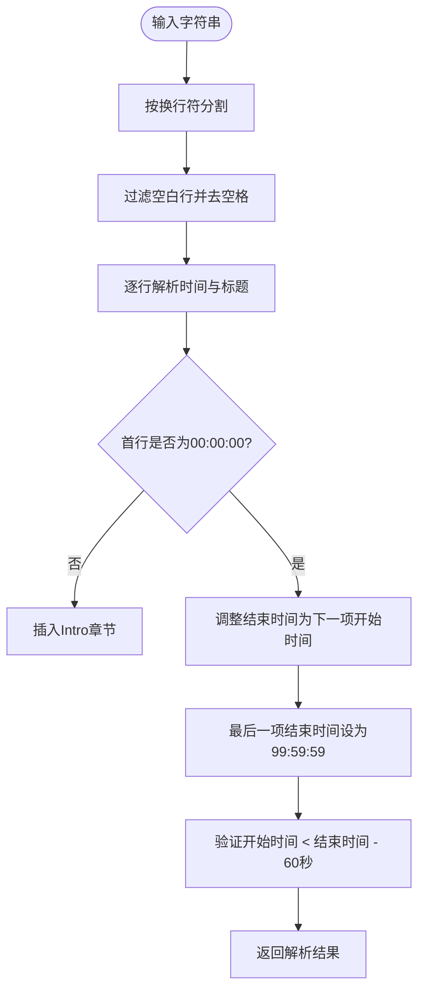
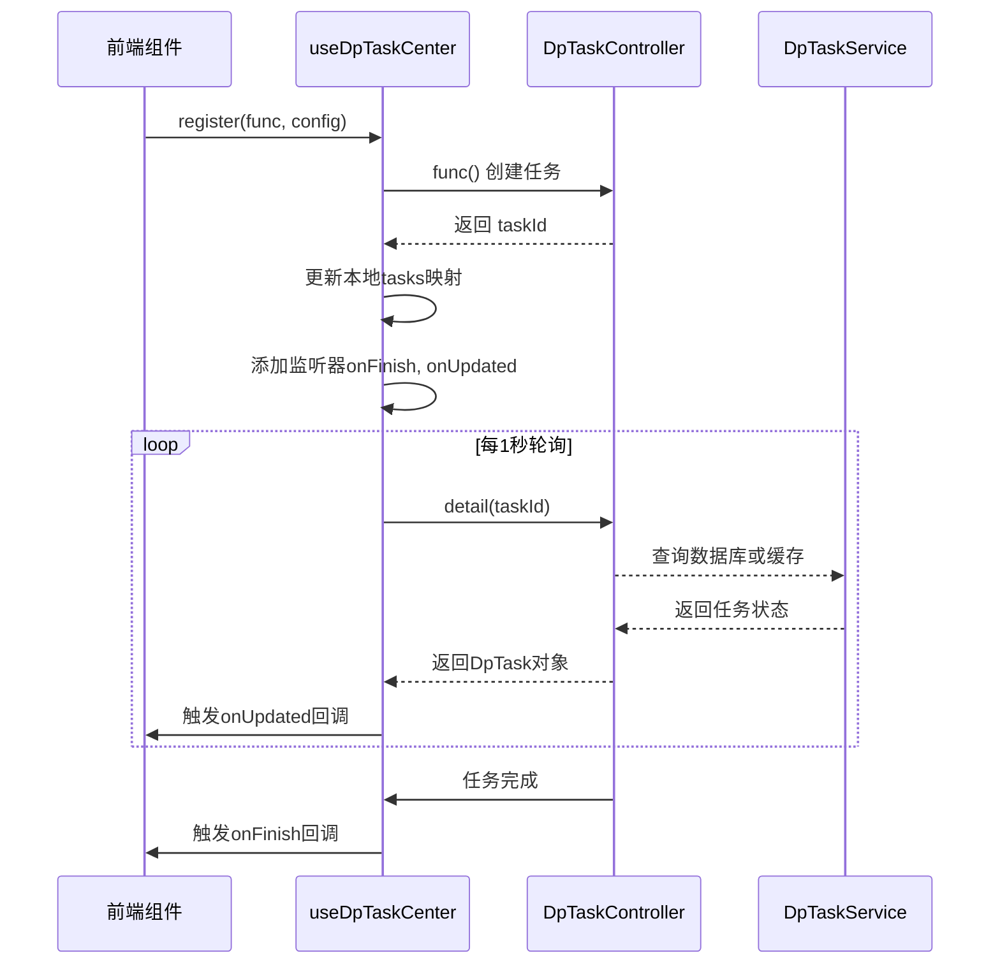
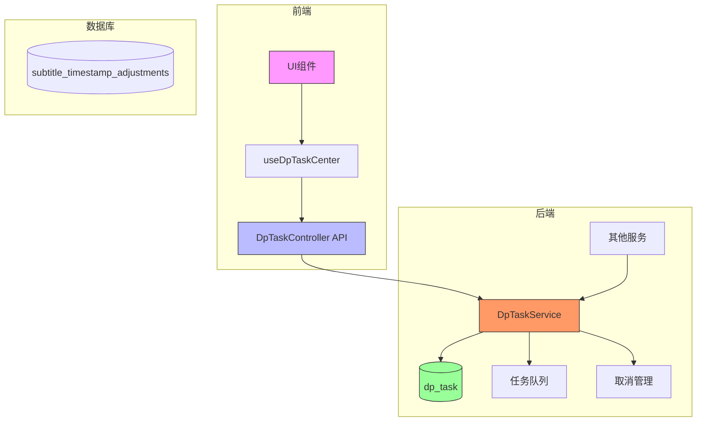

# 字幕与任务管理API

<cite>
**本文档中引用的文件**  
- [SubtitleController.ts](file://src/backend/controllers/SubtitleController.ts)
- [DpTaskController.ts](file://src/backend/controllers/DpTaskController.ts)
- [SrtTimeAdjustController.ts](file://src/backend/controllers/SrtTimeAdjustController.ts)
- [DpTaskServiceImpl.ts](file://src/backend/services/impl/DpTaskServiceImpl.ts)
- [SubtitleServiceImpl.ts](file://src/backend/services/impl/SubtitleServiceImpl.ts)
- [SrtTimeAdjustServiceImpl.ts](file://src/backend/services/impl/SrtTimeAdjustServiceImpl.ts)
- [dpTask.ts](file://src/backend/db/tables/dpTask.ts)
- [chapter-parser.ts](file://src/common/utils/praser/chapter-parser.ts)
- [chapter-result.ts](file://src/common/types/chapter-result.ts)
- [useDpTaskCenter.ts](file://src/fronted/hooks/useDpTaskCenter.ts)
</cite>

## 目录
1. [简介](#简介)
2. [核心控制器API](#核心控制器api)
3. [任务生命周期与dpTask表结构](#任务生命周期与dptask表结构)
4. [章节切割结果结构](#章节切割结果结构)
5. [字幕时间轴调整算法](#字幕时间轴调整算法)
6. [任务系统与前端集成](#任务系统与前端集成)
7. [任务队列管理与并发控制](#任务队列管理与并发控制)
8. [错误重试机制](#错误重试机制)
9. [系统架构概览](#系统架构概览)

## 简介
本文档旨在为开发者提供关于字幕生成与后台任务管理系统的全面技术说明。涵盖`SubtitleController`、`DpTaskController`和`SrtTimeAdjustController`等核心API接口的功能描述，详细解析任务状态机、章节切割逻辑、时间轴调整算法，并说明任务系统如何与前端`DpTaskCenter`组件协同工作以实现进度实时更新。文档还深入探讨了任务队列、并发控制及错误处理机制，帮助开发者理解整个后台任务调度架构。

## 核心控制器API

### SubtitleController
该控制器负责字幕文件的解析与处理。

- **`parseSrt(path: string)`**: 解析SRT字幕文件并返回结构化句子对象。此方法通过`SubtitleService`调用底层服务，支持缓存和时间轴调整。
- **`registerRoutes()`**: 注册API路由`subtitle/srt/parse-to-sentences`，供前端调用。

**Section sources**  
- [SubtitleController.ts](file://src/backend/controllers/SubtitleController.ts#L8-L21)

### DpTaskController
该控制器提供对后台任务的查询与操作接口。

- **`detail(id: number)`**: 获取指定任务的详细信息。
- **`details(ids: number[])`**: 批量获取多个任务的状态。
- **`cancel(id: number)`**: 取消指定ID的任务。
- **`registerRoutes()`**: 注册路由包括`dp-task/detail`、`dp-task/cancel`和`dp-task/details`。

**Section sources**  
- [DpTaskController.ts](file://src/backend/controllers/DpTaskController.ts#L11-L34)

### SrtTimeAdjustController
该控制器用于管理字幕时间轴的手动调整记录。

- **`record(e: InsertSubtitleTimestampAdjustment)`**: 记录用户对某条字幕时间点的修改。
- **`deleteByKey(key: string)`**: 根据唯一键删除时间调整记录。
- **`deleteByFile(fileHash: string)`**: 删除某个字幕文件的所有调整记录。
- **`registerRoutes()`**: 注册路由如`subtitle-timestamp/update`和`delete/by-key`等。

**Section sources**  
- [SrtTimeAdjustController.ts](file://src/backend/controllers/SrtTimeAdjustController.ts#L10-L44)

## 任务生命周期与dpTask表结构

### 任务状态机
任务在系统中经历以下生命周期状态：

| 状态 | 说明 |
|------|------|
| `init` | 任务已创建，等待处理 |
| `in_progress` | 任务正在执行中 |
| `done` | 任务成功完成 |
| `cancelled` | 任务被用户取消 |
| `failed` | 任务执行失败 |

这些状态定义在`DpTaskState`枚举中，直接影响前端展示和后续处理逻辑。

### dpTask表结构
数据库表`dp_task`存储所有后台任务的核心信息。

```typescript
export const dpTask = sqliteTable('dp_task', {
    id: integer('id', { mode: 'number' }).primaryKey({ autoIncrement: true }),
    status: text('status').notNull().default(DpTaskState.INIT),
    progress: text('description').default('任务创建成功'),
    result: text('result'),
    created_at: text('created_at').notNull().default(sql`CURRENT_TIMESTAMP`),
    updated_at: text('updated_at').notNull().default(sql`CURRENT_TIMESTAMP`),
});
```

- **`id`**: 唯一任务标识符
- **`status`**: 当前任务状态
- **`progress`**: 进度描述文本，用于向用户反馈
- **`result`**: 任务结果，通常为JSON字符串
- **`created_at`, `updated_at`**: 时间戳字段

**Section sources**  
- [dpTask.ts](file://src/backend/db/tables/dpTask.ts#L3-L24)

## 章节切割结果结构

### ChapterParseResult接口
该接口定义了章节解析后的标准结构，用于视频分割功能。

```typescript
export interface ChapterParseResult {
    timestampStart: string
    timestampEnd: string
    timestampValid: boolean,
    title: string
    original: string
}
```

- **`timestampStart`**: 章节开始时间（格式：HH:MM:SS）
- **`timestampEnd`**: 章节结束时间
- **`timestampValid`**: 时间有效性标志
- **`title`**: 章节标题
- **`original`**: 原始输入行

### 章节解析逻辑
`parseChapter`函数负责将用户输入的章节文本转换为结构化数据。



**Diagram sources**  
- [chapter-parser.ts](file://src/common/utils/praser/chapter-parser.ts#L8-L44)

**Section sources**  
- [chapter-result.ts](file://src/common/types/chapter-result.ts#L0-L6)
- [chapter-parser.ts](file://src/common/utils/praser/chapter-parser.ts#L8-L44)

## 字幕时间轴调整算法

### 实现逻辑
当用户手动调整字幕时间点时，系统会将修改记录持久化到数据库，并在后续加载时自动应用。

1. **记录调整**：调用`SrtTimeAdjustService.record()`将调整信息存入`subtitle_timestamp_adjustments`表。
2. **加载字幕**：`SubtitleServiceImpl.parseSrt()`在解析SRT文件后，会根据文件哈希值查询所有相关的时间调整记录。
3. **应用调整**：通过`adjustTime()`方法将数据库中的调整值合并到原始字幕数据中，生成最终显示的字幕。

### 参数配置
- **`key`**: 字幕条目唯一键（由文件哈希+索引构成）
- **`start_at`, `end_at`**: 调整后的时间点
- **`subtitle_hash`**: 字幕文件内容哈希，用于批量操作

**Section sources**  
- [SubtitleServiceImpl.ts](file://src/backend/services/impl/SubtitleServiceImpl.ts#L41-L116)
- [SrtTimeAdjustServiceImpl.ts](file://src/backend/services/impl/SrtTimeAdjustServiceImpl.ts#L11-L71)

## 任务系统与前端集成

### DpTaskCenter Hook
前端通过`useDpTaskCenter` Hook与后端任务系统集成，实现任务注册与状态监听。



**Diagram sources**  
- [useDpTaskCenter.ts](file://src/fronted/hooks/useDpTaskCenter.ts#L30-L59)

**Section sources**  
- [useDpTaskCenter.ts](file://src/fronted/hooks/useDpTaskCenter.ts#L30-L59)

## 任务队列管理与并发控制

### 更新队列（upQueue）
为避免频繁的数据库写入，系统使用`upQueue`暂存待更新的任务。

- **机制**：每次调用`update()`时，任务信息先存入内存队列。
- **刷新周期**：通过`@postConstruct`定时器每3秒批量写入数据库。
- **优势**：显著减少I/O操作，提升性能。

### 取消队列（cancelQueue）
实现任务取消的异步处理。

- **流程**：调用`cancel(id)`时，ID被加入`cancelQueue`。
- **检查点**：关键操作前调用`checkCancel(id)`，若存在则抛出`CancelByUserError`。
- **传播**：异常被捕获后更新任务状态为`cancelled`。

### 任务映射（taskMapping）
支持对运行中任务的直接取消操作。

- **注册**：通过`registerTask(taskId, process)`将可取消对象（如HTTP请求）与任务绑定。
- **触发**：取消时遍历映射中的所有`Cancelable`对象并调用其`cancel()`方法。

**Section sources**  
- [DpTaskServiceImpl.ts](file://src/backend/services/impl/DpTaskServiceImpl.ts#L13-L192)

## 错误重试机制

### 重试策略
以`WhisperServiceImpl`为例，系统对关键操作实施三次重试机制。

```mermaid
flowchart TD
Start["开始 whisperThreeTimes()"] --> Try{"尝试次数 < 3?"}
Try --> |是| Invoke["调用 whisper()"]
Invoke --> Success{"成功?"}
Success --> |是| Return["返回结果"]
Success --> |否| Increment["尝试次数+1"]
Increment --> CheckCancel["checkCancel(taskId)"]
CheckCancel --> Try
Try --> |否| Throw["抛出最后一次错误"]
subgraph whisper()
W_Start["发送OpenAI请求"]
W_Wait["等待速率限制"]
W_Build["构建OpenAiWhisperRequest"]
W_Invoke["执行请求"]
W_Return["返回响应"]
end
```

- **应用场景**：网络请求、外部API调用
- **中断条件**：用户取消或达到最大重试次数
- **日志记录**：每次失败均记录日志便于排查

**Section sources**  
- [WhisperServiceImpl.ts](file://src/backend/services/impl/WhisperServiceImpl.ts#L0-L159)

## 系统架构概览



该架构实现了前后端分离、任务状态持久化、异步处理与实时反馈的完整闭环。通过`DpTask`作为核心协调单元，系统能够高效管理各类后台操作，确保用户体验流畅。

**Diagram sources**  
- [DpTaskController.ts](file://src/backend/controllers/DpTaskController.ts#L11-L34)
- [DpTaskServiceImpl.ts](file://src/backend/services/impl/DpTaskServiceImpl.ts#L13-L192)
- [dpTask.ts](file://src/backend/db/tables/dpTask.ts#L11-L22)