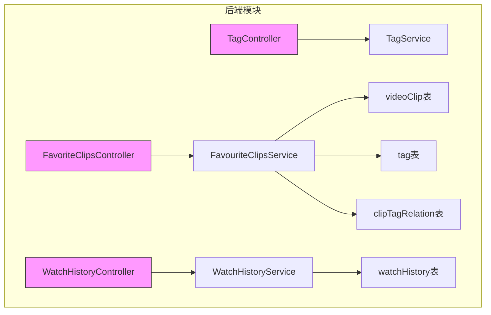
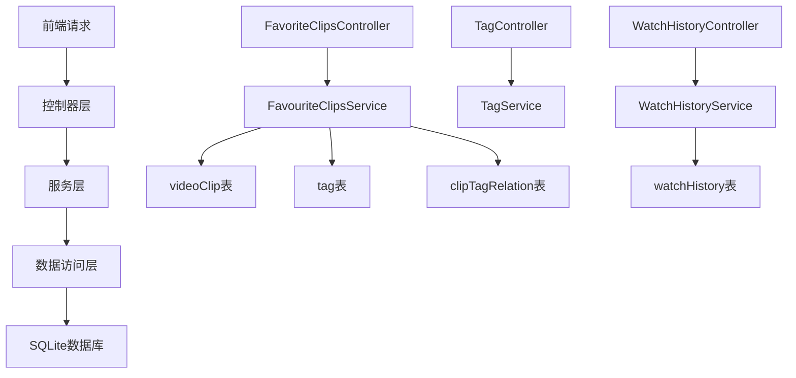
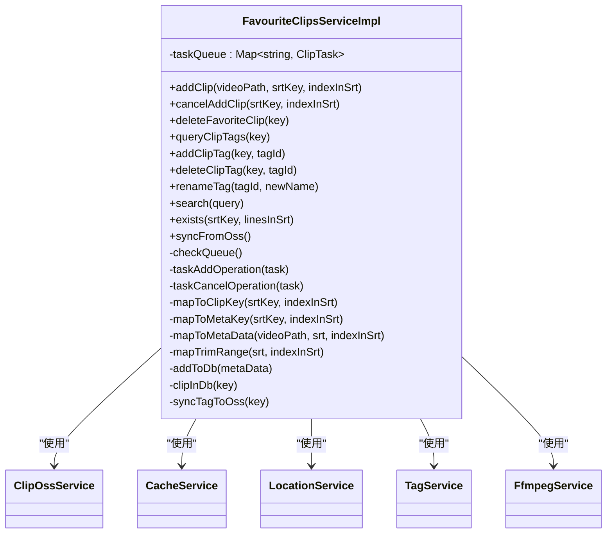
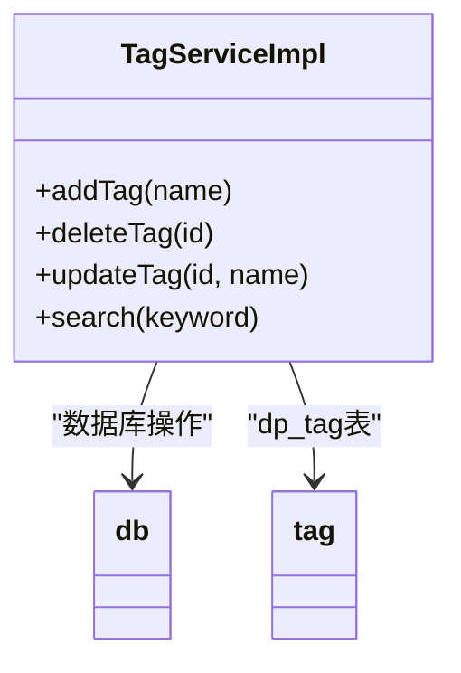
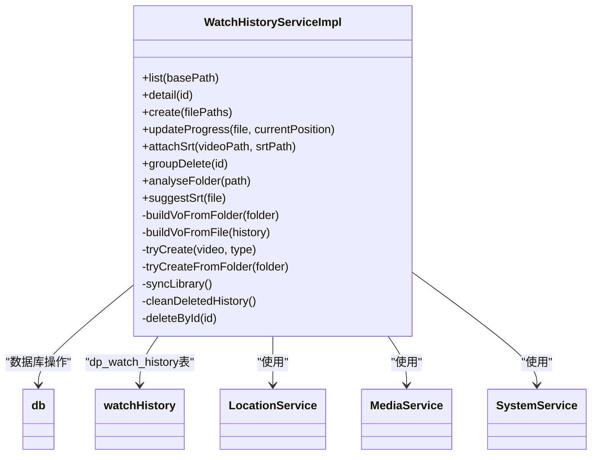
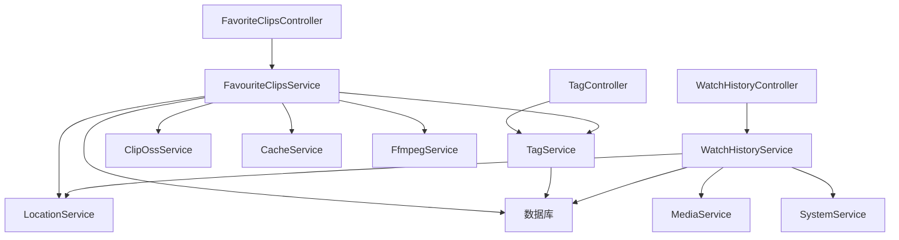

# 用户数据管理API

<cite>
**本文档引用的文件**
- [FavoriteClipsController.ts](file://src/backend/controllers/FavoriteClipsController.ts)
- [TagController.ts](file://src/backend/controllers/TagController.ts)
- [WatchHistoryController.ts](file://src/backend/controllers/WatchHistoryController.ts)
- [videoClip.ts](file://src/backend/db/tables/videoClip.ts)
- [tag.ts](file://src/backend/db/tables/tag.ts)
- [clipTagRelation.ts](file://src/backend/db/tables/clipTagRelation.ts)
- [watchHistory.ts](file://src/backend/db/tables/watchHistory.ts)
- [WatchHistoryVO.ts](file://src/common/types/WatchHistoryVO.ts)
- [FavouriteClipsServiceImpl.ts](file://src/backend/services/impl/FavouriteClipsServiceImpl.ts)
- [TagServiceImpl.ts](file://src/backend/services/impl/TagServiceImpl.ts)
- [WatchHistoryServiceImpl.ts](file://src/backend/services/impl/WatchHistoryServiceImpl.ts)
</cite>

## 目录
1. [简介](#简介)
2. [项目结构](#项目结构)
3. [核心组件](#核心组件)
4. [架构概述](#架构概述)
5. [详细组件分析](#详细组件分析)
6. [依赖分析](#依赖分析)
7. [性能考虑](#性能考虑)
8. [故障排除指南](#故障排除指南)
9. [结论](#结论)

## 简介
本文档详细介绍了DashPlayer应用中用户数据管理API的设计与实现，重点涵盖收藏夹、标签系统和观看历史三大功能模块。通过分析后端控制器、服务实现和数据库表结构，全面阐述了视频片段收藏、标签管理、观看进度同步等核心功能的技术实现机制。文档还解释了实体关系模型、数据一致性保障策略以及前后端数据传输模式，为开发者提供了完整的参考指南。

## 项目结构
用户数据管理功能主要分布在后端控制器、服务实现和数据库表定义三个目录中。控制器负责API路由和请求处理，服务层实现核心业务逻辑，数据库表定义了持久化数据结构。

**图表来源**
- [FavoriteClipsController.ts](file://src/backend/controllers/FavoriteClipsController.ts#L9-L74)
- [TagController.ts](file://src/backend/controllers/TagController.ts#L8-L36)
- [WatchHistoryController.ts](file://src/backend/controllers/WatchHistoryController.ts#L9-L68)
- [videoClip.ts](file://src/backend/db/tables/videoClip.ts#L3-L20)
- [tag.ts](file://src/backend/db/tables/tag.ts#L3-L12)
- [clipTagRelation.ts](file://src/backend/db/tables/clipTagRelation.ts#L3-L16)
- [watchHistory.ts](file://src/backend/db/tables/watchHistory.ts#L3-L18)

**章节来源**
- [src/backend/controllers](file://src/backend/controllers)
- [src/backend/services/impl](file://src/backend/services/impl)
- [src/backend/db/tables](file://src/backend/db/tables)

## 核心组件
用户数据管理API由三个核心控制器组成：收藏夹控制器(FavoriteClipsController)、标签控制器(TagController)和观看历史控制器(WatchHistoryController)。这些控制器通过依赖注入获取相应的服务实例，将HTTP请求委托给服务层处理。数据持久化通过Drizzle ORM实现，使用SQLite作为本地数据库存储。

**章节来源**
- [FavoriteClipsController.ts](file://src/backend/controllers/FavoriteClipsController.ts#L9-L74)
- [TagController.ts](file://src/backend/controllers/TagController.ts#L8-L36)
- [WatchHistoryController.ts](file://src/backend/controllers/WatchHistoryController.ts#L9-L68)

## 架构概述
用户数据管理系统的架构采用典型的分层设计模式，包括控制器层、服务层和数据访问层。控制器负责API路由和请求参数处理，服务层封装核心业务逻辑，数据访问层通过Drizzle ORM与SQLite数据库交互。

**图表来源**
- [FavoriteClipsController.ts](file://src/backend/controllers/FavoriteClipsController.ts#L9-L74)
- [TagController.ts](file://src/backend/controllers/TagController.ts#L8-L36)
- [WatchHistoryController.ts](file://src/backend/controllers/WatchHistoryController.ts#L9-L68)
- [FavouriteClipsServiceImpl.ts](file://src/backend/services/impl/FavouriteClipsServiceImpl.ts#L34-L428)
- [TagServiceImpl.ts](file://src/backend/services/impl/TagServiceImpl.ts#L8-L35)
- [WatchHistoryServiceImpl.ts](file://src/backend/services/impl/WatchHistoryServiceImpl.ts#L21-L426)

## 详细组件分析

### 收藏夹功能分析
收藏夹功能允许用户收藏视频片段并添加标签。系统通过异步任务队列处理视频剪辑的创建和删除操作，确保主线程不会被阻塞。

#### 收藏夹服务实现

**图表来源**
- [FavouriteClipsServiceImpl.ts](file://src/backend/services/impl/FavouriteClipsServiceImpl.ts#L34-L428)

**章节来源**
- [FavouriteClipsServiceImpl.ts](file://src/backend/services/impl/FavouriteClipsServiceImpl.ts#L34-L428)
- [FavoriteClipsController.ts](file://src/backend/controllers/FavoriteClipsController.ts#L9-L74)

### 标签系统分析
标签系统提供标签的增删改查功能，并支持标签与收藏片段的关联管理。标签名称具有唯一性约束，确保数据一致性。

#### 标签服务实现

**图表来源**
- [TagServiceImpl.ts](file://src/backend/services/impl/TagServiceImpl.ts#L8-L35)

**章节来源**
- [TagServiceImpl.ts](file://src/backend/services/impl/TagServiceImpl.ts#L8-L35)
- [TagController.ts](file://src/backend/controllers/TagController.ts#L8-L36)

### 观看历史分析
观看历史功能跟踪用户的视频播放进度，支持文件和文件夹级别的历史记录管理。系统自动同步视频库中的媒体文件。

#### 观看历史服务实现

**图表来源**
- [WatchHistoryServiceImpl.ts](file://src/backend/services/impl/WatchHistoryServiceImpl.ts#L21-L426)

**章节来源**
- [WatchHistoryServiceImpl.ts](file://src/backend/services/impl/WatchHistoryServiceImpl.ts#L21-L426)
- [WatchHistoryController.ts](file://src/backend/controllers/WatchHistoryController.ts#L9-L68)

## 依赖分析
用户数据管理模块与其他系统组件存在明确的依赖关系。控制器依赖服务层实现业务逻辑，服务层依赖数据库访问层进行数据持久化。

**图表来源**
- [FavoriteClipsController.ts](file://src/backend/controllers/FavoriteClipsController.ts#L9-L74)
- [TagController.ts](file://src/backend/controllers/TagController.ts#L8-L36)
- [WatchHistoryController.ts](file://src/backend/controllers/WatchHistoryController.ts#L9-L68)
- [FavouriteClipsServiceImpl.ts](file://src/backend/services/impl/FavouriteClipsServiceImpl.ts#L34-L428)
- [TagServiceImpl.ts](file://src/backend/services/impl/TagServiceImpl.ts#L8-L35)
- [WatchHistoryServiceImpl.ts](file://src/backend/services/impl/WatchHistoryServiceImpl.ts#L21-L426)

**章节来源**
- [src/backend/controllers](file://src/backend/controllers)
- [src/backend/services/impl](file://src/backend/services/impl)

## 性能考虑
系统在设计时考虑了多项性能优化策略。收藏夹功能使用异步任务队列处理视频剪辑操作，避免阻塞主线程。数据库查询使用索引优化，如watchHistory表的basePathFileNameIdx索引。批量操作如分页查询限制返回结果数量（如search方法限制5000条记录），防止内存溢出。

## 故障排除指南
当遇到数据不一致问题时，可以使用syncFromOss接口重新从OSS同步收藏夹数据。对于观看历史记录丢失的情况，系统启动时会自动执行syncLibrary同步视频库文件。如果标签关联出现问题，检查clipTagRelation表的复合主键约束是否被正确维护。

**章节来源**
- [FavouriteClipsServiceImpl.ts](file://src/backend/services/impl/FavouriteClipsServiceImpl.ts#L400-L428)
- [WatchHistoryServiceImpl.ts](file://src/backend/services/impl/WatchHistoryServiceImpl.ts#L389-L426)

## 结论
用户数据管理API通过清晰的分层架构和合理的数据库设计，实现了收藏夹、标签系统和观看历史等核心功能。系统采用异步处理机制确保响应性，通过事务和约束保证数据一致性。API设计简洁明了，便于前端调用和维护。未来可进一步优化批量操作的性能，增加更多的查询过滤选项。