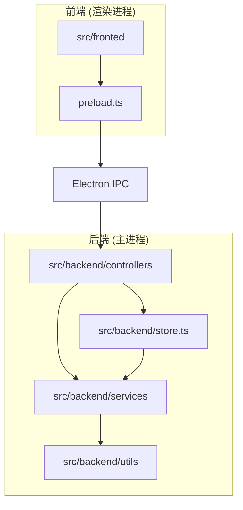
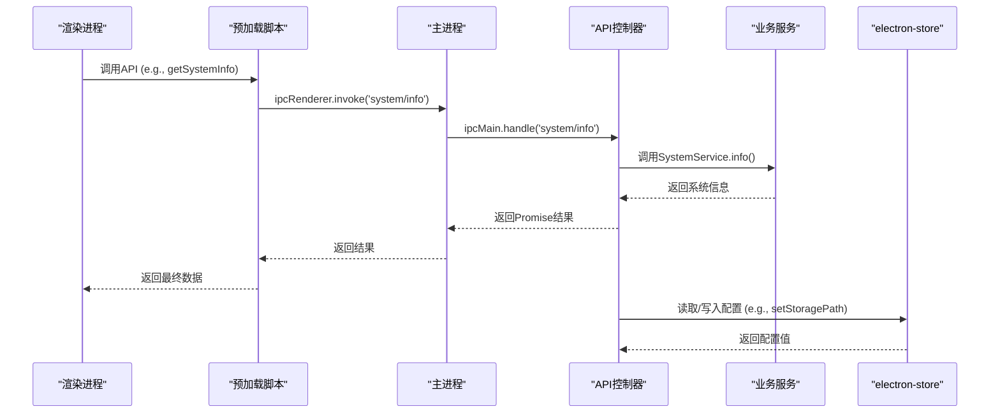
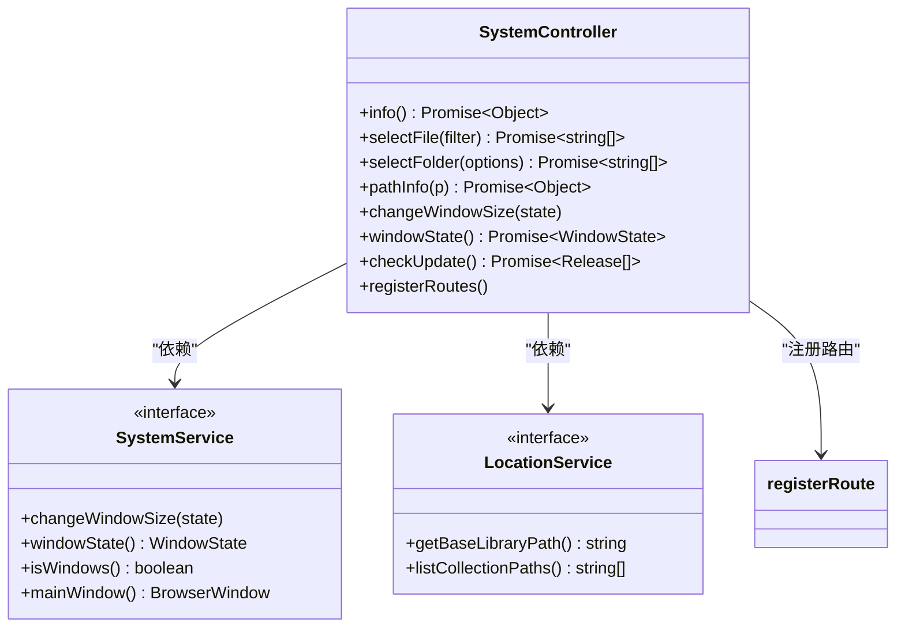
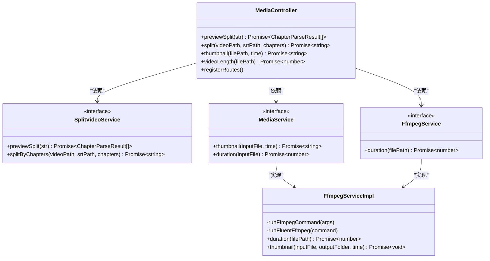
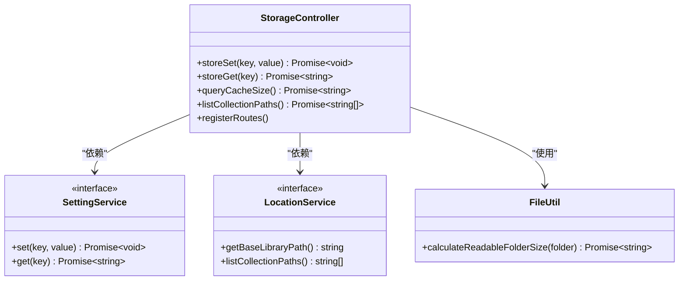
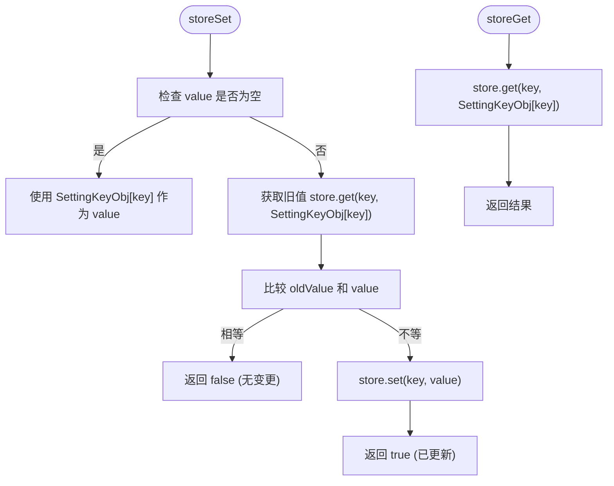
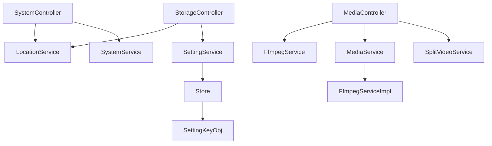

# 系统与媒体API

<cite>
**本文档引用的文件**  
- [SystemController.ts](file://src/backend/controllers/SystemController.ts)
- [MediaController.ts](file://src/backend/controllers/MediaController.ts)
- [StorageController.ts](file://src/backend/controllers/StorageController.ts)
- [store.ts](file://src/backend/store.ts)
- [store_schema.ts](file://src/common/types/store_schema.ts)
- [register.ts](file://src/common/api/register.ts)
- [SystemService.ts](file://src/backend/services/SystemService.ts)
- [SettingService.ts](file://src/backend/services/SettingService.ts)
- [FileUtil.ts](file://src/backend/utils/FileUtil.ts)
- [LocationService.ts](file://src/backend/services/LocationService.ts)
- [FfmpegServiceImpl.ts](file://src/backend/services/impl/FfmpegServiceImpl.ts)
- [MediaService.ts](file://src/backend/services/MediaService.ts)
- [SplitVideoService.ts](file://src/backend/services/SplitVideoService.ts)
</cite>

## 目录
1. [简介](#简介)
2. [项目结构](#项目结构)
3. [核心组件](#核心组件)
4. [架构概述](#架构概述)
5. [详细组件分析](#详细组件分析)
6. [依赖分析](#依赖分析)
7. [性能考虑](#性能考虑)
8. [故障排除指南](#故障排除指南)
9. [结论](#结论)

## 简介
本文档旨在全面介绍 DashPlayer 应用中的系统级 IPC（进程间通信）API，涵盖 `SystemController`、`MediaController` 和 `StorageController` 提供的核心接口。文档详细说明了系统信息获取、文件路径操作、窗口控制、媒体播放状态同步以及存储路径配置等功能的实现机制。同时，深入解析了 `store.ts` 中的全局状态管理机制和 `store_schema.ts` 定义的配置结构。此外，还阐述了这些 API 如何通过 Electron 主进程安全地访问操作系统资源，并确保渲染进程的隔离性。文档包含权限注意事项、跨平台差异、实际调用示例以及常见问题的解决方案。

## 项目结构
DashPlayer 项目采用分层架构，核心后端逻辑位于 `src/backend` 目录下，通过 Electron 的 IPC 机制与前端渲染进程通信。`controllers` 目录包含对外暴露的 API 控制器，`services` 目录实现具体的业务逻辑，`utils` 提供通用工具函数。前端位于 `src/fronted` 目录，使用 React 构建用户界面。全局状态和配置通过 `src/backend/store.ts` 和 `src/common/types/store_schema.ts` 进行管理。



**Diagram sources**
- [SystemController.ts](file://src/backend/controllers/SystemController.ts)
- [MediaController.ts](file://src/backend/controllers/MediaController.ts)
- [StorageController.ts](file://src/backend/controllers/StorageController.ts)
- [store.ts](file://src/backend/store.ts)

**Section sources**
- [SystemController.ts](file://src/backend/controllers/SystemController.ts)
- [MediaController.ts](file://src/backend/controllers/MediaController.ts)
- [StorageController.ts](file://src/backend/controllers/StorageController.ts)
- [store.ts](file://src/backend/store.ts)

## 核心组件
本节深入分析 `SystemController`、`MediaController` 和 `StorageController` 三个核心控制器，它们是系统与媒体功能的 API 入口。

**Section sources**
- [SystemController.ts](file://src/backend/controllers/SystemController.ts#L25-L127)
- [MediaController.ts](file://src/backend/controllers/MediaController.ts#L9-L56)
- [StorageController.ts](file://src/backend/controllers/StorageController.ts#L9-L37)

## 架构概述
DashPlayer 的 IPC 架构遵循典型的 Electron 模式：渲染进程通过 `ipcRenderer` 发起请求，主进程的 `ipcMain` 处理这些请求并调用相应的控制器。控制器通过依赖注入（DI）获取服务实例，执行业务逻辑，并返回结果。全局状态通过 `electron-store` 持久化。



**Diagram sources**
- [register.ts](file://src/common/api/register.ts#L8-L19)
- [SystemController.ts](file://src/backend/controllers/SystemController.ts#L113-L126)
- [store.ts](file://src/backend/store.ts#L7-L21)

## 详细组件分析
本节对每个核心控制器进行详细分析，包括其提供的 API、内部逻辑和与其他组件的交互。

### SystemController 分析
`SystemController` 负责提供与系统交互的 API，如获取系统信息、文件选择、窗口控制和应用更新检查。

#### API 接口
- `getSystemInfo`: 获取操作系统类型和路径分隔符。
- `selectFile`: 打开文件选择对话框。
- `selectFolder`: 打开文件夹选择对话框。
- `getPath`: 获取文件路径信息（基名、目录名、扩展名）。
- `minimizeWindow`: 通过 `changeWindowSize` 方法将窗口状态更改为 `minimized`。
- `checkUpdate`: 检查 GitHub 上的最新发布版本。

#### 实现逻辑
`SystemController` 依赖于 `SystemService` 和 `LocationService`。`info` 方法直接使用 Node.js 的 `process` 对象获取平台信息。`selectFile` 和 `selectFolder` 使用 Electron 的 `dialog` 模块。`changeWindowSize` 和 `windowState` 将请求委托给 `SystemService`，后者直接操作 Electron 的 `BrowserWindow` 实例。



**Diagram sources**
- [SystemController.ts](file://src/backend/controllers/SystemController.ts#L25-L127)
- [SystemService.ts](file://src/backend/services/SystemService.ts#L6-L21)
- [LocationService.ts](file://src/backend/services/LocationService.ts#L16-L26)
- [register.ts](file://src/common/api/register.ts#L8-L19)

**Section sources**
- [SystemController.ts](file://src/backend/controllers/SystemController.ts#L25-L127)

### MediaController 分析
`MediaController` 提供与媒体文件处理相关的 API，如视频分割、缩略图生成和获取视频时长。

#### API 接口
- `getCurrentTime`: 未直接提供，但 `videoLength` 可获取总时长。
- `seekTo`: 未直接提供，但 `thumbnail` 可在指定时间点生成缩略图，间接证明时间定位能力。

#### 实现逻辑
`MediaController` 依赖 `SplitVideoService`、`FfmpegService` 和 `MediaService`。`previewSplit` 和 `split` 方法委托给 `SplitVideoService` 来处理章节分割逻辑。`thumbnail` 方法调用 `MediaService`，而 `videoLength` 直接调用 `FfmpegService` 的 `duration` 方法，后者使用 `ffprobe` 获取视频元数据。



**Diagram sources**
- [MediaController.ts](file://src/backend/controllers/MediaController.ts#L9-L56)
- [SplitVideoService.ts](file://src/backend/services/SplitVideoService.ts#L5-L17)
- [MediaService.ts](file://src/backend/services/MediaService.ts#L0-L3)
- [FfmpegServiceImpl.ts](file://src/backend/services/impl/FfmpegServiceImpl.ts#L16-L355)

**Section sources**
- [MediaController.ts](file://src/backend/controllers/MediaController.ts#L9-L56)

### StorageController 分析
`StorageController` 负责管理应用的存储配置，包括设置和获取存储路径。

#### API 接口
- `setStoragePath`: 通过 `storeSet` 方法设置存储路径。

#### 实现逻辑
`StorageController` 依赖 `SettingService` 和 `LocationService`。`storeSet` 和 `storeGet` 方法将请求委托给 `SettingService`，后者负责与持久化存储交互。`queryCacheSize` 使用 `LocationService` 获取缓存目录路径，并通过 `FileUtil` 计算其大小。



**Diagram sources**
- [StorageController.ts](file://src/backend/controllers/StorageController.ts#L9-L37)
- [SettingService.ts](file://src/backend/services/SettingService.ts#L2-L5)
- [LocationService.ts](file://src/backend/services/LocationService.ts#L16-L26)
- [FileUtil.ts](file://src/backend/utils/FileUtil.ts#L73-L248)

**Section sources**
- [StorageController.ts](file://src/backend/controllers/StorageController.ts#L9-L37)

### 全局状态管理分析
本节分析 `store.ts` 和 `store_schema.ts`，它们共同构成了应用的全局配置系统。

#### store_schema.ts
该文件定义了所有可配置项的键和默认值。`SettingKeyObj` 是一个常量对象，其键为配置项的路径（如 `'storage.path'`），值为默认值。`SettingKey` 类型通过 `keyof typeof SettingKeyObj` 动态生成，确保了类型安全。

```mermaid
erDiagram
CONFIG {
string key PK
string value
string default_value
}
CONFIG ||--o{ STORAGE_PATH : "has"
CONFIG ||--o{ SHORTCUTS : "has"
CONFIG ||--o{ APIS : "has"
CONFIG ||--o{ APPEARANCE : "has"
STORAGE_PATH {
string storage.path
}
SHORTCUTS {
string shortcut.previousSentence
string shortcut.nextSentence
string shortcut.playPause
}
APIS {
string apiKeys.openAi.key
string apiKeys.youdao.secretId
}
APPEARANCE {
string appearance.theme
string appearance.fontSize
}
```

**Diagram sources**
- [store_schema.ts](file://src/common/types/store_schema.ts#L0-L36)

**Section sources**
- [store_schema.ts](file://src/common/types/store_schema.ts#L0-L36)

#### store.ts
该文件封装了 `electron-store` 的读写操作。`storeGet` 函数在获取值时，如果键不存在，则返回 `SettingKeyObj` 中定义的默认值。`storeSet` 函数在设置值前会进行空值检查，并在值未改变时避免不必要的写入。



**Diagram sources**
- [store.ts](file://src/backend/store.ts#L7-L21)
- [store_schema.ts](file://src/common/types/store_schema.ts#L0-L36)

**Section sources**
- [store.ts](file://src/backend/store.ts#L7-L21)

## 依赖分析
项目通过 InversifyJS 实现依赖注入，解耦了控制器与服务。控制器通过 `@inject` 装饰器声明其依赖，由容器在运行时注入。这种设计使得代码更易于测试和维护。核心依赖链为：`Controller -> Service -> Utils/External Libraries`。



**Diagram sources**
- [ioc/types.ts](file://src/backend/ioc/types.ts)
- [SystemController.ts](file://src/backend/controllers/SystemController.ts)
- [MediaController.ts](file://src/backend/controllers/MediaController.ts)
- [StorageController.ts](file://src/backend/controllers/StorageController.ts)

**Section sources**
- [ioc/types.ts](file://src/backend/ioc/types.ts#L9-L20)

## 性能考虑
- **异步操作**: 所有文件系统和网络操作（如 `dialog.showOpenDialog`, `checkUpdate`）均使用异步方法，避免阻塞主进程。
- **缓存**: `checkUpdate` 函数实现了 5 分钟的缓存机制，防止频繁的网络请求。
- **资源管理**: `FfmpegServiceImpl` 使用 `@WaitLock` 装饰器确保同一时间只有一个 FFmpeg 命令在执行，防止资源竞争。
- **批量操作**: `FileUtil.calculateReadableFolderSize` 使用异步生成器 `walkDir` 遍历目录，避免一次性加载大量文件信息到内存。

## 故障排除指南
本节提供常见问题的解决方案。

### 权限相关注意事项
- **文件系统访问**: `selectFile` 和 `selectFolder` 由 Electron 的沙箱机制管理，用户需主动选择路径。直接访问未授权路径会失败。
- **外部程序执行**: `FfmpegServiceImpl` 需要访问 `ffmpeg` 和 `ffprobe` 可执行文件，其路径由 `LocationService` 提供，确保了路径安全。

### 跨平台差异
- **路径分隔符**: `SystemController.info()` 返回 `path.sep`，在 Windows 上为 `\`，在 macOS/Linux 上为 `/`。
- **系统判断**: `isWindows` 通过 `process.platform === 'win32'` 判断，影响路径处理和某些系统调用。

### 常见问题与解决方案
- **问题**: 调用 `selectFolder` 时路径不存在。
  - **解决方案**: 确保 `defaultPath` 参数指向一个存在的目录，或在调用前使用 `FileUtil.exists` 检查。
- **问题**: `setStoragePath` 后路径未生效。
  - **解决方案**: 检查 `storeSet` 是否返回 `true`（表示值已更新），并确认 `SettingService` 正确地将变更通知到其他组件。
- **问题**: `checkUpdate` 请求失败。
  - **解决方案**: 检查网络连接，确认 GitHub API 可访问。代码中已包含错误处理，会返回空数组。

**Section sources**
- [SystemController.ts](file://src/backend/controllers/SystemController.ts#L51-L63)
- [store.ts](file://src/backend/store.ts#L7-L17)
- [CheckUpdate.ts](file://src/backend/services/CheckUpdate.ts#L8-L45)
- [FileUtil.ts](file://src/backend/utils/FileUtil.ts#L73-L248)

## 结论
DashPlayer 的系统与媒体 API 设计清晰，通过 `SystemController`、`MediaController` 和 `StorageController` 提供了丰富的功能。全局状态管理通过 `store.ts` 和 `store_schema.ts` 实现了类型安全和默认值管理。整个架构利用 Electron 的 IPC 机制和依赖注入，确保了主进程与渲染进程的安全隔离和代码的可维护性。开发者在使用这些 API 时，应遵循权限最佳实践，并注意跨平台的差异。