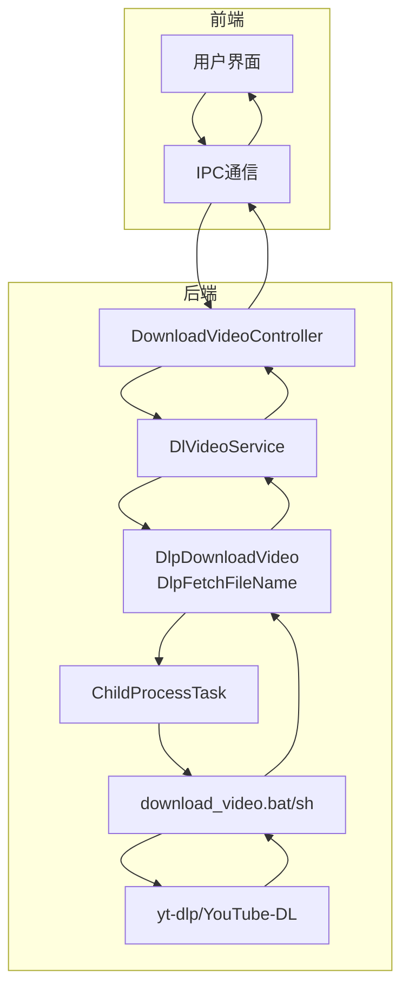
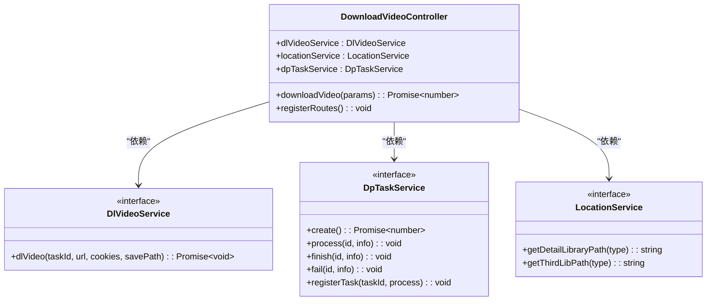
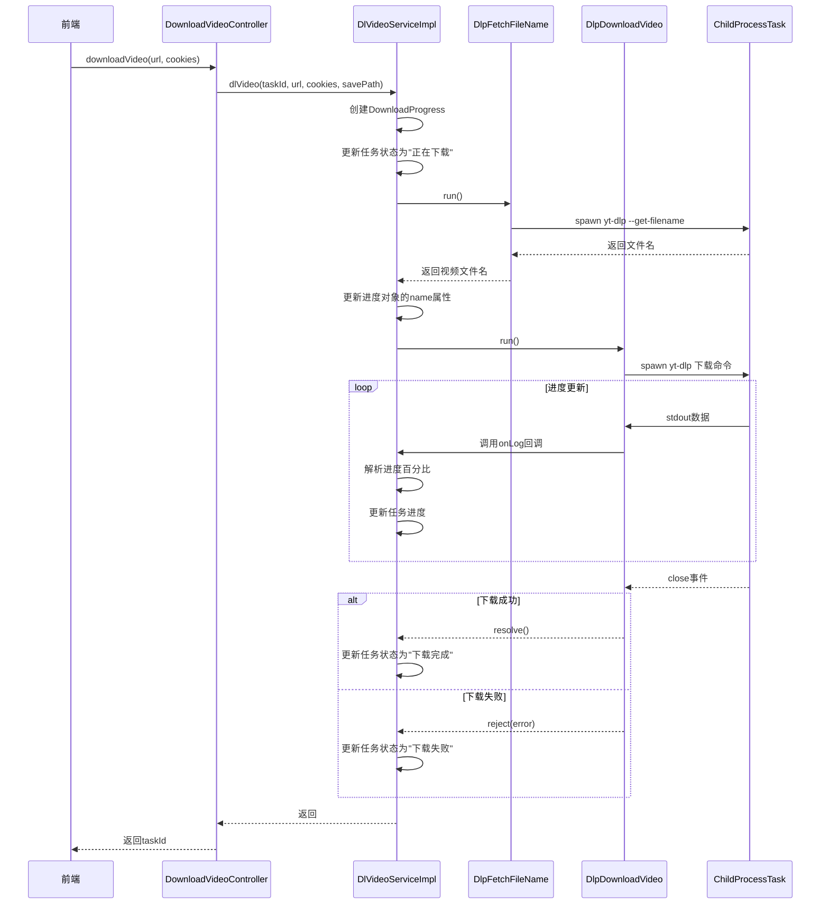
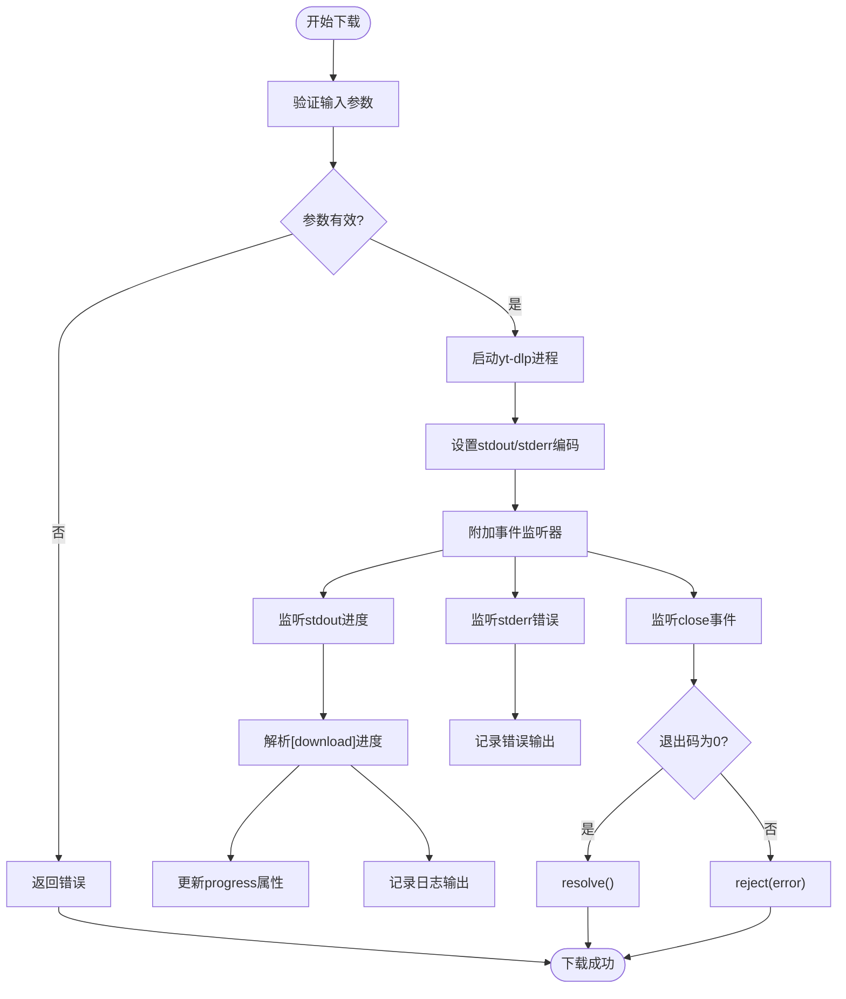
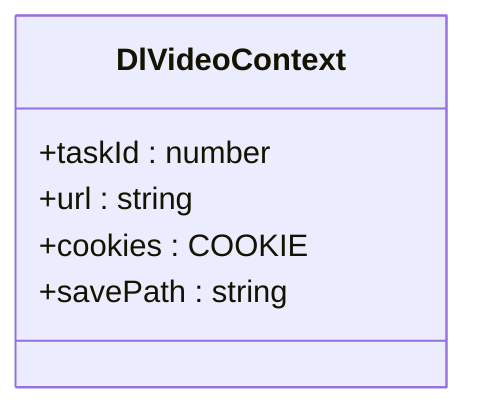
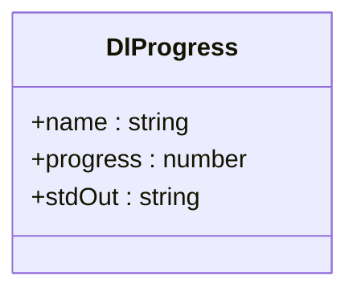
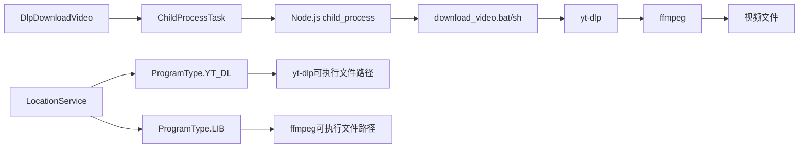
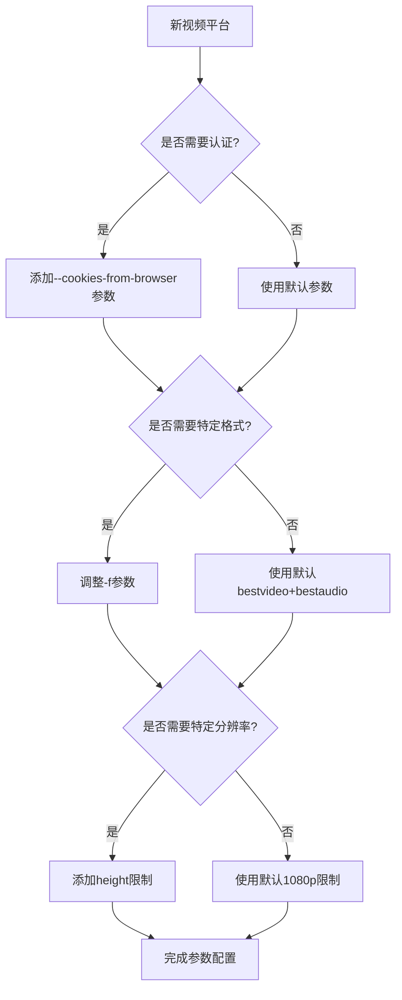

# 视频下载API

<cite>
**本文档引用的文件**
- [DownloadVideoController.ts](file://src/backend/controllers/DownloadVideoController.ts)
- [DlVideoServiceImpl.ts](file://src/backend/services/impl/DlVideoServiceImpl.ts)
- [DlpDownloadVideo.ts](file://src/backend/objs/dl-video/DlpDownloadVideo.ts)
- [DlpFetchFileName.ts](file://src/backend/objs/dl-video/DlpFetchFileName.ts)
- [dl-progress.ts](file://src/common/types/dl-progress.ts)
- [DlVideoType.ts](file://src/common/types/DlVideoType.ts)
- [download_video.bat](file://scripts/download_video.bat)
- [download_video.sh](file://scripts/download_video.sh)
- [ChildProcessTask.ts](file://src/backend/objs/ChildProcessTask.ts)
- [DpTaskService.ts](file://src/backend/services/DpTaskService.ts)
- [LocationService.ts](file://src/backend/services/LocationService.ts)
</cite>

## 目录
1. [简介](#简介)
2. [核心组件](#核心组件)
3. [架构概览](#架构概览)
4. [详细组件分析](#详细组件分析)
5. [依赖分析](#依赖分析)
6. [错误码说明](#错误码说明)
7. [扩展新视频源平台](#扩展新视频源平台)
8. [结论](#结论)

## 简介
本文档详细说明了DashPlayer项目中视频下载功能的API设计与实现机制。重点聚焦于`DownloadVideoController`暴露的IPC接口，包括`startDownload`、`getDownloadProgress`和`cancelDownload`等核心方法。文档深入解析了`DlVideoType`枚举定义的视频类型、`dl-progress`中的进度状态机模型，以及`DlpDownloadVideo`对象封装的下载任务参数。同时，阐述了后端如何通过调用外部脚本（`download_video.bat/sh`）与youtube-dl或yt-dlp集成，并处理cookies和认证信息。通过调用序列图展示从前端触发到`DownloadVideoController`再到`DlVideoService`和`ChildProcessTask`的完整流程。此外，文档还提供了错误码说明（如网络超时、格式不支持）和恢复机制，指导开发者如何扩展支持新的视频源平台。

## 核心组件
本节分析视频下载功能的核心组件，包括控制器、服务层、任务对象和进度模型。

**Section sources**
- [DownloadVideoController.ts](file://src/backend/controllers/DownloadVideoController.ts)
- [DlVideoServiceImpl.ts](file://src/backend/services/impl/DlVideoServiceImpl.ts)
- [DlpDownloadVideo.ts](file://src/backend/objs/dl-video/DlpDownloadVideo.ts)
- [dl-progress.ts](file://src/common/types/dl-progress.ts)
- [DlVideoType.ts](file://src/common/types/DlVideoType.ts)

## 架构概览
以下Mermaid图展示了视频下载功能的整体架构和组件交互关系。



**Diagram sources**
- [DownloadVideoController.ts](file://src/backend/controllers/DownloadVideoController.ts)
- [DlVideoServiceImpl.ts](file://src/backend/services/impl/DlVideoServiceImpl.ts)
- [DlpDownloadVideo.ts](file://src/backend/objs/dl-video/DlpDownloadVideo.ts)
- [ChildProcessTask.ts](file://src/backend/objs/ChildProcessTask.ts)

## 详细组件分析
本节深入分析视频下载功能的各个关键组件，包括接口定义、数据结构和执行流程。

### DownloadVideoController分析
`DownloadVideoController`是视频下载功能的入口控制器，实现了IPC接口的注册和调用。



**Diagram sources**
- [DownloadVideoController.ts](file://src/backend/controllers/DownloadVideoController.ts)
- [DlVideoService.ts](file://src/backend/services/DlVideoService.ts)
- [DpTaskService.ts](file://src/backend/services/DpTaskService.ts)
- [LocationService.ts](file://src/backend/services/LocationService.ts)

**Section sources**
- [DownloadVideoController.ts](file://src/backend/controllers/DownloadVideoController.ts)

### DlVideoService分析
`DlVideoService`是视频下载的核心服务，负责协调文件名获取和视频下载任务。



**Diagram sources**
- [DlVideoServiceImpl.ts](file://src/backend/services/impl/DlVideoServiceImpl.ts)
- [DlpFetchFileName.ts](file://src/backend/objs/dl-video/DlpFetchFileName.ts)
- [DlpDownloadVideo.ts](file://src/backend/objs/dl-video/DlpDownloadVideo.ts)
- [ChildProcessTask.ts](file://src/backend/objs/ChildProcessTask.ts)

**Section sources**
- [DlVideoServiceImpl.ts](file://src/backend/services/impl/DlVideoServiceImpl.ts)

### DlpDownloadVideo分析
`DlpDownloadVideo`是视频下载任务的具体实现，封装了与yt-dlp的交互逻辑。



**Diagram sources**
- [DlpDownloadVideo.ts](file://src/backend/objs/dl-video/DlpDownloadVideo.ts)

**Section sources**
- [DlpDownloadVideo.ts](file://src/backend/objs/dl-video/DlpDownloadVideo.ts)

### 数据模型分析
本节分析视频下载功能中使用的关键数据模型和类型定义。

#### DlVideoContext接口
`DlVideoContext`接口定义了视频下载任务的上下文信息。



**Diagram sources**
- [DlVideoType.ts](file://src/common/types/DlVideoType.ts)

#### DlProgress接口
`DlProgress`接口定义了下载进度的状态模型。



**Diagram sources**
- [dl-progress.ts](file://src/common/types/dl-progress.ts)

#### COOKIE类型
`COOKIE`类型定义了支持的浏览器cookie来源。

```mermaid
stateDiagram-v2
[*] --> chrome
[*] --> firefox
[*] --> safari
[*] --> edge
[*] --> no-cookie
```

**Diagram sources**
- [DlVideoType.ts](file://src/common/types/DlVideoType.ts)

**Section sources**
- [DlVideoType.ts](file://src/common/types/DlVideoType.ts)

## 依赖分析
本节分析视频下载功能的外部依赖和脚本集成机制。



**Diagram sources**
- [DlpDownloadVideo.ts](file://src/backend/objs/dl-video/DlpDownloadVideo.ts)
- [LocationService.ts](file://src/backend/services/LocationService.ts)
- [download_video.bat](file://scripts/download_video.bat)
- [download_video.sh](file://scripts/download_video.sh)

**Section sources**
- [download_video.bat](file://scripts/download_video.bat)
- [download_video.sh](file://scripts/download_video.sh)

## 错误码说明
本节列出视频下载功能中可能出现的错误码及其含义和处理建议。

| 错误码 | 描述 | 可能原因 | 建议处理方式 |
|--------|------|----------|------------|
| PROCESS_EXIT_NON_ZERO | yt-dlp进程非正常退出 | 网络超时、URL无效、服务器拒绝 | 检查网络连接，验证URL有效性，重试下载 |
| FORMAT_NOT_SUPPORTED | 请求的格式不支持 | 视频源不提供指定分辨率 | 调整下载参数，尝试其他格式 |
| COOKIES_INVALID | Cookie无效或过期 | 浏览器会话过期，登录状态失效 | 重新登录源平台，更新Cookie |
| FFMPEG_NOT_FOUND | 找不到FFmpeg可执行文件 | 路径配置错误，文件缺失 | 检查thirdLibPath配置，重新安装依赖 |
| YTDLP_NOT_FOUND | 找不到yt-dlp可执行文件 | 路径配置错误，文件缺失 | 检查thirdLibPath配置，重新安装yt-dlp |
| PERMISSION_DENIED | 权限被拒绝 | 目标目录不可写，防病毒软件阻止 | 检查目录权限，暂时禁用安全软件 |
| DISK_FULL | 磁盘空间不足 | 存储空间耗尽 | 清理磁盘空间，更改下载目录 |

**Section sources**
- [DlpDownloadVideo.ts](file://src/backend/objs/dl-video/DlpDownloadVideo.ts)
- [DlVideoServiceImpl.ts](file://src/backend/services/impl/DlVideoServiceImpl.ts)

## 扩展新视频源平台
本节指导开发者如何扩展支持新的视频源平台。

### 扩展步骤
1. **验证平台兼容性**：确认新平台被yt-dlp/youtube-dl支持
2. **测试下载命令**：在命令行中测试基本下载功能
3. **处理认证需求**：确定是否需要特殊认证或Cookie
4. **调整下载参数**：根据平台特性优化格式和分辨率设置
5. **实现错误处理**：添加针对该平台的特定错误处理逻辑

### 参数调整建议


**Section sources**
- [DlpDownloadVideo.ts](file://src/backend/objs/dl-video/DlpDownloadVideo.ts)
- [download_video.bat](file://scripts/download_video.bat)
- [download_video.sh](file://scripts/download_video.sh)

## 结论
本文档全面介绍了DashPlayer项目中视频下载功能的API设计与实现。通过`DownloadVideoController`暴露的IPC接口，前端可以触发视频下载任务，后端通过`DlVideoService`协调`DlpDownloadVideo`和`DlpFetchFileName`等任务对象，利用`ChildProcessTask`执行外部脚本与yt-dlp集成。进度状态通过`DlProgress`模型实时更新，错误处理机制确保了下载过程的稳定性。开发者可以基于现有架构轻松扩展支持新的视频源平台，只需调整yt-dlp参数并处理特定的认证需求即可。