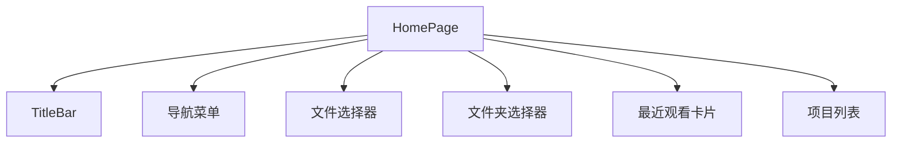
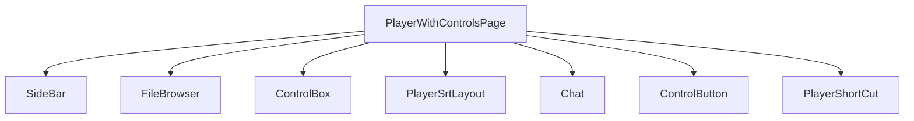
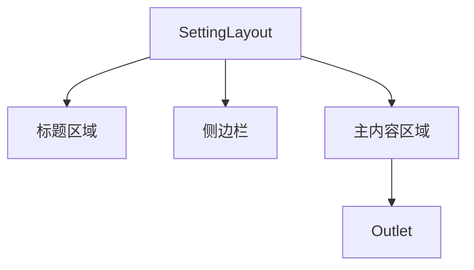
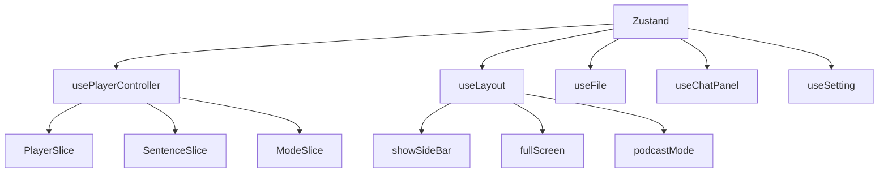
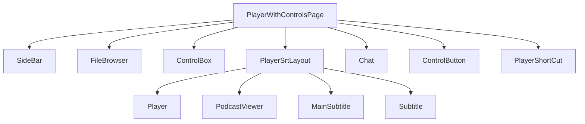

# UI组件

<cite>
**本文档引用的文件**
- [HomePage.tsx](file://src/fronted/pages/HomePage.tsx)
- [PlayerWithControlsPage.tsx](file://src/fronted/pages/PlayerWithControlsPage.tsx)
- [SettingLayout.tsx](file://src/fronted/pages/setting/SettingLayout.tsx)
- [Player.tsx](file://src/fronted/components/Player.tsx)
- [Subtitle.tsx](file://src/fronted/components/Subtitle.tsx)
- [Chat.tsx](file://src/fronted/components/chat/Chat.tsx)
- [FileBrowser.tsx](file://src/fronted/components/FileBrowser.tsx)
- [SettingInput.tsx](file://src/fronted/components/setting/SettingInput.tsx)
- [usePlayerController.ts](file://src/fronted/hooks/usePlayerController.ts)
- [useLayout.ts](file://src/fronted/hooks/useLayout.ts)
- [style.ts](file://src/fronted/styles/style.ts)
- [tailwind.config.js](file://tailwind.config.js)
- [PlayerSrtLayout.tsx](file://src/fronted/components/PlayerSrtLayout.tsx)
- [MainSubtitle.tsx](file://src/fronted/components/MainSubtitle.tsx)
- [useSubtitleScroll.ts](file://src/fronted/hooks/useSubtitleScroll.ts)
- [useFile.ts](file://src/fronted/hooks/useFile.ts)
- [useChatPanel.ts](file://src/fronted/hooks/useChatPanel.ts)
- [useSetting.ts](file://src/fronted/hooks/useSetting.ts)
- [usePlayerToaster.ts](file://src/fronted/hooks/usePlayerToaster.ts)
- [useSystem.ts](file://src/fronted/hooks/useSystem.ts)
</cite>

## 目录
1. [简介](#简介)
2. [页面结构](#页面结构)
3. [核心功能组件](#核心功能组件)
4. [UI架构与状态管理](#ui架构与状态管理)
5. [组件树示例](#组件树示例)
6. [样式定制方法](#样式定制方法)

## 简介
DashPlayer 是一个集视频播放、字幕显示、AI对话和文件管理于一体的多功能前端应用。本文档系统化地介绍其前端组件库，涵盖主要页面结构、核心功能组件、UI架构设计、状态管理机制以及样式定制方法，旨在为开发者提供全面的技术参考。

## 页面结构

### HomePage（首页）
`HomePage` 是应用的入口页面，提供视频库浏览和最近观看记录展示功能。用户可通过文件选择器或文件夹选择器加载视频，并快速跳转到播放页面。



**图示来源**
- [HomePage.tsx](file://src/fronted/pages/HomePage.tsx#L19-L140)

**本节来源**
- [HomePage.tsx](file://src/fronted/pages/HomePage.tsx#L19-L140)

### PlayerWithControlsPage（带控件的播放页面）
`PlayerWithControlsPage` 是视频播放的核心页面，支持侧边栏、文件浏览器、控制面板和AI对话窗口的动态布局切换。页面根据屏幕尺寸和用户操作动态调整组件可见性与位置。



**图示来源**
- [PlayerWithControlsPage.tsx](file://src/fronted/pages/PlayerWithControlsPage.tsx#L25-L263)

**本节来源**
- [PlayerWithControlsPage.tsx](file://src/fronted/pages/PlayerWithControlsPage.tsx#L25-L263)

### SettingLayout（设置页面布局）
`SettingLayout` 提供统一的设置页面容器，包含侧边栏导航和主内容区域。用户可通过侧边栏切换不同设置模块，如外观、快捷键、存储路径等。



**图示来源**
- [SettingLayout.tsx](file://src/fronted/pages/setting/SettingLayout.tsx#L80-L107)

**本节来源**
- [SettingLayout.tsx](file://src/fronted/pages/setting/SettingLayout.tsx#L80-L107)

## 核心功能组件

### Player（播放器组件）
`Player` 组件封装了视频播放的核心逻辑，使用 `ReactPlayer` 实现跨平台播放支持。通过 `usePlayerController` Hook 订阅播放状态，并在全屏模式下显示字幕面板。

**Props接口**
- `className`: 自定义样式类名

**内部状态**
- `playing`: 播放状态
- `muted`: 静音状态
- `volume`: 音量
- `playbackRate`: 播放速度

**事件处理**
- `onProgress`: 更新播放进度
- `onDuration`: 设置视频总时长
- `onStart`: 视频开始播放时跳转至历史进度

**与其他组件交互**
- 通过 `usePlayerController` 获取播放控制方法
- 通过 `useFile` 获取当前视频路径
- 通过 `useLayout` 监听全屏和播客模式

**本节来源**
- [Player.tsx](file://src/fronted/components/Player.tsx#L17-L257)

### Subtitle（字幕显示组件）
`Subtitle` 组件负责侧边栏字幕的滚动与高亮显示。利用 `Virtuoso` 实现虚拟滚动，提升长字幕列表的渲染性能。通过 `useSubtitleScroll` 管理滚动状态，支持自动滚动、手动浏览和暂停测量模式。

**Props接口**
- 无显式Props，完全依赖状态管理

**内部状态**
- `scrollState`: 滚动状态（NORMAL, USER_BROWSING, AUTO_SCROLLING, PAUSE_MEASUREMENT）
- `currentSentence`: 当前播放句子
- `subtitle`: 字幕数据数组

**事件处理**
- `onScrolling`: 滚轮事件拦截，防止在自动滚动时触发
- `updateCurrentRef`: 更新当前句子引用，触发滚动定位
- `onUserFinishScrolling`: 用户结束浏览后恢复自动滚动

**与其他组件交互**
- 通过 `usePlayerController` 获取当前句子和字幕数据
- 通过 `useSubtitleScroll` 管理滚动行为
- 通过 `useLayout` 获取侧边栏显示状态

**本节来源**
- [Subtitle.tsx](file://src/fronted/components/Subtitle.tsx#L15-L155)
- [useSubtitleScroll.ts](file://src/fronted/hooks/useSubtitleScroll.ts#L80-L232)

### Chat（AI对话界面组件）
`Chat` 组件提供与AI交互的对话窗口，支持上下文菜单操作，如朗读、解释、润色、引用和复制。通过 `useChatPanel` 管理对话状态，支持撤销/重做功能。

**Props接口**
- 无显式Props

**内部状态**
- `messages`: 消息列表
- `tasks`: 异步任务映射
- `input`: 用户输入内容
- `canUndo`, `canRedo`: 撤销/重做状态

**事件处理**
- `createFromSelect`: 从选中文本创建新对话
- `sent`: 发送用户消息
- `ctxMenuExplain`: 解释选中单词
- `ctxMenuPolish`: 润色句子
- `ctxMenuPlayAudio`: 朗读文本

**与其他组件交互**
- 通过 `useChatPanel` 管理对话状态
- 通过 `usePlayerController` 获取当前句子上下文
- 通过 `api.call` 调用后端AI服务

**本节来源**
- [Chat.tsx](file://src/fronted/components/chat/Chat.tsx#L24-L189)
- [useChatPanel.ts](file://src/fronted/hooks/useChatPanel.ts#L134-L439)

### FileBrowser（文件浏览器组件）
`FileBrowser` 组件提供视频文件的浏览与管理功能，支持文件夹层级导航和视频项目展示。通过 `ProjectListComp` 渲染项目列表，支持高亮当前播放视频。

**Props接口**
- 无显式Props

**内部状态**
- `videoPath`: 当前视频路径
- `videoId`: 当前视频ID
- `data`: 视频详情数据

**事件处理**
- `FileSelector.onSelected`: 选择文件后跳转播放
- `FolderSelector.onSelected`: 分析文件夹内容并提示转换MKV格式

**与其他组件交互**
- 通过 `useFile` 获取当前视频信息
- 通过 `api.call` 调用后端API获取视频详情
- 通过 `useNavigate` 实现页面跳转

**本节来源**
- [FileBrowser.tsx](file://src/fronted/components/FileBrowser.tsx#L20-L171)

### SettingInput（配置输入框组件）
`SettingInput` 组件用于渲染设置项的输入控件，包含标签、输入框和描述文本。支持多种输入类型，如文本、密码等。

**Props接口**
- `title`: 标题
- `description`: 描述
- `placeHolder`: 占位符
- `value`: 当前值
- `setValue`: 值变更回调
- `type`: 输入类型
- `inputWidth`: 输入框宽度
- `className`: 自定义样式

**内部状态**
- 无本地状态，完全受控

**事件处理**
- `onChange`: 输入值变更时调用 `setValue`

**与其他组件交互**
- 通过 `useSetting` 获取和更新设置值
- 在 `SettingLayout` 中作为子组件使用

**本节来源**
- [SettingInput.tsx](file://src/fronted/components/setting/SettingInput.tsx#L16-L44)
- [useSetting.ts](file://src/fronted/hooks/useSetting.ts#L16-L36)

## UI架构与状态管理

### 使用Radix UI原语和Tailwind CSS进行样式化
DashPlayer 使用 [Radix UI](https://www.radix-ui.com/) 作为基础UI组件库，提供无障碍、可定制的原语组件，如 `Button`, `Dialog`, `DropdownMenu` 等。样式方面采用 [Tailwind CSS](https://tailwindcss.com/) 实现原子化CSS，结合 `cn` 工具函数动态组合类名。

Tailwind 配置中启用了暗色模式支持，并通过 `theme` 扩展定义了边框、输入、环形、背景等颜色变量。插件系统集成了动画、滚动条和排版功能，提升用户体验。

```mermaid
graph TD
A[Tailwind CSS] --> B[颜色变量]
A --> C[圆角变量]
A --> D[动画]
A --> E[插件]
E --> F[tailwindcss-animate]
E --> G[tailwind-scrollbar]
E --> H[@tailwindcss/typography]
```

**图示来源**
- [tailwind.config.js](file://tailwind.config.js#L0-L78)

**本节来源**
- [tailwind.config.js](file://tailwind.config.js#L0-L78)

### 通过Zustand和自定义Hooks进行状态管理
DashPlayer 采用 [Zustand](https://zustand-demo.pmnd.rs/) 作为状态管理库，通过 `create` 函数创建多个独立的状态存储，如 `usePlayerController`, `useLayout`, `useFile`, `useChatPanel` 等。每个Hook封装特定领域的状态与逻辑，实现关注点分离。

- `usePlayerController`: 管理播放器核心状态，如播放、暂停、进度、字幕等。
- `useLayout`: 管理UI布局状态，如侧边栏、全屏、播客模式等。
- `useFile`: 管理文件路径和加载状态。
- `useChatPanel`: 管理AI对话状态，支持撤销/重做。
- `useSetting`: 管理用户设置，持久化到本地存储。

这些Hook通过 `subscribeWithSelector` 实现细粒度订阅，避免不必要的重渲染。



**图示来源**
- [usePlayerController.ts](file://src/fronted/hooks/usePlayerController.ts#L28-L46)
- [useLayout.ts](file://src/fronted/hooks/useLayout.ts#L23-L45)
- [useFile.ts](file://src/fronted/hooks/useFile.ts#L20-L67)
- [useChatPanel.ts](file://src/fronted/hooks/useChatPanel.ts#L134-L439)
- [useSetting.ts](file://src/fronted/hooks/useSetting.ts#L16-L36)

**本节来源**
- [usePlayerController.ts](file://src/fronted/hooks/usePlayerController.ts#L28-L46)
- [useLayout.ts](file://src/fronted/hooks/useLayout.ts#L23-L45)
- [useFile.ts](file://src/fronted/hooks/useFile.ts#L20-L67)
- [useChatPanel.ts](file://src/fronted/hooks/useChatPanel.ts#L134-L439)
- [useSetting.ts](file://src/fronted/hooks/useSetting.ts#L16-L36)

## 组件树示例

以下为 `PlayerWithControlsPage` 的组件树结构：



**图示来源**
- [PlayerWithControlsPage.tsx](file://src/fronted/pages/PlayerWithControlsPage.tsx#L25-L263)
- [PlayerSrtLayout.tsx](file://src/fronted/components/PlayerSrtLayout.tsx#L13-L103)

**本节来源**
- [PlayerWithControlsPage.tsx](file://src/fronted/pages/PlayerWithControlsPage.tsx#L25-L263)
- [PlayerSrtLayout.tsx](file://src/fronted/components/PlayerSrtLayout.tsx#L13-L103)

## 样式定制方法

### 通过Tailwind配置主题
DashPlayer 支持通过 `tailwind.config.js` 配置主题颜色、字体、间距等。开发者可修改 `theme.extend.colors` 中的变量来自定义应用外观。例如，更改主色调、背景色、文本颜色等。

此外，项目中定义了 `style.ts` 文件，集中管理字体大小和颜色常量，支持亮色和暗色两种主题。通过 `themeProvider` 函数根据当前主题动态返回对应的Tailwind类名。

```typescript
export const themeProvider = (
    theme: string
): ((style: ColorType) => string) => {
    return (style: ColorType): string => {
        if (theme === 'light') {
            return lightColor[style];
        }
        return darkColor[style];
    };
};
```

**本节来源**
- [style.ts](file://src/fronted/styles/style.ts#L0-L106)
- [tailwind.config.js](file://tailwind.config.js#L0-L78)