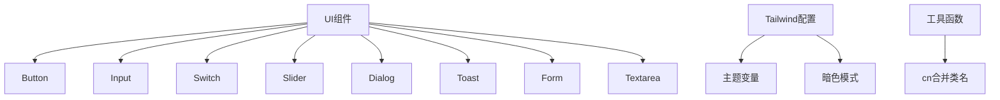
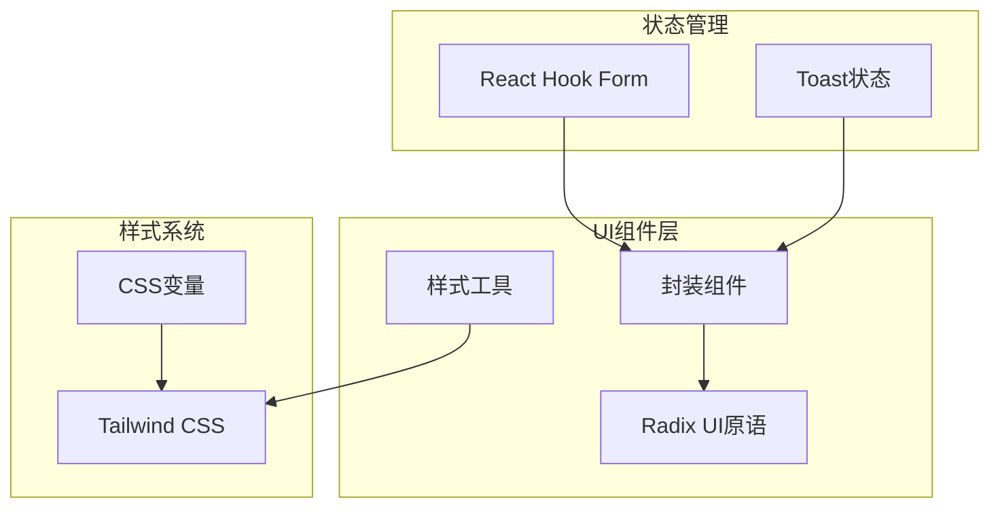
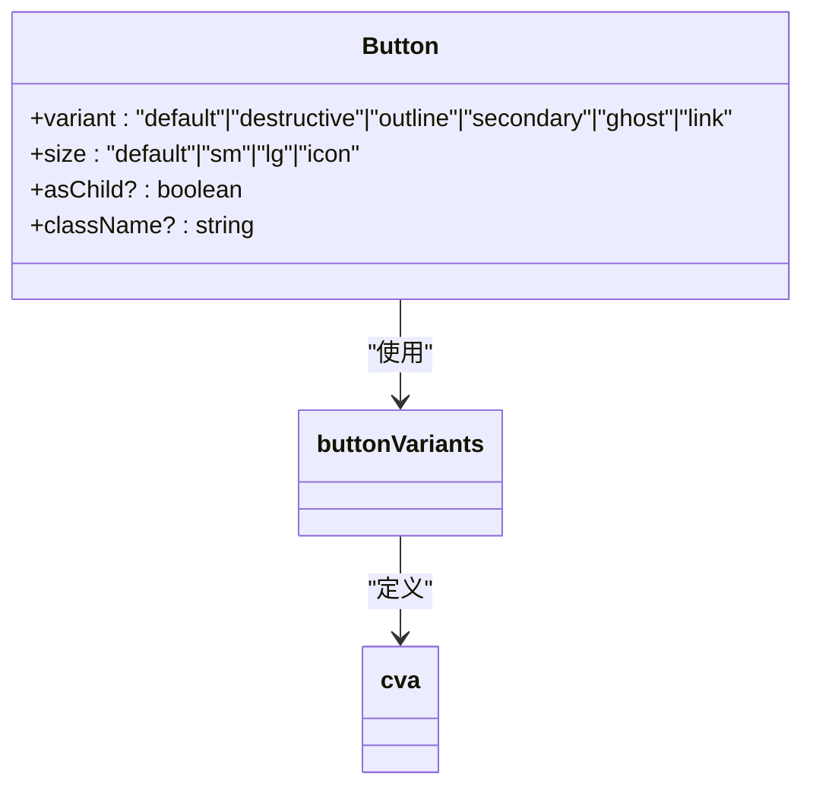
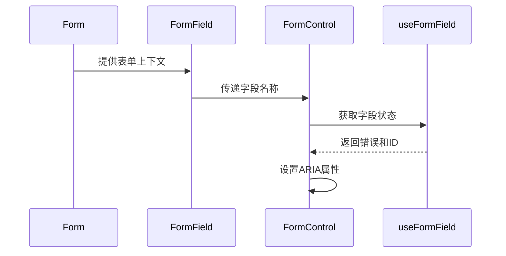
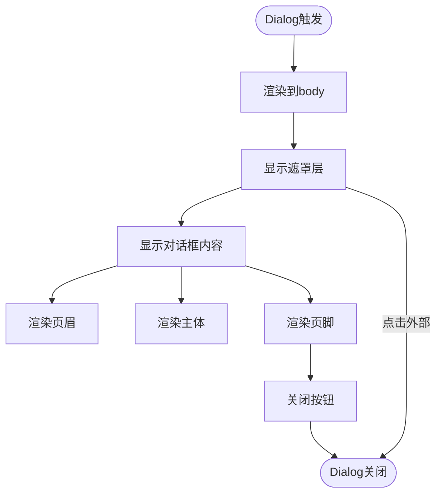
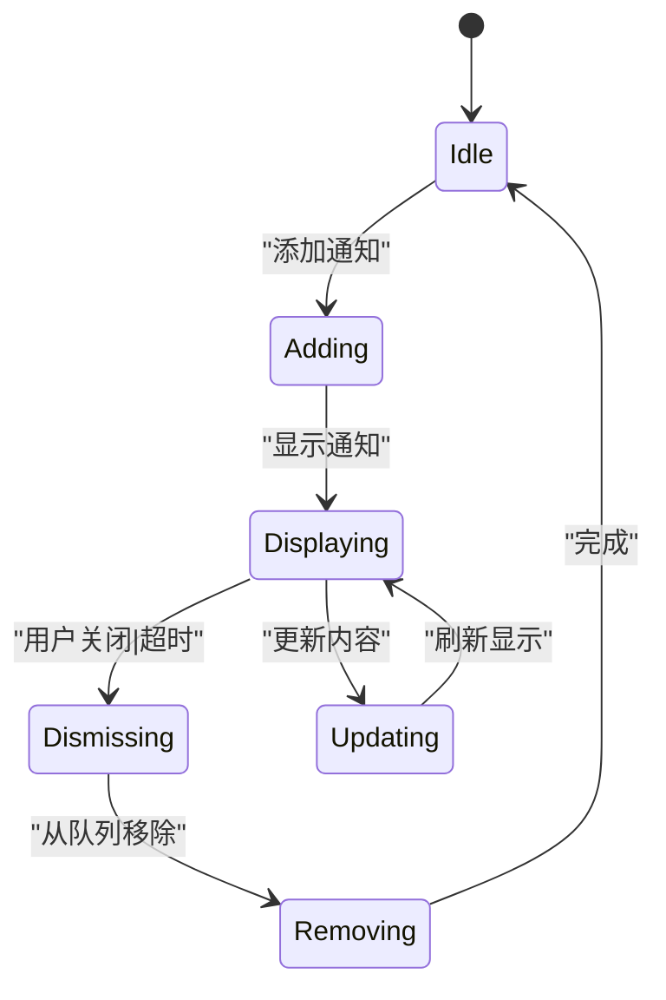
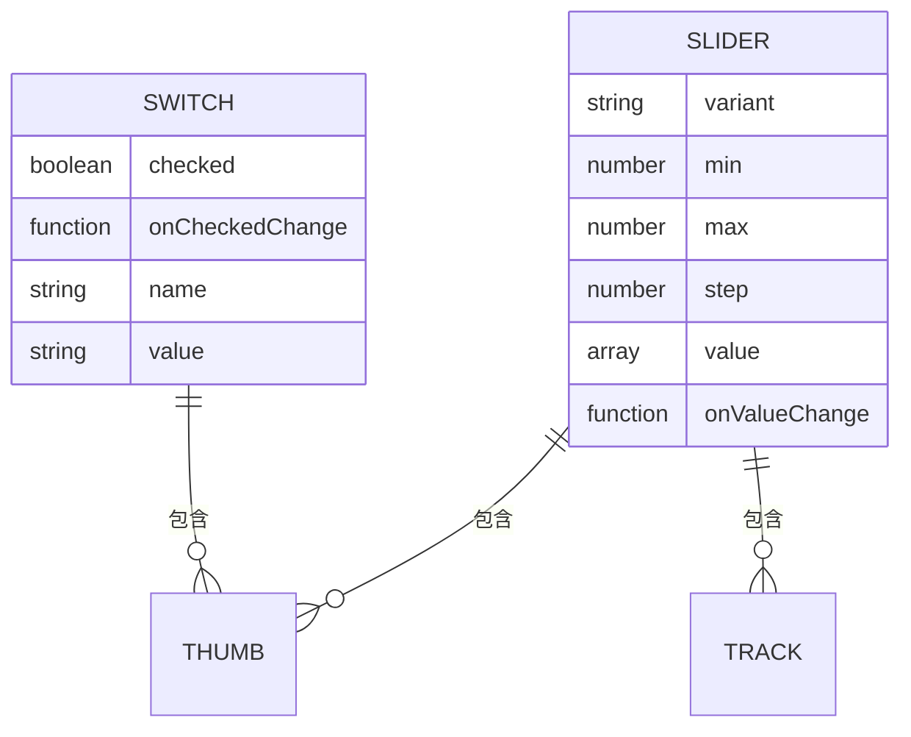
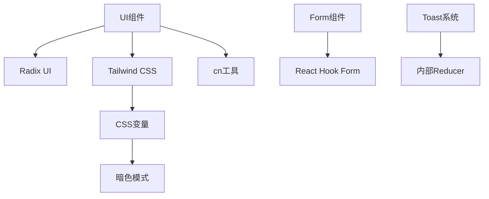

# 基础UI组件

<cite>
**本文档中引用的文件**  
- [button.tsx](file://src/fronted/components/ui/button.tsx)
- [input.tsx](file://src/fronted/components/ui/input.tsx)
- [switch.tsx](file://src/fronted/components/ui/switch.tsx)
- [slider.tsx](file://src/fronted/components/ui/slider.tsx)
- [dialog.tsx](file://src/fronted/components/ui/dialog.tsx)
- [toast.tsx](file://src/fronted/components/ui/toast.tsx)
- [form.tsx](file://src/fronted/components/ui/form.tsx)
- [textarea.tsx](file://src/fronted/components/ui/textarea.tsx)
- [use-toast.ts](file://src/fronted/components/ui/use-toast.ts)
- [tailwind.config.js](file://tailwind.config.js)
- [Button.tsx](file://src/fronted/components/Button.tsx)
</cite>

## 目录
1. [简介](#简介)
2. [项目结构](#项目结构)
3. [核心组件](#核心组件)
4. [架构概述](#架构概述)
5. [详细组件分析](#详细组件分析)
6. [依赖分析](#依赖分析)
7. [性能考虑](#性能考虑)
8. [故障排除指南](#故障排除指南)
9. [结论](#结论)
10. [附录](#附录)（如有必要）

## 简介
本文档系统化整理了基于Radix UI构建的基础UI原语组件。详细说明了每个原子化组件（如Button、Input、Switch、Slider、Dialog、Toast等）的封装目的、扩展属性和样式定制方式。解释了这些组件如何通过Tailwind CSS实现主题一致性，并支持暗色模式切换。描述了表单相关组件（Form、Input、Textarea）与React Hook Form的集成方式。提供了各基础组件的使用规范、无障碍访问（a11y）支持情况以及在不同上下文中的最佳实践示例。

## 项目结构
本项目采用分层架构，前端组件主要位于`src/fronted/components/ui`目录下，所有基础UI组件均基于Radix UI进行封装。Tailwind CSS配置文件位于项目根目录，负责全局样式和主题管理。组件通过`@/fronted/lib/utils`中的`cn`工具函数进行样式合并，确保一致的样式处理逻辑。

**图示来源**
- [button.tsx](file://src/fronted/components/ui/button.tsx#L41-L52)
- [tailwind.config.js](file://tailwind.config.js#L1-L78)

**章节来源**
- [tailwind.config.js](file://tailwind.config.js#L1-L78)
- [src/fronted/components/ui](file://src/fronted/components/ui)

## 核心组件
本项目的核心UI组件基于Radix UI原语进行二次封装，通过Tailwind CSS实现样式统一。每个组件都遵循原子化设计原则，提供一致的API接口和无障碍访问支持。组件通过`cva`（Class Variance Authority）定义变体，支持多种尺寸和状态样式。所有组件均支持暗色模式，通过CSS变量实现主题切换。

**章节来源**
- [button.tsx](file://src/fronted/components/ui/button.tsx#L35-L39)
- [input.tsx](file://src/fronted/components/ui/input.tsx#L4-L4)
- [switch.tsx](file://src/fronted/components/ui/switch.tsx#L5-L23)

## 架构概述
系统采用分层架构，基础UI组件层基于Radix UI构建，通过Tailwind CSS进行样式管理。表单组件与React Hook Form深度集成，提供类型安全的表单处理能力。Toast系统采用中心化状态管理，确保通知的一致性和可预测性。所有组件通过`cn`工具函数进行样式合并，确保在不同上下文中的样式一致性。

**图示来源**
- [form.tsx](file://src/fronted/components/ui/form.tsx#L15-L15)
- [use-toast.ts](file://src/fronted/components/ui/use-toast.ts#L171-L189)
- [tailwind.config.js](file://tailwind.config.js#L1-L78)

## 详细组件分析
本节详细分析各个基础UI组件的实现细节、使用规范和最佳实践。

### 按钮组件分析
按钮组件提供了多种变体和尺寸选项，支持作为子元素渲染（asChild）。组件通过`buttonVariants`函数定义样式变体，包括默认、破坏性、轮廓、次要、幽灵和链接等类型。所有按钮都具有焦点环和禁用状态样式，确保无障碍访问。

**图示来源**
- [button.tsx](file://src/fronted/components/ui/button.tsx#L41-L52)
- [button.tsx](file://src/fronted/components/ui/button.tsx#L35-L39)

#### 表单相关组件分析
表单组件与React Hook Form深度集成，提供类型安全的表单处理能力。`Form`组件封装了`FormProvider`，`FormField`组件通过上下文传递字段名称，`FormControl`组件自动关联标签和错误信息。整个表单系统支持无障碍访问，自动处理ARIA属性。

**图示来源**
- [form.tsx](file://src/fronted/components/ui/form.tsx#L28-L39)
- [form.tsx](file://src/fronted/components/ui/form.tsx#L103-L122)
- [form.tsx](file://src/fronted/components/ui/form.tsx#L41-L62)

#### 对话框组件分析
对话框组件提供模态对话框功能，支持标题、描述、页眉、页脚等结构化内容。组件使用Portal渲染到body元素，确保正确的z-index层级。Overlay组件提供背景遮罩，支持点击外部关闭。Close按钮提供标准的关闭交互，符合无障碍访问规范。

**图示来源**
- [dialog.tsx](file://src/fronted/components/ui/dialog.tsx#L6-L6)
- [dialog.tsx](file://src/fronted/components/ui/dialog.tsx#L29-L50)
- [dialog.tsx](file://src/fronted/components/ui/dialog.tsx#L14-L26)

#### Toast通知组件分析
Toast组件提供轻量级通知功能，支持成功、错误等不同类型。系统采用中心化状态管理，通过reducer处理添加、更新、关闭和移除操作。ToastViewport组件控制通知的显示位置和动画效果，支持从顶部或底部滑入滑出。每个通知都有自动移除队列，确保界面整洁。

**图示来源**
- [toast.tsx](file://src/fronted/components/ui/toast.tsx#L40-L52)
- [use-toast.ts](file://src/fronted/components/ui/use-toast.ts#L171-L189)
- [toast.tsx](file://src/fronted/components/ui/toast.tsx#L17-L28)

**章节来源**
- [toast.tsx](file://src/fronted/components/ui/toast.tsx#L40-L52)
- [use-toast.ts](file://src/fronted/components/ui/use-toast.ts#L171-L189)
- [src/fronted/components/ui/toast.tsx](file://src/fronted/components/ui/toast.tsx)

### 滑块与开关组件分析
滑块和开关组件均基于Radix UI的原语构建，提供直观的用户交互。滑块组件支持范围选择，Thumb可拖动，Track显示进度。开关组件提供二态切换，通过data-state属性控制样式。两个组件都支持键盘导航和屏幕阅读器，确保无障碍访问。

**图示来源**
- [slider.tsx](file://src/fronted/components/ui/slider.tsx#L5-L22)
- [switch.tsx](file://src/fronted/components/ui/switch.tsx#L5-L23)

**章节来源**
- [slider.tsx](file://src/fronted/components/ui/slider.tsx#L5-L22)
- [switch.tsx](file://src/fronted/components/ui/switch.tsx#L5-L23)

## 依赖分析
项目依赖关系清晰，基础UI组件依赖Radix UI原语和Tailwind CSS工具函数。表单组件额外依赖React Hook Form，Toast系统依赖其内部状态管理机制。所有样式通过Tailwind的`cn`函数合并，避免样式冲突。组件间通过标准的React上下文和props进行通信，耦合度低。

**图示来源**
- [tailwind.config.js](file://tailwind.config.js#L1-L78)
- [form.tsx](file://src/fronted/components/ui/form.tsx#L15-L15)
- [use-toast.ts](file://src/fronted/components/ui/use-toast.ts#L171-L189)

**章节来源**
- [tailwind.config.js](file://tailwind.config.js#L1-L78)
- [package.json](file://package.json#L1-L20)

## 性能考虑
组件设计注重性能优化。所有UI组件均为轻量级封装，避免不必要的重渲染。使用`React.forwardRef`确保引用正确传递，`React.memo`可选用于防止不必要的更新。样式通过Tailwind的JIT编译器按需生成，减少CSS文件体积。动画使用CSS过渡而非JavaScript，确保60fps流畅体验。

## 故障排除指南
常见问题包括样式不生效、无障碍访问问题和状态同步错误。确保正确安装和配置Tailwind CSS，检查`tailwind.config.js`中的content路径。对于表单验证问题，确认React Hook Form的版本兼容性。Toast不显示时，检查是否正确渲染了`ToastProvider`和`ToastViewport`。暗色模式失效时，验证CSS变量是否正确注入。

**章节来源**
- [tailwind.config.js](file://tailwind.config.js#L1-L78)
- [use-toast.ts](file://src/fronted/components/ui/use-toast.ts#L171-L189)
- [form.tsx](file://src/fronted/components/ui/form.tsx#L41-L62)

## 结论
本项目的基础UI组件系统设计良好，基于Radix UI提供可靠的原语支持，通过Tailwind CSS实现一致的视觉风格。组件封装合理，API设计直观，支持主题切换和无障碍访问。与React Hook Form的集成简化了表单处理，Toast系统提供优雅的通知体验。整体架构清晰，易于维护和扩展。

## 附录
### 主题变量参考
| CSS变量 | 说明 |
|--------|------|
| `--primary` | 主要颜色 |
| `--background` | 背景颜色 |
| `--foreground` | 前景颜色 |
| `--radius` | 圆角半径 |

### 组件使用速查
| 组件 | 主要属性 | 用途 |
|------|---------|------|
| Button | variant, size, asChild | 触发操作 |
| Input | type, placeholder | 数据输入 |
| Switch | checked, onCheckedChange | 二态切换 |
| Slider | min, max, step | 范围选择 |
| Dialog | open, onOpenChange | 模态对话 |
| Toast | title, description, variant | 轻量通知 |