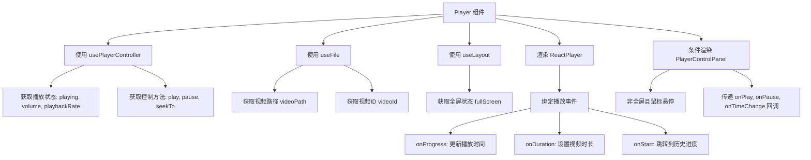
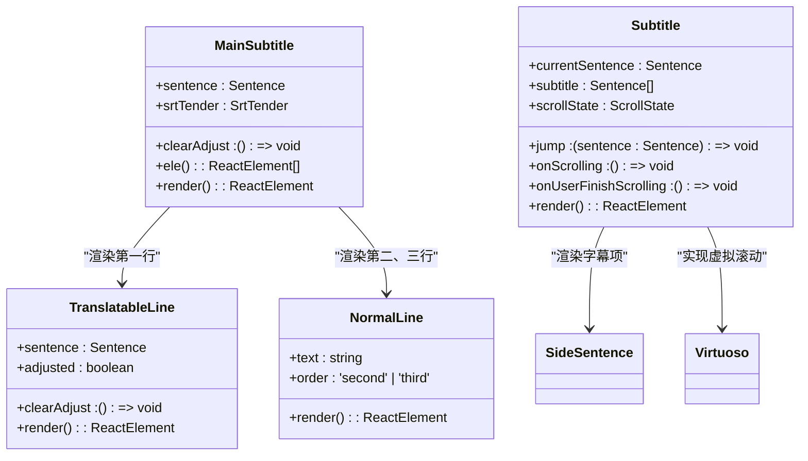
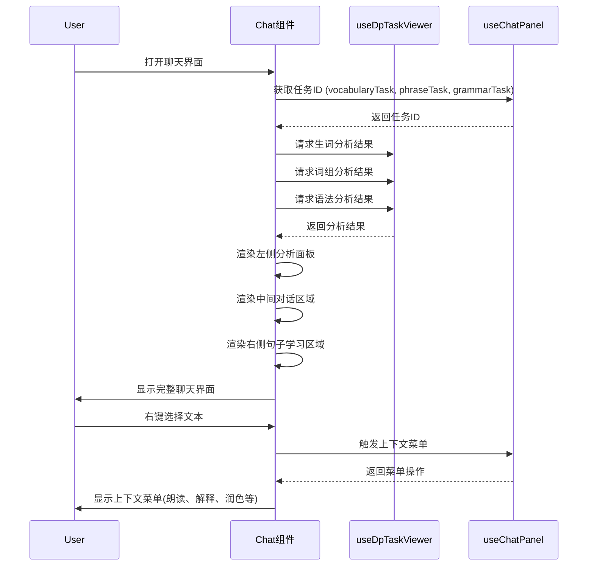

# 核心UI组件

<cite>
**本文档中引用的文件**  
- [Player.tsx](file://src/fronted/components/Player.tsx)
- [PlayerControlPanel.tsx](file://src/fronted/components/PlayerControlPanel.tsx)
- [MainSubtitle.tsx](file://src/fronted/components/MainSubtitle.tsx)
- [Subtitle.tsx](file://src/fronted/components/Subtitle.tsx)
- [Chat.tsx](file://src/fronted/components/chat/Chat.tsx)
- [AiWelcomeMsg.tsx](file://src/fronted/components/chat/msg/AiWelcomeMsg.tsx)
- [AiNormalMsg.tsx](file://src/fronted/components/chat/msg/AiNormalMsg.tsx)
- [ChatLeftWords.tsx](file://src/fronted/components/chat/ChatLeftWords.tsx)
- [ChatLeftPhrases.tsx](file://src/fronted/components/chat/ChatLeftPhrases.tsx)
- [ChatLeftGrammers.tsx](file://src/fronted/components/chat/ChatLeftGrammers.tsx)
- [FileBrowser.tsx](file://src/fronted/components/FileBrowser.tsx)
- [SettingInput.tsx](file://src/fronted/components/setting/SettingInput.tsx)
</cite>

## 目录
1. [播放器组件](#播放器组件)
2. [字幕组件](#字幕组件)
3. [聊天组件](#聊天组件)
4. [文件浏览器组件](#文件浏览器组件)
5. [设置输入组件](#设置输入组件)

## 播放器组件

`Player` 组件是 DashPlayer 的核心播放控制组件，负责视频播放、暂停、进度控制、音量调节和播放速率管理。该组件通过 `usePlayerController` Hook 与全局播放状态进行绑定，实现播放逻辑的集中管理。

组件通过 `ReactPlayer` 实现视频播放功能，并结合 `useLayout` Hook 管理全屏状态。播放控制面板（`PlayerControlPanel`）在非全屏模式下作为子组件嵌入，通过 `onPlay`、`onPause` 和 `onTimeChange` 回调与父组件交互。组件还实现了防抖机制，通过 `seekTimeoutRef` 避免频繁的 seek 操作，提升用户体验。

当视频加载时，组件会自动跳转到用户上次观看的位置，通过调用 `watch-history/detail` API 获取历史进度。在播客模式下，背景视频同步功能会被禁用。



**组件属性接口定义**
- `className?: string` - 可选的 CSS 类名，用于自定义样式

**内部状态结构**
- `showControlPanel: boolean` - 控制播放控制面板的显示状态
- `lastSeekTime: Ref<SeekAction>` - 存储上一次 seek 操作的时间
- `seekTimeoutRef: Ref<Timeout | null>` - 存储防抖定时器的引用

**事件回调机制**
- `onPlay()` - 播放回调，触发 `play()` 方法
- `onPause()` - 暂停回调，触发 `pause()` 方法
- `onTimeChange(time: number)` - 进度改变回调，触发 `seekTo({ time })` 方法

**真实场景使用示例**
```tsx
<Player className="player-container" />
```

**组件来源**
- [Player.tsx](file://src/fronted/components/Player.tsx#L17-L257)
- [PlayerControlPanel.tsx](file://src/fronted/components/PlayerControlPanel.tsx#L22-L207)

## 字幕组件

`Subtitle` 和 `MainSubtitle` 组件共同实现了双语字幕的同步渲染功能。`MainSubtitle` 组件负责渲染当前播放时间点的主字幕，而 `Subtitle` 组件则负责渲染侧边栏中的完整字幕列表。

`MainSubtitle` 组件从 `usePlayerController` 中获取当前句子（`currentSentence`），并按优先级渲染原文、微软翻译和中文翻译。组件通过 `srtTender?.adjusted(sentence)` 判断字幕是否经过时间轴调整，并显示相应的重置按钮。`TranslatableLine` 组件用于渲染可翻译的主字幕行，而 `NormalLine` 组件用于渲染翻译后的字幕行。

`Subtitle` 组件使用 `Virtuoso` 实现虚拟滚动，提高长字幕列表的渲染性能。组件通过 `useSubtitleScroll` Hook 管理滚动状态，并在用户手动滚动时显示"返回自动滚动"按钮。字幕项通过 `SideSentence` 组件渲染，点击后会跳转到对应时间点。



**组件属性接口定义**
- `MainSubtitle`: 无外部属性，完全依赖状态管理
- `Subtitle`: 无外部属性，完全依赖状态管理

**内部状态结构**
- `MainSubtitle`: 使用 `sentence` 状态存储当前句子
- `Subtitle`: 使用 `mouseOver` 状态跟踪鼠标悬停状态

**事件回调机制**
- `jump(sentence)` - 点击字幕项时跳转到指定时间点
- `onUserFinishScrolling()` - 用户完成手动滚动后恢复自动滚动

**真实场景使用示例**
```tsx
<MainSubtitle />
<Subtitle />
```

**组件来源**
- [MainSubtitle.tsx](file://src/fronted/components/MainSubtitle.tsx#L5-L66)
- [Subtitle.tsx](file://src/fronted/components/Subtitle.tsx#L15-L155)
- [srt-cops/translatable-line.tsx](file://src/fronted/components/srt-cops/translatable-line.tsx#L15-L80)
- [NormalLine.tsx](file://src/fronted/components/NormalLine.tsx#L8-L79)

## 聊天组件

`Chat` 组件是 DashPlayer 的 AI 交互中心，管理对话消息流和各种 AI 消息类型的处理。组件通过 `useChatPanel` Hook 管理对话状态，并与 `ChatLeftWords`、`ChatLeftPhrases`、`ChatLeftGrammers` 等子组件联动，展示 AI 分析结果。

`AiWelcomeMsg` 组件是欢迎消息类型，显示句子分析结果，包括翻译、同义句和可能的标点修正。组件通过 `useDpTaskViewer` Hook 获取多个异步任务的结果（润色、标点、翻译），并动态渲染。`AiNormalMsg` 组件是普通 AI 消息类型，用于显示常规的 AI 响应。

左侧分析面板包含三个核心组件：`ChatLeftWords` 显示生词分析，`ChatLeftPhrases` 显示词组分析，`ChatLeftGrammers` 显示语法分析。这些组件都通过 `useDpTaskViewer` Hook 获取对应的 AI 分析任务结果，并使用骨架屏（Skeleton）提供加载状态反馈。



**组件属性接口定义**
- `AiWelcomeMsg`: `{ msg: AiWelcomeMessage }` - 接收欢迎消息对象
- `AiNormalMsg`: `{ msg: AiNormalMessage }` - 接收普通AI消息对象
- `ChatLeftWords/Phrases/Grammers`: `{ className: string }` - 接收CSS类名

**内部状态结构**
- `AiWelcomeMsg`: 通过 `useDpTaskViewer` 获取多个任务的详细结果
- `AiNormalMsg`: 通过 `useDpTaskViewer` 获取任务结果内容
- `ChatLeftWords`: 通过 `useDpTaskViewer` 获取生词分析结果

**事件回调机制**
- `ctxMenuExplain()`: 解释所选单词
- `ctxMenuPolish()`: 润色句子
- `ctxMenuPlayAudio()`: 朗读文本
- `retry(type)`: 重新执行指定类型的分析任务

**真实场景使用示例**
```tsx
<Chat />
<AiWelcomeMsg msg={welcomeMessage} />
<AiNormalMsg msg={normalMessage} />
<ChatLeftWords className="analysis-panel" />
```

**组件来源**
- [Chat.tsx](file://src/fronted/components/chat/Chat.tsx#L24-L189)
- [AiWelcomeMsg.tsx](file://src/fronted/components/chat/msg/AiWelcomeMsg.tsx#L11-L79)
- [AiNormalMsg.tsx](file://src/fronted/components/chat/msg/AiNormalMsg.tsx#L7-L25)
- [ChatLeftWords.tsx](file://src/fronted/components/chat/ChatLeftWords.tsx#L11-L53)
- [ChatLeftPhrases.tsx](file://src/fronted/components/chat/ChatLeftPhrases.tsx#L11-L43)
- [ChatLeftGrammers.tsx](file://src/fronted/components/chat/ChatLeftGrammers.tsx#L12-L42)

## 文件浏览器组件

`FileBrowser` 组件提供文件导航与选择功能，允许用户浏览和选择视频文件进行播放。组件通过 `useSWR` Hook 获取当前视频的历史播放进度，并根据进度状态高亮显示当前播放的项目。

组件包含两个主要选择器：`FileSelector` 用于选择单个视频文件，`FolderSelector` 用于选择整个文件夹。选择器通过 `onSelected` 回调与父组件通信，实现文件选择后的导航跳转。`ProjectListComp` 组件负责渲染项目列表，支持文件和文件夹的混合显示。

文件项的显示状态根据当前播放状态动态调整：当前播放的文件显示为高亮（highlight），已播放过但非当前的文件显示为低亮（lowlight），其他文件显示为正常状态。右键菜单提供"在资源管理器中显示"和"删除"功能。

```mermaid
flowchart LR
A[FileBrowser] --> B[useNavigate]
B --> C[导航到播放页面]
A --> D[useFile]
D --> E[获取当前视频路径]
D --> F[获取当前视频ID]
A --> G[useSWR]
G --> H[获取播放历史详情]
A --> I[FileSelector]
I --> J[选择视频文件]
J --> C
A --> K[FolderSelector]
K --> L[选择文件夹]
L --> M[分析文件夹内容]
M --> N[显示转换提示(如有MKV文件)]
A --> O[ProjectListComp]
O --> P[渲染项目列表]
P --> Q[VideoItem2: 视频项]
P --> R[ProjItem2: 项目项]
Q --> S[高亮当前播放项]
R --> S
```

**组件属性接口定义**
- 无外部属性，完全依赖状态管理

**内部状态结构**
- `previousData: WatchHistoryVO | null` - 存储上一次获取的播放历史数据
- `data: WatchHistoryVO | undefined` - 通过 useSWR 获取的当前播放历史数据

**事件回调机制**
- `navigate('/player/${vid}')`: 文件选择后导航到播放页面
- `api.call('system/open-folder', path)`: 在系统资源管理器中打开文件夹
- `api.call('watch-history/group-delete', id)`: 删除播放历史记录

**真实场景使用示例**
```tsx
<FileBrowser />
```

**组件来源**
- [FileBrowser.tsx](file://src/fronted/components/FileBrowser.tsx#L20-L171)

## 设置输入组件

`SettingInput` 组件是表单输入的基础组件，用于实现设置项的表单绑定与验证逻辑。组件通过 `value` 和 `setValue` 属性实现受控输入，确保状态与 UI 的同步。

组件包含标签（Label）、输入框（Input）和描述文本（p）三个部分，布局采用网格系统。输入框的 `onChange` 事件直接调用 `setValue` 回调，实现双向绑定。组件支持多种输入类型（通过 `type` 属性），并提供占位符（`placeHolder`）和描述（`description`）文本。

通过 `inputWidth` 属性可以自定义输入框宽度，`className` 属性可用于进一步的样式定制。组件默认提供文本输入类型，宽度为96，这些默认值在 `defaultProps` 中定义。

```mermaid
flowchart TD
A[SettingInput] --> B[Props]
B --> C[title: string]
B --> D[value: string]
B --> E[setValue: (value: string) => void]
B --> F[type?: string]
B --> G[inputWidth?: string]
B --> H[description?: string]
B --> I[className?: string]
A --> J[渲染结构]
J --> K[Label: 显示标题]
J --> L[Input: 受控输入框]
L --> M[绑定value属性]
L --> N[绑定onChange事件]
N --> O[调用setValue回调]
J --> P[p: 显示描述文本]
```

**组件属性接口定义**
- `title: string` - 输入项标题，必填
- `value: string` - 当前值，必填
- `setValue: (value: string) => void` - 值改变回调，必填
- `type?: string` - 输入类型，默认为'text'
- `inputWidth?: string` - 输入框宽度类名，默认为'w-96'
- `description?: string` - 描述文本
- `placeHolder?: string` - 占位符文本
- `className?: string` - 容器CSS类名

**内部状态结构**
- 无内部状态，完全受控于父组件

**事件回调机制**
- `onChange(event)`: 输入框值改变时调用 `setValue(event.target.value)`，实现双向绑定

**真实场景使用示例**
```tsx
<SettingInput 
    title="API密钥" 
    value={apiKey} 
    setValue={setApiKey}
    type="password"
    description="请输入您的OpenAI API密钥"
/>
```

**组件来源**
- [SettingInput.tsx](file://src/fronted/components/setting