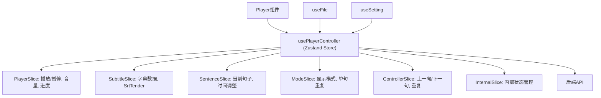

# 自定义Hooks

<cite>
**本文档中引用的文件**  
- [usePlayerController.ts](file://src/fronted/hooks/usePlayerController.ts)
- [useSetting.ts](file://src/fronted/hooks/useSetting.ts)
- [useFile.ts](file://src/fronted/hooks/useFile.ts)
- [useChatPanel.ts](file://src/fronted/hooks/useChatPanel.ts)
- [useDpTask.ts](file://src/fronted/hooks/useDpTask.ts)
- [createPlayerSlice.ts](file://src/fronted/hooks/usePlayerControllerSlices/createPlayerSlice.ts)
- [createSubtitleSlice.ts](file://src/fronted/hooks/usePlayerControllerSlices/createSubtitleSlice.ts)
- [createSentenceSlice.ts](file://src/fronted/hooks/usePlayerControllerSlices/createSentenceSlice.ts)
- [createModeSlice.ts](file://src/fronted/hooks/usePlayerControllerSlices/createModeSlice.ts)
- [createInternalSlice.ts](file://src/fronted/hooks/usePlayerControllerSlices/createInternalSlice.ts)
- [createControllerSlice.ts](file://src/fronted/hooks/usePlayerControllerSlices/createControllerSlice.ts)
</cite>

## 目录
1. [简介](#简介)
2. [usePlayerController：播放器状态控制核心](#useplayercontroller播放器状态控制核心)
3. [useSetting：全局配置管理](#usesetting全局配置管理)
4. [useFile：文件路径与加载状态管理](#usefile文件路径与加载状态管理)
5. [useChatPanel：AI对话状态管理](#usechatpanelai对话状态管理)
6. [useDpTask：后台任务监控](#usedptask后台任务监控)

## 简介
本文档全面解析DashPlayer前端中用于状态逻辑复用的核心自定义Hooks。重点阐述各Hook的函数签名、返回值结构、内部依赖（如Zustand store）及其在组件协同中的作用机制，并提供典型使用场景说明。

## usePlayerController：播放器状态控制核心

`usePlayerController` 是DashPlayer前端的核心状态管理Hook，基于Zustand库构建，通过组合多个Slice实现对播放器状态的集中控制。该Hook封装了播放/暂停、播放进度、音量、播放速率、字幕同步等核心功能，并与Player组件深度协同。

该Hook通过`create`函数初始化，整合了`PlayerSlice`、`SentenceSlice`、`ModeSlice`、`InternalSlice`、`SubtitleSlice`和`ControllerSlice`六个状态切片，形成一个统一的状态管理容器。

### 函数签名与返回值结构
```typescript
const usePlayerController = create<
    PlayerSlice &
    SentenceSlice &
    ModeSlice &
    InternalSlice &
    SubtitleSlice &
    ControllerSlice
>()(
    subscribeWithSelector((...a) => ({
        ...createPlayerSlice(...a),
        ...createSentenceSlice(...a),
        ...createModeSlice(...a),
        ...createInternalSlice(...a),
        ...createSubtitleSlice(...a),
        ...createControllerSlice(...a)
    }))
);
```

### 核心功能分析
- **播放控制**：提供`play()`、`pause()`、`space()`（空格键切换）等方法，控制媒体的播放状态。
- **进度管理**：通过`updateExactPlayTime()`同步精确播放时间，并在播放时通过定时器持续更新`playTime`。
- **音量与静音**：通过`setVolume()`和`setMuted()`控制播放音量和静音状态。
- **播放速率**：支持通过`nextRate()`在用户预设的播放速率数组中循环切换。
- **时间跳转**：`seekTo()`方法用于跳转到指定时间点，并触发播放。
- **单句重复与自动暂停**：结合`singleRepeat`和`autoPause`模式，实现单句循环播放或在句子结束时自动暂停。

### 与Player组件的协同
`usePlayerController`通过订阅机制与`useFile`和`useSetting`等其他状态Hook联动：
- 当`useFile`中的视频加载完成时，`usePlayerController`会监听播放时间变化，自动更新当前句子`currentSentence`。
- 当`useSetting`中的腾讯云密钥更新时，会触发字幕文件的重新加载。
- 播放状态变化时，会通过`api.call('watch-history/progress/update')`将播放进度同步到后端。



**Diagram sources**
- [usePlayerController.ts](file://src/fronted/hooks/usePlayerController.ts)
- [createPlayerSlice.ts](file://src/fronted/hooks/usePlayerControllerSlices/createPlayerSlice.ts)
- [createSubtitleSlice.ts](file://src/fronted/hooks/usePlayerControllerSlices/createSubtitleSlice.ts)

**Section sources**
- [usePlayerController.ts](file://src/fronted/hooks/usePlayerController.ts#L28-L46)
- [createPlayerSlice.ts](file://src/fronted/hooks/usePlayerControllerSlices/createPlayerSlice.ts#L58-L129)

## useSetting：全局配置管理

`useSetting` Hook负责管理应用的全局配置项，实现配置的读取、更新和持久化存储。

### 函数签名与返回值结构
```typescript
const useSetting = create(
    subscribeWithSelector<SettingState & SettingActions>((set, get) => ({
        init: false,
        values: new Map<SettingKey, string>(),
        setSetting: async (key: SettingKey, value: string) => { ... },
        setting: (key: SettingKey) => { ... }
    }))
);
```
- **SettingState**：包含`init`（初始化状态）和`values`（配置键值对映射）。
- **SettingActions**：包含`setSetting`（设置配置并持久化）和`setting`（获取配置值）。

### 内部依赖与持久化机制
- **Zustand Store**：作为状态容器，存储所有配置项。
- **Electron API**：通过`window.electron`调用后端`storage/put`