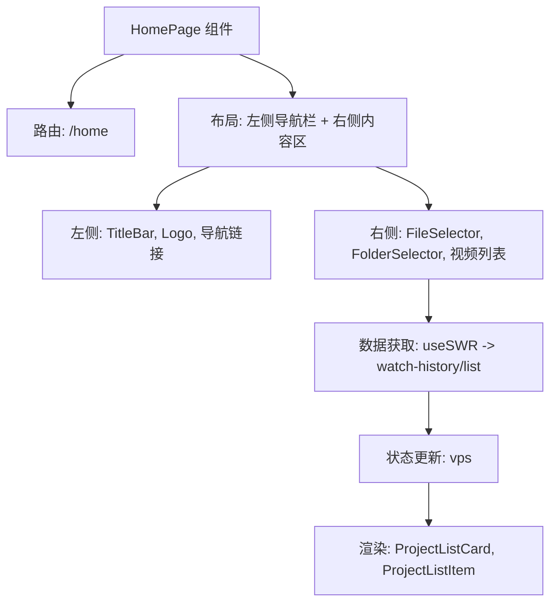
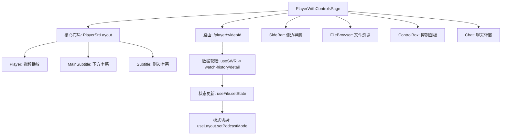
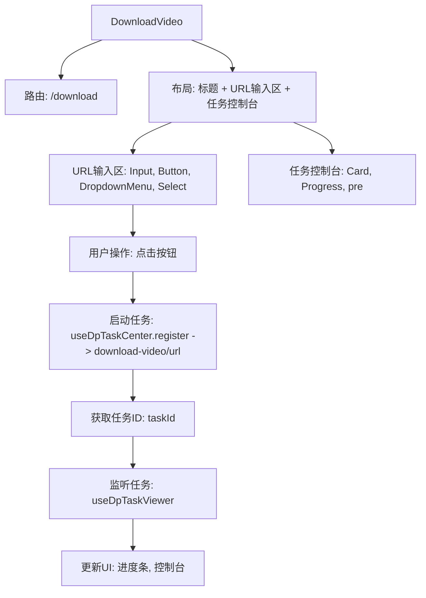
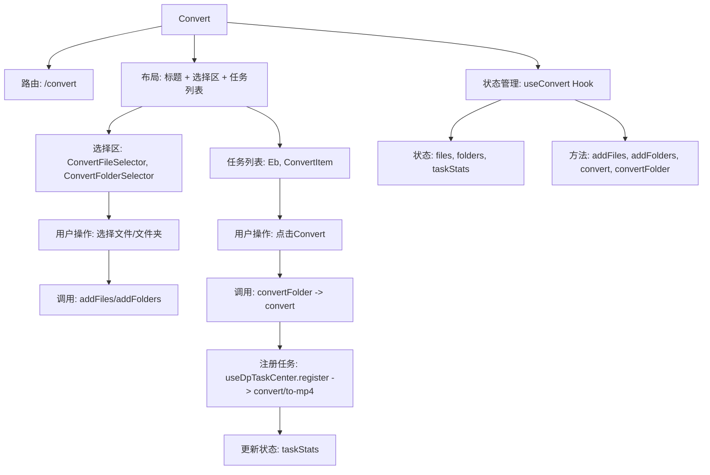
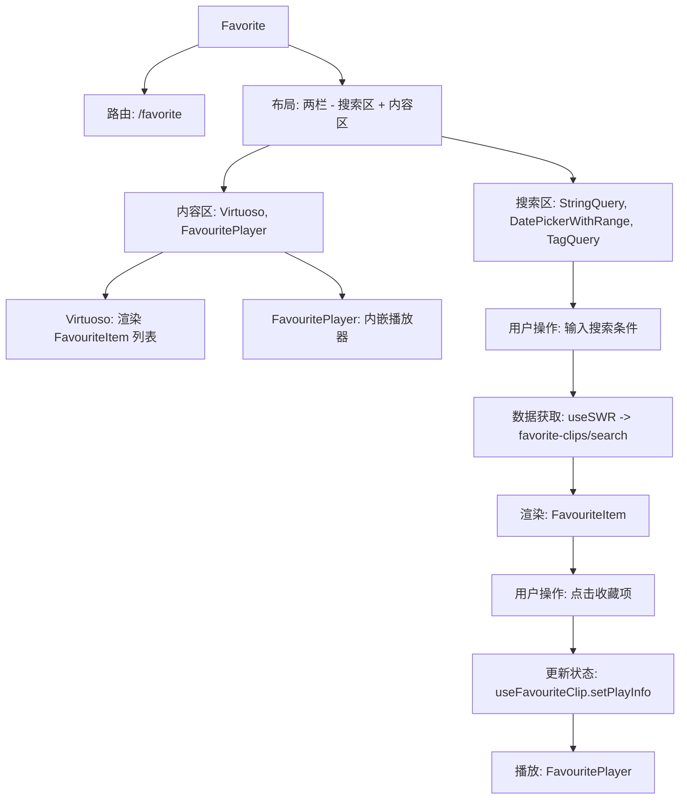
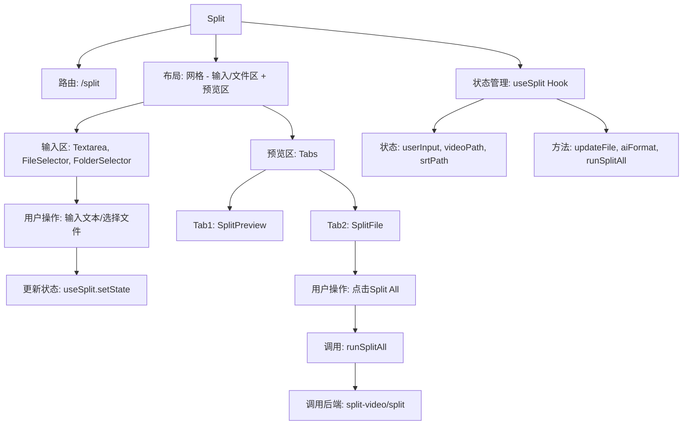

# 页面组件

<cite>
**本文档引用的文件**   
- [HomePage.tsx](file://src/fronted/pages/HomePage.tsx)
- [PlayerWithControlsPage.tsx](file://src/fronted/pages/PlayerWithControlsPage.tsx)
- [SettingLayout.tsx](file://src/fronted/pages/setting/SettingLayout.tsx)
- [DownloadVideo.tsx](file://src/fronted/pages/DownloadVideo.tsx)
- [Convert.tsx](file://src/fronted/pages/convert/Convert.tsx)
- [Favorite.tsx](file://src/fronted/pages/favourite/Favorite.tsx)
- [Split.tsx](file://src/fronted/pages/split/Split.tsx)
- [Transcript.tsx](file://src/fronted/pages/transcript/Transcript.tsx)
- [useSetting.ts](file://src/fronted/hooks/useSetting.ts)
- [useFile.ts](file://src/fronted/hooks/useFile.ts)
- [useConvert.ts](file://src/fronted/hooks/useConvert.ts)
- [useSplit.ts](file://src/fronted/hooks/useSplit.ts)
- [useTranscript.ts](file://src/fronted/hooks/useTranscript.ts)
- [useFavouriteClip.ts](file://src/fronted/hooks/useFavouriteClip.ts)
- [useDpTaskCenter.ts](file://src/fronted/hooks/useDpTaskCenter.ts)
- [api-def.ts](file://src/common/api/api-def.ts)
</cite>

## 目录
1. [主页 (HomePage)](#主页-homepage)
2. [带控件的播放页 (PlayerWithControlsPage)](#带控件的播放页-playerwithcontrolspage)
3. [设置页布局 (SettingLayout)](#设置页布局-settinglayout)
4. [视频下载页 (DownloadVideo)](#视频下载页-downloadvideo)
5. [格式转换页 (Convert)](#格式转换页-convert)
6. [收藏夹页 (Favorite)](#收藏夹页-favorite)
7. [视频分割页 (Split)](#视频分割页-split)
8. [字幕编辑页 (Transcript)](#字幕编辑页-transcript)
9. [页面级状态管理机制](#页面级状态管理机制)
10. [页面渲染流程与数据依赖关系](#页面渲染流程与数据依赖关系)

## 主页 (HomePage)

`HomePage` 组件是应用的默认入口页面，其路由配置为 `/home`。该页面采用响应式布局，主要由左侧导航栏和右侧内容区构成。左侧导航栏包含应用的 Logo 和主要功能的快捷链接，如“收藏夹”、“字幕编辑”、“视频分割”等。右侧内容区则分为两个部分：上方是用于快速打开视频或文件夹的文件选择器，下方是“最近观看”视频列表。

该页面的核心子组件包括：
- `TitleBar`: 顶部标题栏，根据操作系统显示不同的样式。
- `FileSelector`: 文件选择器，允许用户选择单个视频文件。
- `FolderSelector`: 文件夹选择器，允许用户选择包含视频的文件夹。
- `ProjectListCard`: 用于在“最近观看”列表中显示视频缩略图、文件名和播放进度的卡片组件。
- `ProjectListItem`: 用于在“更多”列表中显示视频的列表项组件。

页面通过 `useSWR` Hook 从后端服务获取用户的观看历史记录 (`watch-history/list`)，并将其渲染到界面上。当用户点击某个视频时，会调用 `api.call('system/window-size/change', 'player')` 调整窗口大小，并通过 `navigate` 函数跳转到对应的播放页面。



**页面来源**
- [HomePage.tsx](file://src/fronted/pages/HomePage.tsx#L19-L140)

## 带控件的播放页 (PlayerWithControlsPage)

`PlayerWithControlsPage` 组件是视频播放的核心页面，其路由配置为 `/player/:videoId`。该页面的布局非常复杂，采用了一个基于 `grid` 的网格系统，并根据屏幕尺寸和用户操作（如侧边栏展开/收起）动态调整。其核心布局由 `PlayerSrtLayout` 组件实现，该组件将播放器、主字幕和侧边字幕通过可调整大小的面板 (`ResizablePanel`) 进行组合。

该页面的核心子组件及其组合方式如下：
- `SideBar`: 可动画展开/收起的侧边栏，包含应用导航。
- `FileBrowser`: 文件浏览器，用于浏览和选择视频。
- `ControlBox`: 播放控制面板，集中管理播放器的各种设置。
- `PlayerSrtLayout`: 播放器与字幕的主布局容器。
  - `Player`: 实际的视频播放器组件。
  - `MainSubtitle`: 显示在播放器下方的主字幕。
  - `Subtitle`: 显示在右侧的侧边字幕列表。
- `Chat`: 一个可从底部弹出的整句学习聊天面板。

页面通过 `useParams` 获取 URL 中的 `videoId`，并使用 `useSWR` 根据该 ID 从后端 (`watch-history/detail`) 获取视频的详细信息。当视频数据加载后，`useEffect` 会触发一系列操作，包括更新 `useFile` 状态以加载视频和字幕文件，并根据文件类型（音频/视频）自动切换“播客模式”。



**页面来源**
- [PlayerWithControlsPage.tsx](file://src/fronted/pages/PlayerWithControlsPage.tsx#L25-L263)

## 设置页布局 (SettingLayout)

`SettingLayout` 组件是所有设置页面的通用布局容器，其路由配置为 `/settings/*`。该页面采用经典的侧边栏-主内容区布局。顶部是设置页面的标题和副标题，下方是一个 `div` 容器，其中包含一个固定的侧边栏 (`Sidebar`) 和一个主内容区 (`<Outlet/>`)。

该页面的核心子组件包括：
- `Sidebar`: 设置页面的导航侧边栏，用户可以在此切换不同的设置类别（如外观、快捷键、存储等）。
- `<Outlet/>`: React Router 提供的占位符组件，用于渲染当前匹配的子路由组件，例如 `AppearanceSetting` 或 `StorageSetting`。

该布局本身不包含具体的功能逻辑，它主要负责提供一个统一的视觉框架。具体的设置功能由其子路由组件实现。

```mermaid
flowchart TD
A[SettingLayout] --> B[路由: /settings/*]
A --> C[布局: 顶部标题 + 侧边栏 + 主内容区]
C --> D[顶部: 标题 "Settings", 副标题 "Dash Player"]
C --> E[侧边栏: Sidebar]
C --> F[主内容区: <Outlet/>]
F --> G[子组件: AppearanceSetting, StorageSetting 等]
```

**页面来源**
- [SettingLayout.tsx](file://src/fronted/pages/setting/SettingLayout.tsx#L80-L107)

## 视频下载页 (DownloadVideo)

`DownloadVideo` 组件提供从互联网下载视频的功能，其路由配置为 `/download`。该页面的布局清晰，顶部是页面标题，下方是两个主要功能区域：URL 输入区和下载任务控制台。

该页面的核心子组件包括：
- `Input`: 用于输入视频 URL 的输入框。
- `Button`: “DL & Transcript” 按钮，用于启动下载和转录任务。
- `DropdownMenu`: 一个下拉菜单，提供“仅下载”选项。
- `Select`: 一个下拉选择器，用于选择浏览器的 Cookie（以支持需要登录的网站）。
- `Card`: 用于显示当前下载任务进度的卡片。
- `Progress`: 进度条，显示下载的百分比。
- `pre`: 一个预格式化文本区域，用作下载任务的控制台输出。

页面通过 `useLocalStorage` Hook 管理 `taskId` 和 `url` 等状态。当用户点击“DL & Transcript”按钮时，会调用 `useDpTaskCenter.getState().register()` 来注册一个后端任务 (`download-video/url`)。该任务的 ID 会被存储，页面通过 `useDpTaskViewer` Hook 监听该任务的状态，并实时更新进度条和控制台输出。



**页面来源**
- [DownloadVideo.tsx](file://src/fronted/pages/DownloadVideo.tsx#L39-L215)

## 格式转换页 (Convert)

`Convert` 组件用于将 MKV 格式的视频转换为 MP4 格式，其路由配置为 `/convert`。该页面的布局分为顶部标题区和下方的主内容区。主内容区包含一个文件/文件夹选择区和一个任务列表。

该页面的核心子组件包括：
- `ConvertFileSelector`: 用于选择单个 MKV 视频文件。
- `ConvertFolderSelector`: 用于选择包含 MKV 视频的文件夹。
- `Eb`: 一个包装组件，用于包裹 `ConvertItem`。
- `ConvertItem`: 用于显示单个待转换文件信息的组件，包含文件名和操作按钮。

页面通过 `useConvert` 这个自定义 Hook 来管理其状态和逻辑。`useConvert` Hook 维护了 `files`（待转换文件列表）、`folders`（待转换文件夹列表）和 `taskStats`（任务状态映射）等状态。当用户选择文件或文件夹时，会调用 `addFiles` 或 `addFolders` 方法。当用户点击“Convert”按钮时，会调用 `convertFolder` 方法，该方法会遍历文件夹中的每个视频，并为每个视频调用 `convert` 方法。`convert` 方法内部会注册一个后端任务 (`convert/to-mp4`) 并监听其状态。



**页面来源**
- [Convert.tsx](file://src/fronted/pages/convert/Convert.tsx#L14-L131)
- [useConvert.ts](file://src/fronted/hooks/useConvert.ts#L26-L93)

## 收藏夹页 (Favorite)

`Favorite` 组件用于管理和回看用户收藏的视频片段，其路由配置为 `/favorite`。该页面采用两栏布局，左侧是搜索和筛选区，右侧是收藏夹列表和播放预览区。

该页面的核心子组件包括：
- `StringQuery`: 字符串搜索框，支持在“片段”或“上下文”中搜索。
- `DatePickerWithRange`: 日期范围选择器，用于按时间筛选收藏。
- `TagQuery`: 标签查询组件，允许用户通过标签进行筛选。
- `Virtuoso`: 一个高性能的虚拟滚动列表，用于渲染收藏夹列表 (`FavouriteItem`)。
- `FavouritePlayer`: 一个内嵌的视频播放器，用于预览选中的收藏片段。

页面通过 `useSWR` Hook 结合多个状态（`keyword`, `tags`, `date` 等）来动态构建查询参数，并调用后端的 `favorite-clips/search` 接口获取数据。`FavouriteItem` 组件展示了收藏片段的缩略图、内容和创建时间。当用户点击某个收藏项时，`FavouritePlayer` 会根据 `useFavouriteClip` Hook 提供的 `playInfo` 状态来播放对应的视频片段。



**页面来源**
- [Favorite.tsx](file://src/fronted/pages/favourite/Favorite.tsx#L49-L119)
- [FavouriteItem.tsx](file://src/fronted/pages/favourite/FavouriteItem.tsx#L10-L87)
- [FavouritePlayer.tsx](file://src/fronted/pages/favourite/FavouritePlayer.tsx#L9-L78)
- [useFavouriteClip.ts](file://src/fronted/hooks/useFavouriteClip.ts#L39-L106)

## 视频分割页 (Split)

`Split` 组件用于将长视频和字幕文件分割成多个小片段，其路由配置为 `/split`。该页面采用复杂的网格布局，左侧是输入区和文件选择区，右侧是预览区。

该页面的核心子组件包括：
- `Textarea`: 用于输入分割配置的文本区域。
- `FileVideo2`, `FileType2`: 图标，用于指示文件类型。
- `FileSelector`, `FolderSelector`: 用于选择视频和字幕文件。
- `Tabs`: 一个标签页组件，包含“预览”和“快捷选择”两个标签页。
- `SplitPreview`: 在“预览”标签页中显示分割结果的表格。
- `SplitFile`: 在“快捷选择”标签页中显示文件列表的组件。

页面通过 `useSplit` Hook 管理其状态。用户可以在 `Textarea` 中输入时间戳和标题，或通过 `FileSelector` 选择文件。点击“Split All”按钮会触发 `runSplitAll` 方法，该方法会调用后端的 `split-video/split` 接口执行分割任务。`aiFormat` 按钮可以调用 AI 功能 (`ai-func/format-split`) 来尝试格式化用户输入的文本。



**页面来源**
- [Split.tsx](file://src/fronted/pages/split/Split.tsx#L26-L198)
- [SplitPreview.tsx](file://src/fronted/pages/split/split-preview.tsx#L60-L87)
- [SplitFile.tsx](file://src/fronted/pages/split/SplitFile.tsx#L17-L125)
- [useSplit.ts](file://src/fronted/hooks/useSplit.ts#L31-L104)

## 字幕编辑页 (Transcript)

`Transcript` 组件用于为视频生成字幕，其路由配置为 `/transcript`。该页面采用两栏布局，左侧是文件选择和队列管理区，右侧是任务状态表。

该页面的核心子组件包括：
- `TranscriptFile`: 左侧组件，包含文件选择器和项目列表，用于将视频添加到转录队列。
- `TranscriptTable`: 右侧组件，一个表格，用于显示队列中所有视频的转录状态和操作按钮。
- `TranscriptItem`: 表格中的每一行，显示单个视频的任务信息。

页面通过 `useTranscript` Hook 管理转录队列。`TranscriptFile` 组件中的 `ProjectListComp` 允许用户浏览文件并点击“添加到队列”按钮，这会触发 `onAddToQueue` 方法。`TranscriptTable` 会渲染 `useTranscript` 中的 `files` 数组，每个 `TranscriptItem` 都有一个“转录”按钮，点击后会调用 `onTranscript` 方法。该方法会注册一个后端任务 (`ai-func/transcript`)，并将任务 ID 与文件关联。

```mermaid
flowchart TD
    A[Transcript] --> B[路由: /transcript]
    A --> C[布局: 两栏 - 文件区 + 状态表]
    C --> D[文件区: TranscriptFile]
    C --> E[状态表: TranscriptTable]
    D --> F[TranscriptFile: 包含 FileSelector, ProjectListComp]
    E --> G[TranscriptTable: 包含 TranscriptItem]
    A --> H[状态管理: useTranscript Hook]
    H --> I[状态: files]
    H --> J[方法: onAddToQueue, onTranscript, onDelFromQueue]
