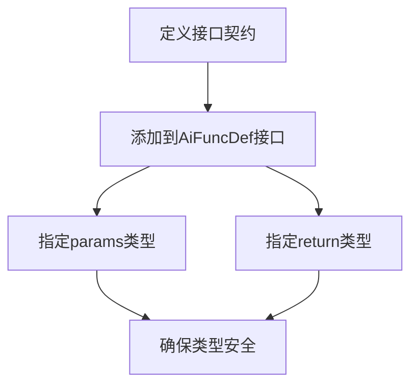
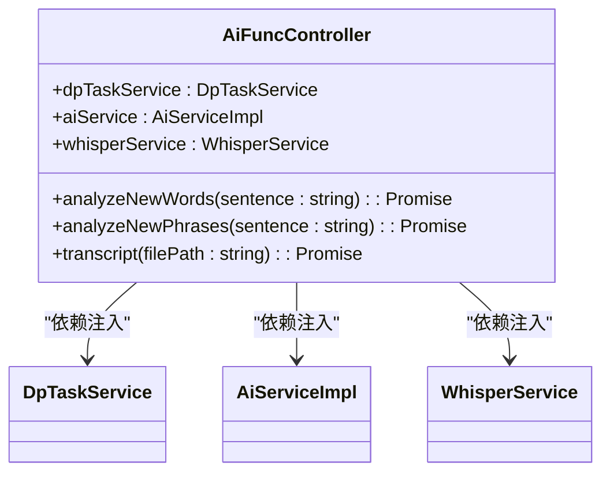
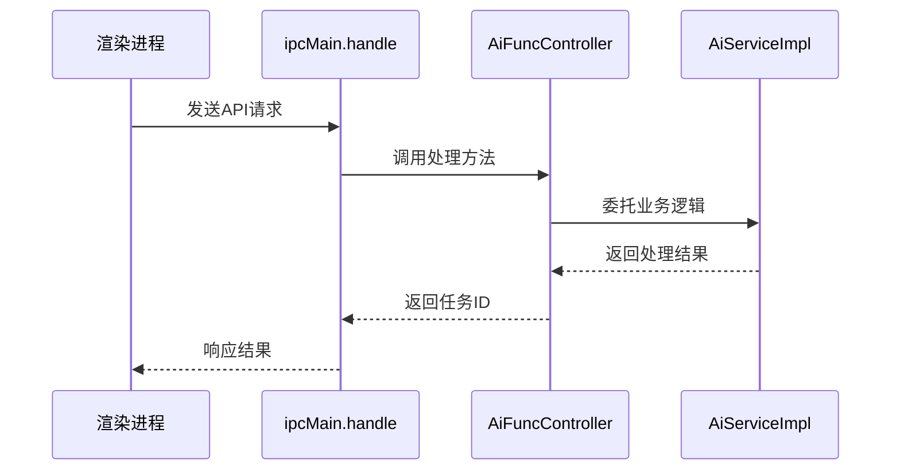
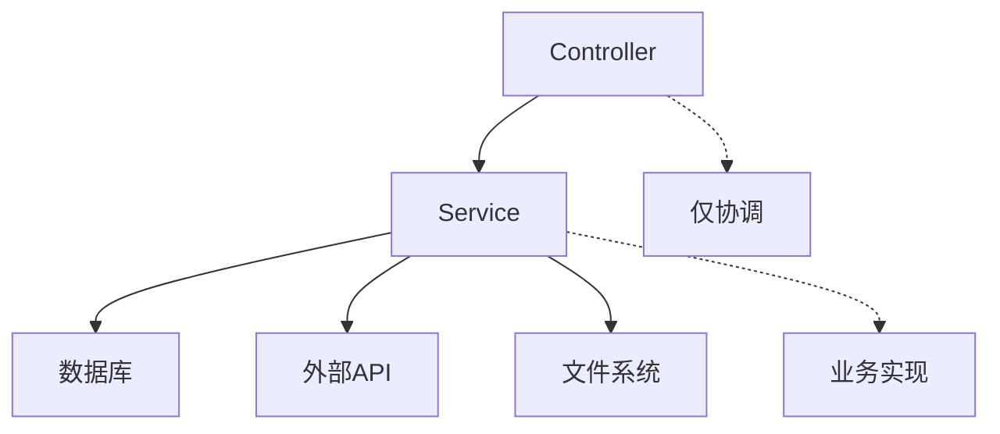
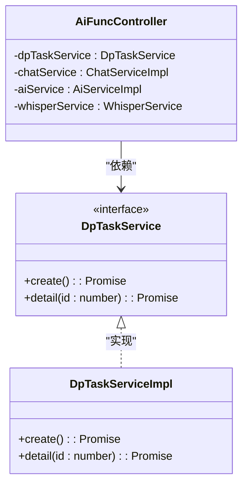
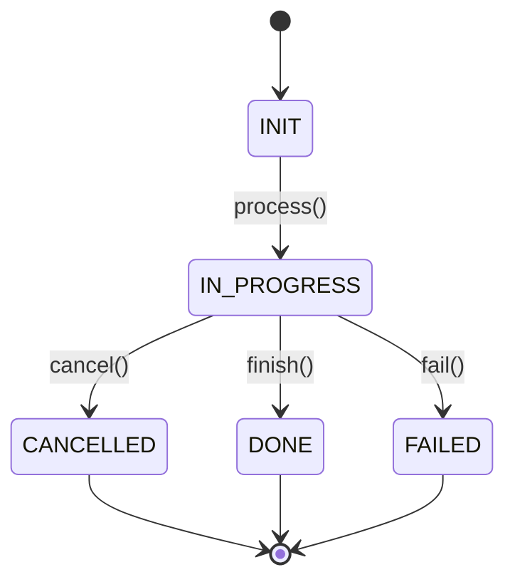

# API扩展指南

<cite>
**本文档中引用的文件**  
- [api-def.ts](file://src/common/api/api-def.ts)
- [AiFuncController.ts](file://src/backend/controllers/AiFuncController.ts)
- [DpTaskService.ts](file://src/backend/services/DpTaskService.ts)
- [DpTaskServiceImpl.ts](file://src/backend/services/impl/DpTaskServiceImpl.ts)
- [AiServiceImpl.ts](file://src/backend/services/AiServiceImpl.ts)
- [register.ts](file://src/common/api/register.ts)
</cite>

## 目录
1. [简介](#简介)
2. [API扩展流程概览](#api扩展流程概览)
3. [定义接口契约](#定义接口契约)
4. [实现Controller方法](#实现controller方法)
5. [注册API路由](#注册api路由)
6. [调用Service层处理业务逻辑](#调用service层处理业务逻辑)
7. [完整示例：添加AI分析功能](#完整示例添加ai分析功能)
8. [依赖注入机制说明](#依赖注入机制说明)
9. [任务生命周期管理](#任务生命周期管理)
10. [最佳实践与注意事项](#最佳实践与注意事项)

## 简介
本文档提供在DashPlayer项目中添加新API功能的完整操作指南。遵循MVC架构模式，通过清晰的分层设计实现功能扩展。重点介绍如何在`api-def.ts`中定义接口契约，在Controller中实现请求处理，并通过依赖注入使用Service层完成业务逻辑处理。

## API扩展流程概览
添加新API功能需遵循以下标准流程：
1. 在`api-def.ts`中定义接口契约
2. 在对应Controller类中实现处理方法
3. 通过`registerRoute`函数注册路由
4. 委托业务逻辑给Service层处理
5. 利用`DpTaskService`管理任务生命周期

该流程确保代码结构清晰、职责分离明确，符合项目的架构设计原则。

## 定义接口契约
所有API接口契约必须在`src/common/api/api-def.ts`文件中统一定义。该文件使用TypeScript接口形式声明所有可用API的请求参数和响应类型。

对于AI相关功能，需在`AiFuncDef`接口中添加新的方法定义。每个方法需明确指定：
- **params**: 请求参数类型
- **return**: 响应返回类型

**Diagram sources**
- [api-def.ts](file://src/common/api/api-def.ts#L24-L39)

**Section sources**
- [api-def.ts](file://src/common/api/api-def.ts#L24-L39)

## 实现Controller方法
Controller层负责请求解析和响应封装，应保持轻量级。具体实现步骤如下：

1. 在`AiFuncController`类中添加新的公共异步方法
2. 方法参数应与`api-def.ts`中定义的类型一致
3. 返回值类型应与接口定义匹配
4. 仅包含任务创建和Service调用逻辑

Controller不直接处理业务逻辑，而是作为协调者，将具体实现委托给Service层。

**Diagram sources**
- [AiFuncController.ts](file://src/backend/controllers/AiFuncController.ts#L12-L129)

**Section sources**
- [AiFuncController.ts](file://src/backend/controllers/AiFuncController.ts#L12-L129)

## 注册API路由
通过`registerRoute`函数将API路径与处理函数绑定。该函数位于`src/common/api/register.ts`，使用Electron的IPC机制处理主进程与渲染进程间的通信。

注册过程包含：
- 路径字符串作为第一个参数
- 箭头函数包装的处理方法作为第二个参数
- 自动处理日志记录和错误捕获

**Diagram sources**
- [register.ts](file://src/common/api/register.ts#L8-L19)
- [AiFuncController.ts](file://src/backend/controllers/AiFuncController.ts#L113-L128)

**Section sources**
- [register.ts](file://src/common/api/register.ts#L8-L19)
- [AiFuncController.ts](file://src/backend/controllers/AiFuncController.ts#L113-L128)

## 调用Service层处理业务逻辑
业务逻辑必须委托给相应的Service层处理，确保Controller保持轻量。Service层实现具体的功能逻辑，包括：

- AI分析算法实现
- 数据库操作
- 外部服务调用
- 复杂业务规则处理

这种分层架构实现了关注点分离，提高了代码的可维护性和可测试性。

**Section sources**
- [AiServiceImpl.ts](file://src/backend/services/AiServiceImpl.ts#L45-L153)

## 完整示例：添加AI分析功能
以在`AiFuncController`中添加新的AI分析功能为例，展示完整实现流程：

1. **定义接口契约**：在`AiFuncDef`中添加新方法
2. **实现Controller方法**：创建处理函数，创建任务并调用Service
3. **注册路由**：将路径与处理函数绑定
4. **Service实现**：在`AiServiceImpl`中实现具体逻辑

该示例展示了如何正确注入`DpTaskService`来管理任务生命周期，确保每个操作都有唯一的任务ID跟踪。

**Section sources**
- [AiFuncController.ts](file://src/backend/controllers/AiFuncController.ts#L27-L31)
- [AiServiceImpl.ts](file://src/backend/services/AiServiceImpl.ts#L60-L72)

## 依赖注入机制说明
项目使用InversifyJS实现依赖注入，确保组件间的松耦合。关键特性包括：

- 使用`@injectable()`装饰器标记可注入类
- 使用`@inject(TYPES.XXX)`注入依赖
- 在`inversify.config.ts`中配置绑定关系
- 支持单例模式和生命周期管理

这种设计模式提高了代码的可测试性，便于单元测试中的依赖替换。

**Diagram sources**
- [AiFuncController.ts](file://src/backend/controllers/AiFuncController.ts#L12-L129)
- [DpTaskService.ts](file://src/backend/services/DpTaskService.ts#L4-L26)
- [DpTaskServiceImpl.ts](file://src/backend/services/impl/DpTaskServiceImpl.ts#L13-L192)

**Section sources**
- [AiFuncController.ts](file://src/backend/controllers/AiFuncController.ts#L12-L129)
- [DpTaskService.ts](file://src/backend/services/DpTaskService.ts#L4-L26)

## 任务生命周期管理
`DpTaskService`负责管理所有后台任务的生命周期，提供以下核心功能：

- **任务创建**：生成唯一任务ID，初始化任务状态
- **状态更新**：支持进行中、完成、失败、取消等状态转换
- **进度跟踪**：记录任务执行进度和结果
- **取消机制**：支持用户取消任务和批量取消
- **缓存管理**：使用LRU缓存提高查询性能

每个API调用都关联一个任务ID，便于前端跟踪异步操作的状态。

**Diagram sources**
- [DpTaskServiceImpl.ts](file://src/backend/services/impl/DpTaskServiceImpl.ts#L57-L73)

**Section sources**
- [DpTaskServiceImpl.ts](file://src/backend/services/impl/DpTaskServiceImpl.ts#L13-L192)

## 最佳实践与注意事项
遵循以下最佳实践确保代码质量和系统稳定性：

1. **保持Controller轻量**：仅处理请求解析和响应封装
2. **单一职责原则**：每个Service类只负责特定领域的业务逻辑
3. **类型安全**：严格遵循TypeScript类型定义
4. **错误处理**：在`registerRoute`中自动捕获并处理异常
5. **日志记录**：关键操作添加日志输出便于调试
6. **异步处理**：所有耗时操作使用异步模式，避免阻塞主线程

避免在Controller中直接访问数据库或执行复杂计算，确保架构的清晰性和可维护性。