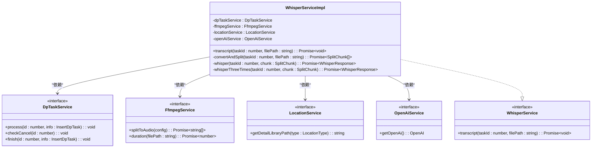
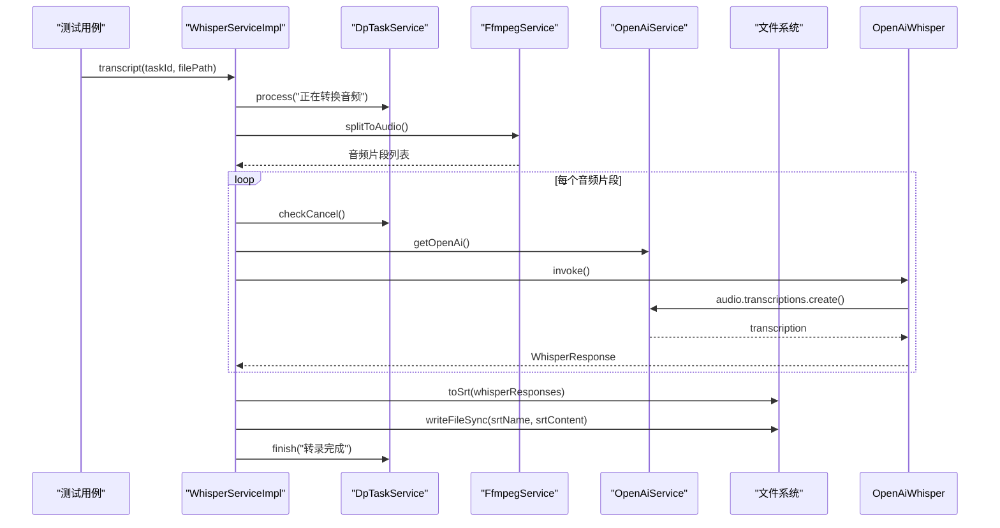

# 测试实践

<cite>
**本文档中引用的文件**  
- [whisper.test.ts](file://src/backend/test/whisper.test.ts)
- [WhisperServiceImpl.ts](file://src/backend/services/impl/WhisperServiceImpl.ts)
- [OpenAiWhisperRequest.ts](file://src/backend/objs/OpenAiWhisperRequest.ts)
- [OpenAIServiceImpl.ts](file://src/backend/services/impl/OpenAIServiceImpl.ts)
- [DpTaskService.ts](file://src/backend/services/DpTaskService.ts)
- [FfmpegService.ts](file://src/backend/services/FfmpegService.ts)
- [LocationService.ts](file://src/backend/services/LocationService.ts)
- [RateLimiter.ts](file://src/common/utils/RateLimiter.ts)
- [SrtUtil.ts](file://src/common/utils/SrtUtil.ts)
</cite>

## 目录
1. [引言](#引言)
2. [项目结构与测试布局](#项目结构与测试布局)
3. [核心服务单元测试规范](#核心服务单元测试规范)
4. [语音转录功能测试详解](#语音转录功能测试详解)
5. [外部依赖模拟策略](#外部依赖模拟策略)
6. [测试覆盖率要求与执行流程](#测试覆盖率要求与执行流程)
7. [测试报告解读与质量保障](#测试报告解读与质量保障)
8. [结论](#结论)

## 引言
本规范旨在建立全面的测试体系，确保 DashPlayer 项目的代码质量与系统稳定性。重点指导如何为后端服务层编写单元测试，使用 Jest 框架结合 `jest-mock-extended` 等模拟工具隔离外部依赖，特别是 OpenAI API 调用。以 `whisper.test.ts` 为例，详细说明语音转录功能的测试方法，包括测试用例设计、文件输入模拟、输出结果验证等。所有新功能必须附带单元测试，测试覆盖率不得低于 80%。同时，规范测试套件的运行方式与测试报告的解读流程，确保每次提交前所有测试通过。

## 项目结构与测试布局
项目测试文件集中存放于 `src/backend/test` 目录下，与后端服务代码分离但结构对应。当前已存在 `whisper.test.ts` 和 `sentence.test.ts` 两个测试文件，分别用于测试语音转录和句子处理功能。

```mermaid
graph TB
subgraph "测试目录"
A[src/backend/test]
A --> B[whisper.test.ts]
A --> C[sentence.test.ts]
end
subgraph "核心服务"
D[WhisperServiceImpl.ts]
E[OpenAiWhisperRequest.ts]
F[OpenAIServiceImpl.ts]
end
B --> D : "测试"
D --> E : "依赖"
D --> F : "依赖"
```

**Diagram sources**
- [whisper.test.ts](file://src/backend/test/whisper.test.ts)
- [WhisperServiceImpl.ts](file://src/backend/services/impl/WhisperServiceImpl.ts)

**Section sources**
- [whisper.test.ts](file://src/backend/test/whisper.test.ts)
- [project_structure](file://project_structure)

## 核心服务单元测试规范
单元测试应聚焦于服务类的业务逻辑，通过依赖注入机制将外部服务（如数据库、API 客户端）替换为模拟对象（Mock），确保测试的独立性和可重复性。测试应覆盖正常流程、异常处理和边界条件。

### 服务接口与实现
`WhisperService` 接口定义了语音转录的核心方法，其实现类 `WhisperServiceImpl` 依赖多个外部服务。



**Diagram sources**
- [WhisperService.ts](file://src/backend/services/WhisperService.ts)
- [WhisperServiceImpl.ts](file://src/backend/services/impl/WhisperServiceImpl.ts)
- [DpTaskService.ts](file://src/backend/services/DpTaskService.ts)
- [FfmpegService.ts](file://src/backend/services/FfmpegService.ts)
- [LocationService.ts](file://src/backend/services/LocationService.ts)
- [OpenAiService.ts](file://src/backend/services/OpenAiService.ts)

**Section sources**
- [WhisperService.ts](file://src/backend/services/WhisperService.ts#L0-L2)
- [WhisperServiceImpl.ts](file://src/backend/services/impl/WhisperServiceImpl.ts#L46-L155)

## 语音转录功能测试详解
`whisper.test.ts` 文件提供了测试语音转录功能的起点。测试应验证从音频文件输入到 SRT 字幕文件输出的完整流程。

### 测试流程分析


**Diagram sources**
- [whisper.test.ts](file://src/backend/test/whisper.test.ts)
- [WhisperServiceImpl.ts](file://src/backend/services/impl/WhisperServiceImpl.ts#L59-L92)
- [OpenAiWhisperRequest.ts](file://src/backend/objs/OpenAiWhisperRequest.ts#L54-L84)
- [SrtUtil.ts](file://src/common/utils/SrtUtil.ts#L113-L124)

**Section sources**
- [whisper.test.ts](file://src/backend/test/whisper.test.ts#L0-L21)
- [WhisperServiceImpl.ts](file://src/backend/services/impl/WhisperServiceImpl.ts#L59-L92)

### 关键测试点
1. **音频转换与分片**：验证 `convertAndSplit` 方法能正确调用 `FfmpegService.splitToAudio` 将视频文件分割为 60 秒的音频片段。
2. **OpenAI API 调用**：验证 `whisper` 方法能正确构建 `OpenAiWhisperRequest` 并调用 `invoke` 方法，且受 `RateLimiter` 限流控制。
3. **重试机制**：验证 `whisperThreeTimes` 方法在失败时能进行最多 3 次重试。
4. **任务状态管理**：验证 `DpTaskService` 的 `process`、`checkCancel` 和 `finish` 方法被正确调用以更新任务进度。
5. **SRT 文件生成**：验证 `toSrt` 函数能正确合并多个 `WhisperResponse` 的 segments，并写入正确的 `.srt` 文件。

## 外部依赖模拟策略
为隔离外部依赖，应使用 Jest 的模拟功能对以下服务进行 Mock：

### 模拟 OpenAI 服务
```typescript
// 模拟 OpenAiService
const mockOpenAiService = {
  getOpenAi: jest.fn().mockReturnValue({
    audio: {
      transcriptions: {
        create: jest.fn().mockResolvedValue({
          language: 'en',
          duration: 60,
          text: 'Hello world',
          segments: [{ seek: 0, start: 0, end: 10, text: 'Hello world' }]
        })
      }
    }
  })
};
```

### 模拟 FFmpeg 服务
```typescript
// 模拟 FfmpegService
const mockFfmpegService = {
  splitToAudio: jest.fn().mockResolvedValue(['/temp/whisper/abc/001.mp3']),
  duration: jest.fn().mockResolvedValue(60)
};
```

### 模拟任务服务
```typescript
// 模拟 DpTaskService
const mockDpTaskService = {
  process: jest.fn(),
  checkCancel: jest.fn(),
  finish: jest.fn(),
  fail: jest.fn(),
  registerTask: jest.fn()
};
```

通过依赖注入，将这些模拟对象注入到 `WhisperServiceImpl` 实例中，即可在不调用真实 API 的情况下测试其内部逻辑。

**Section sources**
- [OpenAIServiceImpl.ts](file://src/backend/services/impl/OpenAIServiceImpl.ts#L14-L30)
- [FfmpegService.ts](file://src/backend/services/FfmpegService.ts#L41-L51)
- [DpTaskService.ts](file://src/backend/services/DpTaskService.ts#L13-L15)

## 测试覆盖率要求与执行流程
所有新功能必须附带单元测试，且测试覆盖率不低于 80%。覆盖率应通过 `jest --coverage` 命令生成。

### 测试执行命令
```bash
# 运行所有测试
npm test

# 运行单个测试文件
npm test whisper.test.ts

# 生成覆盖率报告
npm test -- --coverage --coverage-reporter=html
```

### 测试前检查
在代码提交前，必须确保：
1. 所有测试用例通过 (`npm test` 无失败)。
2. 测试覆盖率达标 (`coverage/` 目录下的报告中，行覆盖率、函数覆盖率、分支覆盖率均 ≥ 80%)。
3. 模拟对象正确地验证了方法调用次数和参数。

**Section sources**
- [package.json](file://package.json)
- [whisper.test.ts](file://src/backend/test/whisper.test.ts)

## 测试报告解读与质量保障
Jest 生成的测试报告包含通过/失败状态、执行时间、错误堆栈等信息。HTML 覆盖率报告 (`coverage/index.html`) 可直观查看哪些代码行被测试覆盖。

### 质量保障措施
- **持续集成 (CI)**：在 CI/CD 流程中集成测试步骤，任何提交若导致测试失败或覆盖率下降将被阻止合并。
- **代码审查 (Code Review)**：审查代码时必须检查是否包含相应的测试用例。
- **定期维护**：随着代码演进，定期更新和维护测试用例，确保其有效性。

**Section sources**
- [whisper.test.ts](file://src/backend/test/whisper.test.ts)
- [WhisperServiceImpl.ts](file://src/backend/services/impl/WhisperServiceImpl.ts)

## 结论
通过建立严格的单元测试规范，使用 Jest 框架和模拟技术隔离外部依赖，可以有效保障 DashPlayer 项目后端服务的代码质量和稳定性。以 `whisper.test.ts` 为例，展示了如何全面测试一个涉及外部 API 调用的复杂功能。坚持 80% 的覆盖率要求和提交前测试通过原则，是确保软件长期健康发展的关键。