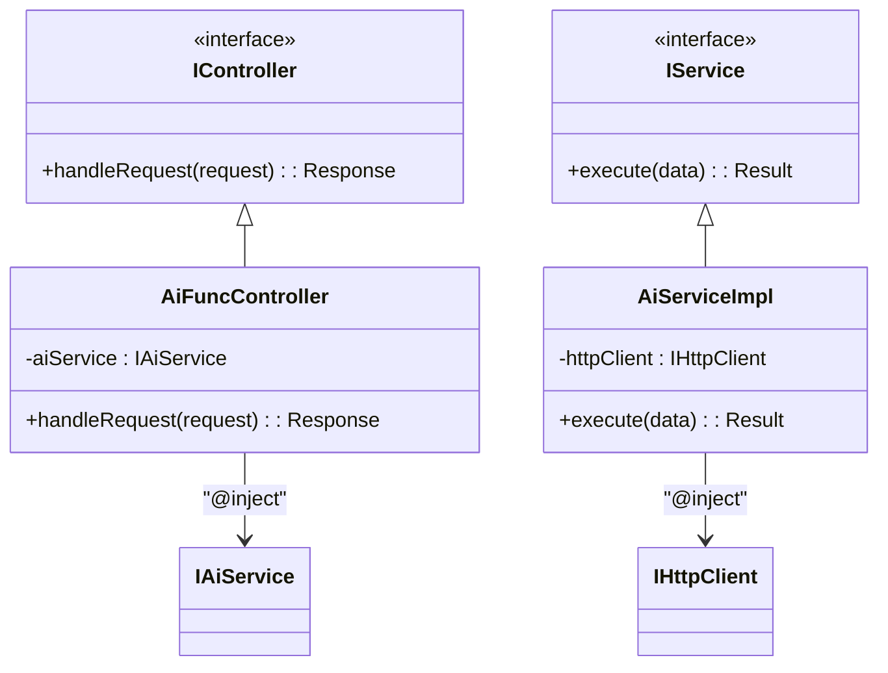
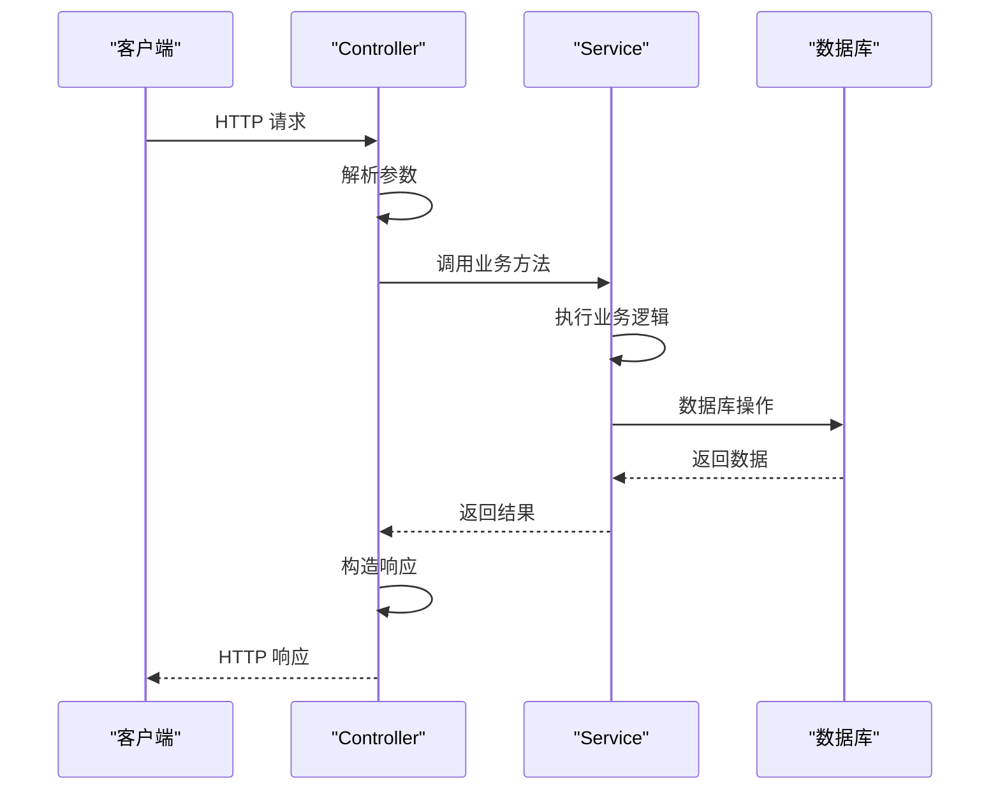

# 编码规范

<cite>
**本文档引用的文件**  
- [tsconfig.json](file://tsconfig.json)
- [package.json](file://package.json)
- [vite.base.config.ts](file://vite.base.config.ts)
- [vite.main.config.ts](file://vite.main.config.ts)
- [vite.preload.config.ts](file://vite.preload.config.ts)
- [vite.renderer.config.ts](file://vite.renderer.config.ts)
- [inversify.config.ts](file://src/backend/ioc/inversify.config.ts)
- [types.ts](file://src/backend/ioc/types.ts)
- [AiFuncController.ts](file://src/backend/controllers/AiFuncController.ts)
- [AiTransController.ts](file://src/backend/controllers/AiTransController.ts)
- [DpTaskController.ts](file://src/backend/controllers/DpTaskController.ts)
- [MediaController.ts](file://src/backend/controllers/MediaController.ts)
- [StorageController.ts](file://src/backend/controllers/StorageController.ts)
- [SystemController.ts](file://src/backend/controllers/SystemController.ts)
- [TagController.ts](file://src/backend/controllers/TagController.ts)
- [WatchHistoryController.ts](file://src/backend/controllers/WatchHistoryController.ts)
- [AiServiceImpl.ts](file://src/backend/services/AiServiceImpl.ts)
- [AiTransServiceImpl.ts](file://src/backend/services/AiTransServiceImpl.ts)
- [DpTaskServiceImpl.ts](file://src/backend/services/impl/DpTaskServiceImpl.ts)
- [MediaServiceImpl.ts](file://src/backend/services/impl/MediaServiceImpl.ts)
- [SettingServiceImpl.ts](file://src/backend/services/impl/SettingServiceImpl.ts)
- [SystemServiceImpl.ts](file://src/backend/services/impl/SystemServiceImpl.ts)
- [TagServiceImpl.ts](file://src/backend/services/impl/TagServiceImpl.ts)
- [WatchHistoryServiceImpl.ts](file://src/backend/services/impl/WatchHistoryServiceImpl.ts)
</cite>

## 目录
1. [简介](#简介)
2. [项目结构](#项目结构)
3. [TypeScript 编码规范](#typescript-编码规范)
4. [Prettier 代码格式化规则](#prettier-代码格式化规则)
5. [命名约定](#命名约定)
6. [文件组织结构](#文件组织结构)
7. [依赖注入规范（InversifyJS）](#依赖注入规范inversifyjs)
8. [控制器与服务职责分离](#控制器与服务职责分离)
9. [异步操作与错误处理](#异步操作与错误处理)
10. [附录](#附录)

## 简介
本规范旨在为 DashPlayer 项目提供统一的 TypeScript 编码标准，确保代码可读性、可维护性和团队协作效率。涵盖代码格式化、命名约定、文件组织、依赖注入机制、职责分离原则及异步错误处理等关键方面。

## 项目结构
DashPlayer 采用前后端分离架构，后端使用 TypeScript 构建，前端基于 React。项目按功能模块划分目录，核心逻辑集中在 `src/backend` 目录下，包含控制器、服务、数据库操作等组件。

```mermaid
graph TB
subgraph "前端"
Frontend[fronted]
Components[components]
Pages[pages]
Hooks[hooks]
end
subgraph "后端"
Backend[src/backend]
Controllers[controllers]
Services[services]
DB[db]
IOCIoc[ioc]
Utils[utils]
end
Controllers --> Services : "调用"
Services --> DB : "访问"
Backend --> IOCIoc : "依赖注入配置"
Frontend --> Backend : "HTTP 请求"
```

**Diagram sources**  
- [src/backend/controllers](file://src/backend/controllers)
- [src/backend/services](file://src/backend/services)
- [src/frontend](file://src/fronted)

## TypeScript 编码规范
项目使用 TypeScript 严格模式，确保类型安全。`tsconfig.json` 配置启用了 `strict`、`noImplicitAny`、`experimentalDecorators` 等关键选项，支持装饰器元数据发射，为依赖注入提供基础。

**Section sources**  
- [tsconfig.json](file://tsconfig.json#L2-L26)

## Prettier 代码格式化规则
项目采用 Prettier 统一代码风格。所有 `.ts`、`.tsx`、`.js`、`.json` 文件均应通过 Prettier 格式化。默认配置包括：
- 使用 4 个空格缩进
- 单引号
- 结尾逗号（es5 兼容）
- 每行最大长度 120
- 分号结尾

建议在编辑器中集成 Prettier 插件，保存时自动格式化。

**Section sources**  
- [package.json](file://package.json)

## 命名约定
为保持代码一致性，遵循以下命名规范：
- **接口（Interface）**：以 `I` 开头，采用帕斯卡命名法，如 `IAiService`、`IController`。
- **类（Class）**：采用帕斯卡命名法，如 `AiServiceImpl`、`DpTaskController`。
- **变量与函数**：采用驼峰命名法，如 `userService`、`getVideoInfo`。
- **常量**：全大写，下划线分隔，如 `MAX_RETRY_COUNT`。
- **私有成员**：以 `_` 开头，如 `_cache`、`_logger`。

**Section sources**  
- [types.ts](file://src/backend/ioc/types.ts)
- [AiServiceImpl.ts](file://src/backend/services/AiServiceImpl.ts)
- [AiFuncController.ts](file://src/backend/controllers/AiFuncController.ts)

## 文件组织结构
项目按功能模块组织文件，主要目录如下：
- `src/backend/controllers`：HTTP 请求处理，仅负责请求解析与响应封装。
- `src/backend/services`：业务逻辑实现，分为 `impl` 目录存放具体实现类。
- `src/backend/db`：数据库表定义与操作。
- `src/backend/ioc`：依赖注入配置与类型定义。
- `src/backend/utils`：通用工具函数。
- `src/common`：前后端共享类型定义与常量。
- `src/fronted`：前端 React 组件与页面。

每个模块的控制器与服务应一一对应，如 `DpTaskController` 对应 `DpTaskService`。

**Section sources**  
- [src/backend/controllers](file://src/backend/controllers)
- [src/backend/services](file://src/backend/services)
- [src/common](file://src/common)

## 依赖注入规范（InversifyJS）
项目使用 InversifyJS 实现依赖注入，确保松耦合和可测试性。

### 配置要求
- 所有可注入类必须使用 `@injectable()` 装饰器标记。
- 接口与实现类通过 `Symbol` 类型标识符绑定，定义在 `types.ts` 中。
- 依赖注入容器在 `inversify.config.ts` 中配置。

### 使用规范
- **必须使用 `@inject(Symbol)` 装饰器注入依赖**，禁止在类内部直接 `new` 实例。
- 构造函数注入是主要方式，确保依赖清晰可见。
- 避免循环依赖，必要时使用延迟注入或重构模块。



**Diagram sources**  
- [inversify.config.ts](file://src/backend/ioc/inversify.config.ts)
- [types.ts](file://src/backend/ioc/types.ts)
- [AiFuncController.ts](file://src/backend/controllers/AiFuncController.ts)
- [AiServiceImpl.ts](file://src/backend/services/AiServiceImpl.ts)

**Section sources**  
- [inversify.config.ts](file://src/backend/ioc/inversify.config.ts)
- [types.ts](file://src/backend/ioc/types.ts)

## 控制器与服务职责分离
严格区分控制器（Controller）和服务（Service）的职责边界。

### 控制器职责
- 接收 HTTP 请求，解析参数（路径、查询、正文）。
- 调用对应服务方法。
- 处理服务返回结果，构造 HTTP 响应（状态码、数据、头信息）。
- **不包含任何业务逻辑**。

### 服务职责
- 实现核心业务逻辑，如数据处理、算法计算、外部 API 调用。
- 访问数据库或缓存。
- 处理事务和并发。
- 抛出业务异常，由控制器或全局异常处理器捕获。

此分离确保业务逻辑可复用、可测试，且与 HTTP 协议解耦。



**Diagram sources**  
- [AiTransController.ts](file://src/backend/controllers/AiTransController.ts)
- [AiTransServiceImpl.ts](file://src/backend/services/AiTransServiceImpl.ts)
- [db.ts](file://src/backend/db/db.ts)

**Section sources**  
- [AiTransController.ts](file://src/backend/controllers/AiTransController.ts)
- [AiTransServiceImpl.ts](file://src/backend/services/AiTransServiceImpl.ts)

## 异步操作与错误处理
所有异步操作必须正确处理错误，返回有意义的状态信息。

### 规范要求
- 使用 `async/await` 或 `Promise` 处理异步操作。
- 必须使用 `try-catch` 捕获异步错误。
- 业务异常应继承自自定义错误类（如 `AssertionError`），定义在 `src/backend/errors`。
- 错误信息应清晰、用户友好，避免暴露敏感信息。
- 返回标准化的错误响应格式，包含错误码、消息和可选详情。

### 示例
控制器中捕获服务抛出的异常，并转换为适当的 HTTP 状态码和响应体。

**Section sources**  
- [AssertionError.ts](file://src/backend/errors/AssertionError.ts)
- [CancelByUserError.ts](file://src/backend/errors/CancelByUserError.ts)
- [DpTaskController.ts](file://src/backend/controllers/DpTaskController.ts)
- [DpTaskServiceImpl.ts](file://src/backend/services/impl/DpTaskServiceImpl.ts)

## 附录
### 推荐开发环境
- VS Code 编辑器
- 安装 Prettier、ESLint、TypeScript 插件
- 启用保存时自动格式化

### 构建与运行
- 使用 `npm run dev` 启动开发服务器。
- 使用 `npm run build` 构建生产版本。
- Vite 配置文件（`vite.*.config.ts`）定义了不同环境的构建配置。

**Section sources**  
- [package.json](file://package.json)
- [vite.base.config.ts](file://vite.base.config.ts)
- [vite.main.config.ts](file://vite.main.config.ts)
- [vite.preload.config.ts](file://vite.preload.config.ts)
- [vite.renderer.config.ts](file://vite.renderer.config.ts)