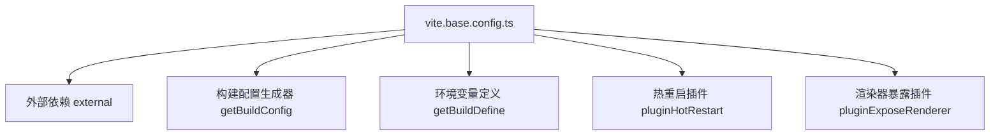
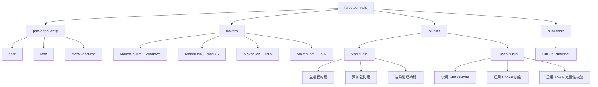
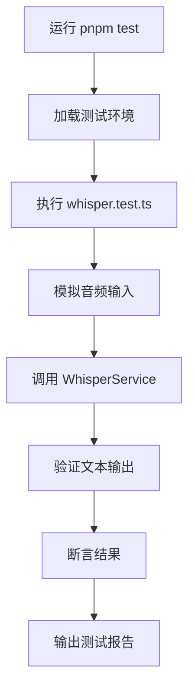

# 开发者指南

<cite>
**本文档中引用的文件**  
- [vite.base.config.ts](file://vite.base.config.ts)
- [vite.main.config.ts](file://vite.main.config.ts)
- [vite.preload.config.ts](file://vite.preload.config.ts)
- [vite.renderer.config.ts](file://vite.renderer.config.ts)
- [forge.config.ts](file://forge.config.ts)
- [package.json](file://package.json)
- [src/main.ts](file://src/main.ts)
- [src/preload.ts](file://src/preload.ts)
- [src/renderer.ts](file://src/renderer.ts)
- [src/backend/test/whisper.test.ts](file://src/backend/test/whisper.test.ts)
</cite>

## 目录
1. [简介](#简介)
2. [开发环境搭建](#开发环境搭建)
3. [构建配置详解](#构建配置详解)
4. [Electron Forge 打包配置](#electron-forge-打包配置)
5. [调试策略](#调试策略)
6. [代码规范与提交流程](#代码规范与提交流程)
7. [测试方法](#测试方法)
8. [添加新功能指导](#添加新功能指导)
9. [结论](#结论)

## 简介
本指南旨在为参与 DashPlayer 项目开发或进行二次开发的开发者提供全面的技术支持。内容涵盖从环境配置、构建系统、打包发布到调试、测试及功能扩展的完整开发流程，帮助开发者快速上手并高效贡献代码。

## 开发环境搭建

### Node.js 与 pnpm 版本要求
本项目基于现代前端技术栈构建，需确保以下环境已正确安装：

- **Node.js**: 建议使用 v18.x 或更高版本，以兼容项目依赖。
- **pnpm**: 推荐使用 v8.x 或以上版本，用于高效管理项目依赖。

可通过以下命令检查版本：
```bash
node -v
pnpm -v
```

### 依赖安装
项目使用 `pnpm` 作为包管理器。在项目根目录执行以下命令安装依赖：

```bash
pnpm install
```

安装完成后，可运行 `pnpm dev` 启动开发服务器，或 `pnpm build` 进行生产构建。

**本节来源**
- [package.json](file://package.json)

## 构建配置详解

### Vite 配置概览
本项目采用 Vite 作为构建工具，并通过 `electron-forge` 集成支持 Electron 多进程架构。Vite 配置分为多个文件，分别对应主进程、预加载脚本和渲染进程。

#### 共享基础配置：vite.base.config.ts
该文件定义了所有构建配置共享的常量、外部依赖和通用插件，包括：
- 排除 Node.js 内置模块和 `package.json` 中的依赖（避免打包）
- 提供 `getBuildConfig`、`getBuildDefine` 等工具函数
- 实现热重启插件 `pluginHotRestart` 和渲染器暴露插件 `pluginExposeRenderer`



**图示来源**
- [vite.base.config.ts](file://vite.base.config.ts#L1-L93)

#### 主进程配置：vite.main.config.ts
负责构建 Electron 主进程代码（`src/main.ts`），关键配置包括：
- 使用 `lib` 模式生成 CJS 格式的库
- 设置 `sourcemap: true` 便于调试
- 引入 `pluginHotRestart('restart')` 实现主进程热重启
- 通过 `alias` 配置 `@` 指向 `src` 目录

**本节来源**
- [vite.main.config.ts](file://vite.main.config.ts#L1-L38)
- [src/main.ts](file://src/main.ts)

#### 预加载脚本配置：vite.preload.config.ts
用于构建 Electron 预加载脚本（`src/preload.ts`），特点如下：
- 使用 `rollupOptions.input` 而非 `lib.entry`，支持 Web 资源
- 设置 `inlineDynamicImports: true` 防止代码分割
- 引入 `pluginHotRestart('reload')` 实现预加载脚本热重载
- 启用 React 插件以支持 JSX

**本节来源**
- [vite.preload.config.ts](file://vite.preload.config.ts#L1-L36)
- [src/preload.ts](file://src/preload.ts)

#### 渲染进程配置：vite.renderer.config.ts
负责构建前端渲染进程（React 应用），主要配置：
- 设置 `base: './'` 支持相对路径
- 输出目录为 `.vite/renderer/${name}`
- 使用 `pluginExposeRenderer` 将 Vite 服务器暴露给主进程
- 启用 React 插件和路径别名

**本节来源**
- [vite.renderer.config.ts](file://vite.renderer.config.ts#L1-L29)
- [src/renderer.ts](file://src/renderer.ts)

## Electron Forge 打包配置

### forge.config.ts 核心配置
`forge.config.ts` 是 Electron Forge 的核心配置文件，定义了打包、发布和插件行为。

#### 打包配置（packagerConfig）
- `asar: true`：启用 ASAR 归档
- `icon`：指定应用图标路径
- `extraResource`：额外资源（如数据库迁移文件、脚本）
- `executableName`：可执行文件名称

#### 打包器（makers）
支持多平台打包：
- **Windows**: 使用 `MakerSquirrel` 生成 `.exe` 安装包
- **macOS**: 使用 `MakerDMG` 生成 `.dmg` 镜像
- **Linux**: 使用 `MakerDeb` 和 `MakerRpm` 生成 `.deb` 和 `.rpm` 包

#### 插件配置
- **VitePlugin**: 集成 Vite，分别配置主进程、预加载和渲染进程
- **FusesPlugin**: 启用安全熔断，如禁用 `runAsNode`、启用 Cookie 加密等

#### 发布配置（publishers）
支持通过 GitHub 发布预发布版本。



**图示来源**
- [forge.config.ts](file://forge.config.ts#L1-L92)

### 打包命令
执行以下命令生成对应平台安装包：
```bash
pnpm make:win    # Windows
pnpm make:mac    # macOS
pnpm make:linux  # Linux
```

**本节来源**
- [forge.config.ts](file://forge.config.ts#L1-L92)

## 调试策略

### 主进程调试
主进程日志可通过 `electron-log` 模块输出。日志文件默认位于：
- **Windows**: `%APPDATA%/DashPlayer/logs/`
- **macOS**: `~/Library/Logs/DashPlayer/`
- **Linux**: `~/.config/DashPlayer/logs/`

在开发模式下，可通过 `console.log` 输出信息，或使用 VS Code 的调试配置附加到主进程。

### 渲染进程调试
渲染进程为标准的 React 应用，可通过浏览器开发者工具进行调试。启动 `pnpm dev` 后，应用运行在本地服务器，可直接使用 DevTools。

### 预加载脚本调试
预加载脚本运行在渲染器上下文但具有 Node.js 权限，其日志同样由 `electron-log` 记录。可通过在 `preload.ts` 中添加日志语句进行调试。

**本节来源**
- [forge.config.ts](file://forge.config.ts)
- [src/main.ts](file://src/main.ts)
- [src/preload.ts](file://src/preload.ts)

## 代码规范与提交流程

### 代码风格
- 使用 TypeScript 编写，遵循项目 `tsconfig.json` 配置
- React 组件使用函数式组件和 Hooks
- 文件命名采用小写加连字符（如 `file-selector.tsx`）
- 路径别名 `@` 指向 `src` 目录

### 提交流程
1. 创建新分支：`git checkout -b feature/your-feature`
2. 编码并确保通过 ESLint 和 Prettier 检查
3. 提交时使用约定式提交（Conventional Commits）：
   - `feat:` 新功能
   - `fix:` 修复 bug
   - `docs:` 文档更新
   - `refactor:` 代码重构
4. 提交 PR 并关联相关 issue

**本节来源**
- [tsconfig.json](file://tsconfig.json)
- [tailwind.config.js](file://tailwind.config.js)
- [postcss.config.js](file://postcss.config.js)

## 测试方法

### 单元测试
项目使用标准测试框架对核心功能进行测试。例如，`whisper.test.ts` 文件测试语音转文字功能。

#### 运行测试
```bash
pnpm test
```

#### 测试文件示例
- `src/backend/test/whisper.test.ts`：测试 Whisper 语音识别服务
- 其他测试文件位于 `src/backend/test/` 目录



**图示来源**
- [src/backend/test/whisper.test.ts](file://src/backend/test/whisper.test.ts)

**本节来源**
- [src/backend/test/whisper.test.ts](file://src/backend/test/whisper.test.ts)

## 添加新功能指导

### 注册新的 IPC 路由
1. 在 `src/backend/controllers/` 目录下创建新的控制器类，实现 `Controller` 接口
2. 使用 `@injectable()` 装饰器注册为依赖注入服务
3. 在 `dispatcher.ts` 中注册路由映射，将 IPC 通道与控制器方法关联
4. 在渲染进程通过 `ipcRenderer.invoke()` 调用新通道

### 创建新服务
1. 在 `src/backend/services/impl/` 下创建服务实现类
2. 定义服务接口并注册到 `inversify.config.ts`
3. 通过依赖注入在控制器中使用服务
4. 如需持久化，使用 Drizzle ORM 在 `src/backend/db/tables/` 定义表结构

### 添加前端页面
1. 在 `src/fronted/pages/` 下创建新页面组件
2. 在路由系统中注册新路径
3. 使用 `useXXX` 自定义 Hook 管理状态
4. 通过 `@` 别名导入公共组件和工具

**本节来源**
- [src/backend/controllers/AiFuncController.ts](file://src/backend/controllers/AiFuncController.ts)
- [src/backend/services/impl/WhisperServiceImpl.ts](file://src/backend/services/impl/WhisperServiceImpl.ts)
- [src/backend/dispatcher.ts](file://src/backend/dispatcher.ts)
- [src/fronted/pages/](file://src/fronted/pages/)

## 结论
本指南详细介绍了 DashPlayer 项目的开发全流程，从环境搭建到功能扩展，为开发者提供了完整的参考。遵循本文档的规范和流程，可高效地参与项目开发，确保代码质量和系统稳定性。