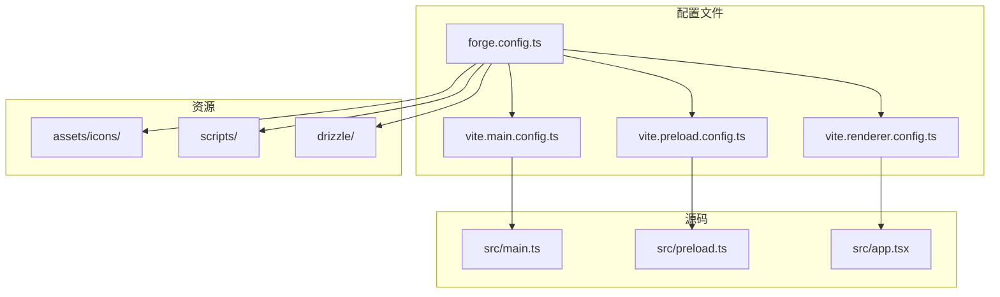
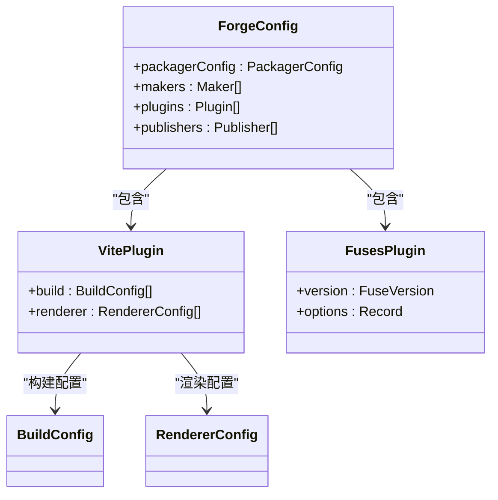
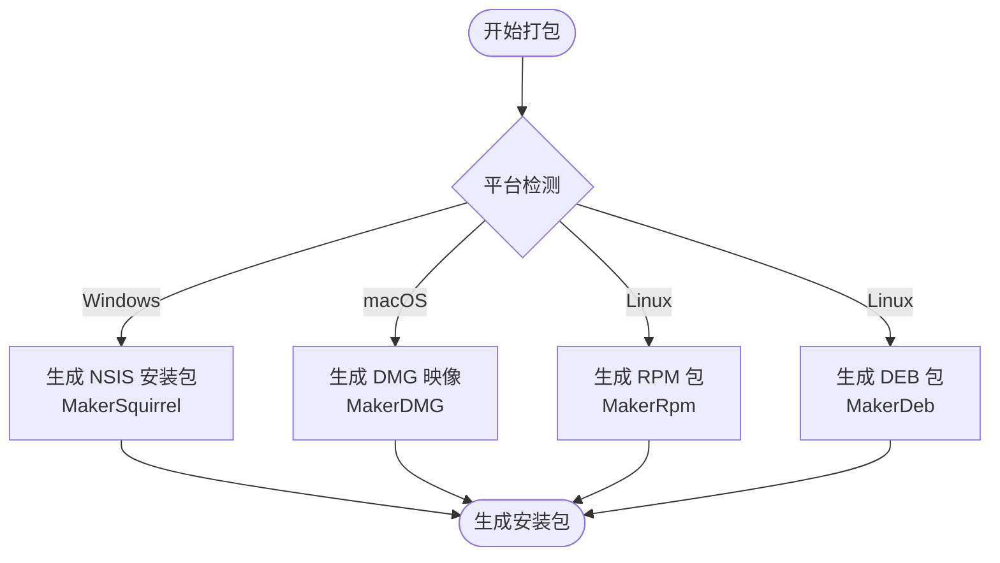

# 打包与发布

<cite>
**本文档中引用的文件**  
- [forge.config.ts](file://forge.config.ts)
- [package.json](file://package.json)
- [vite.main.config.ts](file://vite.main.config.ts)
- [vite.preload.config.ts](file://vite.preload.config.ts)
- [vite.renderer.config.ts](file://vite.renderer.config.ts)
- [vite.base.config.ts](file://vite.base.config.ts)
- [assets/icons/icon.ico](file://assets/icons/icon.ico)
- [assets/icons/icon.icns](file://assets/icons/icon.icns)
- [assets/icons/icon.png](file://assets/icons/icon.png)
</cite>

## 目录
1. [简介](#简介)
2. [项目结构](#项目结构)
3. [核心配置文件分析](#核心配置文件分析)
4. [Packager 配置详解](#packager-配置详解)
5. [Makers 配置详解](#makers-配置详解)
6. [Publishers 配置详解](#publishers-配置详解)
7. [应用元数据设置](#应用元数据设置)
8. [打包命令执行与验证](#打包命令执行与验证)
9. [代码签名建议](#代码签名建议)
10. [自动更新机制实现](#自动更新机制实现)

## 简介
本文档详细说明了使用 Electron Forge 对 DashPlayer 应用进行打包与发布的完整流程。涵盖 `forge.config.ts` 中的关键配置项，包括 packager、makers、publishers 的设置，应用元数据定义，跨平台打包命令执行，以及代码签名和自动更新机制的实现建议。

## 项目结构
本项目采用模块化结构，前端使用 Vite + React 技术栈，后端基于 Electron 构建。打包配置由 Electron Forge 管理，通过 Vite 插件集成构建流程。核心打包配置位于根目录的 `forge.config.ts` 文件中。



**Diagram sources**
- [forge.config.ts](file://forge.config.ts#L9-L48)
- [vite.main.config.ts](file://vite.main.config.ts#L0-L37)
- [vite.preload.config.ts](file://vite.preload.config.ts#L0-L35)
- [vite.renderer.config.ts](file://vite.renderer.config.ts#L0-L28)

**Section sources**
- [forge.config.ts](file://forge.config.ts#L1-L92)
- [package.json](file://package.json#L1-L148)

## 核心配置文件分析
`forge.config.ts` 是 Electron Forge 的核心配置文件，定义了应用打包、构建和发布的行为。该文件通过 `VitePlugin` 集成 Vite 构建系统，支持主进程、预加载脚本和渲染进程的分别构建。



**Diagram sources**
- [forge.config.ts](file://forge.config.ts#L9-L91)
- [vite.base.config.ts](file://vite.base.config.ts#L0-L93)

**Section sources**
- [forge.config.ts](file://forge.config.ts#L1-L92)
- [vite.base.config.ts](file://vite.base.config.ts#L0-L93)

## Packager 配置详解
`packagerConfig` 定义了 Electron 应用打包的基础参数：

- **asar**: 启用 ASAR 归档格式打包应用资源
- **icon**: 指定应用图标路径，支持跨平台自动识别格式
- **extraResource**: 额外资源文件夹，确保 drizzle 数据库迁移、脚本等被包含
- **executableName**: 可执行文件名称设置为 `dash-player`
- **name**: 应用显示名称为 `DashPlayer`

该配置确保应用在不同平台上使用统一的资源结构和命名规范。

**Section sources**
- [forge.config.ts](file://forge.config.ts#L10-L16)

## Makers 配置详解
Makers 负责生成特定平台的安装包格式：

- **MakerSquirrel**: 为 Windows 生成 NSIS 安装程序，配置了安装动画、安装图标和远程图标 URL
- **MakerDMG**: 为 macOS 生成 DMG 磁盘映像，使用 `.icns` 图标并采用 ULFO 压缩格式
- **MakerRpm**: 为 Linux 生成 RPM 包，配置包名、产品名和图标
- **MakerDeb**: 为 Linux 生成 DEB 包，配置与 RPM 类似

这些配置确保应用能在三大主流操作系统上生成符合平台规范的安装包。



**Diagram sources**
- [forge.config.ts](file://forge.config.ts#L18-L38)
- [package.json](file://package.json#L23-L28)

**Section sources**
- [forge.config.ts](file://forge.config.ts#L17-L39)

## Publishers 配置详解
`publishers` 配置定义了自动发布机制：

- 使用 `@electron-forge/publisher-github` 插件
- 配置 GitHub 仓库信息（owner: solidSpoon, name: DashPlayer）
- 启用预发布（prerelease: true）功能

该配置允许通过 `electron-forge publish` 命令自动将构建产物推送到 GitHub Releases，支持持续集成和自动更新。

**Section sources**
- [forge.config.ts](file://forge.config.ts#L85-L91)

## 应用元数据设置
应用元数据在多个文件中统一配置：

- **package.json**: 定义 `name`, `productName`, `version` (当前为 5.1.2)
- **forge.config.ts**: 在 packagerConfig 中重复定义 name 和 executableName 以确保一致性
- **图标资源**: 提供多种格式（.ico, .icns, .png）存放于 `assets/icons/` 目录

版本号遵循语义化版本控制，通过 `npm run make` 打包时自动继承。

**Section sources**
- [package.json](file://package.json#L1-L10)
- [forge.config.ts](file://forge.config.ts#L10-L16)
- [assets/icons/icon.ico](file://assets/icons/icon.ico)
- [assets/icons/icon.icns](file://assets/icons/icon.icns)
- [assets/icons/icon.png](file://assets/icons/icon.png)

## 打包命令执行与验证
在不同操作系统上执行打包命令：

```bash
npm run make
```

该命令会：
1. 先执行 `yarn run download` 下载必要资源
2. 调用 `electron-forge make` 启动打包流程
3. 根据当前操作系统生成对应的安装包

验证生成的安装包：
- Windows: 检查 `out/make/squirrel-windows/` 目录下的 `.exe` 文件
- macOS: 检查 `out/make/dmg/` 目录下的 `.dmg` 文件
- Linux: 检查 `out/make/rpm/` 和 `out/make/deb/` 目录下的对应包文件

**Section sources**
- [package.json](file://package.json#L10)

## 代码签名建议
为确保应用在各平台的安全性和可信度，建议实施代码签名：

- **Windows**: 使用 Authenticode 签名，需配置 `win` 选项和证书信息
- **macOS**: 使用 Apple Developer ID 签名，需配置 `osxSign` 选项
- 可通过环境变量管理签名证书和密码
- 签名应在 CI/CD 环境中安全地执行

虽然当前配置未显式包含签名设置，但应在发布正式版本前添加。

## 自动更新机制实现
基于现有配置的自动更新实现建议：

1. **发布通道**: 利用 GitHub Releases 作为更新服务器
2. **更新检查**: 在应用中集成 `electron-updater`，指向 GitHub 仓库
3. **发布流程**: 
   - 构建完成后使用 `electron-forge publish` 推送到 GitHub
   - 标记稳定版本或预发布版本
4. **客户端更新逻辑**:
   - 启动时检查最新版本
   - 下载更新并静默安装
   - 重启应用完成更新

当前配置中的 `prerelease: true` 支持测试版本的灰度发布。

**Section sources**
- [forge.config.ts](file://forge.config.ts#L85-L91)
- [package.json](file://package.json#L14)