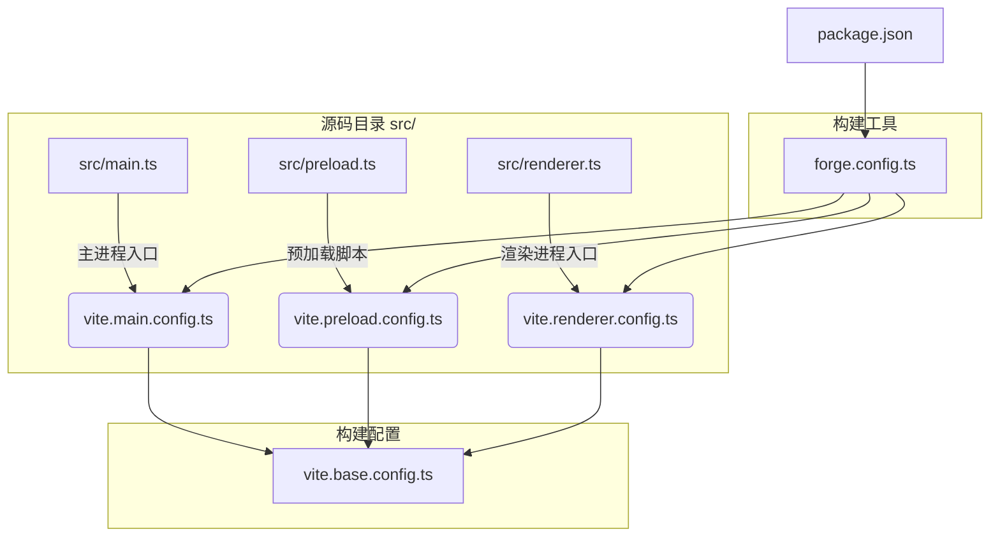
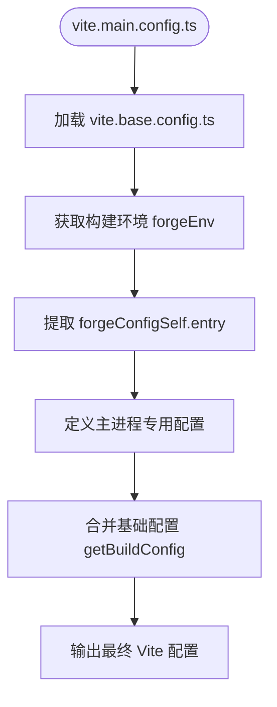
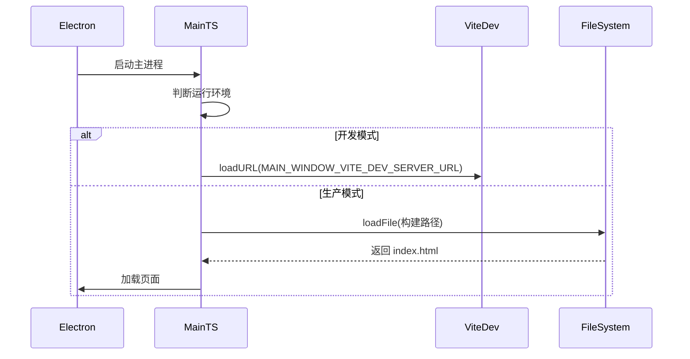

# 主进程构建配置

<cite>
**本文档中引用的文件**  
- [vite.main.config.ts](file://vite.main.config.ts)
- [vite.base.config.ts](file://vite.base.config.ts)
- [forge.config.ts](file://forge.config.ts)
- [src/main.ts](file://src/main.ts)
- [forge.env.d.ts](file://forge.env.d.ts)
- [src/types.d.ts](file://src/types.d.ts)
</cite>

## 目录
1. [项目结构](#项目结构)
2. [主进程构建配置详解](#主进程构建配置详解)
3. [external 机制与 Electron 内置模块处理](#external-机制与-electron-内置模块处理)
4. [构建输出路径与 TypeScript 集成](#构建输出路径与-typescript-集成)
5. [rollupOptions 与 Node.js 兼容性配置](#rollupoptions-与-nodejs-兼容性配置)
6. [主进程入口与构建产物加载机制](#主进程入口与构建产物加载机制)
7. [常见构建错误与排查方案](#常见构建错误与排查方案)

## 项目结构

本项目采用 Electron + Vite + TypeScript 的现代桌面应用架构，结合 Electron Forge 进行打包构建。项目结构清晰地分离了主进程、渲染进程与预加载脚本，各部分通过独立的 Vite 配置进行构建。



**Diagram sources**  
- [src/main.ts](file://src/main.ts)
- [vite.main.config.ts](file://vite.main.config.ts)
- [forge.config.ts](file://forge.config.ts)

**Section sources**  
- [src/main.ts](file://src/main.ts)
- [vite.main.config.ts](file://vite.main.config.ts)
- [forge.config.ts](file://forge.config.ts)

## 主进程构建配置详解

主进程的 Vite 构建配置定义在 `vite.main.config.ts` 文件中，其核心目标是为 Electron 主进程定制构建流程，确保生成的代码能够在 Node.js 环境中正确运行。

该配置通过 `defineConfig` 函数接收构建环境参数，并结合 `vite.base.config.ts` 中的共享配置，使用 `mergeConfig` 进行合并。配置中明确指定了主进程的入口文件由 `forgeConfigSelf.entry!` 动态提供，确保与 Electron Forge 的集成一致性。



**Diagram sources**  
- [vite.main.config.ts](file://vite.main.config.ts#L0-L37)
- [vite.base.config.ts](file://vite.base.config.ts#L0-L93)

**Section sources**  
- [vite.main.config.ts](file://vite.main.config.ts#L0-L37)

## external 机制与 Electron 内置模块处理

### external 的定义与作用

在 `vite.base.config.ts` 中，`external` 变量被定义为一个包含 Electron 内置模块和项目依赖的数组：

```ts
export const external = [...builtins, ...Object.keys('dependencies' in pkg ? (pkg.dependencies as Record<string, unknown>) : {})];
```

其中 `builtins` 包含 `'electron'` 及所有 Node.js 内置模块（通过 `builtinModules` 获取），确保这些模块在打包时不会被嵌入到最终的 bundle 中。

### 防止原生模块打包的机制

Electron 主进程运行在 Node.js 环境中，可以直接访问 `electron`、`fs`、`path` 等原生模块。若这些模块被 Vite 打包进 bundle，会导致：
- 构建产物体积异常增大
- 模块加载失败或行为异常
- 运行时出现 `Cannot find module 'electron'` 等错误

通过在 `vite.main.config.ts` 的 `rollupOptions.external` 中引用 `external` 数组，Vite 使用 Rollup 的 external 机制，将这些模块标记为外部依赖，仅在运行时通过 `require` 动态加载，从而避免了打包问题。

**Section sources**  
- [vite.base.config.ts](file://vite.base.config.ts#L7-L7)
- [vite.main.config.ts](file://vite.main.config.ts#L21-L24)

## 构建输出路径与 TypeScript 集成

### 构建输出路径设置

主进程的构建输出路径由 `vite.base.config.ts` 中的 `getBuildConfig` 函数统一管理：

```ts
outDir: '.vite/build'
```

该路径为所有构建任务（主进程、预加载、渲染进程）的根输出目录。主进程的最终产物将根据 Electron Forge 的配置放置在 `.vite/build` 目录下，确保多构建任务之间不会相互干扰。

### TypeScript 编译集成方式

项目通过 `tsconfig.json` 配置 TypeScript 编译选项，关键配置包括：
- `"module": "commonjs"`：输出 CommonJS 模块，兼容 Node.js 环境
- `"target": "ESNext"`：支持最新 JavaScript 特性
- `"baseUrl": "."` 和 `"paths"`：支持 `@/*` 路径别名，与 Vite 的 `resolve.alias` 保持一致

Vite 在构建过程中自动处理 TypeScript 编译，无需额外插件，同时保留源码映射（`sourcemap: true`），便于调试。

**Section sources**  
- [vite.base.config.ts](file://vite.base.config.ts#L9-L25)
- [tsconfig.json](file://tsconfig.json#L0-L25)

## rollupOptions 与 Node.js 兼容性配置

`rollupOptions` 是 Vite 构建配置的核心部分，用于微调底层 Rollup 打包行为，确保主进程代码与 Node.js 环境完全兼容。

### 主要配置项

| 配置项 | 值 | 说明 |
|--------|----|------|
| `external` | `external` 数组 | 外部化所有 Node.js 和 Electron 内置模块 |
| `output.format` | `'cjs'` | 输出 CommonJS 格式，确保 Node.js 兼容性 |
| `output.inlineDynamicImports` | `true`（预加载） | 预加载脚本不拆分 chunk，确保单文件加载 |

在 `vite.main.config.ts` 中，`build.lib.formats` 被设置为 `['cjs']`，明确指定输出格式为 CommonJS，这是 Node.js 模块系统的标准格式。

### mainFields 配置

```ts
mainFields: ['module', 'jsnext:main', 'jsnext']
```

此配置指示 Vite 在解析依赖时优先查找 ES 模块字段，但在主进程上下文中，最终仍会回退到 CommonJS，确保最大兼容性。

**Section sources**  
- [vite.main.config.ts](file://vite.main.config.ts#L14-L24)
- [vite.preload.config.ts](file://vite.preload.config.ts#L14-L22)

## 主进程入口与构建产物加载机制

### src/main.ts 入口文件分析

`src/main.ts` 是 Electron 主进程的入口文件，负责创建主窗口、注册协议、初始化数据库等核心功能。其关键代码如下：

```ts
if (MAIN_WINDOW_VITE_DEV_SERVER_URL) {
    mainWindow.loadURL(MAIN_WINDOW_VITE_DEV_SERVER_URL);
} else {
    mainWindow.loadFile(path.join(__dirname, `../renderer/${MAIN_WINDOW_VITE_NAME}/index.html`));
}
```

### 构建产物加载流程

1. **开发模式**：通过 `MAIN_WINDOW_VITE_DEV_SERVER_URL` 环境变量加载 Vite 开发服务器的 URL
2. **生产模式**：通过 `MAIN_WINDOW_VITE_NAME` 变量定位构建后的 HTML 文件路径

这些环境变量由 `vite.base.config.ts` 中的 `getBuildDefine` 函数动态生成，并注入到构建产物中，实现开发与生产环境的无缝切换。



**Diagram sources**  
- [src/main.ts](file://src/main.ts#L0-L31)
- [vite.base.config.ts](file://vite.base.config.ts#L41-L55)
- [forge.env.d.ts](file://forge.env.d.ts#L0-L30)

**Section sources**  
- [src/main.ts](file://src/main.ts#L0-L98)
- [forge.env.d.ts](file://forge.env.d.ts#L0-L30)
- [src/types.d.ts](file://src/types.d.ts#L0-L4)

## 常见构建错误与排查方案

### 模块未 external 导致的运行时错误

**现象**：  
`Uncaught Error: Cannot find module 'electron'` 或 `fs.readFileSync is not a function`

**原因**：  
`electron` 或 `fs` 等模块未被正确 external，导致 Vite 尝试在浏览器环境中解析这些 Node.js 模块。

**解决方案**：
1. 确认 `vite.base.config.ts` 中的 `external` 数组包含 `'electron'` 和所有 Node.js 内置模块
2. 检查 `vite.main.config.ts` 是否正确引用了 `external`
3. 确保 `rollupOptions.external` 配置生效

### 构建路径错误

**现象**：  
生产模式下无法加载 `index.html`，提示文件不存在

**原因**：  
`MAIN_WINDOW_VITE_NAME` 环境变量未正确注入或路径拼接错误

**解决方案**：
1. 检查 `forge.config.ts` 中 `renderer.name` 是否为 `'main_window'`
2. 确认 `vite.renderer.config.ts` 的 `outDir` 与 `main.ts` 中的路径拼接逻辑一致
3. 验证构建后 `.vite/renderer/main_window/` 目录是否存在

### 热重载失效

**现象**：  
修改主进程代码后，Electron 应用未自动重启

**原因**：  
`pluginHotRestart('restart')` 插件未正确触发

**解决方案**：
1. 确认 `vite.main.config.ts` 中已注册 `pluginHotRestart('restart')`
2. 检查 `process.stdin.emit('data', 'rs')` 是否被正确执行
3. 验证 Electron Forge 的开发服务器是否支持 stdin 输入

**Section sources**  
- [vite.main.config.ts](file://vite.main.config.ts#L26-L27)
- [vite.base.config.ts](file://vite.base.config.ts#L76-L92)
- [src/main.ts](file://src/main.ts#L0-L98)