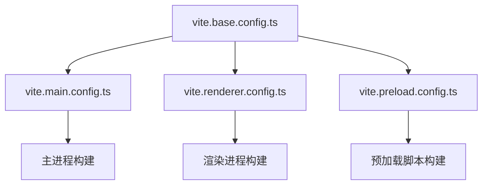
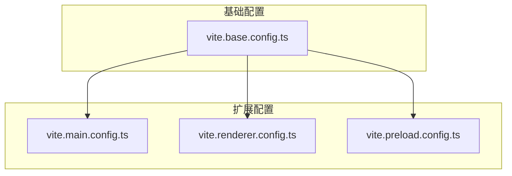
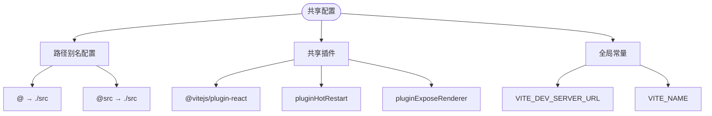
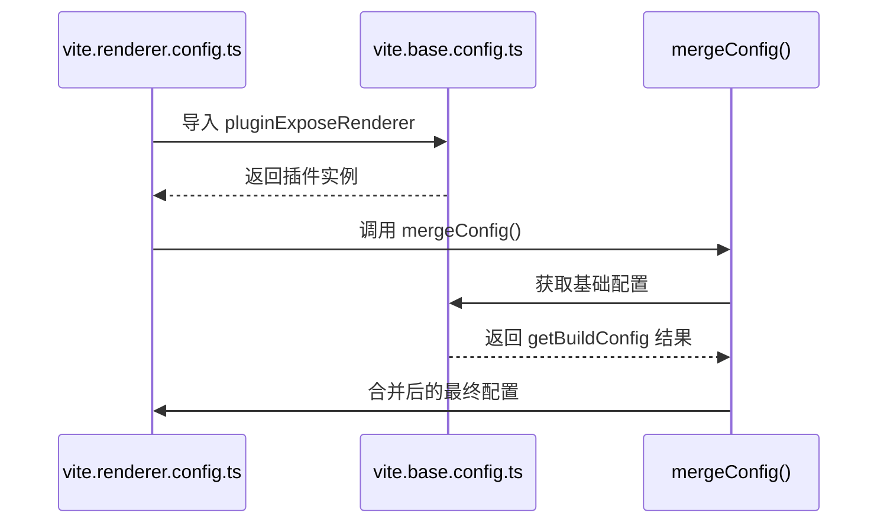

# 基础配置共享

<cite>
**本文档中引用的文件**  
- [vite.base.config.ts](file://vite.base.config.ts)
- [vite.main.config.ts](file://vite.main.config.ts)
- [vite.renderer.config.ts](file://vite.renderer.config.ts)
- [vite.preload.config.ts](file://vite.preload.config.ts)
- [forge.env.d.ts](file://forge.env.d.ts)
- [src/main.ts](file://src/main.ts)
- [src/types.d.ts](file://src/types.d.ts)
</cite>

## 目录
1. [简介](#简介)
2. [项目结构](#项目结构)
3. [核心组件](#核心组件)
4. [架构概述](#架构概述)
5. [详细组件分析](#详细组件分析)
6. [依赖分析](#依赖分析)
7. [性能考虑](#性能考虑)
8. [故障排除指南](#故障排除指南)
9. [结论](#结论)

## 简介
本项目是一个基于 Electron 和 Vite 构建的桌面应用程序，采用模块化配置方式管理主进程、渲染进程和预加载脚本的构建设置。`vite.base.config.ts` 作为核心基础配置文件，被多个 Vite 配置文件继承和复用，确保构建行为的一致性与可维护性。通过 `defineConfig` 和 `mergeConfig` 实现配置共享，结合路径别名、全局常量定义和插件复用，形成统一的构建体系。

## 项目结构



**图示来源**  
- [vite.base.config.ts](file://vite.base.config.ts#L1-L93)
- [vite.main.config.ts](file://vite.main.config.ts#L1-L38)
- [vite.renderer.config.ts](file://vite.renderer.config.ts#L1-L29)
- [vite.preload.config.ts](file://vite.preload.config.ts#L1-L36)

**本节来源**  
- [vite.base.config.ts](file://vite.base.config.ts#L1-L93)
- [vite.main.config.ts](file://vite.main.config.ts#L1-L38)
- [vite.renderer.config.ts](file://vite.renderer.config.ts#L1-L29)
- [vite.preload.config.ts](file://vite.preload.config.ts#L1-L36)

## 核心组件

`vite.base.config.ts` 是整个项目构建配置的核心，提供了多个可复用的函数和常量，包括构建配置生成器、全局变量定义机制、热重载插件等。这些组件被主进程、渲染进程和预加载脚本的配置文件共同继承，实现了配置的高度一致性。

**本节来源**  
- [vite.base.config.ts](file://vite.base.config.ts#L1-L93)

## 架构概述

本项目的构建架构采用分层设计模式，以 `vite.base.config.ts` 为基础层，提供通用配置和工具函数；`vite.main.config.ts`、`vite.renderer.config.ts` 和 `vite.preload.config.ts` 作为扩展层，分别针对主进程、渲染进程和预加载脚本进行特定配置。通过 `mergeConfig` 方法将基础配置与特定配置合并，实现配置的继承与复用。



**图示来源**  
- [vite.base.config.ts](file://vite.base.config.ts#L1-L93)
- [vite.main.config.ts](file://vite.main.config.ts#L1-L38)
- [vite.renderer.config.ts](file://vite.renderer.config.ts#L1-L29)
- [vite.preload.config.ts](file://vite.preload.config.ts#L1-L36)

## 详细组件分析

### 基础配置共享机制分析

#### 配置复用函数
```mermaid
classDiagram
class getBuildConfig {
+getBuildConfig(env : ConfigEnv<'build'>) : UserConfig
}
class getBuildDefine {
+getBuildDefine(env : ConfigEnv<'build'>) : Record<string, any>
}
class getDefineKeys {
+getDefineKeys(names : string[]) : { [name : string] : VitePluginRuntimeKeys }
}
class pluginExposeRenderer {
+pluginExposeRenderer(name : string) : Plugin
}
class pluginHotRestart {
+pluginHotRestart(command : 'reload' | 'restart') : Plugin
}
getBuildDefine --> getDefineKeys : "依赖"
pluginExposeRenderer --> getDefineKeys : "依赖"
```

**图示来源**  
- [vite.base.config.ts](file://vite.base.config.ts#L7-L93)

**本节来源**  
- [vite.base.config.ts](file://vite.base.config.ts#L7-L93)

### 路径别名与共享插件分析

#### 共享构建选项


**图示来源**  
- [vite.base.config.ts](file://vite.base.config.ts#L1-L93)
- [vite.main.config.ts](file://vite.main.config.ts#L1-L38)
- [vite.renderer.config.ts](file://vite.renderer.config.ts#L1-L29)
- [vite.preload.config.ts](file://vite.preload.config.ts#L1-L36)

**本节来源**  
- [vite.base.config.ts](file://vite.base.config.ts#L1-L93)
- [vite.main.config.ts](file://vite.main.config.ts#L1-L38)
- [vite.renderer.config.ts](file://vite.renderer.config.ts#L1-L29)
- [vite.preload.config.ts](file://vite.preload.config.ts#L1-L36)

### 配置继承流程分析

#### 配置合并流程


**图示来源**  
- [vite.base.config.ts](file://vite.base.config.ts#L7-L93)
- [vite.renderer.config.ts](file://vite.renderer.config.ts#L1-L29)

**本节来源**  
- [vite.base.config.ts](file://vite.base.config.ts#L7-L93)
- [vite.renderer.config.ts](file://vite.renderer.config.ts#L1-L29)

## 依赖分析

```mermaid
erDiagram
VITE_BASE_CONFIG ||--o{ VITE_MAIN_CONFIG : "被继承"
VITE_BASE_CONFIG ||--o{ VITE_RENDERER_CONFIG : "被继承"
VITE_BASE_CONFIG ||--o{ VITE_PRELOAD_CONFIG : "被继承"
VITE_MAIN_CONFIG ||--o{ MAIN_PROCESS : "构建"
VITE_RENDERER_CONFIG ||--o{ RENDERER_PROCESS : "构建"
VITE_PRELOAD_CONFIG ||--o{ PRELOAD_SCRIPT : "构建"
class VITE_BASE_CONFIG {
builtins
external
getBuildConfig()
getBuildDefine()
pluginHotRestart()
}
class VITE_MAIN_CONFIG {
pluginHotRestart('restart')
resolve.alias
}
class VITE_RENDERER_CONFIG {
pluginExposeRenderer()
react()
resolve.alias
}
class VITE_PRELOAD_CONFIG {
pluginHotRestart('reload')
react()
resolve.alias
}
```

**图示来源**  
- [vite.base.config.ts](file://vite.base.config.ts#L1-L93)
- [vite.main.config.ts](file://vite.main.config.ts#L1-L38)
- [vite.renderer.config.ts](file://vite.renderer.config.ts#L1-L29)
- [vite.preload.config.ts](file://vite.preload.config.ts#L1-L36)

**本节来源**  
- [vite.base.config.ts](file://vite.base.config.ts#L1-L93)
- [vite.main.config.ts](file://vite.main.config.ts#L1-L38)
- [vite.renderer.config.ts](file://vite.renderer.config.ts#L1-L29)
- [vite.preload.config.ts](file://vite.preload.config.ts#L1-L36)

## 性能考虑

基础配置通过统一的 `outDir` 设置（`.vite/build`）避免了多构建任务间的干扰，同时通过 `emptyOutDir: false` 防止重复清理输出目录，提升了构建效率。`minify` 选项根据命令类型自动启用，确保生产环境构建的优化。路径别名减少了模块解析时间，提高了开发服务器的启动速度。

**本节来源**  
- [vite.base.config.ts](file://vite.base.config.ts#L10-L24)

## 故障排除指南

当遇到构建问题时，应首先检查 `vite.base.config.ts` 中的基础配置是否正确被继承。常见问题包括：环境变量未正确注入（检查 `getBuildDefine` 调用）、热重载失效（确认 `pluginHotRestart` 和 `pluginExposeRenderer` 正确注册）、路径别名解析失败（验证 `resolve.alias` 配置）。可通过在各配置文件中添加日志输出来调试配置合并过程。

**本节来源**  
- [vite.base.config.ts](file://vite.base.config.ts#L1-L93)
- [forge.env.d.ts](file://forge.env.d.ts#L1-L31)
- [src/main.ts](file://src/main.ts#L1-L98)
- [src/types.d.ts](file://src/types.d.ts#L1-L5)

## 结论

`vite.base.config.ts` 作为项目的基础配置文件，通过提供可复用的配置生成函数、插件和常量，实现了主进程、渲染进程和预加载脚本配置的高度一致性。利用 Vite 的 `mergeConfig` 机制，各特定配置文件能够灵活地扩展基础配置，既保证了构建行为的统一，又保留了针对不同进程的定制能力。这种分层配置架构显著提升了项目的可维护性和可扩展性。