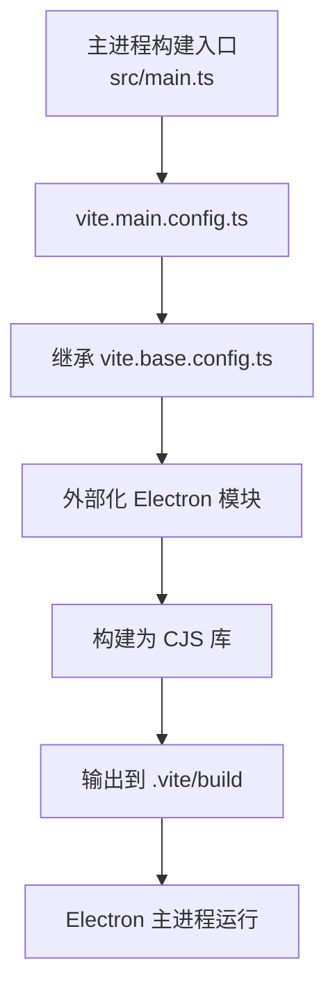
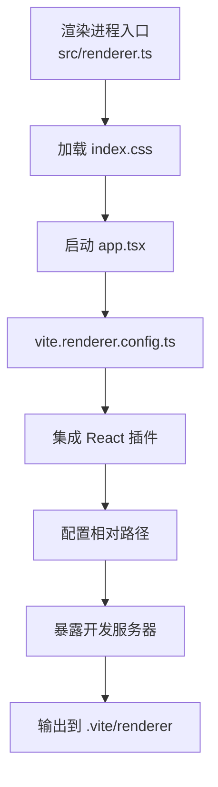
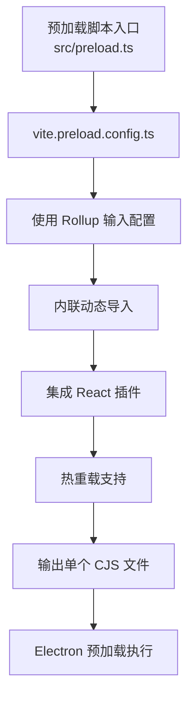
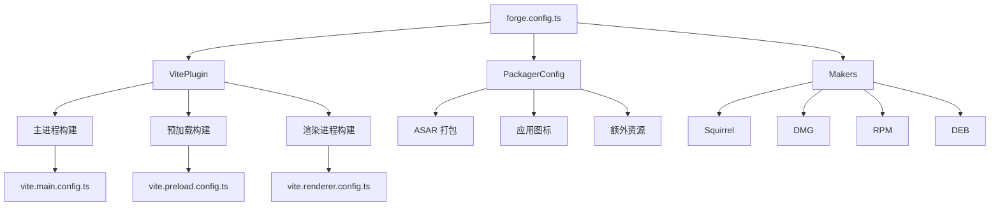

# 构建配置详解

<cite>
**本文档中引用的文件**  
- [vite.base.config.ts](file://vite.base.config.ts)
- [vite.main.config.ts](file://vite.main.config.ts)
- [vite.preload.config.ts](file://vite.preload.config.ts)
- [vite.renderer.config.ts](file://vite.renderer.config.ts)
- [forge.config.ts](file://forge.config.ts)
- [src/main.ts](file://src/main.ts)
- [src/preload.ts](file://src/preload.ts)
- [src/renderer.ts](file://src/renderer.ts)
- [tailwind.config.js](file://tailwind.config.js)
- [src/app.tsx](file://src/app.tsx)
</cite>

## 目录
1. [项目构建体系概述](#项目构建体系概述)
2. [基础配置：vite.base.config.ts](#基础配置vitebaseconfigts)
3. [主进程构建配置](#主进程构建配置)
4. [渲染进程构建配置](#渲染进程构建配置)
5. [预加载脚本构建配置](#预加载脚本构建配置)
6. [Electron 集成与 Forge 配置](#electron-集成与-forge-配置)
7. [Tailwind CSS 集成](#tailwind-css-集成)
8. [自定义构建配置指导](#自定义构建配置指导)

## 项目构建体系概述

本项目采用 Vite 作为核心构建工具，结合 Electron 和 Electron Forge 实现跨平台桌面应用的开发与打包。构建系统采用模块化配置策略，通过基础配置文件 `vite.base.config.ts` 提供共享配置，多个专用配置文件分别处理主进程、渲染进程和预加载脚本的差异化构建需求。

构建体系的核心特点包括：
- 多入口构建支持：分别处理主进程、渲染进程和预加载脚本
- 环境变量注入：通过 `define` 配置实现运行时常量注入
- 热重载支持：主进程和预加载脚本均支持开发时热更新
- 模块外部化：避免将 Electron 和 Node.js 内置模块打包进产物

**Section sources**
- [vite.base.config.ts](file://vite.base.config.ts#L1-L93)
- [forge.config.ts](file://forge.config.ts#L1-L92)

## 基础配置：vite.base.config.ts

`vite.base.config.ts` 是整个构建系统的基础配置文件，提供跨所有构建目标的共享功能和工具函数。该文件定义了构建配置的核心组成部分：

1. **内置模块外部化**：通过 `builtins` 常量将 Electron 和 Node.js 内置模块标记为外部依赖，防止它们被错误地打包进最终产物
2. **依赖项外部化**：自动将 `package.json` 中的依赖项添加到外部化列表中
3. **构建配置生成器**：`getBuildConfig` 函数提供标准化的构建选项，包括输出目录、清屏行为等
4. **环境变量注入**：`getBuildDefine` 函数生成运行时常量，用于在代码中访问开发服务器 URL 和构建名称
5. **插件工具**：提供 `pluginExposeRenderer` 和 `pluginHotRestart` 两个实用插件，分别用于暴露开发服务器和实现热重启功能

该基础配置通过 `mergeConfig` 被其他具体配置文件继承和扩展，确保配置的一致性和可维护性。

**Section sources**
- [vite.base.config.ts](file://vite.base.config.ts#L1-L93)

## 主进程构建配置

主进程配置文件 `vite.main.config.ts` 专门处理 Electron 主线程代码的构建。其核心配置特点包括：

1. **库模式构建**：使用 `build.lib` 配置将主进程代码构建为 CommonJS 库，确保与 Electron 的兼容性
2. **源码映射**：启用 sourcemap 支持，便于调试主进程代码
3. **模块外部化**：继承自基础配置的 `external` 列表，确保 Electron 和 Node.js 模块不会被打包
4. **热重启支持**：通过 `pluginHotRestart('restart')` 插件实现主进程代码修改后的自动重启
5. **路径别名**：配置 `@` 别名指向 `src` 目录，简化模块导入

主进程构建的输出路径为 `.vite/build`，入口文件为 `src/main.ts`，该文件负责创建浏览器窗口、注册协议处理程序和初始化应用。



**Diagram sources**
- [vite.main.config.ts](file://vite.main.config.ts#L1-L38)
- [src/main.ts](file://src/main.ts#L1-L98)

**Section sources**
- [vite.main.config.ts](file://vite.main.config.ts#L1-L38)
- [src/main.ts](file://src/main.ts#L1-L98)

## 渲染进程构建配置

渲染进程配置文件 `vite.renderer.config.ts` 负责构建 React 前端应用。其主要特点包括：

1. **React 支持**：集成 `@vitejs/plugin-react` 插件，提供 React 18 的开发支持
2. **相对路径基础**：设置 `base: './'`，确保资源在 Electron 环境中正确加载
3. **独立输出目录**：每个渲染进程构建输出到 `.vite/renderer/${name}` 目录，避免冲突
4. **开发服务器暴露**：通过 `pluginExposeRenderer` 插件将开发服务器实例暴露给主进程，实现跨进程通信
5. **符号链接保留**：启用 `preserveSymlinks` 选项，确保模块解析的正确性
6. **路径别名**：配置 `@` 别名指向 `src` 目录，统一模块导入方式

渲染进程的入口是 `src/renderer.ts`，该文件负责加载 CSS 样式和启动 React 应用。React 应用的根组件定义在 `src/app.tsx` 中。



**Diagram sources**
- [vite.renderer.config.ts](file://vite.renderer.config.ts#L1-L29)
- [src/renderer.ts](file://src/renderer.ts#L1-L32)
- [src/app.tsx](file://src/app.tsx#L1-L132)

**Section sources**
- [vite.renderer.config.ts](file://vite.renderer.config.ts#L1-L29)
- [src/renderer.ts](file://src/renderer.ts#L1-L32)
- [src/app.tsx](file://src/app.tsx#L1-L132)

## 预加载脚本构建配置

预加载脚本配置文件 `vite.preload.config.ts` 处理 Electron 预加载脚本的构建。预加载脚本在渲染进程和主进程之间提供安全的通信桥梁。其配置特点包括：

1. **输入配置**：使用 `build.rollupOptions.input` 而非 `build.lib.entry`，支持预加载脚本中包含 Web 资源
2. **单一文件输出**：通过 `inlineDynamicImports: true` 确保输出为单个文件，避免 Electron 加载问题
3. **热重载支持**：使用 `pluginHotRestart('reload')` 实现预加载脚本修改后的热重载
4. **React 支持**：集成 React 插件，允许在预加载脚本中使用 React 相关功能
5. **路径别名**：配置 `@` 别名，保持与其他模块的一致性

预加载脚本的入口是 `src/preload.ts`，该文件使用 `contextBridge` 将 Electron API 安全地暴露给渲染进程，同时通过 `ipcRenderer` 实现进程间通信。



**Diagram sources**
- [vite.preload.config.ts](file://vite.preload.config.ts#L1-L36)
- [src/preload.ts](file://src/preload.ts#L1-L47)

**Section sources**
- [vite.preload.config.ts](file://vite.preload.config.ts#L1-L36)
- [src/preload.ts](file://src/preload.ts#L1-L47)

## Electron 集成与 Forge 配置

`forge.config.ts` 文件定义了 Electron Forge 的构建配置，将 Vite 构建系统与 Electron 打包流程集成。其核心配置包括：

1. **多入口构建**：在 `plugins.VitePlugin.build` 数组中定义主进程和预加载脚本的构建配置
2. **渲染进程配置**：在 `plugins.VitePlugin.renderer` 数组中定义渲染进程的构建配置
3. **打包配置**：设置 ASAR 打包、应用图标、额外资源等打包选项
4. **安装包生成**：配置 Squirrel、DMG、RPM、DEB 等多种安装包格式
5. **安全熔断**：通过 `FusesPlugin` 启用各种安全选项，如 Cookie 加密、ASAR 完整性验证等

该配置文件将多个 Vite 配置文件（`vite.main.config.ts`、`vite.preload.config.ts`、`vite.renderer.config.ts`）与 Electron Forge 集成，形成完整的构建和打包流水线。



**Diagram sources**
- [forge.config.ts](file://forge.config.ts#L1-L92)

**Section sources**
- [forge.config.ts](file://forge.config.ts#L1-L92)

## Tailwind CSS 集成

项目通过 `tailwind.config.js` 配置文件集成 Tailwind CSS，实现现代化的 CSS 开发体验。主要配置特点包括：

1. **内容扫描**：配置 `content` 选项扫描项目中所有 TypeScript 和 TSX 文件，确保使用的 Tailwind 类名不会被移除
2. **暗色模式支持**：启用 `darkMode: ["class"]`，通过 CSS 类控制暗色模式切换
3. **设计系统扩展**：扩展主题配置，定义边框、输入、环形、背景等设计变量
4. **插件集成**：集成 `tailwindcss-animate`、`tailwind-scrollbar` 和 `@tailwindcss/typography` 插件，增强动画、滚动条和排版功能
5. **容器布局**：配置容器居中和响应式断点，优化布局体验

Tailwind CSS 的集成与 Vite 构建系统无缝配合，提供高效的 CSS 开发工作流。

**Section sources**
- [tailwind.config.js](file://tailwind.config.js#L1-L78)

## 自定义构建配置指导

当需要自定义构建配置时，可遵循以下指导原则：

### 添加新插件
在相应的配置文件中导入并添加插件到 `plugins` 数组：
```typescript
import myPlugin from 'my-vite-plugin';

// 在 vite.renderer.config.ts 中
plugins: [pluginExposeRenderer(name), react(), myPlugin()]
```

### 修改输出路径
调整 `build.outDir` 配置：
```typescript
// 在 vite.main.config.ts 中
build: {
  outDir: '.vite/main-build',
  // ...
}
```

### 扩展基础配置
创建新的配置文件并继承基础配置：
```typescript
import { defineConfig } from 'vite';
import { getBuildConfig, external } from './vite.base.config';

export default defineConfig({
  ...getBuildConfig(env),
  build: {
    rollupOptions: {
      external: [...external, 'my-special-module']
    }
  }
});
```

### 环境特定配置
利用 `ConfigEnv` 参数区分开发和生产环境：
```typescript
export default defineConfig((env) => {
  const isProduction = env.command === 'build';
  return {
    // 根据环境调整配置
    minify: isProduction,
    // ...
  };
});
```

通过遵循这些指导原则，可以安全地扩展和定制构建配置，满足项目特定需求。

**Section sources**
- [vite.base.config.ts](file://vite.base.config.ts#L1-L93)
- [vite.main.config.ts](file://vite.main.config.ts#L1-L38)
- [vite.preload.config.ts](file://vite.preload.config.ts#L1-L36)
- [vite.renderer.config.ts](file://vite.renderer.config.ts#L1-L29)