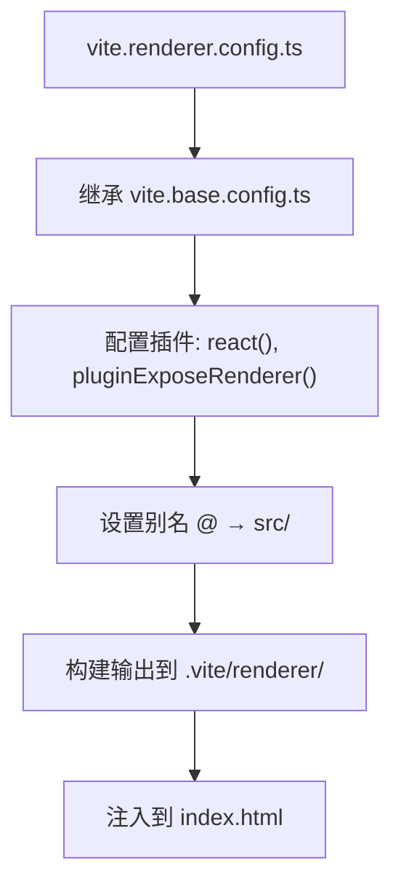
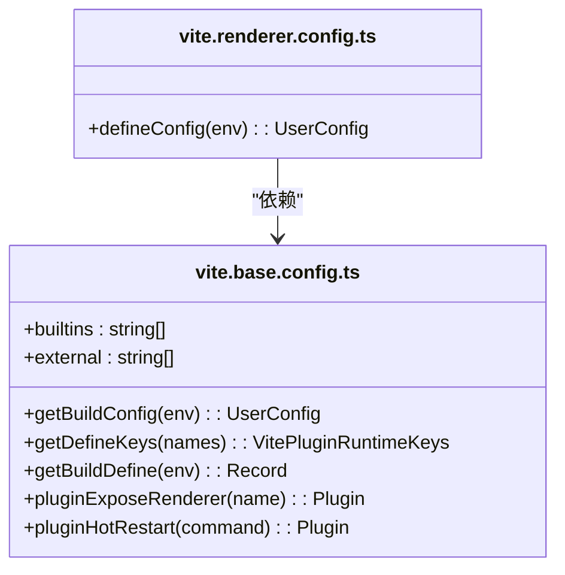
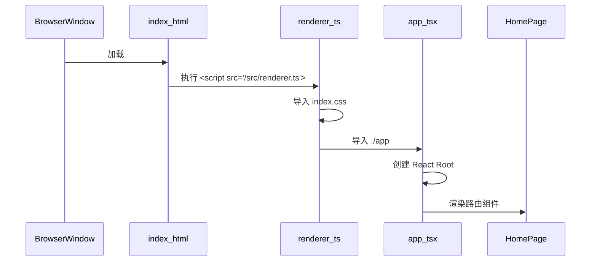

# 渲染进程构建配置

<cite>
**本文档中引用的文件**  
- [vite.base.config.ts](file://vite.base.config.ts)
- [vite.renderer.config.ts](file://vite.renderer.config.ts)
- [tailwind.config.js](file://tailwind.config.js)
- [postcss.config.js](file://postcss.config.js)
- [index.html](file://index.html)
- [src/app.tsx](file://src/app.tsx)
- [src/renderer.ts](file://src/renderer.ts)
- [src/fronted/pages/HomePage.tsx](file://src/fronted/pages/HomePage.tsx)
</cite>

## 目录
1. [项目结构](#项目结构)  
2. [核心构建配置分析](#核心构建配置分析)  
3. [技术栈集成：React + TypeScript + Tailwind CSS](#技术栈集成react--typescript--tailwind-css)  
4. [Vite 基础配置与继承机制](#vite-基础配置与继承机制)  
5. [静态资源与 public 目录处理](#静态资源与-public-目录处理)  
6. [组件打包与 HTML 注入机制](#组件打包与-html-注入机制)  
7. [性能优化建议](#性能优化建议)

## 项目结构

本项目采用 Electron + Vite + React 架构，前端渲染进程位于 `src/fronted` 目录，主进程与预加载脚本分别位于 `src/backend` 与 `src/preload.ts`。前端页面组件集中于 `src/fronted/pages`，UI 组件库位于 `src/fronted/components`，全局状态管理通过 `useSetting`、`useLayout` 等自定义 Hook 实现。

构建配置采用多文件策略，包含 `vite.base.config.ts`（基础配置）、`vite.renderer.config.ts`（渲染进程配置）、`vite.main.config.ts`（主进程配置）和 `vite.preload.config.ts`（预加载脚本配置），通过 Electron Forge 进行集成构建。

**Section sources**  
- [vite.base.config.ts](file://vite.base.config.ts#L1-L94)
- [src/fronted/pages/HomePage.tsx](file://src/fronted/pages/HomePage.tsx#L1-L144)

## 核心构建配置分析

渲染进程的 Vite 配置由 `vite.renderer.config.ts` 定义，其核心职责是构建 Electron 的渲染窗口内容。该配置通过 `defineConfig` 函数导出，并根据构建环境动态生成配置对象。

配置中设置了 `base: './'`，确保资源在 Electron 的本地文件系统中正确加载。输出目录为 `.vite/renderer/${name}`，其中 `name` 来自 Electron Forge 的配置，支持多渲染窗口的独立构建。



**Diagram sources**  
- [vite.renderer.config.ts](file://vite.renderer.config.ts#L1-L30)
- [vite.base.config.ts](file://vite.base.config.ts#L1-L94)

**Section sources**  
- [vite.renderer.config.ts](file://vite.renderer.config.ts#L1-L30)

## 技术栈集成：React + TypeScript + Tailwind CSS

### JSX 编译支持

通过引入 `@vitejs/plugin-react` 插件，Vite 实现了对 React 和 JSX/TSX 文件的原生支持。该插件自动处理 React Fast Refresh，确保开发过程中组件的热更新。

TypeScript 支持由 Vite 内置提供，结合 `tsconfig.json` 中的配置（如 `jsx: "react-jsx"` 和路径别名 `@/*`），实现了类型检查与模块解析。

### CSS 模块化与 Tailwind JIT 编译

Tailwind CSS 通过 `tailwind.config.js` 配置，启用了 JIT（Just-In-Time）模式，极大提升了构建性能。JIT 模式按需生成 CSS 类，仅包含项目中实际使用的样式，避免了全量打包带来的体积膨胀。

配置中 `content` 字段指定了样式扫描路径，包括 `pages/**/*.{ts,tsx}`、`components/**/*.{ts,tsx}` 等，确保所有 JSX/TSX 文件中的类名被正确识别。

PostCSS 配置文件 `postcss.config.js` 引入了 `tailwindcss` 和 `autoprefixer`，在构建过程中自动处理 CSS 前缀和 Tailwind 指令（如 `@tailwind`）。

```mermaid
flowchart LR
TSX["TSX 文件"] --> |包含 class="..."| Tailwind["tailwind.config.js"]
Tailwind --> |JIT 编译| CSS["生成优化 CSS"]
CSS --> |通过 PostCSS| Output["输出到构建目录"]
```

**Diagram sources**  
- [tailwind.config.js](file://tailwind.config.js#L1-L79)
- [postcss.config.js](file://postcss.config.js#L1-L7)

**Section sources**  
- [tailwind.config.js](file://tailwind.config.js#L1-L79)
- [postcss.config.js](file://postcss.config.js#L1-L7)

## Vite 基础配置与继承机制

`vite.base.config.ts` 提供了跨进程的公共构建逻辑，通过函数式导出实现配置复用。`getBuildConfig` 函数返回基础构建选项，如 `outDir: '.vite/build'` 和根据命令自动启用 `minify`。

`vite.renderer.config.ts` 通过直接引用 `pluginExposeRenderer` 插件，实现了与基础配置的集成。该插件用于暴露 Vite 开发服务器实例，支持预加载脚本的热重载。

环境变量注入通过 `getDefineKeys` 和 `getBuildDefine` 实现，动态生成如 `MAIN_WINDOW_VITE_DEV_SERVER_URL` 等常量，供主进程在运行时获取开发服务器地址。



**Diagram sources**  
- [vite.base.config.ts](file://vite.base.config.ts#L1-L94)
- [vite.renderer.config.ts](file://vite.renderer.config.ts#L1-L30)

**Section sources**  
- [vite.base.config.ts](file://vite.base.config.ts#L1-L94)

## 静态资源与 public 目录处理

项目未显式使用 Vite 的 `public` 目录，静态资源（如图片、SVG）通过模块导入方式处理。`assets.d.ts` 文件声明了对 `.svg`、`.png`、`.jpg`、`.css`、`.scss` 等文件的类型支持，允许直接导入资源。

例如，SVG 文件可作为 React 组件导入使用：
```ts
import { ReactComponent as Logo } from '@/assets/logo.svg';
```

CSS 文件导入后返回类名映射，实现 CSS 模块化：
```ts
import styles from '@/fronted/components/TitleBar/TitleBarWindows.css';
// 使用 styles.titleBar
```

所有静态资源在构建时由 Vite 自动处理，生成带哈希的文件名并输出到 `dist` 目录。

**Section sources**  
- [assets/assets.d.ts](file://assets/assets.d.ts#L1-L32)

## 组件打包与 HTML 注入机制

前端入口由 `index.html` 定义，其脚本入口为 `/src/renderer.ts`。

`renderer.ts` 是 Vite 的入口文件，负责加载全局样式 `index.css` 并启动应用：
```ts
import './index.css';
import './app';
```

`app.tsx` 是 React 应用的根组件，使用 `createRoot` 将 `<App />` 渲染到 `document.body`。应用采用 `HashRouter` 实现前端路由，路由配置映射到 `src/fronted/pages` 下的各个页面组件，如 `HomePage`、`PlayerWithControlsPage` 等。



**Diagram sources**  
- [index.html](file://index.html#L1-L11)
- [src/renderer.ts](file://src/renderer.ts#L1-L33)
- [src/app.tsx](file://src/app.tsx#L1-L133)

**Section sources**  
- [index.html](file://index.html#L1-L11)
- [src/renderer.ts](file://src/renderer.ts#L1-L33)
- [src/app.tsx](file://src/app.tsx#L1-L133)

## 性能优化建议

### 代码分割与懒加载

当前配置未显式启用路由级代码分割。建议使用 `React.lazy` 和 `Suspense` 实现页面级懒加载，例如：

```ts
const HomePage = React.lazy(() => import('@/fronted/pages/HomePage'));
```

### 生产环境压缩

Vite 默认在 `build` 命令下启用压缩（`minify: command === 'build'`）。可进一步配置 `build.minify` 为 `'terser'` 以获得更小的包体积，或调整 `build.chunkSizeWarningLimit` 控制分块大小警告。

### 资源优化

- **图片优化**：建议使用 WebP 格式替代 PNG/JPG，并在构建时通过插件进行压缩。
- **字体优化**：避免加载完整字体文件，仅加载所需字符集。
- **依赖分析**：使用 `rollup-plugin-visualizer` 分析构建产物，识别并移除未使用依赖。

### 构建缓存

确保 `.vite` 目录被正确缓存，利用 Vite 的预构建和缓存机制加速开发服务器启动。

**Section sources**  
- [vite.base.config.ts](file://vite.base.config.ts#L15-L25)
- [vite.renderer.config.ts](file://vite.renderer.config.ts#L1-L30)