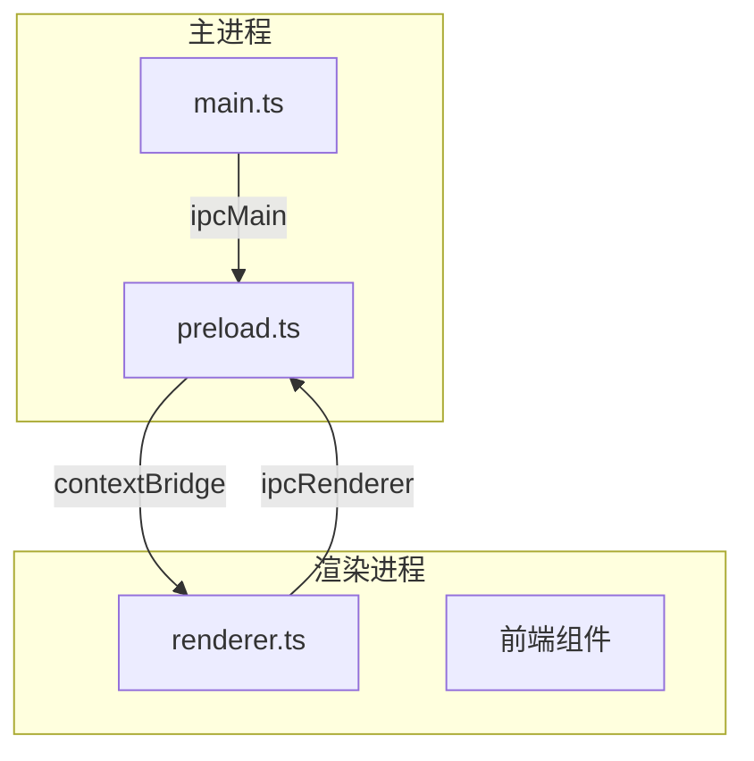
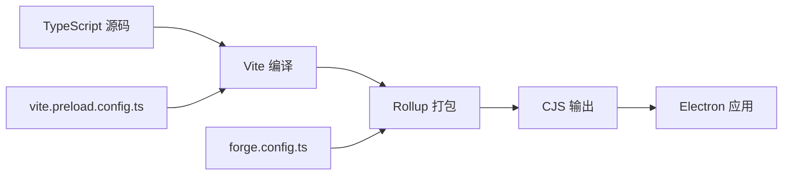
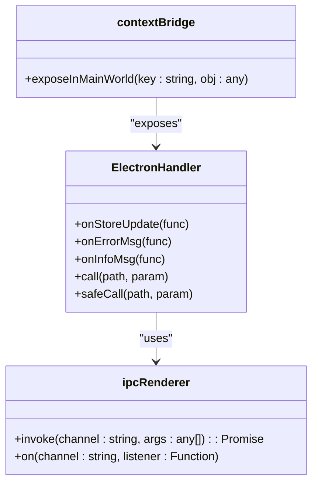
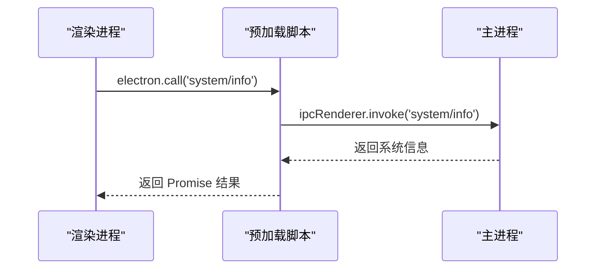
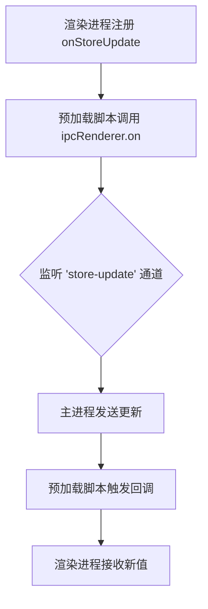
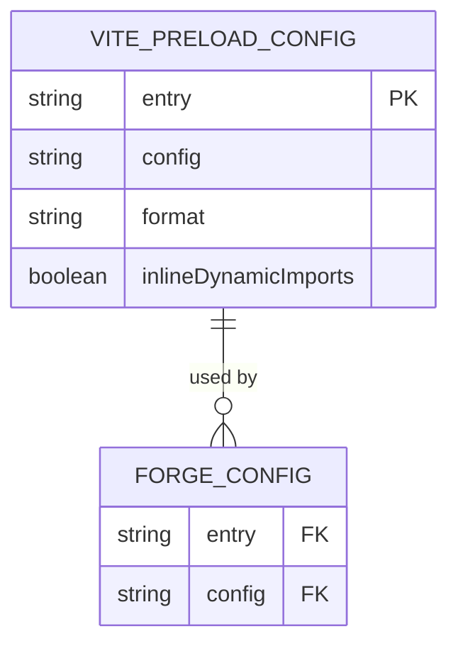
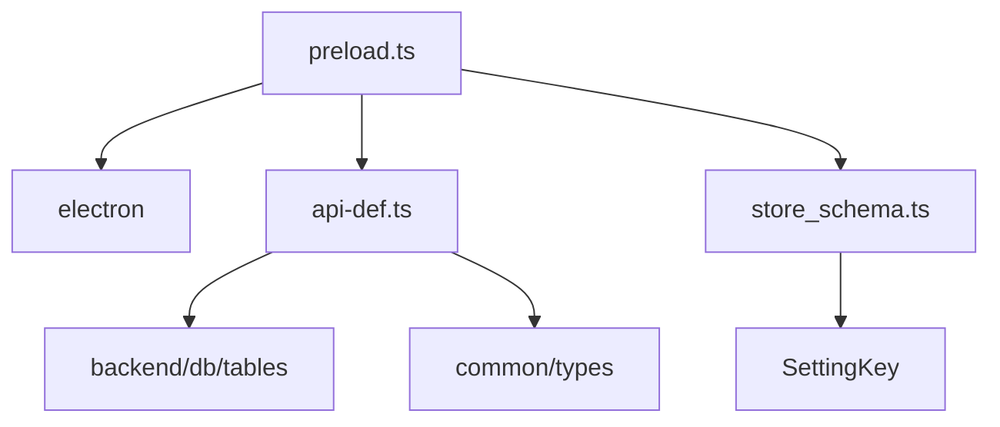

# 预加载脚本构建配置

<cite>
**本文档引用的文件**  
- [preload.ts](file://src/preload.ts)
- [vite.preload.config.ts](file://vite.preload.config.ts)
- [forge.config.ts](file://forge.config.ts)
- [api-def.ts](file://src/common/api/api-def.ts)
- [store_schema.ts](file://src/common/types/store_schema.ts)
- [preload.d.ts](file://src/fronted/preload.d.ts)
</cite>

## 目录
1. [简介](#简介)
2. [项目结构](#项目结构)
3. [核心组件](#核心组件)
4. [架构概述](#架构概述)
5. [详细组件分析](#详细组件分析)
6. [依赖分析](#依赖分析)
7. [性能考虑](#性能考虑)
8. [故障排除指南](#故障排除指南)
9. [结论](#结论)

## 简介
本文档深入分析 Electron 应用中预加载脚本（`preload.ts`）的构建配置，重点阐述其在安全模型中的关键作用。文档解释了如何在启用 `contextIsolation` 的前提下，通过 `contextBridge` 安全地将 IPC 接口暴露给渲染进程。同时，说明了构建流程中对 `src/preload.ts` 的处理机制，包括 TypeScript 编译、模块打包及输出路径设定。结合 `window.electron` 对象的暴露方式，进一步阐述如何防止原型污染和不安全 API 暴露，并提供基于最小权限原则和输入验证的安全加固建议。

## 项目结构
本项目采用模块化结构，前端与后端逻辑分离，预加载脚本位于 `src/preload.ts`，其构建配置由 `vite.preload.config.ts` 和 `forge.config.ts` 共同定义。预加载脚本作为主进程与渲染进程之间的桥梁，承担着安全通信的核心职责。

**Diagram sources**  
- [preload.ts](file://src/preload.ts#L1-L47)
- [forge.config.ts](file://forge.config.ts#L1-L92)

**Section sources**  
- [preload.ts](file://src/preload.ts#L1-L47)
- [vite.preload.config.ts](file://vite.preload.config.ts#L1-L36)

## 核心组件
预加载脚本的核心功能是通过 `contextBridge.exposeInMainWorld` 将受控的 API 接口暴露给渲染进程，同时确保主进程的 Node.js 环境不被直接访问。该机制依赖于 `ipcRenderer` 与主进程通信，并通过泛型约束确保类型安全。

**Section sources**  
- [preload.ts](file://src/preload.ts#L16-L46)
- [api-def.ts](file://src/common/api/api-def.ts#L1-L190)

## 架构概述
预加载脚本在 Electron 的多进程架构中扮演中介角色，确保渲染进程只能通过定义良好的接口与主进程交互。构建系统使用 Vite 进行编译打包，Electron Forge 进行最终打包配置，确保脚本以 CJS 格式输出并内联动态导入。

**Diagram sources**  
- [vite.preload.config.ts](file://vite.preload.config.ts#L1-L36)
- [forge.config.ts](file://forge.config.ts#L1-L92)

## 详细组件分析

### 预加载脚本安全机制分析
预加载脚本通过 `contextBridge` 实现安全上下文隔离，防止渲染进程直接访问 Node.js API 或 DOM 污染。

#### 安全暴露机制

**Diagram sources**  
- [preload.ts](file://src/preload.ts#L16-L46)

#### IPC 调用流程

**Diagram sources**  
- [preload.ts](file://src/preload.ts#L38-L44)
- [api-def.ts](file://src/common/api/api-def.ts#L100-L110)

#### 事件监听机制

**Diagram sources**  
- [preload.ts](file://src/preload.ts#L20-L30)

**Section sources**  
- [preload.ts](file://src/preload.ts#L1-L47)
- [store_schema.ts](file://src/common/types/store_schema.ts#L1-L37)

### 构建流程分析
构建系统通过 Vite 和 Electron Forge 协同工作，确保预加载脚本正确编译和打包。

#### 构建配置关系

**Diagram sources**  
- [vite.preload.config.ts](file://vite.preload.config.ts#L1-L36)
- [forge.config.ts](file://forge.config.ts#L1-L92)

**Section sources**  
- [vite.preload.config.ts](file://vite.preload.config.ts#L1-L36)
- [forge.config.ts](file://forge.config.ts#L1-L92)

## 依赖分析
预加载脚本依赖多个核心模块，确保类型安全和功能完整。

**Diagram sources**  
- [preload.ts](file://src/preload.ts#L1-L15)
- [api-def.ts](file://src/common/api/api-def.ts#L1-L190)
- [store_schema.ts](file://src/common/types/store_schema.ts#L1-L37)

**Section sources**  
- [preload.ts](file://src/preload.ts#L1-L47)
- [api-def.ts](file://src/common/api/api-def.ts#L1-L190)
- [store_schema.ts](file://src/common/types/store_schema.ts#L1-L37)

## 性能考虑
- 预加载脚本使用 `inlineDynamicImports: true`，避免代码分割，减少运行时开销。
- 所有 IPC 调用均为异步，避免阻塞渲染进程主线程。
- `safeCall` 方法提供错误捕获机制，防止未处理异常影响用户体验。

## 故障排除指南
- **问题：`window.electron` 未定义**  
  检查 `contextBridge.exposeInMainWorld` 是否执行，确认 `preload.js` 路径正确。
- **问题：IPC 调用无响应**  
  确认主进程是否注册了对应 `ipcMain.handle` 通道。
- **问题：类型错误**  
  检查 `ApiDefinitions` 泛型定义是否与实际接口一致。

**Section sources**  
- [preload.d.ts](file://src/fronted/preload.d.ts#L1-L10)
- [preload.ts](file://src/preload.ts#L45-L46)

## 结论
预加载脚本是 Electron 安全架构的核心组件。通过 `contextIsolation` 和 `contextBridge` 的结合，有效隔离了不安全环境，仅暴露必要的 IPC 接口。构建流程通过 Vite 和 Electron Forge 精确控制输出格式和打包行为，确保脚本高效运行。建议始终遵循最小权限原则，对所有输入进行验证，并使用 `safeCall` 包装高风险操作，以提升应用整体安全性。