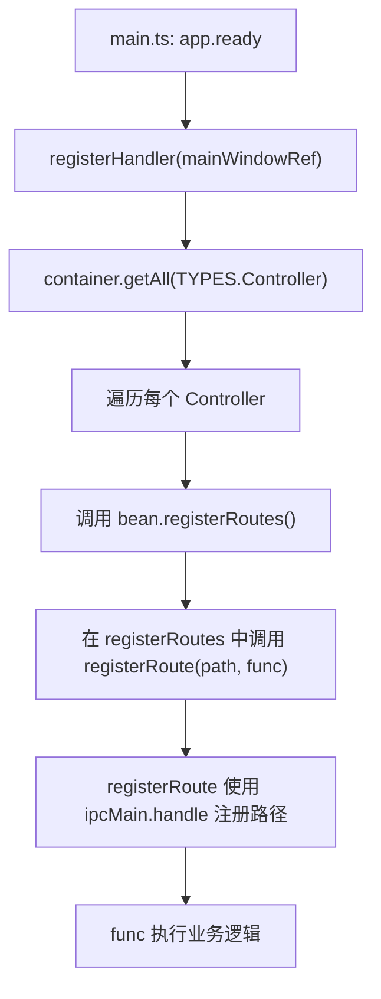

# IPC 通信调试

<cite>
**本文档引用的文件**  
- [dispatcher.ts](file://src/backend/dispatcher.ts)
- [register.ts](file://src/common/api/register.ts)
- [AiFuncController.ts](file://src/backend/controllers/AiFuncController.ts)
- [preload.ts](file://src/preload.ts)
- [main.ts](file://src/main.ts)
</cite>

## 目录
1. [引言](#引言)
2. [IPC 通信机制概述](#ipc-通信机制概述)
3. [路由注册与消息分发流程分析](#路由注册与消息分发流程分析)
4. [IPC 调试策略](#ipc-调试策略)
5. [日志记录最佳实践](#日志记录最佳实践)
6. [断点调试与参数验证](#断点调试与参数验证)
7. [常见问题与错误处理](#常见问题与错误处理)
8. [总结](#总结)

## 引言
本文件旨在系统性阐述 Electron 应用中进程间通信（IPC）的调试策略。通过分析项目中的 `dispatcher.ts` 和 `register.ts` 文件，深入理解主进程与渲染进程之间如何通过 `ipcMain` 和 `ipcRenderer` 实现通信。同时，结合 `AiFuncController.ts` 等控制器类，展示实际的路由注册与消息分发流程，并提供完整的调试指导。

## IPC 通信机制概述
Electron 应用采用多进程架构，主进程负责管理窗口和系统事件，而渲染进程负责用户界面展示。两者之间的通信依赖于 IPC（Inter-Process Communication）机制，核心是 `ipcMain`（主进程）和 `ipcRenderer`（渲染进程）模块。

在本项目中：
- 主进程通过 `ipcMain.handle` 注册异步处理器，接收来自渲染进程的请求。
- 渲染进程通过 `ipcRenderer.invoke` 发起调用，等待主进程响应。
- 预加载脚本（`preload.ts`）使用 `contextBridge.exposeInMainWorld` 安全地将 IPC 调用暴露给前端 JavaScript。

这种设计确保了安全性，避免了直接暴露 Node.js API 到渲染进程中。

**Section sources**
- [main.ts](file://src/main.ts#L79-L97)
- [preload.ts](file://src/preload.ts#L0-L47)

## 路由注册与消息分发流程分析
项目的 IPC 路由注册采用集中式管理机制，通过依赖注入容器自动扫描并注册所有控制器。

### 核心组件
1. **`registerHandler`**：入口函数，接收主窗口引用，从 IoC 容器获取所有控制器并调用其 `registerRoutes()` 方法。
2. **`registerRoute`**：通用路由注册函数，封装了 `ipcMain.handle` 并集成日志记录与错误处理。
3. **`Controller` 接口**：所有控制器需实现该接口，统一提供 `registerRoutes()` 方法。

### 流程图


**Diagram sources**
- [dispatcher.ts](file://src/backend/dispatcher.ts#L6-L12)
- [register.ts](file://src/common/api/register.ts#L8-L19)

### 示例：AiFuncController 路由注册
以 `AiFuncController` 为例，其 `registerRoutes()` 方法批量注册多个 AI 功能相关的 IPC 接口：

```mermaid
classDiagram
class AiFuncController {
+analyzeNewWords(sentence : string)
+analyzeNewPhrases(sentence : string)
+analyzeGrammars(sentence : string)
+makeSentences({sentence, point})
+polish(sentence : string)
+formatSplit(text : string)
+phraseGroup(sentence : string)
+punctuation({no, srt})
+translateWithContext({sentence, context})
+tts(string : string)
+chat({msgs})
+transcript({filePath})
+explainSelectWithContext({sentence, selectedWord})
+explainSelect({word})
+registerRoutes()
}
AiFuncController ..|> Controller : 实现
AiFuncController --> DpTaskService : 依赖注入
AiFuncController --> AiServiceImpl : 依赖注入
AiFuncController --> ChatServiceImpl : 依赖注入
AiFuncController --> WhisperService : 依赖注入
```

**Diagram sources**
- [AiFuncController.ts](file://src/backend/controllers/AiFuncController.ts#L12-L129)

**Section sources**
- [AiFuncController.ts](file://src/backend/controllers/AiFuncController.ts#L0-L131)

## IPC 调试策略
为有效追踪 IPC 请求的完整生命周期，建议采取以下调试策略：

### 1. 添加日志输出
在 `register.ts` 中已内置日志记录：
- 每次 API 调用前使用 `dpLog.log('api-call', path, JSON.stringify(param))` 记录请求路径与参数。
- 异常发生时使用 `dpLog.error('api-error', path, e)` 记录错误详情。

这使得开发者可通过日志清晰追踪：
- 哪些 IPC 请求被触发
- 请求携带的参数内容
- 是否进入正确的处理函数
- 是否抛出异常

### 2. 使用 `console.log` 辅助调试
在关键业务方法中添加临时日志，例如在 `AiFuncController.transcript()` 中：
```ts
public async transcript({ filePath }: { filePath: string }) {
    const taskId = await this.dpTaskService.create();
    console.log('IPC Received: transcript', { filePath, taskId }); // 调试日志
    this.whisperService.transcript(taskId, filePath).then(r => {
        console.log('Transcript Result:', r);
    });
    return taskId;
}
```

## 日志记录最佳实践
项目使用 `electron-log` 进行日志管理，遵循以下最佳实践：

### 统一日志格式
- **调用日志**：`dpLog.log('api-call', path, param)` —— 记录所有入口请求。
- **错误日志**：`dpLog.error('api-error', path, error)` —— 记录处理异常。
- **上下文信息**：始终包含 `path` 参数，便于定位来源。

### 错误传播机制
当 IPC 处理函数抛出异常时：
1. `registerRoute` 捕获异常并记录日志。
2. 通过 `SystemService.sendErrorToRenderer(e)` 将错误发送回渲染进程。
3. 渲染进程可通过 `electron.onErrorMsg(...)` 监听并展示错误。

此机制确保前后端均可感知错误状态。

**Section sources**
- [register.ts](file://src/common/api/register.ts#L8-L19)
- [SystemServiceImpl.ts](file://src/backend/services/impl/SystemServiceImpl.ts#L56-L84)

## 断点调试与参数验证
利用 VS Code 调试器可深入检查 IPC 参数传递的正确性。

### 配置调试环境
确保 `launch.json` 包含 Electron 调试配置，能够同时调试主进程与渲染进程。

### 设置断点步骤
1. 打开 `AiFuncController.ts`。
2. 在目标方法（如 `transcript`）的第一行设置断点。
3. 从前端触发对应功能（如语音转录）。
4. 程序将在断点处暂停，可检查：
   - `filePath` 参数是否正确传递
   - `this` 上下文中的服务实例是否已注入
   - 调用栈是否符合预期

### 参数类型验证
建议在控制器方法中加入参数校验逻辑，防止非法输入导致运行时错误：
```ts
if (!filePath || typeof filePath !== 'string') {
    throw new Error('Invalid filePath parameter');
}
```

**Section sources**
- [AiFuncController.ts](file://src/backend/controllers/AiFuncController.ts#L12-L129)

## 常见问题与错误处理
### 1. IPC 调用失败
**可能原因**：
- 路由未正确注册（检查 `registerRoutes()` 是否被调用）
- 路径拼写错误（前后端路径不一致）
- 主进程未启动或崩溃

**排查方法**：
- 检查日志中是否有 `'api-call'` 记录
- 确认 `dispatcher.ts` 已在 `main.ts` 中调用
- 使用 `console.log` 验证 `ipcMain.handle` 是否绑定成功

### 2. 参数序列化错误
Electron IPC 要求参数可序列化（JSON.stringify 兼容）。

**避免传递**：
- 函数、Symbol、undefined
- 循环引用对象
- DOM 元素或原生指针

**建议**：仅传递 Plain Old JavaScript Object (POJO)。

### 3. 超时问题
长时间运行的任务应返回任务 ID 而非等待结果，前端通过轮询或事件监听获取进度。

如 `transcript()` 返回 `taskId`，后续通过事件通知完成状态。

**Section sources**
- [register.ts](file://src/common/api/register.ts#L8-L19)
- [AiFuncController.ts](file://src/backend/controllers/AiFuncController.ts#L12-L129)

## 总结
本项目通过 `dispatcher.ts` 和 `register.ts` 构建了一套结构清晰、易于维护的 IPC 通信体系。结合 `electron-log` 的日志记录与 VS Code 断点调试，开发者可以高效追踪 IPC 请求的全过程，快速定位并解决调用失败、参数错误等问题。建议在开发过程中始终开启日志输出，并在关键路径添加临时 `console.log` 辅助验证，以提升调试效率。