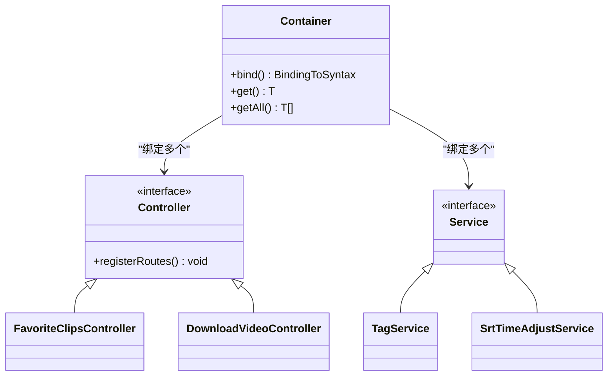
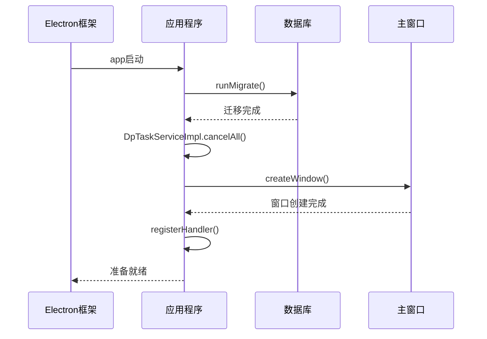
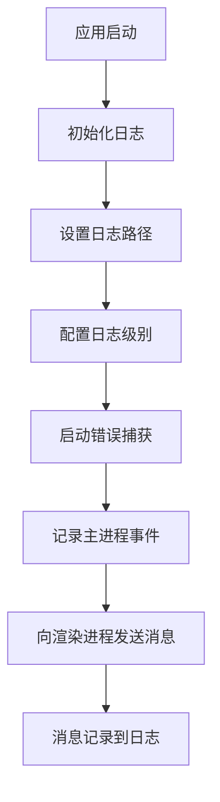

# 主进程调试

<cite>
**本文档中引用的文件**  
- [main.ts](file://src/main.ts)
- [inversify.config.ts](file://src/backend/ioc/inversify.config.ts)
- [forge.config.ts](file://forge.config.ts)
- [logger.ts](file://src/backend/ioc/logger.ts)
- [dispatcher.ts](file://src/backend/dispatcher.ts)
- [package.json](file://package.json)
</cite>

## 目录
1. [简介](#简介)
2. [主进程调试方法](#主进程调试方法)
3. [VS Code 调试配置](#vs-code-调试配置)
4. [依赖注入容器状态检查](#依赖注入容器状态检查)
5. [应用生命周期事件跟踪](#应用生命周期事件跟踪)
6. [结合初始化逻辑的启动流程跟踪](#结合初始化逻辑的启动流程跟踪)
7. [使用 electron-log 记录关键状态](#使用-electron-log-记录关键状态)

## 简介
本文档详细说明如何调试 Electron 应用的主进程。通过分析 DashPlayer 项目的代码结构，介绍如何使用 `--inspect` 或 `--inspect-brk` 参数启动应用，并通过 Chrome DevTools 或 VS Code 调试器附加到主进程。同时，指导如何检查 InversifyJS 依赖注入容器的状态、服务注册情况以及应用生命周期事件的执行流程。

## 主进程调试方法
要调试 Electron 主进程，需要在启动应用时添加 `--inspect` 或 `--inspect-brk` 参数：

- `--inspect`：允许调试器连接，程序正常运行
- `--inspect-brk`：在第一行代码处暂停，等待调试器连接

对于本项目，可通过修改 `package.json` 中的启动脚本或直接在命令行中添加参数来启用调试模式。主进程入口文件为 `src/main.ts`，该文件负责初始化应用窗口、注册协议处理程序和调用后端服务。

**Section sources**
- [main.ts](file://src/main.ts#L1-L98)
- [package.json](file://package.json#L10-L15)

## VS Code 调试配置
在 `.vscode/launch.json` 中配置以下内容以调试主进程：

```json
{
  "version": "0.2.0",
  "configurations": [
    {
      "name": "Debug Main Process",
      "type": "node",
      "request": "launch",
      "runtimeExecutable": "yarn",
      "runtimeArgs": [
        "start"
      ],
      "cwd": "${workspaceFolder}",
      "env": {
        "ELECTRON_ENABLE_LOGGING": "true"
      },
      "autoAttachChildProcesses": true,
      "outputCapture": "std",
      "sourceMaps": true,
      "protocol": "inspector",
      "console": "integratedTerminal"
    }
  ]
}
```

关键配置说明：
- `runtimeExecutable`: 设置为 "yarn" 以使用 yarn 启动
- `runtimeArgs`: 包含启动命令 "start"
- `cwd`: 工作目录设置为项目根目录
- 调试器将自动附加到 Electron 主进程

**Section sources**
- [forge.config.ts](file://forge.config.ts#L46-L91)
- [package.json](file://package.json#L10-L15)

## 依赖注入容器状态检查
本项目使用 InversifyJS 实现依赖注入，容器配置位于 `src/backend/ioc/inversify.config.ts`。通过调试器可以检查容器中注册的服务实例及其生命周期。

依赖注入容器初始化流程：
1. 创建 Inversify 容器实例
2. 绑定客户端提供者（YouDao、Tencent、OpenAI）
3. 注册所有控制器（Controller）
4. 注册所有服务（Service）

在调试过程中，可以检查 `container` 对象，查看已注册的绑定和服务实例。每个服务都配置为单例作用域（`inSingletonScope()`），确保在整个应用生命周期中只存在一个实例。



**Diagram sources**
- [inversify.config.ts](file://src/backend/ioc/inversify.config.ts#L1-L108)
- [types.ts](file://src/backend/ioc/types.ts)

**Section sources**
- [inversify.config.ts](file://src/backend/ioc/inversify.config.ts#L1-L108)

## 应用生命周期事件跟踪
Electron 应用的生命周期由 `app` 模块管理，主要事件在 `src/main.ts` 中注册：

- `app.on('ready')`：应用初始化完成，准备创建浏览器窗口
- `app.on('window-all-closed')`：所有窗口关闭时退出应用（macOS 除外）
- `app.on('activate')`：应用激活时重新创建窗口（macOS）

在调试模式下，可以在这些事件处理函数中设置断点，逐步跟踪应用的启动和关闭流程。特别是 `app.on('ready')` 事件，它触发了数据库迁移、任务取消和窗口创建等关键操作。



**Diagram sources**
- [main.ts](file://src/main.ts#L50-L97)

**Section sources**
- [main.ts](file://src/main.ts#L50-L97)
- [migrate.ts](file://src/backend/db/migrate.ts#L10-L19)
- [DpTaskServiceImpl.ts](file://src/backend/services/impl/DpTaskServiceImpl.ts#L176-L185)

## 结合初始化逻辑的启动流程跟踪
应用启动流程从 `src/main.ts` 的 `app.on('ready')` 事件开始，具体步骤如下：

1. 执行数据库迁移 (`runMigrate`)
2. 取消所有进行中的任务 (`DpTaskServiceImpl.cancelAll`)
3. 创建主窗口 (`createWindow`)
4. 注册自定义协议处理器
5. 注册所有控制器路由 (`registerHandler`)

在调试器中，可以通过单步执行跟踪整个初始化过程。重点关注 `registerHandler` 函数，它从 Inversify 容器获取所有控制器并注册其路由，这是前后端通信的关键环节。

**Section sources**
- [main.ts](file://src/main.ts#L50-L97)
- [dispatcher.ts](file://src/backend/dispatcher.ts#L6-L12)
- [inversify.config.ts](file://src/backend/ioc/inversify.config.ts)

## 使用 electron-log 记录关键状态
本项目使用 `electron-log` 进行日志记录，配置位于 `src/backend/ioc/logger.ts`。日志文件存储在用户数据目录的 logs 子目录中，文件名为 `main.log`。

日志配置特点：
- 初始化时启用预加载日志
- 设置文件传输级别为 "info"
- 自定义日志文件路径
- 启用错误处理捕获

在调试过程中，可以通过查看日志文件来验证应用状态。例如，在 `SystemServiceImpl` 中通过 `sendErrorToRenderer` 和 `sendInfoToRenderer` 方法向渲染进程发送消息，这些消息也会被记录到日志中。



**Diagram sources**
- [logger.ts](file://src/backend/ioc/logger.ts#L1-L19)

**Section sources**
- [logger.ts](file://src/backend/ioc/logger.ts#L1-L19)
- [SystemServiceImpl.ts](file://src/backend/services/impl/SystemServiceImpl.ts#L56-L84)