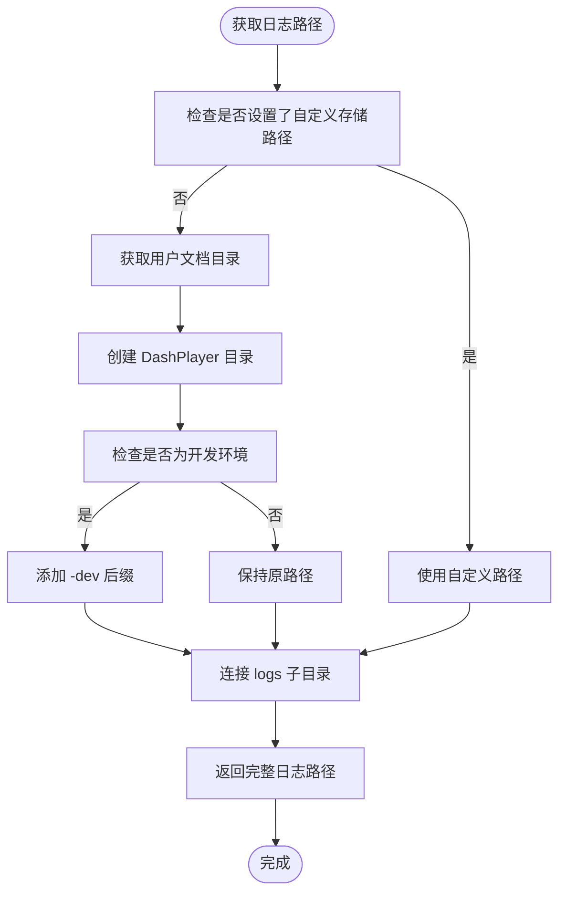
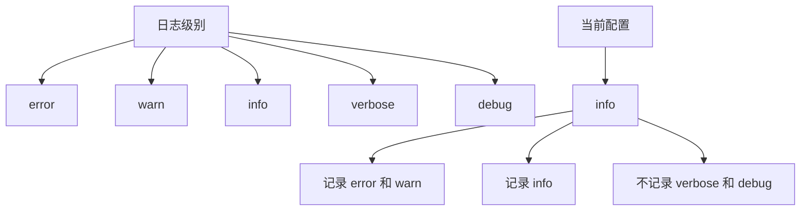
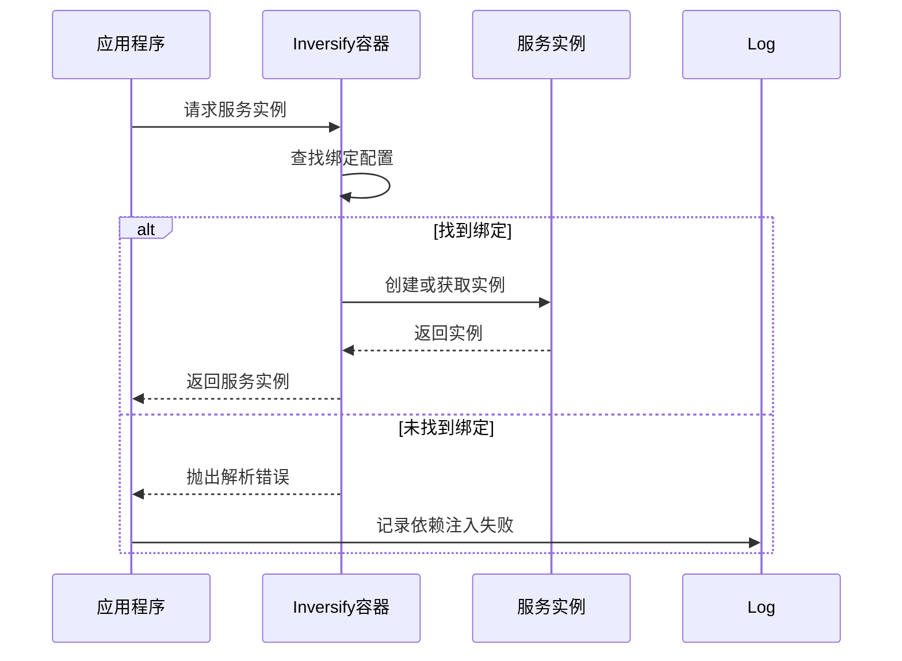
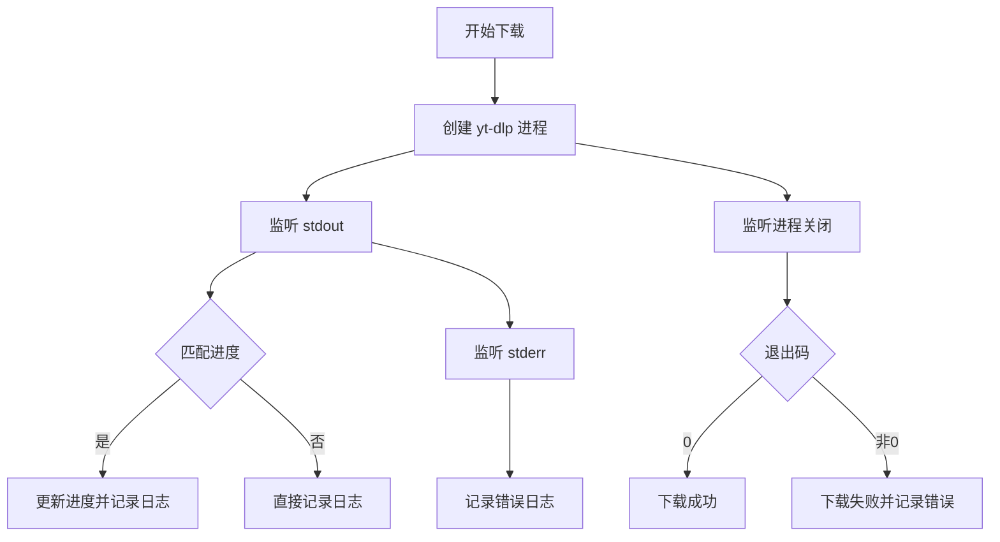
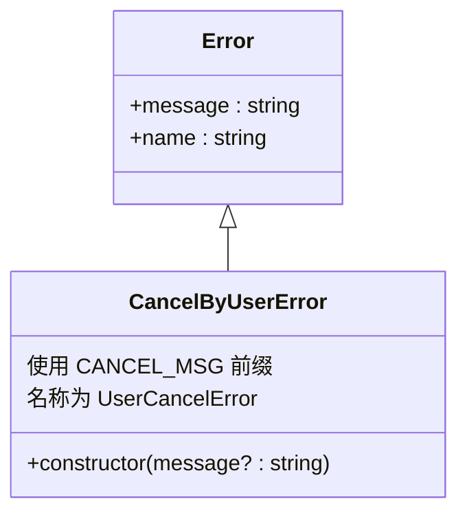

# 日志查看与常见错误排查

<cite>
**本文档引用的文件**   
- [logger.ts](file://src/backend/ioc/logger.ts)
- [CancelByUserError.ts](file://src/backend/errors/CancelByUserError.ts)
- [error-constants.ts](file://src/common/constants/error-constants.ts)
- [DlpDownloadVideo.ts](file://src/backend/objs/dl-video/DlpDownloadVideo.ts)
- [FfmpegServiceImpl.ts](file://src/backend/services/impl/FfmpegServiceImpl.ts)
- [OpenAiWhisperRequest.ts](file://src/backend/objs/OpenAiWhisperRequest.ts)
- [inversify.config.ts](file://src/backend/ioc/inversify.config.ts)
- [LocationUtil.ts](file://src/backend/utils/LocationUtil.ts)
</cite>

## 目录
1. [日志系统概述](#日志系统概述)
2. [日志文件存储路径](#日志文件存储路径)
3. [日志级别配置](#日志级别配置)
4. [典型问题排查](#典型问题排查)
5. [自定义错误识别](#自定义错误识别)
6. [常见错误代码速查表](#常见错误代码速查表)

## 日志系统概述

本项目采用 `electron-log` 作为核心日志框架，为应用程序提供结构化的日志记录功能。日志系统在应用启动时通过 `log.initialize({ preload: true })` 初始化，并与 Electron 的预加载机制集成，确保主进程和渲染进程都能有效记录运行时信息。

日志系统的主要职责包括：
- 记录应用程序的启动、运行和关闭过程
- 捕获并记录未处理的异常和错误
- 记录关键业务操作的执行流程
- 提供调试信息以支持问题诊断

日志系统通过依赖注入容器（Inversify）进行管理，所有需要记录日志的组件都通过注入 `dpLog` 实例来使用日志功能。

**Section sources**
- [logger.ts](file://src/backend/ioc/logger.ts#L1-L18)
- [inversify.config.ts](file://src/backend/ioc/inversify.config.ts#L1-L109)

## 日志文件存储路径

日志文件的存储路径由 `LocationUtil` 工具类动态确定，遵循以下规则：

1. 基础路径默认位于用户文档目录下的 `DashPlayer` 文件夹中
2. 在开发环境下，路径末尾会自动添加 `-dev` 后缀以区分开发和生产环境
3. 日志文件具体存储在基础路径下的 `logs` 子目录中
4. 主日志文件命名为 `main.log`

路径生成逻辑通过 `LocationUtil.staticGetStoragePath(LocationType.LOGS)` 方法实现，该方法首先检查用户是否已自定义存储路径，如果未设置则使用默认的文档目录路径。



**Diagram sources **
- [LocationUtil.ts](file://src/backend/utils/LocationUtil.ts#L6-L34)
- [logger.ts](file://src/backend/ioc/logger.ts#L10-L13)

**Section sources**
- [LocationUtil.ts](file://src/backend/utils/LocationUtil.ts#L6-L34)
- [logger.ts](file://src/backend/ioc/logger.ts#L10-L13)

## 日志级别配置

日志级别在 `logger.ts` 文件中进行配置，当前系统设置如下：

- **文件传输级别（file.level）**: `info`
- **日志文件路径解析函数**: 指向 `logs/main.log`
- **错误处理器**: 已启用，可捕获未处理的异常

日志级别决定了哪些类型的日志消息会被写入文件。当前配置为 `info` 级别，意味着以下级别的日志会被记录：
- `error`: 错误信息，表示应用程序遇到了问题
- `warn`: 警告信息，表示潜在的问题
- `info`: 一般信息，用于记录应用程序的正常运行状态
- `verbose`: 详细信息，用于调试
- `debug`: 调试信息，最详细的日志级别

开发者可以通过修改 `log.transports.file.level` 的值来调整日志级别。例如，设置为 `debug` 可以获得更详细的调试信息，而设置为 `error` 则只记录严重错误。



**Diagram sources **
- [logger.ts](file://src/backend/ioc/logger.ts#L14-L16)

**Section sources**
- [logger.ts](file://src/backend/ioc/logger.ts#L14-L16)

## 典型问题排查

### 依赖注入失败

当 Inversify 容器无法解析依赖时，通常会抛出相关错误。这类问题可以通过检查日志中的依赖注入初始化过程来诊断。在 `inversify.config.ts` 中，所有服务和控制器都通过容器进行绑定和注册。



**Diagram sources **
- [inversify.config.ts](file://src/backend/ioc/inversify.config.ts#L1-L109)

**Section sources**
- [inversify.config.ts](file://src/backend/ioc/inversify.config.ts#L1-L109)

### 数据库连接异常

数据库连接由 `db.ts` 文件管理，使用 Better SQLite3 驱动。常见的数据库问题包括：
- 数据库文件路径不存在
- 文件权限问题
- 数据库文件损坏

日志中会记录数据库初始化过程，包括文件路径的生成和数据库连接的建立。如果出现连接异常，通常会在日志中看到与文件系统操作相关的错误信息。

**Section sources**
- [db.ts](file://src/backend/db/db.ts#L1-L62)

### AI API 调用超时

AI API 调用超时问题主要发生在 `OpenAiWhisperRequest` 类中。该类负责与 OpenAI 的 Whisper API 进行通信。超时可能由以下原因引起：
- 网络连接不稳定
- API 服务器响应缓慢
- 音频文件过大

在 `OpenAiWhisperRequest` 的 `invoke` 方法中，使用了 `AbortController` 来支持取消操作，这也可以用于处理超时情况。

**Section sources**
- [OpenAiWhisperRequest.ts](file://src/backend/objs/OpenAiWhisperRequest.ts#L35-L93)

### 视频下载任务卡住

视频下载功能由 `DlpDownloadVideo` 类实现，使用 yt-dlp 工具进行实际的下载操作。任务卡住的常见原因包括：
- 网络连接中断
- 目标服务器限制
- 下载链接失效

`DlpDownloadVideo` 类通过监听 yt-dlp 进程的输出来更新下载进度，并将相关信息记录到日志中。如果任务卡住，日志中通常会显示最后的下载进度和最近的输出信息。



**Diagram sources **
- [DlpDownloadVideo.ts](file://src/backend/objs/dl-video/DlpDownloadVideo.ts#L9-L101)

**Section sources**
- [DlpDownloadVideo.ts](file://src/backend/objs/dl-video/DlpDownloadVideo.ts#L9-L101)

## 自定义错误识别

### CancelByUserError 错误

`CancelByUserError` 是一个自定义错误类，用于表示用户主动取消操作。该错误在以下场景中被抛出：
- 用户点击取消按钮中断视频下载
- 用户取消 FFmpeg 处理任务
- 手动中断 AI 服务调用



**Diagram sources **
- [CancelByUserError.ts](file://src/backend/errors/CancelByUserError.ts#L3-L8)
- [error-constants.ts](file://src/common/constants/error-constants.ts#L3-L10)

**Section sources**
- [CancelByUserError.ts](file://src/backend/errors/CancelByUserError.ts#L3-L8)
- [error-constants.ts](file://src/common/constants/error-constants.ts#L3-L10)

### 错误识别方法

从日志中识别 `CancelByUserError` 的关键是检查错误消息是否包含 `dp-用户取消` 前缀。此外，系统还通过 `isErrorCancel` 函数来判断错误是否为用户取消操作：

```typescript
function isErrorCancel(e: unknown): boolean {
  return e instanceof Error &&(e.message === ErrorConstants.CANCEL_MSG || e.message === 'ffmpeg was killed with signal SIGKILL');
}
```

在 `FfmpegServiceImpl` 中，当检测到 `ffmpeg was killed with signal SIGKILL` 时，会将其转换为 `CancelByUserError`，确保所有用户取消操作都有统一的错误表示。

**Section sources**
- [error-constants.ts](file://src/common/constants/error-constants.ts#L9-L11)
- [FfmpegServiceImpl.ts](file://src/backend/services/impl/FfmpegServiceImpl.ts#L358-L388)

## 常见错误代码速查表

| 错误代码/消息 | 含义 | 可能原因 | 解决方案 |
|--------------|------|----------|----------|
| dp-用户取消 | 用户主动取消操作 | 点击取消按钮 | 无需处理，正常流程 |
| ffmpeg was killed with signal SIGKILL | FFmpeg 进程被终止 | 用户取消或系统中断 | 检查用户操作意图 |
| child process exited with code 非0 | 子进程异常退出 | 工具执行失败 | 检查相关工具配置 |
| Invalid response from OpenAI | OpenAI 响应格式错误 | API 变更或网络问题 | 检查 API 文档和网络 |
| Cache not found | 缓存未找到 | 数据未预加载或清理 | 重新加载相关数据 |
| Clip already exists | 视频片段已存在 | 重复创建操作 | 检查是否存在再创建 |
| yt-dlp process exited with code 非0 | yt-dlp 下载失败 | 网络或链接问题 | 检查网络和视频链接 |

**Section sources**
- [error-constants.ts](file://src/common/constants/error-constants.ts#L3-L10)
- [DlpDownloadVideo.ts](file://src/backend/objs/dl-video/DlpDownloadVideo.ts#L9-L101)
- [FfmpegServiceImpl.ts](file://src/backend/services/impl/FfmpegServiceImpl.ts#L358-L388)
- [OpenAiWhisperRequest.ts](file://src/backend/objs/OpenAiWhisperRequest.ts#L35-L93)