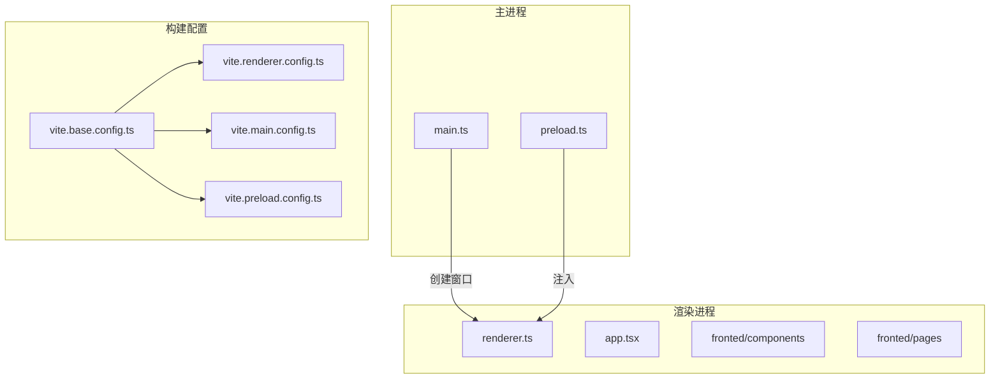
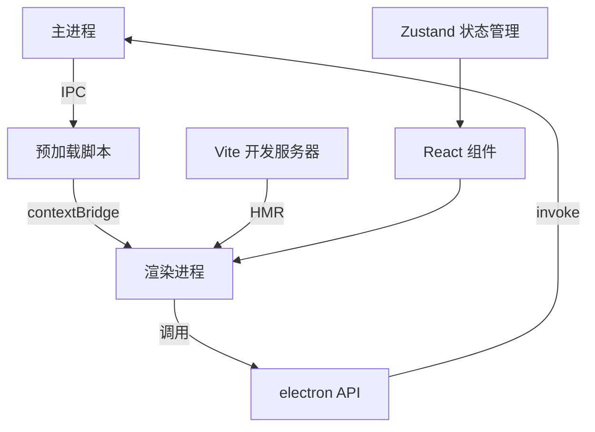
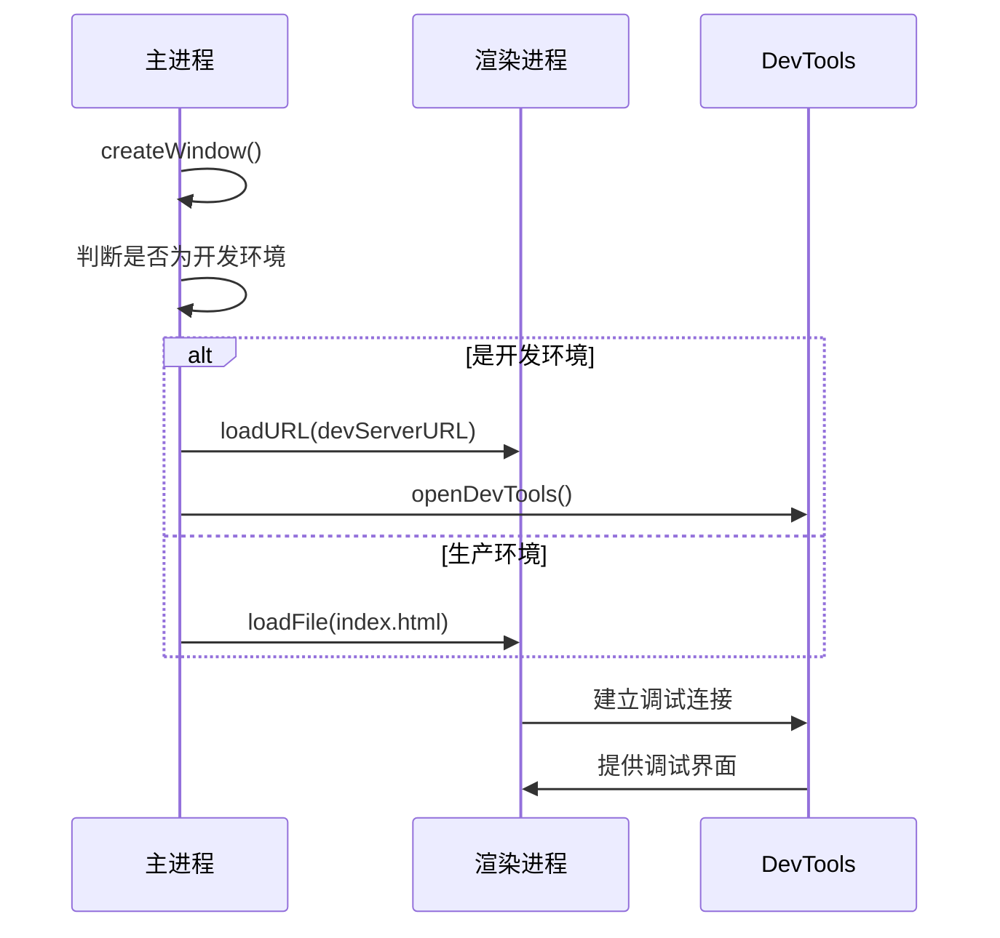
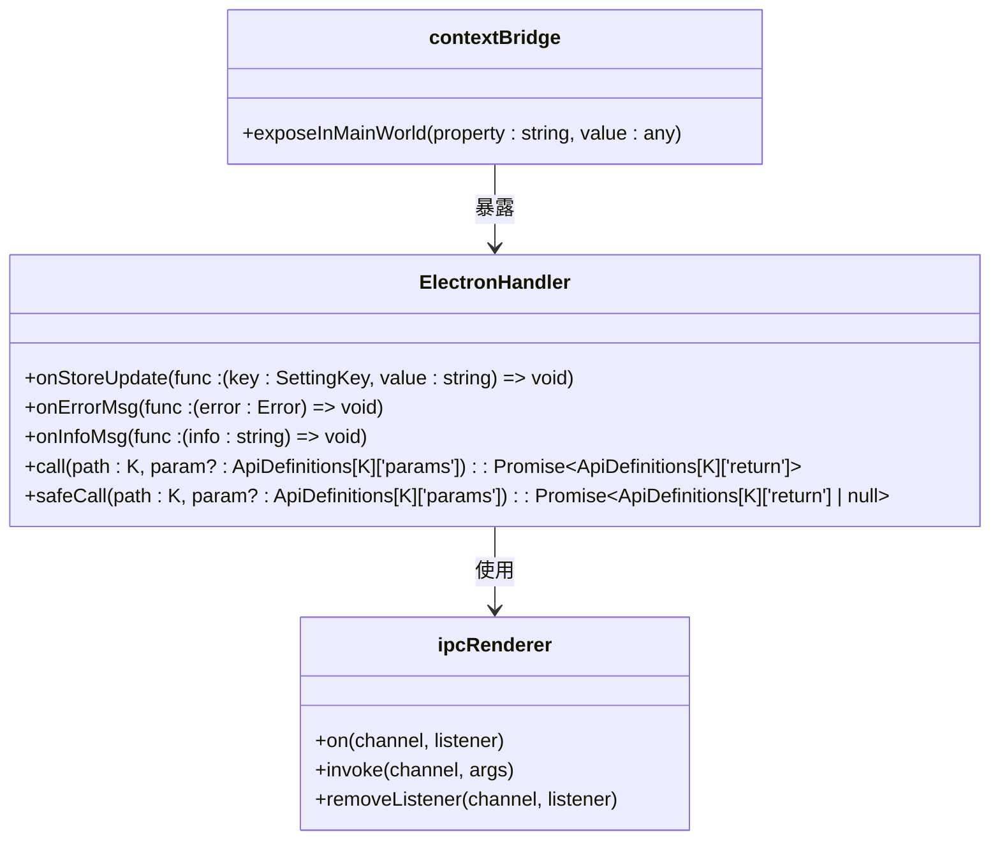
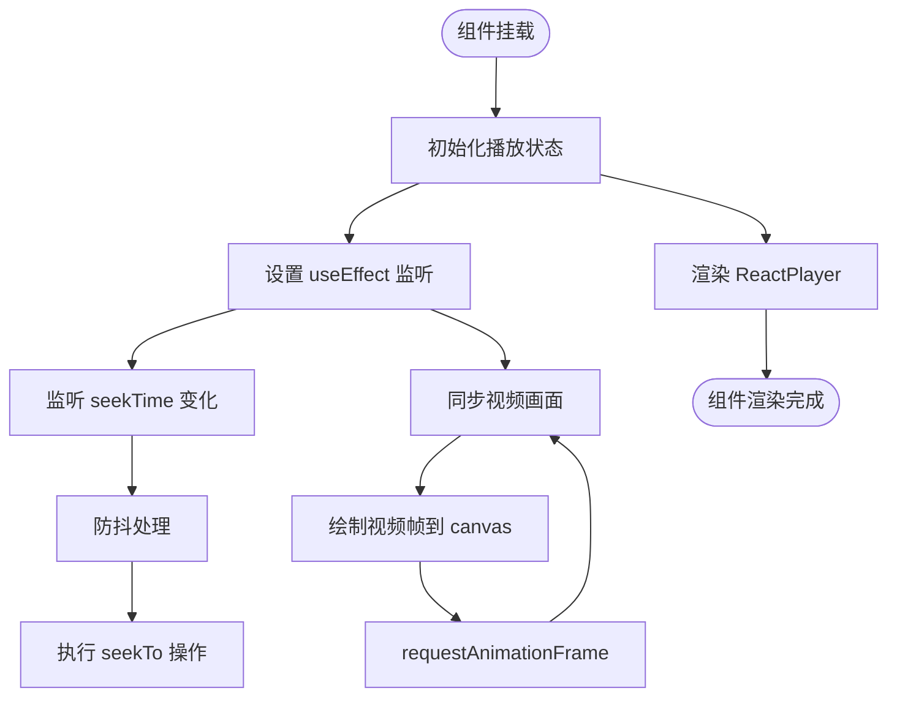
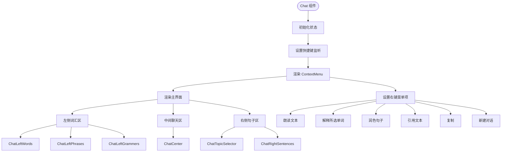

# 渲染进程调试

<cite>
**本文档中引用的文件**
- [main.ts](file://src/main.ts)
- [preload.ts](file://src/preload.ts)
- [Player.tsx](file://src/fronted/components/Player.tsx)
- [Chat.tsx](file://src/fronted/components/chat/Chat.tsx)
- [vite.base.config.ts](file://vite.base.config.ts)
- [vite.renderer.config.ts](file://vite.renderer.config.ts)
- [app.tsx](file://src/app.tsx)
</cite>

## 目录
1. [简介](#简介)
2. [项目结构](#项目结构)
3. [核心组件](#核心组件)
4. [架构概述](#架构概述)
5. [详细组件分析](#详细组件分析)
6. [依赖分析](#依赖分析)
7. [性能考虑](#性能考虑)
8. [故障排除指南](#故障排除指南)
9. [结论](#结论)

## 简介
本文档深入讲解如何在 Electron 应用中调试渲染进程。重点介绍如何在运行时打开 DevTools，利用其进行 React 组件状态检查、网络请求监控和 JavaScript 错误排查。同时解释 `preload.ts` 如何通过 `contextBridge` 暴露 Node.js API 给渲染进程，并指导开发者使用 `console.log`、断点调试和 React DevTools 分析前端组件（如 `Player.tsx`、`Chat.tsx`）的行为。结合 Vite 的热重载机制，说明开发过程中快速迭代与调试的实践技巧。

## 项目结构
本项目采用 Electron + Vite + React 技术栈，分为主进程（main）和渲染进程（renderer）。主进程负责创建窗口和系统级操作，渲染进程负责 UI 展示和用户交互。Vite 提供开发服务器和构建能力，支持热重载。



**Diagram sources**
- [main.ts](file://src/main.ts#L0-L98)
- [vite.base.config.ts](file://vite.base.config.ts#L0-L93)
- [vite.renderer.config.ts](file://vite.renderer.config.ts#L0-L29)

**Section sources**
- [main.ts](file://src/main.ts#L0-L98)
- [vite.base.config.ts](file://vite.base.config.ts#L0-L93)

## 核心组件
本项目的核心组件包括主窗口创建逻辑、预加载脚本、播放器组件和聊天界面组件。主进程通过 `BrowserWindow` 创建窗口并加载渲染进程内容，`preload.ts` 脚本通过 `contextBridge` 安全地暴露 IPC 通信接口。`Player.tsx` 实现视频播放功能，`Chat.tsx` 实现 AI 交互界面。

**Section sources**
- [main.ts](file://src/main.ts#L0-L98)
- [preload.ts](file://src/preload.ts#L0-L47)
- [Player.tsx](file://src/fronted/components/Player.tsx#L0-L262)
- [Chat.tsx](file://src/fronted/components/chat/Chat.tsx#L0-L197)

## 架构概述
应用采用典型的 Electron 分层架构，主进程与渲染进程通过 IPC 通信。`preload.ts` 作为桥梁，使用 `contextBridge.exposeInMainWorld` 将安全的 API 暴露给渲染进程。Vite 配置文件定义了多入口构建系统，支持主进程、渲染进程和预加载脚本的独立构建。



**Diagram sources**
- [main.ts](file://src/main.ts#L0-L98)
- [preload.ts](file://src/preload.ts#L0-L47)
- [app.tsx](file://src/app.tsx#L0-L131)

## 详细组件分析

### 渲染进程调试方法
在 Electron 应用中，调试渲染进程是开发的关键环节。通过启用 DevTools，开发者可以实时检查 React 组件状态、监控网络请求并排查 JavaScript 错误。

#### DevTools 启用机制
在 `main.ts` 中，当应用处于开发模式时，会自动调用 `webContents.openDevTools()` 方法打开开发者工具。这是调试渲染进程的第一步。



**Diagram sources**
- [main.ts](file://src/main.ts#L50-L55)

**Section sources**
- [main.ts](file://src/main.ts#L50-L55)

### preload.ts 通信机制
`preload.ts` 文件通过 `contextBridge` 安全地将主进程能力暴露给渲染进程，避免直接暴露 Node.js API 带来的安全风险。

#### contextBridge 通信分析
`preload.ts` 定义了 `electronHandler` 对象，通过 `contextBridge.exposeInMainWorld('electron', electronHandler)` 将其暴露给渲染进程。该对象包含事件监听和异步调用方法。



**Diagram sources**
- [preload.ts](file://src/preload.ts#L0-L47)

**Section sources**
- [preload.ts](file://src/preload.ts#L0-L47)

### 前端组件调试实践
在渲染进程中，可以使用多种工具和技术来调试 React 组件行为。

#### Player.tsx 组件分析
`Player.tsx` 组件使用 `usePlayerController` Hook 管理播放状态，并通过 `window.electron` 调用后端 API。调试时可检查状态变化和 API 调用。



**Diagram sources**
- [Player.tsx](file://src/fronted/components/Player.tsx#L0-L262)

**Section sources**
- [Player.tsx](file://src/fronted/components/Player.tsx#L0-L262)

#### Chat.tsx 组件分析
`Chat.tsx` 组件使用 Framer Motion 实现动画效果，并通过 ContextMenu 提供右键菜单功能。调试时可检查动画状态和事件处理。



**Diagram sources**
- [Chat.tsx](file://src/fronted/components/chat/Chat.tsx#L0-L197)

**Section sources**
- [Chat.tsx](file://src/fronted/components/chat/Chat.tsx#L0-L197)

## 依赖分析
项目依赖关系清晰，主进程依赖 Electron 核心模块，渲染进程依赖 React 和相关 UI 库，构建系统依赖 Vite 及其插件。

```mermaid
graph TD
A[Electron 主进程] --> B[electron]
A --> C[reflect-metadata]
A --> D[hi-base32]
E[渲染进程] --> F[react]
E --> G[zustand]
E --> H[framer-motion]
E --> I[@radix-ui]
E --> J[lucide-react]
K[Vite 构建] --> L[vite]
K --> M[@vitejs/plugin-react]
K --> N[electron-forge]
B --> K
F --> E
L --> K
```

**Diagram sources**
- [package.json](file://package.json)
- [vite.base.config.ts](file://vite.base.config.ts#L0-L93)

## 性能考虑
在调试过程中需注意性能影响。`Player.tsx` 中的视频同步使用 `requestAnimationFrame` 和 `createImageBitmap` 优化性能，避免主线程阻塞。Vite 的热重载机制通过 WebSocket 实现快速更新，减少开发等待时间。

## 故障排除指南
当遇到渲染进程问题时，可按以下步骤排查：
1. 检查 DevTools 控制台是否有 JavaScript 错误
2. 验证 `preload.ts` 中的 `contextBridge` 是否正确暴露 API
3. 检查 Vite 开发服务器是否正常运行
4. 确认组件状态管理（Zustand）是否正确更新
5. 使用 `console.log` 跟踪关键函数执行

**Section sources**
- [app.tsx](file://src/app.tsx#L123-L131)
- [preload.ts](file://src/preload.ts#L0-L47)

## 结论
通过合理配置 DevTools、正确使用 `contextBridge` 进行进程间通信，并结合 Vite 的热重载功能，可以高效地调试 Electron 应用的渲染进程。掌握这些调试技巧对于开发高质量的桌面应用至关重要。