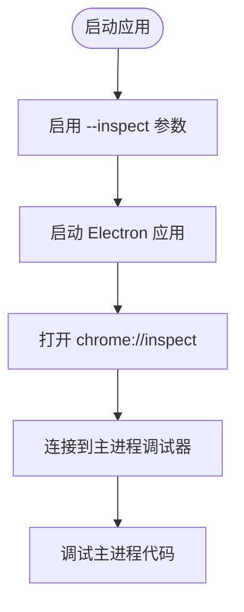
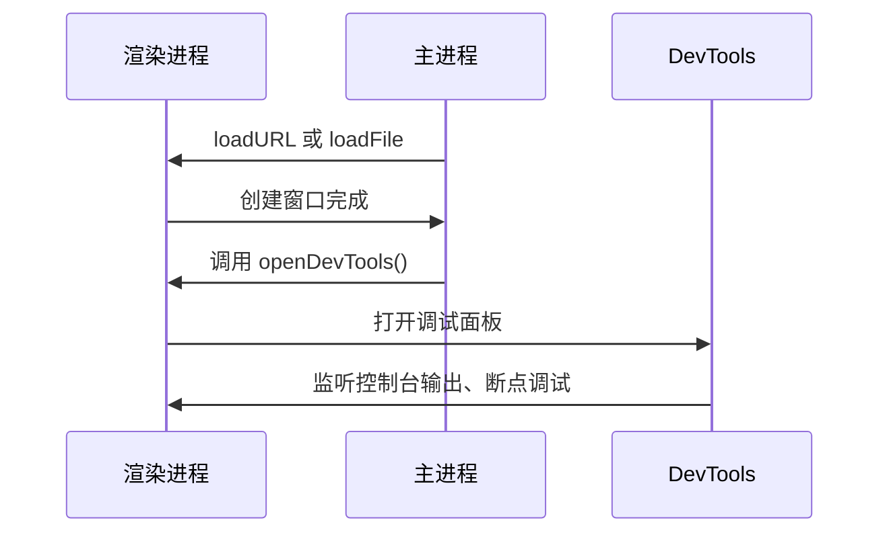
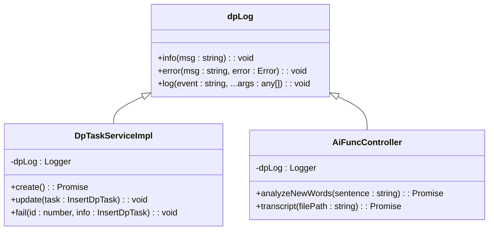
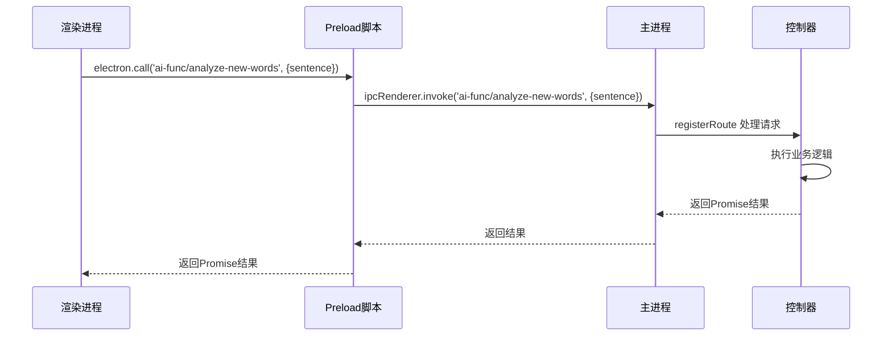
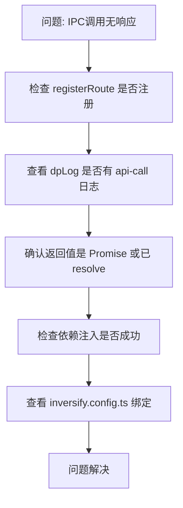

# 调试策略

<cite>
**本文档中引用的文件**  
- [main.ts](file://src/main.ts)
- [preload.ts](file://src/preload.ts)
- [renderer.ts](file://src/renderer.ts)
- [DpTaskServiceImpl.ts](file://src/backend/services/impl/DpTaskServiceImpl.ts)
- [dispatcher.ts](file://src/backend/dispatcher.ts)
- [AiFuncController.ts](file://src/backend/controllers/AiFuncController.ts)
- [register.ts](file://src/common/api/register.ts)
- [logger.ts](file://src/backend/ioc/logger.ts)
- [inversify.config.ts](file://src/backend/ioc/inversify.config.ts)
</cite>

## 目录
1. [简介](#简介)
2. [主进程调试](#主进程调试)
3. [渲染进程调试](#渲染进程调试)
4. [日志查看与管理](#日志查看与管理)
5. [VS Code 调试器配置](#vs-code-调试器配置)
6. [IPC 通信调试技巧](#ipc-通信调试技巧)
7. [常见错误排查](#常见错误排查)
8. [结论](#结论)

## 简介
本指南旨在为开发者提供一套完整的调试策略，帮助高效定位和解决 DashPlayer 项目中的问题。涵盖 Electron 主进程与渲染进程的调试方法、日志系统使用、VS Code 调试器集成、IPC 通信调试以及常见错误场景的排查思路。

**Section sources**
- [main.ts](file://src/main.ts#L1-L98)
- [renderer.ts](file://src/renderer.ts#L1-L32)

## 主进程调试
Electron 主进程运行 Node.js 环境，可通过 `--inspect` 参数启用 Chrome DevTools 进行调试。在启动应用时添加 `--inspect=9229` 参数，即可通过 `chrome://inspect` 连接调试器。主进程代码位于 `src/main.ts`，负责窗口创建、协议注册及后端服务初始化。



**Diagram sources**
- [main.ts](file://src/main.ts#L1-L98)

**Section sources**
- [main.ts](file://src/main.ts#L1-L98)

## 压缩进程调试
渲染进程即前端页面，可通过 DevTools 直接调试。在 `main.ts` 中调用 `mainWindow.webContents.openDevTools()` 可自动打开 DevTools。此外，也可通过右键菜单手动打开。渲染进程代码位于 `src/frontend`，使用 React + TypeScript 构建。



**Diagram sources**
- [main.ts](file://src/main.ts#L25-L30)

**Section sources**
- [main.ts](file://src/main.ts#L25-L30)
- [renderer.ts](file://src/renderer.ts#L1-L32)

## 日志查看与管理
项目使用 `electron-log` 模块统一管理日志输出。日志实例在 `src/backend/ioc/logger.ts` 中定义为 `dpLog`，可在各服务中注入使用。日志级别包括 `info`、`error`、`log` 等，输出内容包含时间戳、日志级别和消息。

日志文件默认存储在系统应用数据目录下，路径为：
```
Windows: %APPDATA%/DashPlayer/logs/
macOS: ~/Library/Logs/DashPlayer/
Linux: ~/.config/DashPlayer/logs/
```

可通过设置环境变量或配置项调整日志级别。例如，在关键服务中使用 `dpLog.info()` 输出流程信息，在异常捕获中使用 `dpLog.error()` 记录错误堆栈。



**Diagram sources**
- [logger.ts](file://src/backend/ioc/logger.ts#L16)
- [DpTaskServiceImpl.ts](file://src/backend/services/impl/DpTaskServiceImpl.ts#L13-L192)
- [AiFuncController.ts](file://src/backend/controllers/AiFuncController.ts#L12-L129)

**Section sources**
- [logger.ts](file://src/backend/ioc/logger.ts#L16)
- [DpTaskServiceImpl.ts](file://src/backend/services/impl/DpTaskServiceImpl.ts#L13-L192)
- [AiFuncController.ts](file://src/backend/controllers/AiFuncController.ts#L12-L129)

## VS Code 调试器配置
可通过 `launch.json` 配置 VS Code 调试器附加到主进程。配置如下：

```json
{
  "version": "0.2.0",
  "configurations": [
    {
      "name": "Attach to Main Process",
      "type": "node",
      "request": "attach",
      "port": 9229,
      "cwd": "${workspaceFolder}",
      "outFiles": ["${workspaceFolder}/dist/**/*.js"],
      "resolveSourceMapLocations": [
        "${workspaceFolder}/**",
        "!${workspaceFolder}/node_modules/**"
      ]
    }
  ]
}
```

启动应用时需确保已启用 `--inspect=9229`，然后在 VS Code 中选择 "Attach to Main Process" 启动调试会话。

**Section sources**
- [main.ts](file://src/main.ts#L1-L98)

## IPC 通信调试技巧
IPC（Inter-Process Communication）是 Electron 主进程与渲染进程通信的核心机制。本项目通过 `ipcRenderer.invoke` 和 `ipcMain.handle` 实现双向通信。

### 通信流程
1. 渲染进程调用 `electron.call('api-path', params)`
2. 主进程通过 `registerRoute` 注册的处理器响应
3. 处理器执行业务逻辑并返回结果
4. 渲染进程接收 Promise 结果

### 调试方法
- 在 `src/common/api/register.ts` 中，`registerRoute` 函数已内置日志输出，可查看每次 API 调用的路径和参数。
- 使用 `dpLog.log('api-call', path, param)` 记录请求。
- 异常时通过 `dpLog.error('api-error', path, error)` 记录错误并通知前端。



**Diagram sources**
- [preload.ts](file://src/preload.ts#L1-L47)
- [register.ts](file://src/common/api/register.ts#L8-L19)
- [AiFuncController.ts](file://src/backend/controllers/AiFuncController.ts#L12-L129)

**Section sources**
- [preload.ts](file://src/preload.ts#L1-L47)
- [register.ts](file://src/common/api/register.ts#L8-L19)
- [AiFuncController.ts](file://src/backend/controllers/AiFuncController.ts#L12-L129)

## 常见错误排查
### IPC 调用无响应
- 检查 API 路径是否正确注册（`registerRoute`）
- 确认主进程服务是否已正确注入依赖（`inversify.config.ts`）
- 查看日志是否有 `api-call` 记录，确认请求是否到达
- 检查返回值是否为 Promise 或正确 resolve

### 依赖注入失败
- 确保服务类使用 `@injectable()` 装饰器
- 检查 `inversify.config.ts` 中是否已绑定该服务
- 确认注入属性使用 `@inject(TYPES.XXX)` 正确声明
- 查看容器初始化是否成功（`container.get()` 是否抛出异常）

### 任务状态不更新
- 检查 `DpTaskServiceImpl` 的 `update` 方法是否被调用
- 确认数据库更新定时器是否正常运行（`setInterval`）
- 查看日志是否有 `task X progress: Y` 输出
- 验证缓存与数据库一致性



**Diagram sources**
- [register.ts](file://src/common/api/register.ts#L8-L19)
- [inversify.config.ts](file://src/backend/ioc/inversify.config.ts#L1-L108)
- [DpTaskServiceImpl.ts](file://src/backend/services/impl/DpTaskServiceImpl.ts#L13-L192)

**Section sources**
- [register.ts](file://src/common/api/register.ts#L8-L19)
- [inversify.config.ts](file://src/backend/ioc/inversify.config.ts#L1-L108)
- [DpTaskServiceImpl.ts](file://src/backend/services/impl/DpTaskServiceImpl.ts#L13-L192)

## 结论
通过结合 `--inspect` 参数、DevTools、`electron-log` 日志系统和 VS Code 调试器，可以高效地调试 DashPlayer 的主进程和渲染进程。合理利用 IPC 通信的日志记录和依赖注入的配置检查，能够快速定位和解决常见问题。建议在开发过程中始终开启日志输出，并熟悉关键服务的调用链路，以提升调试效率。