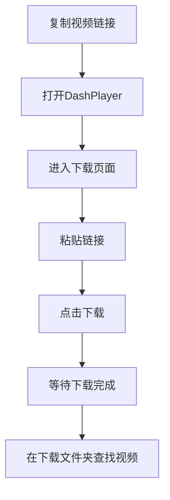
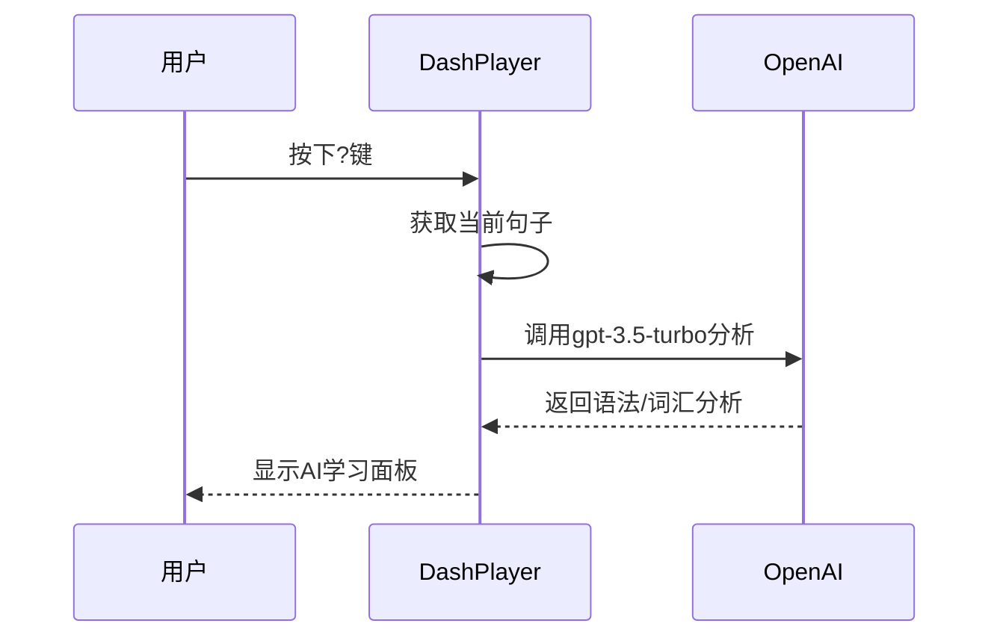

# 快速开始

<cite>
**本文档中引用的文件**  
- [README.md](file://README.md)
- [Installation.md](file://Writerside/topics/Installation.md)
- [Usage.md](file://Writerside/topics/Usage.md)
- [Config-OpenAI-API.md](file://Writerside/topics/Config-OpenAI-API.md)
- [Config-Tencent-API.md](file://Writerside/topics/Config-Tencent-API.md)
- [Config-YouDao-API.md](file://Writerside/topics/Config-YouDao-API.md)
- [Download-Video.md](file://Writerside/topics/Download-Video.md)
- [AI-Subtitles.md](file://Writerside/topics/AI-Subtitles.md)
- [AI-Chat.md](file://Writerside/topics/AI-Chat.md)
- [package.json](file://package.json)
- [DownloadVideoController.ts](file://src/backend/controllers/DownloadVideoController.ts)
- [AiTransController.ts](file://src/backend/controllers/AiTransController.ts)
</cite>

## 目录
1. [简介](#简介)
2. [安装指南](#安装指南)
3. [配置API密钥](#配置api密钥)
4. [基础使用](#基础使用)
5. [AI功能使用](#ai功能使用)
6. [常见问题排查](#常见问题排查)
7. [端到端示例](#端到端示例)
8. [开发者调试](#开发者调试)

## 简介

DashPlayer是一款专为英语学习设计的视频播放器，支持双语字幕、按字幕跳转、查词查询、蓝牙遥控操作、AI字幕生成等强大功能。本指南将指导您完成从安装到高级AI功能使用的完整流程。

**Section sources**
- [README.md](file://README.md#L1-L241)

## 安装指南

### Windows安装
1. 访问[最新发布页面](https://github.com/solidSpoon/DashPlayer/releases/latest)，下载以`.exe`结尾的安装包
2. 双击安装包进行安装
3. 若系统提示不安全，请点击`更多信息` -> `仍要运行`
4. 安装完成后即可使用

### macOS安装
1. 访问[最新发布页面](https://github.com/solidSpoon/DashPlayer/releases/latest)，根据芯片类型下载`.dmg`安装包
2. 双击安装包，将`DashPlayer`拖动到`Applications`文件夹
3. 首次打开时若提示"无法验证开发者"，请前往`系统设置` -> `隐私与安全性`，点击`仍要打开`

#### 故障排除
若遇到"已损坏，无法打开"的提示，在终端执行：
```bash
xattr -c /Applications/DashPlayer.app
```

**Section sources**
- [Installation.md](file://Writerside/topics/Installation.md#L1-L48)

## 配置API密钥

### OpenAI API配置
1. 获取OpenAI密钥（可通过第三方中转服务如[one.gptnb.me](https://one.gptnb.me/)）
2. 在DashPlayer设置界面中，进入`OpenAI设置`
3. 填入API密钥和Endpoint
4. 确保服务支持`gpt-3.5-turbo`和`whisper-1`接口

### 腾讯云API配置
1. 访问[腾讯云机器翻译](https://cloud.tencent.com/product/tmt)并登录
2. 开通付费版（前500万字符免费）
3. 进入[访问管理](https://console.cloud.tencent.com/cam/overview)，创建子账号并授权"机器翻译"权限
4. 将生成的`SecretId`和`SecretKey`填入DashPlayer设置

### 有道云API配置
1. 访问[有道智云AI开放平台](http://ai.youdao.com)注册账号
2. 创建应用，选择服务：`文本翻译`和`语音合成`
3. 在应用总览页面获取`应用ID`和`密钥`
4. 填入DashPlayer的`有道设置`中

**Section sources**
- [Config-OpenAI-API.md](file://Writerside/topics/Config-OpenAI-API.md#L1-L20)
- [Config-Tencent-API.md](file://Writerside/topics/Config-Tencent-API.md#L1-L21)
- [Config-YouDao-API.md](file://Writerside/topics/Config-YouDao-API.md#L1-L34)

## 基础使用

### 播放视频
- 使用`打开文件`按钮加载本地视频和字幕文件
- 使用`打开文件夹`按钮加载整个文件夹的视频
- 支持常见视频格式和SRT字幕文件

### 下载在线视频
1. 复制视频链接
2. 打开DashPlayer，进入`下载`页面
3. 粘贴链接并点击`下载`
4. 下载完成后可在系统下载文件夹找到视频



**Diagram sources**
- [Download-Video.md](file://Writerside/topics/Download-Video.md#L1-L16)
- [DownloadVideoController.ts](file://src/backend/controllers/DownloadVideoController.ts#L1-L36)

**Section sources**
- [Usage.md](file://Writerside/topics/Usage.md#L1-L32)

## AI功能使用

### 生成AI字幕
1. 确保已配置OpenAI密钥
2. 进入`转录`页面
3. 在文件浏览器中选择视频文件，点击`添加到转录队列`
4. 点击`转录`按钮开始生成字幕

### AI整句学习
1. 播放视频时，遇到难句按下`?`键
2. 弹出AI学习面板，显示语法、生词、词组分析
3. 可右键选择内容新建对话，深入学习
4. 支持查询单词、发音、例句等内置功能



**Diagram sources**
- [AI-Subtitles.md](file://Writerside/topics/AI-Subtitles.md#L1-L19)
- [AI-Chat.md](file://Writerside/topics/AI-Chat.md#L1-L23)
- [AiTransController.ts](file://src/backend/controllers/AiTransController.ts#L1-L26)

**Section sources**
- [AI-Subtitles.md](file://Writerside/topics/AI-Subtitles.md#L1-L19)
- [AI-Chat.md](file://Writerside/topics/AI-Chat.md#L1-L23)

## 常见问题排查

### API密钥无效
- 检查密钥是否正确复制
- 确认API服务是否支持所需接口
- 检查网络连接和代理设置

### FFmpeg未安装
- DashPlayer依赖FFmpeg处理视频
- 确保`ffmpeg-static`包已正确安装
- 检查系统环境变量

### 下载失败
- 检查网络连接
- 确认视频链接有效性
- 查看控制台错误日志

### 字幕生成失败
- 检查OpenAI配额和账单
- 确认网络代理未中断长时间连接
- 尝试重新启动应用

**Section sources**
- [README.md](file://README.md#L1-L241)
- [package.json](file://package.json#L1-L148)

## 端到端示例

### 下载YouTube视频并生成双语字幕
1. 复制YouTube视频链接
2. 在DashPlayer中进入下载页面，粘贴链接并下载
3. 配置OpenAI和腾讯云API密钥
4. 进入转录页面，将下载的视频添加到队列并转录
5. 播放视频，使用双语字幕学习
6. 遇到难句时按`?`键使用AI整句学习功能

## 开发者调试

### 开发者工具
- 按F12或右键选择"检查"打开开发者工具
- 可查看控制台日志、网络请求和性能分析

### 调试命令
```bash
# 安装依赖
npm install

# 启动开发服务器
npm run dev

# 运行测试
npm run test
```

**Section sources**
- [package.json](file://package.json#L1-L148)