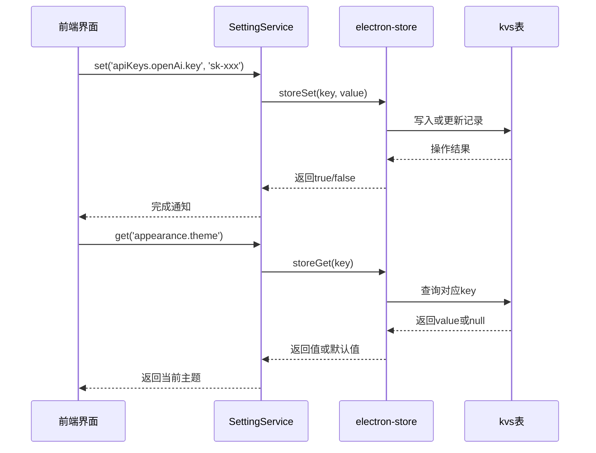
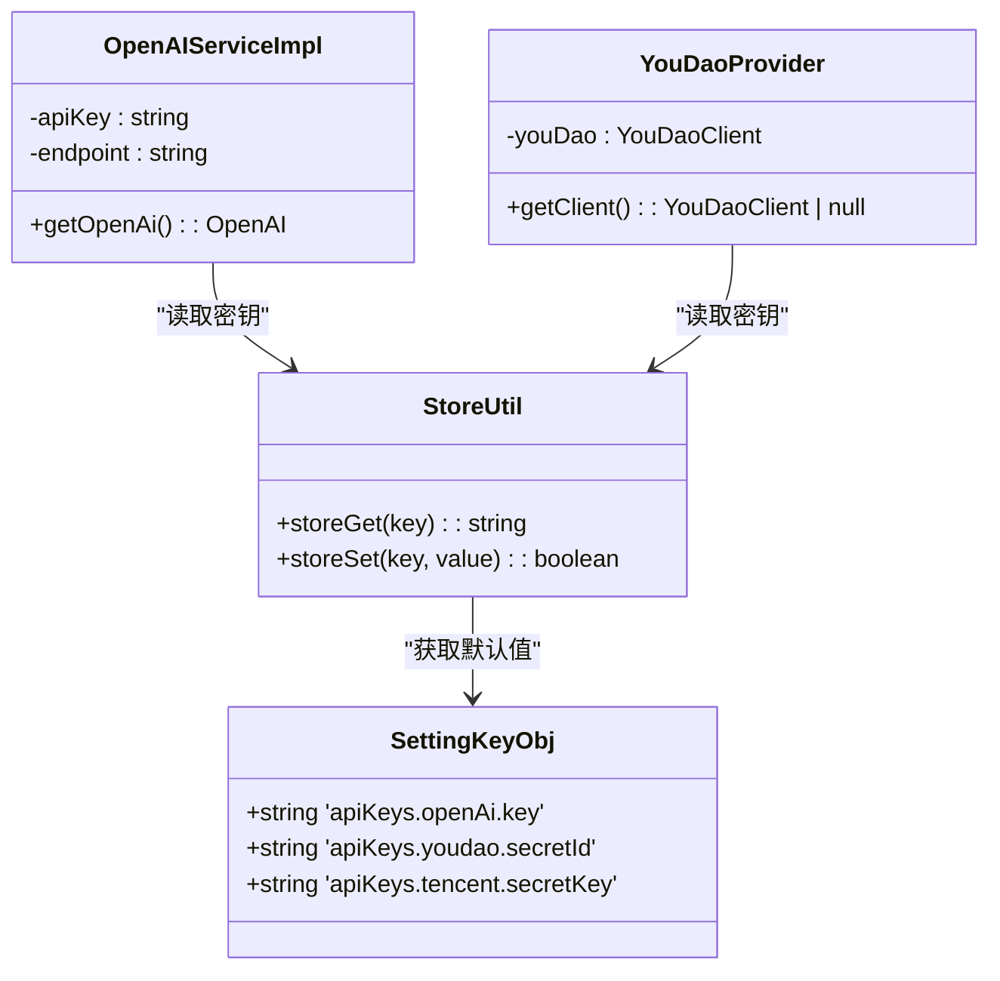
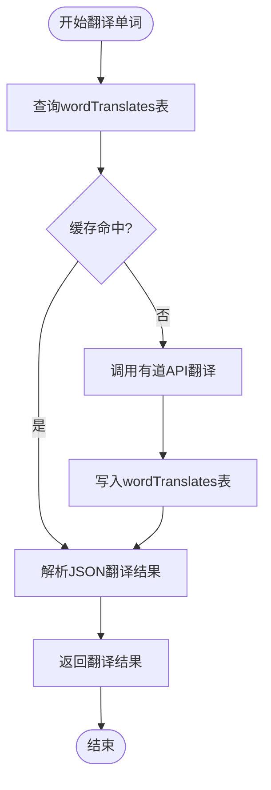

# AI与配置存储表 (kvs, wordTranslates)

<cite>
**本文档引用的文件**
- [kvs.ts](file://src/backend/db/tables/kvs.ts)
- [wordTranslates.ts](file://src/backend/db/tables/wordTranslates.ts)
- [SettingService.ts](file://src/backend/services/SettingService.ts)
- [SettingServiceImpl.ts](file://src/backend/services/impl/SettingServiceImpl.ts)
- [store.ts](file://src/backend/store.ts)
- [store_schema.ts](file://src/common/types/store_schema.ts)
- [TranslateServiceImpl.ts](file://src/backend/services/impl/TranslateServiceImpl.ts)
- [OpenAIServiceImpl.ts](file://src/backend/services/impl/OpenAIServiceImpl.ts)
- [YouDaoProvider.ts](file://src/backend/services/impl/clients/YouDaoProvider.ts)
- [sentenceTranslates.ts](file://src/backend/db/tables/sentenceTranslates.ts)
</cite>

## 目录
1. [简介](#简介)
2. [kvs表设计与用途](#kvs表设计与用途)
3. [SettingService交互机制](#settingservice交互机制)
4. [敏感信息的安全存储](#敏感信息的安全存储)
5. [wordTranslates表在AI翻译缓存中的作用](#wordtranslates表在ai翻译缓存中的作用)
6. [缓存查询与更新流程](#缓存查询与更新流程)
7. [总结](#总结)

## 简介
本文档详细说明`kvs`表作为键值存储的设计用途，用于保存系统设置、AI配置（如API密钥）、用户偏好等非结构化数据。同时解释其与`SettingService`的交互方式，以及如何保证敏感信息（如OpenAI密钥）的安全存储。此外，描述`wordTranslates`表在AI翻译结果缓存中的作用，通过减少重复调用API来降低成本并提升响应速度。

## kvs表设计与用途

`kvs`表是系统中用于持久化存储非结构化配置数据的核心表，采用简单的键值对（Key-Value Store）模型设计，适用于存储各类动态配置和用户设置。

该表结构定义于`kvs.ts`文件中，主要字段包括：
- `key`: 唯一标识配置项的字符串键名
- `value`: 存储对应配置值的文本字段
- `created_at` 和 `updated_at`: 自动维护的时间戳

此设计支持灵活扩展，无需修改表结构即可新增任意配置项，非常适合存储AI服务密钥、快捷键设置、外观主题等多样化配置。

**Section sources**
- [kvs.ts](file://src/backend/db/tables/kvs.ts#L1-L17)

## SettingService交互机制

`SettingService`是系统中负责管理所有配置读写的抽象接口，定义了`get(key)`和`set(key, value)`两个核心方法。其实现类`SettingServiceImpl`通过调用底层`store`模块完成与`kvs`表的实际交互。

当调用`set`方法时，系统会先检查新旧值是否一致，避免无效更新，并在成功写入后通知前端界面刷新相关配置。`get`方法则提供带默认值的安全读取机制，确保即使数据库中无记录也能返回合理默认值。

这种设计实现了配置管理的统一入口，便于维护和跨模块共享。

**Diagram sources**
- [SettingService.ts](file://src/backend/services/SettingService.ts#L2-L5)
- [SettingServiceImpl.ts](file://src/backend/services/impl/SettingServiceImpl.ts#L9-L21)
- [store.ts](file://src/backend/store.ts#L0-L23)

## 敏感信息的安全存储

系统通过多层机制保障敏感信息（如OpenAI、有道、腾讯API密钥）的安全存储：

1. **运行时隔离**：API密钥仅在需要时从`kvs`表读取，且不长期驻留内存。
2. **条件访问控制**：如`OpenAIServiceImpl`中所示，在调用API前会检查密钥是否存在，若为空则抛出异常，防止无效调用。
3. **客户端封装**：`YouDaoProvider`等服务在获取客户端实例时动态注入密钥，避免明文暴露。
4. **默认值保护**：`store_schema.ts`中定义的默认值为空字符串，确保未配置时不使用默认密钥。

这些措施共同确保了敏感凭证不会被意外泄露或误用。

**Diagram sources**
- [OpenAIServiceImpl.ts](file://src/backend/services/impl/OpenAIServiceImpl.ts#L7-L31)
- [YouDaoProvider.ts](file://src/backend/services/impl/clients/YouDaoProvider.ts#L7-L31)
- [store_schema.ts](file://src/common/types/store_schema.ts#L0-L37)

## wordTranslates表在AI翻译缓存中的作用

`wordTranslates`表专门用于缓存单词级别的AI翻译结果，显著降低对外部翻译API的调用频率，从而节省成本并提升响应速度。

每当用户请求翻译某个单词时，系统首先查询该表是否存在已缓存的结果。若存在且有效，则直接返回；否则发起网络请求获取翻译，并将结果持久化存储以供后续使用。

这种缓存机制特别适用于高频词汇的重复查询场景，极大提升了用户体验。

**Section sources**
- [wordTranslates.ts](file://src/backend/db/tables/wordTranslates.ts#L1-L17)
- [TranslateServiceImpl.ts](file://src/backend/services/impl/TranslateServiceImpl.ts#L18-L153)

## 缓存查询与更新流程

系统在`TranslateServiceImpl`中实现了完整的缓存读写逻辑：

1. **查询流程**：调用`wordLoad(word)`方法，根据规范化后的单词查询数据库。
2. **缓存命中**：若找到有效记录，则解析JSON格式的翻译结果并返回。
3. **缓存未命中**：调用有道客户端进行在线翻译，获取结果后通过`wordRecord()`方法写入数据库。
4. **冲突处理**：使用`onConflictDoUpdate`机制，确保同一单词的翻译记录始终最新。

此外，系统还实现了`sentenceTranslates`表用于句子级翻译缓存，采用批量加载与更新策略，进一步优化性能。

**Diagram sources**
- [TranslateServiceImpl.ts](file://src/backend/services/impl/TranslateServiceImpl.ts#L18-L153)
- [wordTranslates.ts](file://src/backend/db/tables/wordTranslates.ts#L1-L17)
- [sentenceTranslates.ts](file://src/backend/db/tables/sentenceTranslates.ts#L1-L17)

## 总结
`kvs`表作为系统的统一配置存储中心，结合`SettingService`提供了安全、高效的配置管理方案，尤其对敏感信息如AI密钥进行了有效保护。而`wordTranslates`表则通过本地缓存机制大幅减少了对外部API的依赖，提升了翻译功能的响应速度与经济性。两者共同构成了系统智能化与高性能运行的基础支撑。