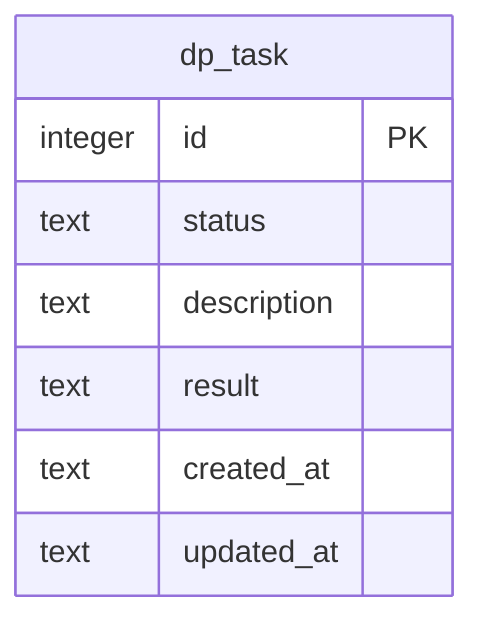
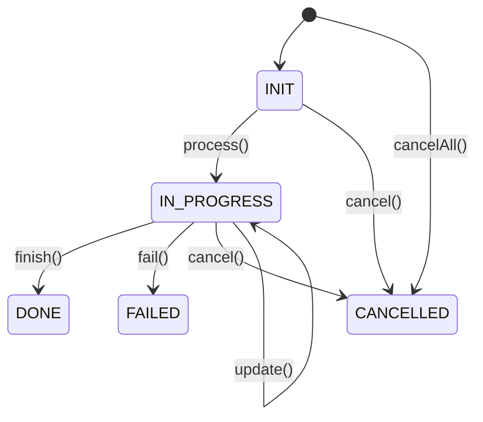
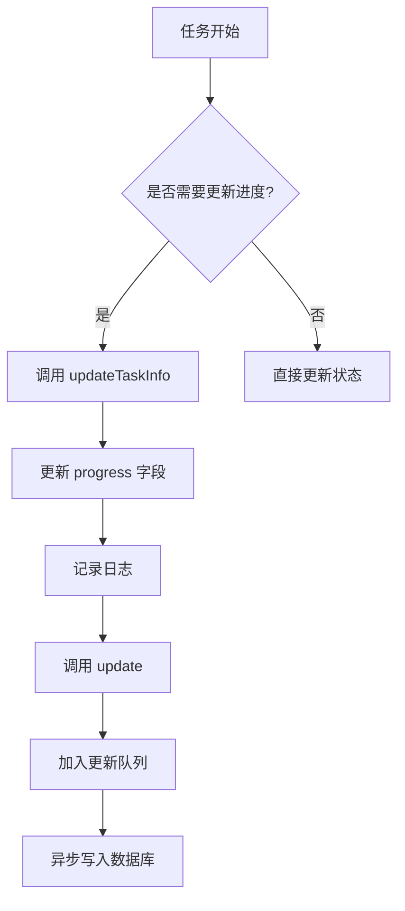
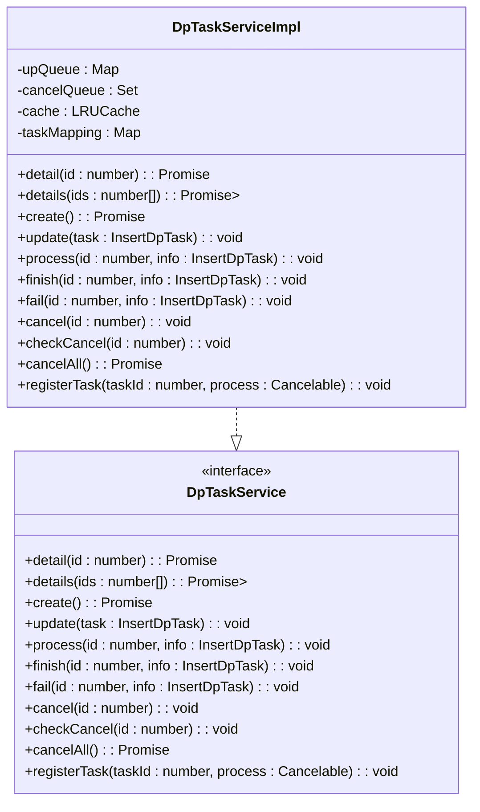
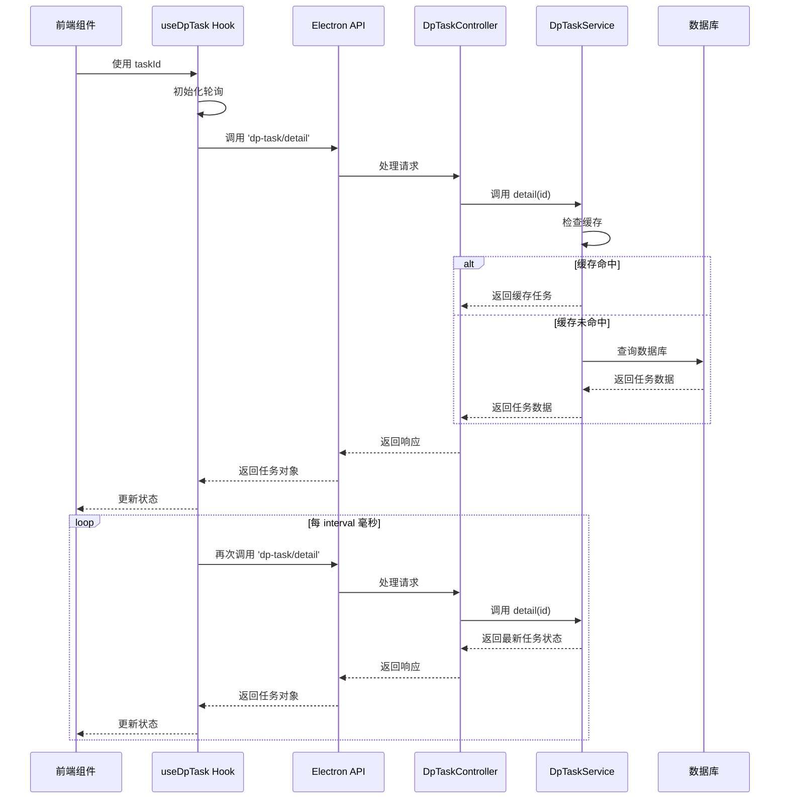

# 任务系统表 (dpTask)

<cite>
**本文档引用的文件**
- [dpTask.ts](file://src/backend/db/tables/dpTask.ts)
- [DpTaskService.ts](file://src/backend/services/DpTaskService.ts)
- [DpTaskServiceImpl.ts](file://src/backend/services/impl/DpTaskServiceImpl.ts)
- [DpTaskController.ts](file://src/backend/controllers/DpTaskController.ts)
- [useDpTask.ts](file://src/fronted/hooks/useDpTask.ts)
- [useDpTaskCenter.ts](file://src/fronted/hooks/useDpTaskCenter.ts)
</cite>

## 目录
1. [简介](#简介)
2. [表结构设计](#表结构设计)
3. [状态机设计](#状态机设计)
4. [进度跟踪机制](#进度跟踪机制)
5. [任务服务层设计](#任务服务层设计)
6. [控制器与前端集成](#控制器与前端集成)
7. [任务持久化与一致性](#任务持久化与一致性)
8. [错误处理与取消机制](#错误处理与取消机制)
9. [总结](#总结)

## 简介
`dpTask` 表是 DashPlayer 应用中异步任务处理系统的核心数据结构，负责管理各类后台任务（如下载、转码、切割等）的生命周期。该表通过状态机设计、进度跟踪和错误处理机制，实现了任务的可靠执行和状态管理。本文档详细介绍了该表的结构设计、状态流转、服务层实现以及与前后端的协同工作机制。

## 表结构设计

`dpTask` 表定义了异步任务的核心属性，采用 SQLite 数据库存储，通过 Drizzle ORM 进行类型化管理。



**表字段说明**

| 字段名 | 类型 | 约束 | 默认值 | 说明 |
|--------|------|------|--------|------|
| id | integer | 主键，自增 | - | 任务唯一标识符 |
| status | text | 非空 | 'init' | 任务当前状态 |
| progress | text | - | '任务创建成功' | 进度描述信息 |
| result | text | - | null | 任务执行结果，通常为 JSON 字符串 |
| created_at | text | 非空 | CURRENT_TIMESTAMP | 任务创建时间 |
| updated_at | text | 非空 | CURRENT_TIMESTAMP | 任务最后更新时间 |

**Diagram sources**
- [dpTask.ts](file://src/backend/db/tables/dpTask.ts#L11-L22)

**Section sources**
- [dpTask.ts](file://src/backend/db/tables/dpTask.ts#L0-L25)

## 状态机设计

`dpTask` 表通过 `DpTaskState` 枚举实现了一个完整的任务状态机，定义了任务从创建到完成或失败的完整生命周期。



**状态定义**

- **INIT ('init')**: 任务初始状态，表示任务已创建但尚未开始执行。
- **IN_PROGRESS ('in_progress')**: 任务进行中状态，表示任务正在执行。
- **DONE ('done')**: 任务完成状态，表示任务已成功执行完毕。
- **CANCELLED ('cancelled')**: 任务取消状态，表示任务被用户或系统取消。
- **FAILED ('failed')**: 任务失败状态，表示任务执行过程中发生错误。

状态流转由 `DpTaskService` 提供的方法驱动，确保了状态变更的可控性和一致性。

**Diagram sources**
- [dpTask.ts](file://src/backend/db/tables/dpTask.ts#L3-L9)

**Section sources**
- [dpTask.ts](file://src/backend/db/tables/dpTask.ts#L3-L9)
- [DpTaskServiceImpl.ts](file://src/backend/services/impl/DpTaskServiceImpl.ts#L95-L141)

## 进度跟踪机制

`dpTask` 表通过 `progress` 和 `result` 字段实现任务进度和结果的跟踪。

- **progress 字段**: 存储任务执行过程中的描述性信息，用于向用户展示当前任务的进展。例如，在下载任务中，可以显示 "已下载 50%"；在转码任务中，可以显示 "正在处理第 3 个文件"。
- **result 字段**: 存储任务执行完成后的结果数据，通常以 JSON 格式存储。前端通过解析此字段获取任务的最终输出。

`DpTaskServiceImpl` 类中的 `updateTaskInfo` 方法负责更新这两个字段，确保只有在需要时才进行更新，并记录到日志中。



**Diagram sources**
- [DpTaskServiceImpl.ts](file://src/backend/services/impl/DpTaskServiceImpl.ts#L118-L135)

**Section sources**
- [DpTaskServiceImpl.ts](file://src/backend/services/impl/DpTaskServiceImpl.ts#L118-L135)

## 任务服务层设计

`DpTaskService` 接口及其 `DpTaskServiceImpl` 实现构成了任务管理的核心服务层，提供了任务的创建、查询、更新和状态变更等操作。



**核心功能**

- **缓存机制**: 使用 LRU 缓存存储最近创建的任务，减少数据库查询压力。
- **更新队列**: 通过 `upQueue` 批量处理任务状态更新，每 3 秒异步写入数据库，提高性能。
- **取消队列**: 通过 `cancelQueue` 记录待取消任务，配合 `checkCancel` 方法实现任务取消检查。
- **任务映射**: 通过 `taskMapping` 维护任务与可取消操作的关联，确保取消操作能正确传递。

**Diagram sources**
- [DpTaskService.ts](file://src/backend/services/DpTaskService.ts#L4-L26)
- [DpTaskServiceImpl.ts](file://src/backend/services/impl/DpTaskServiceImpl.ts#L13-L192)

**Section sources**
- [DpTaskService.ts](file://src/backend/services/DpTaskService.ts#L4-L26)
- [DpTaskServiceImpl.ts](file://src/backend/services/impl/DpTaskServiceImpl.ts#L13-L192)

## 控制器与前端集成

后端通过 `DpTaskController` 暴露 REST API，前端通过 `useDpTask` 和 `useDpTaskCenter` 等 Hook 与后端进行交互。



**前端集成要点**

- **useDpTask**: 一个 React Hook，用于监听特定任务的状态变化，通过定时轮询获取最新状态。
- **useDpTaskCenter**: 一个全局状态管理器，集中管理所有任务的监听和更新，避免重复请求。
- **API 调用**: 通过 Electron 的 IPC 机制与后端通信，调用 `dp-task/detail`、`dp-task/cancel` 等接口。

**Diagram sources**
- [DpTaskController.ts](file://src/backend/controllers/DpTaskController.ts#L11-L34)
- [useDpTask.ts](file://src/fronted/hooks/useDpTask.ts#L0-L35)
- [useDpTaskCenter.ts](file://src/fronted/hooks/useDpTaskCenter.ts#L0-L39)

**Section sources**
- [DpTaskController.ts](file://src/backend/controllers/DpTaskController.ts#L11-L34)
- [useDpTask.ts](file://src/fronted/hooks/useDpTask.ts#L0-L35)
- [useDpTaskCenter.ts](file://src/fronted/hooks/useDpTaskCenter.ts#L0-L39)

## 任务持久化与一致性

`dpTask` 表通过以下机制确保任务数据的持久化和状态一致性：

1. **数据库事务**: 所有状态更新操作都通过 Drizzle ORM 的 `update` 方法执行，确保了原子性。
2. **异步批量更新**: `DpTaskServiceImpl` 使用 `upQueue` 和定时器，每 3 秒批量处理所有待更新任务，减少了数据库 I/O 次数。
3. **缓存一致性**: 在更新数据库的同时，也更新内存中的 LRU 缓存，保证了读取的一致性。
4. **时间戳更新**: 每次更新任务时，都会自动更新 `updated_at` 字段，便于追踪任务的最后活动时间。

```mermaid
flowchart LR
A[调用 update()] --> B{任务ID有效?}
B --> |否| C[直接返回]
B --> |是| D[更新缓存]
D --> E[加入 upQueue]
E --> F[定时器触发]
F --> G[遍历 upQueue]
G --> H[执行数据库更新]
H --> I[从 upQueue 移除]
I --> J[更新 updated_at]
```

**Diagram sources**
- [DpTaskServiceImpl.ts](file://src/backend/services/impl/DpTaskServiceImpl.ts#L78-L93)
- [DpTaskServiceImpl.ts](file://src/backend/services/impl/DpTaskServiceImpl.ts#L143-L155)

**Section sources**
- [DpTaskServiceImpl.ts](file://src/backend/services/impl/DpTaskServiceImpl.ts#L78-L93)
- [DpTaskServiceImpl.ts](file://src/backend/services/impl/DpTaskServiceImpl.ts#L143-L155)

## 错误处理与取消机制

系统提供了完善的错误处理和任务取消机制：

- **失败处理**: `fail()` 方法将任务状态设置为 `FAILED`，并可附带错误信息。
- **取消处理**: `cancel()` 方法将任务加入取消队列，并触发关联的可取消操作。
- **批量取消**: `cancelAll()` 方法可取消所有处于 `INIT` 或 `IN_PROGRESS` 状态的任务。
- **取消检查**: `checkCancel()` 方法在任务执行过程中检查是否被取消，若被取消则抛出 `CancelByUserError` 异常。

这些机制确保了任务可以被安全地中断，避免了资源浪费。

**Section sources**
- [DpTaskServiceImpl.ts](file://src/backend/services/impl/DpTaskServiceImpl.ts#L136-L142)
- [DpTaskServiceImpl.ts](file://src/backend/services/impl/DpTaskServiceImpl.ts#L156-L176)

## 总结

`dpTask` 表作为 DashPlayer 异步任务系统的核心，通过精心设计的表结构、状态机、服务层和前后端集成，实现了高效、可靠的任务管理。其缓存、批量更新和取消机制确保了系统的性能和用户体验。该设计模式可作为其他异步任务系统的参考范例。