# 字幕与时间轴表 (subtitleTimestampAdjustment, sentenceTranslates, words)

<cite>
**本文档引用的文件**  
- [subtitleTimestampAdjustment.ts](file://src/backend/db/tables/subtitleTimestampAdjustment.ts)
- [sentenceTranslates.ts](file://src/backend/db/tables/sentenceTranslates.ts)
- [words.ts](file://src/backend/db/tables/words.ts)
- [stems.ts](file://src/backend/db/tables/stems.ts)
- [SrtTimeAdjustServiceImpl.ts](file://src/backend/services/impl/SrtTimeAdjustServiceImpl.ts)
- [SubtitleServiceImpl.ts](file://src/backend/services/impl/SubtitleServiceImpl.ts)
- [TranslateServiceImpl.ts](file://src/backend/services/impl/TranslateServiceImpl.ts)
- [SrtTimeAdjustService.ts](file://src/backend/services/SrtTimeAdjustService.ts)
- [SubtitleService.ts](file://src/backend/services/SubtitleService.ts)
- [AiTransServiceImpl.ts](file://src/backend/services/AiTransServiceImpl.ts)
- [SrtUtil.ts](file://src/common/utils/SrtUtil.ts)
- [SentenceC.tsx](file://src/common/types/SentenceC.tsx)
- [YdRes.ts](file://src/common/types/YdRes.ts)
</cite>

## 目录
1. [引言](#引言)
2. [核心表结构设计](#核心表结构设计)
3. [时间同步机制](#时间同步机制)
4. [翻译缓存机制](#翻译缓存机制)
5. [词汇分析与词干处理](#词汇分析与词干处理)
6. [高频读写性能优化](#高频读写性能优化)
7. [数据流与协同工作](#数据流与协同工作)
8. [结论](#结论)

## 引言
本系统旨在支持AI字幕生成，核心功能包括原始字幕时间轴调整、句子翻译存储、单词解析及其词干处理。通过合理设计数据库表结构，结合缓存机制和索引优化，系统能够高效处理字幕解析、时间同步、翻译缓存和词汇分析等任务。本文档详细阐述相关表的设计原理、协同工作机制及性能优化策略。

## 核心表结构设计

### 字幕时间轴调整表 (dp_subtitle_timestamp_adjustment)
该表用于记录字幕时间轴的调整信息，支持字幕播放时的精确时间同步。

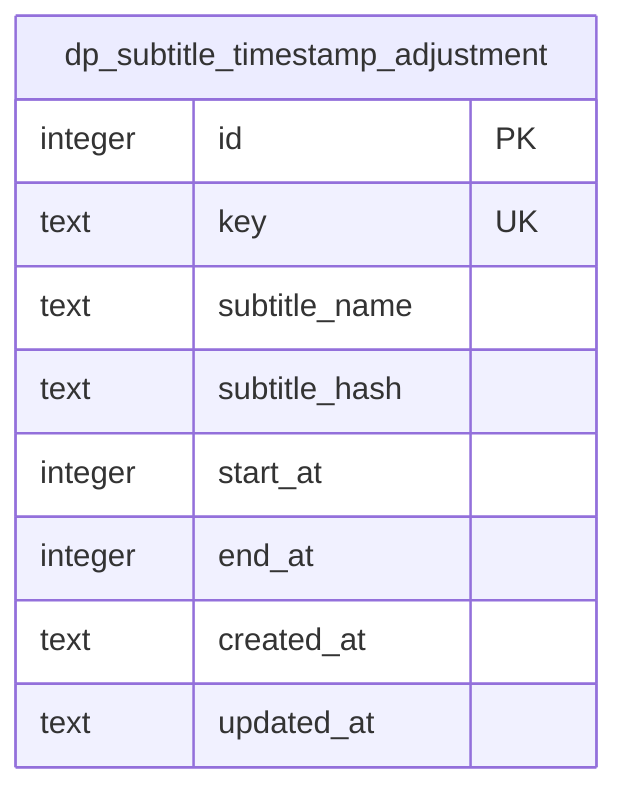

**表字段说明**：
- `id`：主键，自增整数
- `key`：唯一键，用于标识字幕条目，建立唯一索引
- `subtitle_name`：字幕文件路径（已弃用）
- `subtitle_hash`：字幕内容哈希值，用于快速查找
- `start_at`：调整后的开始时间（秒）
- `end_at`：调整后的结束时间（秒）
- `created_at`：创建时间，默认为当前时间戳
- `updated_at`：更新时间，默认为当前时间戳

**Diagram sources**  
- [subtitleTimestampAdjustment.ts](file://src/backend/db/tables/subtitleTimestampAdjustment.ts#L3-L24)

**Section sources**  
- [subtitleTimestampAdjustment.ts](file://src/backend/db/tables/subtitleTimestampAdjustment.ts#L3-L24)

### 句子翻译存储表 (dp_sentence_translates)
该表用于缓存句子翻译结果，避免重复调用翻译API，提高系统响应速度。

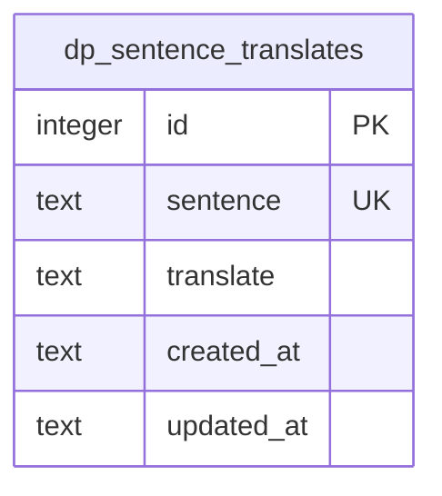

**表字段说明**：
- `id`：主键，自增整数
- `sentence`：原文句子，建立唯一索引
- `translate`：翻译结果
- `created_at`：创建时间，默认为当前时间戳
- `updated_at`：更新时间，默认为当前时间戳

**Diagram sources**  
- [sentenceTranslates.ts](file://src/backend/db/tables/sentenceTranslates.ts#L3-L13)

**Section sources**  
- [sentenceTranslates.ts](file://src/backend/db/tables/sentenceTranslates.ts#L3-L13)

### 单词解析表 (dp_words)
该表用于存储单词的解析信息，包括词干、翻译和笔记。

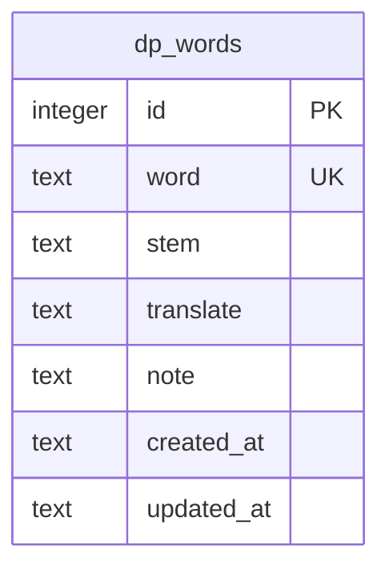

**表字段说明**：
- `id`：主键，自增整数
- `word`：单词，建立唯一索引
- `stem`：词干
- `translate`：翻译结果
- `note`：用户笔记
- `created_at`：创建时间，默认为当前时间戳
- `updated_at`：更新时间，默认为当前时间戳

**Diagram sources**  
- [words.ts](file://src/backend/db/tables/words.ts#L3-L15)

**Section sources**  
- [words.ts](file://src/backend/db/tables/words.ts#L3-L15)

### 词干表 (dp_stems)
该表用于存储词干信息，标记词干的熟悉程度。

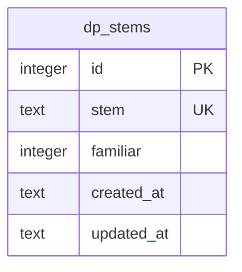

**表字段说明**：
- `id`：主键，自增整数
- `stem`：词干，建立唯一索引
- `familiar`：熟悉程度，布尔值，默认为false
- `created_at`：创建时间，默认为当前时间戳
- `updated_at`：更新时间，默认为当前时间戳

**Diagram sources**  
- [stems.ts](file://src/backend/db/tables/stems.ts#L3-L13)

**Section sources**  
- [stems.ts](file://src/backend/db/tables/stems.ts#L3-L13)

## 时间同步机制

### 时间轴调整服务
`SrtTimeAdjustService` 接口定义了时间轴调整的核心操作，包括记录、删除和查询调整信息。

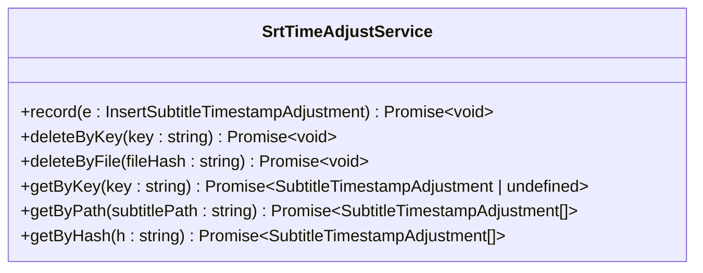

**Diagram sources**  
- [SrtTimeAdjustService.ts](file://src/backend/services/SrtTimeAdjustService.ts#L8-L45)

**Section sources**  
- [SrtTimeAdjustService.ts](file://src/backend/services/SrtTimeAdjustService.ts#L8-L45)

### 时间同步实现
`SrtTimeAdjustServiceImpl` 实现了时间轴调整服务，通过字幕内容哈希值批量获取调整信息，并与原始字幕进行映射。

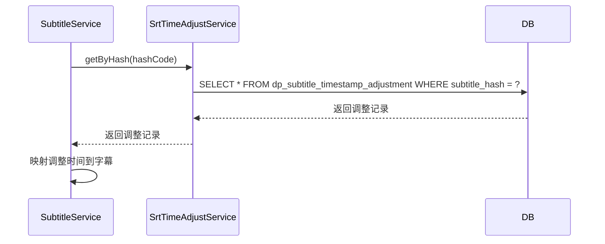

**Diagram sources**  
- [SrtTimeAdjustServiceImpl.ts](file://src/backend/services/impl/SrtTimeAdjustServiceImpl.ts#L11-L71)
- [SubtitleServiceImpl.ts](file://src/backend/services/impl/SubtitleServiceImpl.ts#L41-L116)

**Section sources**  
- [SrtTimeAdjustServiceImpl.ts](file://src/backend/services/impl/SrtTimeAdjustServiceImpl.ts#L11-L71)
- [SubtitleServiceImpl.ts](file://src/backend/services/impl/SubtitleServiceImpl.ts#L98-L115)

## 翻译缓存机制

### 翻译服务
`TranslateService` 接口定义了单词和句子翻译的核心操作。

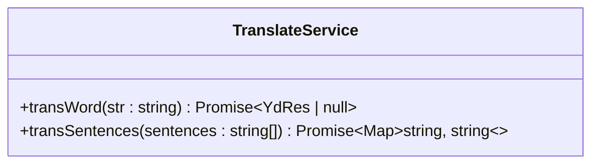

**Diagram sources**  
- [AiTransServiceImpl.ts](file://src/backend/services/AiTransServiceImpl.ts#L2-L5)

**Section sources**  
- [AiTransServiceImpl.ts](file://src/backend/services/AiTransServiceImpl.ts#L2-L5)

### 翻译缓存实现
`TranslateServiceImpl` 实现了翻译服务，通过批量查询和缓存合并机制，最大限度减少API调用。

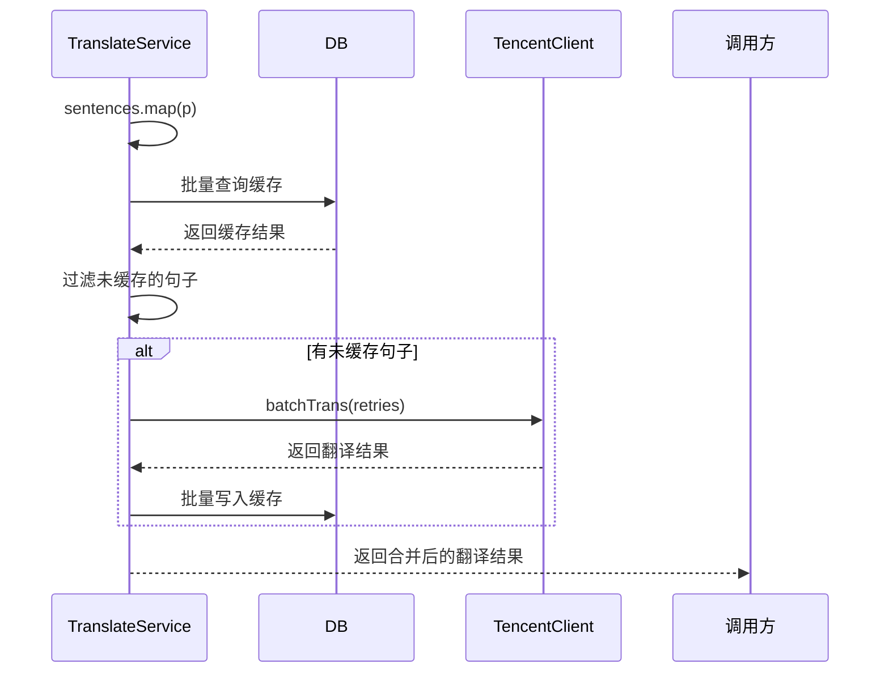

**Diagram sources**  
- [TranslateServiceImpl.ts](file://src/backend/services/impl/TranslateServiceImpl.ts#L18-L153)

**Section sources**  
- [TranslateServiceImpl.ts](file://src/backend/services/impl/TranslateServiceImpl.ts#L45-L72)
- [TranslateServiceImpl.ts](file://src/backend/services/impl/TranslateServiceImpl.ts#L112-L133)
- [TranslateServiceImpl.ts](file://src/backend/services/impl/TranslateServiceImpl.ts#L135-L152)

## 词汇分析与词干处理

### 词汇分析流程
系统在前端组件中对单词进行解析和展示，支持鼠标悬停弹出词义。

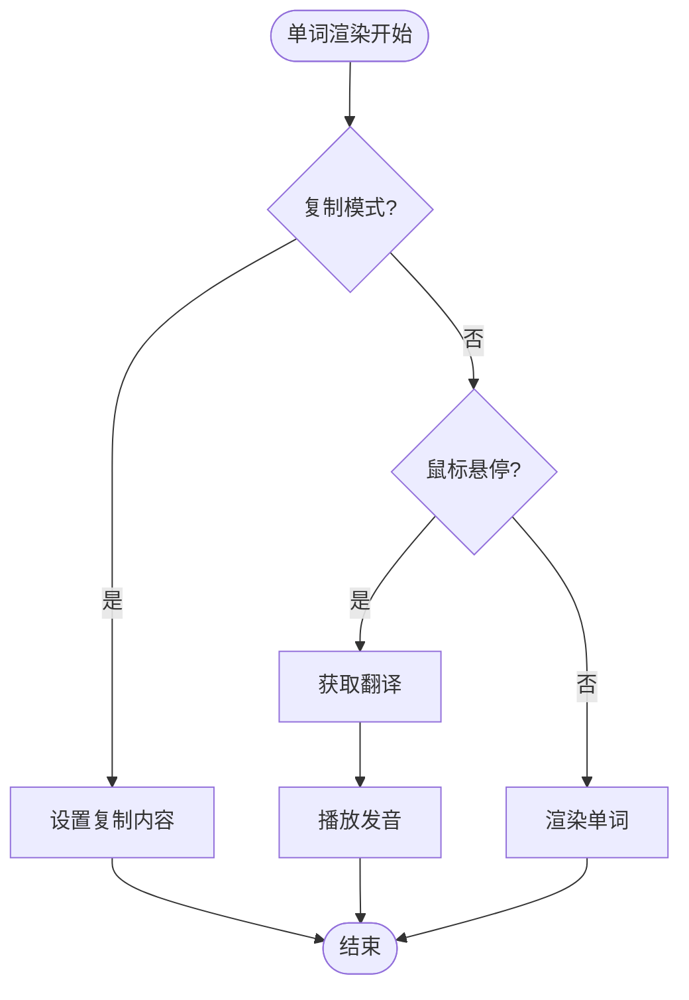

**Diagram sources**  
- [word.tsx](file://src/fronted/components/srt-cops/atoms/word.tsx#L41-L141)

**Section sources**  
- [word.tsx](file://src/fronted/components/srt-cops/atoms/word.tsx#L41-L141)

### 词干处理
词干信息存储在 `dp_stems` 表中，通过 `familiar` 字段标记词干的熟悉程度，支持个性化学习。

**Section sources**  
- [stems.ts](file://src/backend/db/tables/stems.ts#L3-L13)

## 高频读写性能优化

### 索引设计
所有核心表均在关键字段上建立了唯一索引，确保查询效率：

- `dp_subtitle_timestamp_adjustment.key`：唯一索引，用于快速定位调整记录
- `dp_sentence_translates.sentence`：唯一索引，用于快速查找翻译缓存
- `dp_words.word`：唯一索引，用于快速查找单词信息
- `dp_stems.stem`：唯一索引，用于快速查找词干信息

### 查询分页
系统采用批量查询和缓存预加载机制，避免单条记录查询的性能开销：

- 字幕解析时，通过 `subtitle_hash` 批量获取所有时间轴调整
- 句子翻译时，通过 `inArray` 批量查询缓存
- 单词查询时，通过唯一索引直接定位

### 写入优化
采用 `ON CONFLICT DO UPDATE` 机制，避免先查后写的竞争条件：

```sql
INSERT INTO dp_sentence_translates (sentence, translate) 
VALUES (?, ?) 
ON CONFLICT(sentence) DO UPDATE SET translate = ?
```

**Section sources**  
- [sentenceTranslates.ts](file://src/backend/db/tables/sentenceTranslates.ts#L3-L13)
- [subtitleTimestampAdjustment.ts](file://src/backend/db/tables/subtitleTimestampAdjustment.ts#L3-L24)

## 数据流与协同工作

### 字幕解析与时间同步流程
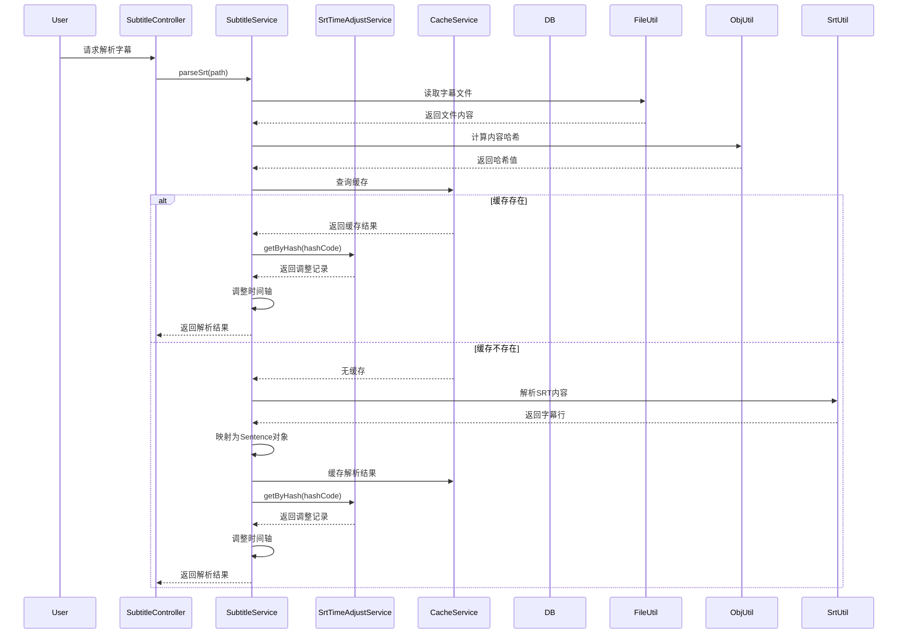

**Diagram sources**  
- [SubtitleServiceImpl.ts](file://src/backend/services/impl/SubtitleServiceImpl.ts#L49-L95)
- [SrtTimeAdjustServiceImpl.ts](file://src/backend/services/impl/SrtTimeAdjustServiceImpl.ts#L63-L70)

**Section sources**  
- [SubtitleServiceImpl.ts](file://src/backend/services/impl/SubtitleServiceImpl.ts#L49-L95)
- [SrtTimeAdjustServiceImpl.ts](file://src/backend/services/impl/SrtTimeAdjustServiceImpl.ts#L63-L70)

### 翻译请求处理流程
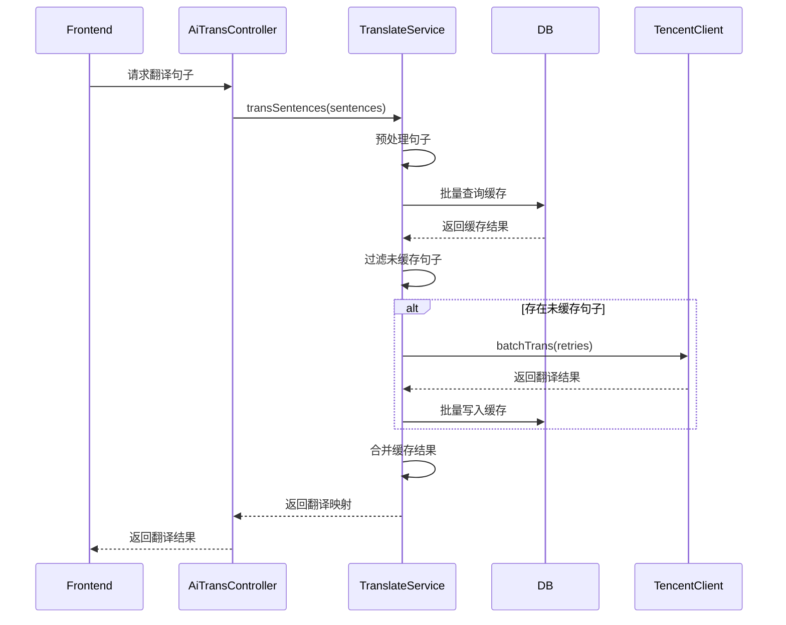

**Diagram sources**  
- [TranslateServiceImpl.ts](file://src/backend/services/impl/TranslateServiceImpl.ts#L45-L72)

**Section sources**  
- [TranslateServiceImpl.ts](file://src/backend/services/impl/TranslateServiceImpl.ts#L45-L72)

## 结论
本系统通过精心设计的数据库表结构，实现了字幕时间同步、翻译缓存和词汇分析等核心功能。`dp_subtitle_timestamp_adjustment` 表支持精确的时间轴调整，`dp_sentence_translates` 表提供高效的翻译缓存，`dp_words` 和 `dp_stems` 表支持深入的词汇分析。通过唯一索引、批量查询和冲突更新等机制，系统在高频读写场景下仍能保持良好性能。各组件通过清晰的接口定义和协同工作，共同支持AI字幕生成功能，为用户提供流畅的字幕体验。