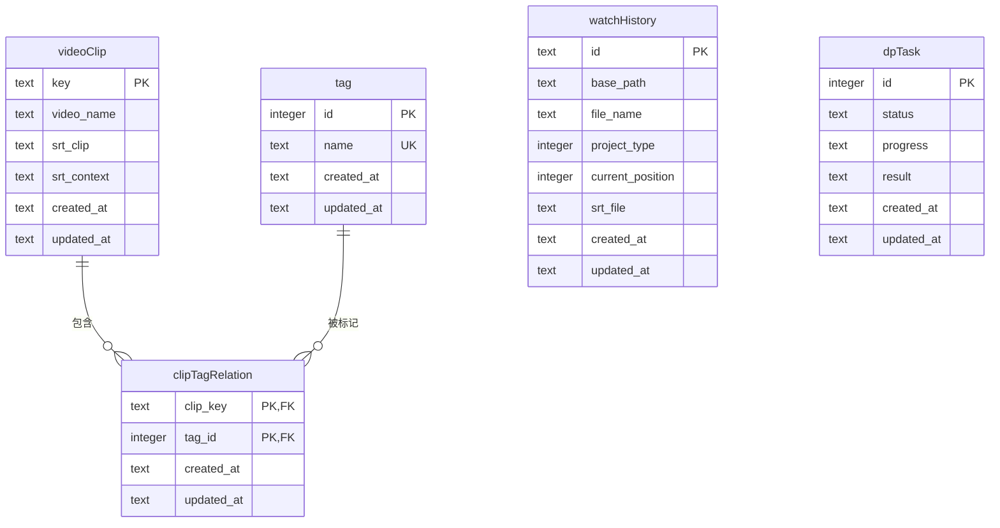

# 数据库设计

<cite>
**本文档引用的文件**
- [videoClip.ts](file://src/backend/db/tables/videoClip.ts)
- [tag.ts](file://src/backend/db/tables/tag.ts)
- [clipTagRelation.ts](file://src/backend/db/tables/clipTagRelation.ts)
- [watchHistory.ts](file://src/backend/db/tables/watchHistory.ts)
- [dpTask.ts](file://src/backend/db/tables/dpTask.ts)
- [db.ts](file://src/backend/db/db.ts)
- [migrate.ts](file://src/backend/db/migrate.ts)
- [0000_funny_mauler.sql](file://drizzle/migrations/0000_funny_mauler.sql)
</cite>

## 目录
1. [简介](#简介)
2. [核心数据表结构](#核心数据表结构)
3. [实体关系与ER图](#实体关系与er图)
4. [数据库迁移机制](#数据库迁移机制)
5. [数据访问层（DAO）设计](#数据访问层dao设计)
6. [数据生命周期与清理策略](#数据生命周期与清理策略)
7. [结论](#结论)

## 简介
本数据库设计文档详细解析了DashPlayer项目中使用的SQLite数据库模式。该数据库基于Drizzle ORM进行定义和管理，用于存储视频片段、标签、观看历史、下载与处理任务等核心数据。文档将深入分析各数据表的字段结构、主外键关系、索引策略，并阐述数据库迁移机制和数据访问方式。

## 核心数据表结构

### videoClip（视频片段表）
存储用户收藏的视频片段信息。

**字段说明：**
- `key`: 文本类型，主键，唯一标识一个视频片段。
- `video_name`: 文本类型，视频名称。
- `srt_clip`: 文本类型，收藏的字幕行内容。
- `srt_context`: 文本类型，收藏行周围的上下文字幕。
- `created_at`: 文本类型，创建时间，默认为当前时间戳。
- `updated_at`: 文本类型，更新时间，默认为当前时间戳。

**Section sources**
- [videoClip.ts](file://src/backend/db/tables/videoClip.ts#L3-L20)

### tag（标签表）
存储用户创建的标签信息。

**字段说明：**
- `id`: 整数类型，主键，自增。
- `name`: 文本类型，标签名称，非空且唯一。
- `created_at`: 文本类型，创建时间，默认为当前时间戳。
- `updated_at`: 文本类型，更新时间，默认为当前时间戳。

**Section sources**
- [tag.ts](file://src/backend/db/tables/tag.ts#L3-L12)

### clipTagRelation（片段标签关系表）
存储视频片段与标签之间的多对多关联关系。

**字段说明：**
- `clip_key`: 文本类型，非空，关联`videoClip`表的`key`。
- `tag_id`: 整数类型，关联`tag`表的`id`。
- `created_at`: 文本类型，创建时间，默认为当前时间戳。
- `updated_at`: 文本类型，更新时间，默认为当前时间戳。

**主键：** 由`clip_key`和`tag_id`组成的复合主键。

**Section sources**
- [clipTagRelation.ts](file://src/backend/db/tables/clipTagRelation.ts#L3-L16)

### watchHistory（观看历史表）
存储用户的观看历史记录。

**字段说明：**
- `id`: 文本类型，主键，唯一标识一条记录。
- `base_path`: 文本类型，非空，项目名称（原字段名`project_name`）。
- `file_name`: 文本类型，非空，项目路径（原字段名`project_path`）。
- `project_type`: 整数类型，非空，项目类型（枚举值：1-文件，2-目录）。
- `current_position`: 整数类型，非空，当前播放位置，默认为0。
- `srt_file`: 文本类型，字幕文件路径。
- `created_at`: 文本类型，创建时间，默认为当前时间戳。
- `updated_at`: 文本类型，更新时间，默认为当前时间戳。

**索引：** 在`base_path`和`file_name`上创建了名为`base_path_file_name_idx`的复合索引，以优化查询性能。

**Section sources**
- [watchHistory.ts](file://src/backend/db/tables/watchHistory.ts#L3-L18)

### dpTask（下载/处理任务表）
存储系统后台任务（如下载、转换）的状态信息。

**字段说明：**
- `id`: 整数类型，主键，自增。
- `status`: 文本类型，非空，任务状态，默认为`init`（初始状态）。状态枚举值包括：`init`, `in_progress`, `done`, `cancelled`, `failed`。
- `progress`: 文本类型，任务描述/进度信息，默认为“任务创建成功”（原字段名为`description`）。
- `result`: 文本类型，任务执行结果。
- `created_at`: 文本类型，创建时间，默认为当前时间戳。
- `updated_at`: 文本类型，更新时间，默认为当前时间戳。

**Section sources**
- [dpTask.ts](file://src/backend/db/tables/dpTask.ts#L11-L22)

## 实体关系与ER图

**Diagram sources**
- [videoClip.ts](file://src/backend/db/tables/videoClip.ts#L3-L20)
- [tag.ts](file://src/backend/db/tables/tag.ts#L3-L12)
- [clipTagRelation.ts](file://src/backend/db/tables/clipTagRelation.ts#L3-L16)
- [watchHistory.ts](file://src/backend/db/tables/watchHistory.ts#L3-L18)
- [dpTask.ts](file://src/backend/db/tables/dpTask.ts#L11-L22)

## 数据库迁移机制

DashPlayer使用`drizzle-kit`工具来管理数据库的版本迁移。迁移脚本存储在`drizzle/migrations`目录下。

### 迁移流程
1.  **生成迁移脚本**：当开发者修改了Drizzle ORM的表定义文件（如`videoClip.ts`）后，运行`drizzle-kit generate`命令。该命令会对比当前的表定义与数据库的当前状态（或上一个迁移快照），自动生成一个新的SQL迁移脚本（例如`0000_funny_mauler.sql`）。
2.  **应用迁移脚本**：在应用启动时，`migrate.ts`文件中的`runMigrate`函数会被调用。它使用`drizzle-orm`提供的`migrate`函数，根据`drizzle.config.ts`中配置的迁移文件夹路径，按顺序应用所有未执行的迁移脚本，将数据库结构更新到最新版本。

### 迁移脚本示例分析
`0000_funny_mauler.sql`文件包含了数据库的初始建表语句。例如，它创建了`dp_video_clip`表，并定义了其字段、主键和默认值。同时，它还为`dp_tag`表的`name`字段创建了唯一索引`dp_tag_name_unique`，确保标签名称的唯一性。

**Section sources**
- [0000_funny_mauler.sql](file://drizzle/migrations/0000_funny_mauler.sql#L0-L104)
- [migrate.ts](file://src/backend/db/migrate.ts#L0-L27)

## 数据访问层（DAO）设计

数据访问层通过`db.ts`文件提供的`db`实例进行统一管理。

### db.ts 核心功能
- **数据库连接**：使用`better-sqlite3`库连接到SQLite数据库文件（路径由`LocationUtil`确定，通常位于用户数据目录下）。
- **Drizzle ORM 实例化**：通过`drizzle(sqlite, { logger: isDev })`创建一个Drizzle ORM实例，该实例是执行所有数据库操作的入口。
- **数据库清理**：提供了`clearDB`函数，用于在开发或测试时清空所有表和索引，重置数据库状态。

### 数据访问方式
应用中的其他模块（如控制器和服务）通过导入`db`实例，使用Drizzle ORM提供的类型安全的查询API来执行CRUD操作。例如，要查询所有视频片段，可以使用类似`db.select().from(videoClip)`的链式调用。

**Section sources**
- [db.ts](file://src/backend/db/db.ts#L0-L63)

## 数据生命周期与清理策略

### 任务数据清理
`dpTask`表中的任务记录在完成后（状态为`done`、`cancelled`或`failed`）会保留在数据库中，以便用户查看历史任务。目前的代码中没有自动清理已完成任务的机制，这些数据会一直保留，直到用户手动操作或系统提供清理功能。

### 数据库重置
`db.ts`文件中提供的`clearDB`函数是主要的清理手段。它会删除数据库中的所有表和索引，相当于将数据库恢复到初始的空白状态。这个功能通常在应用出现严重数据错误或需要进行重大重构时由开发者或高级用户手动触发。

## 结论
DashPlayer的数据库设计清晰地反映了其核心功能需求。通过Drizzle ORM实现了类型安全的数据库操作，利用`drizzle-kit`实现了可靠的数据库迁移。实体关系设计合理，特别是通过`clipTagRelation`表实现了视频片段与标签的多对多关联。未来可以考虑为`dpTask`表增加自动归档或清理策略，以优化长期运行下的数据库性能和存储空间。