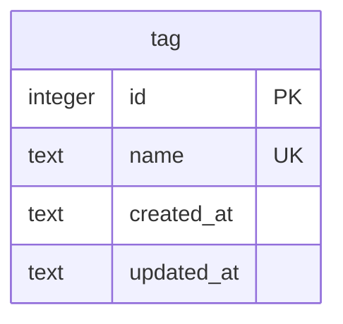
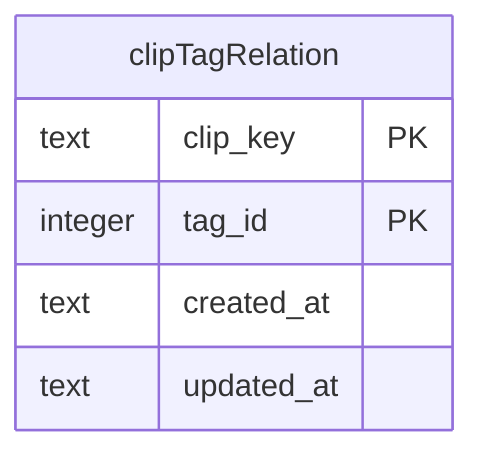
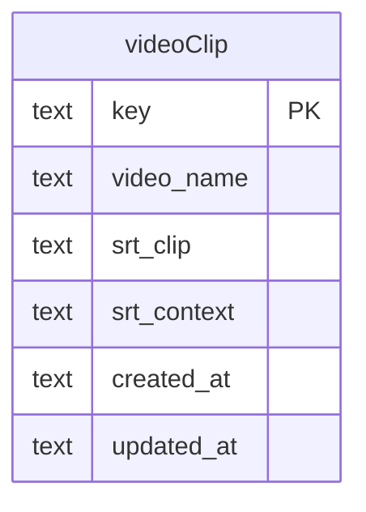
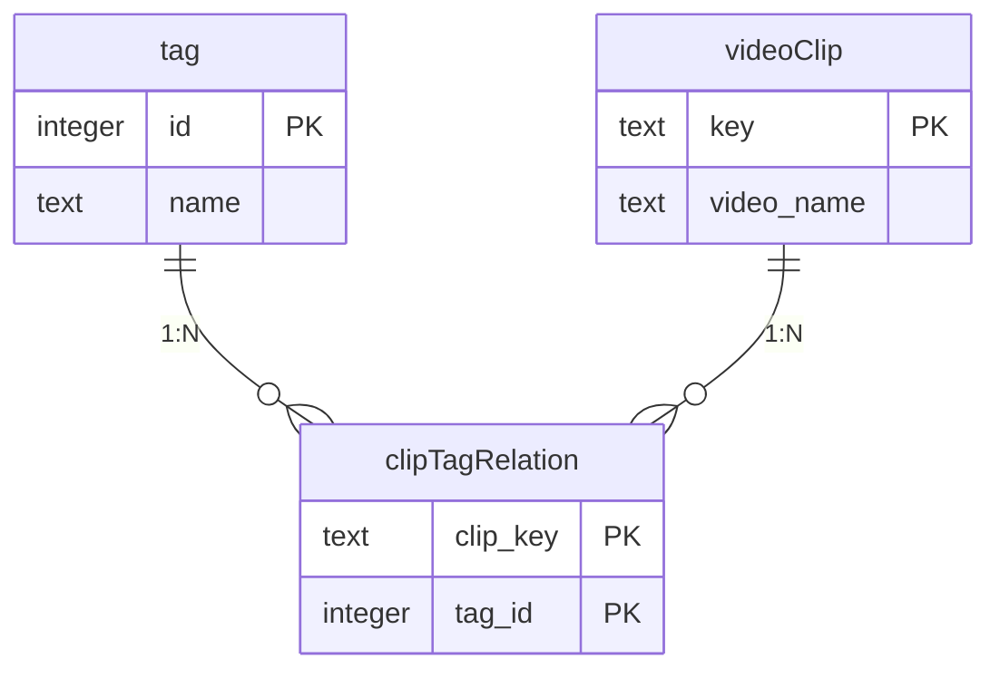
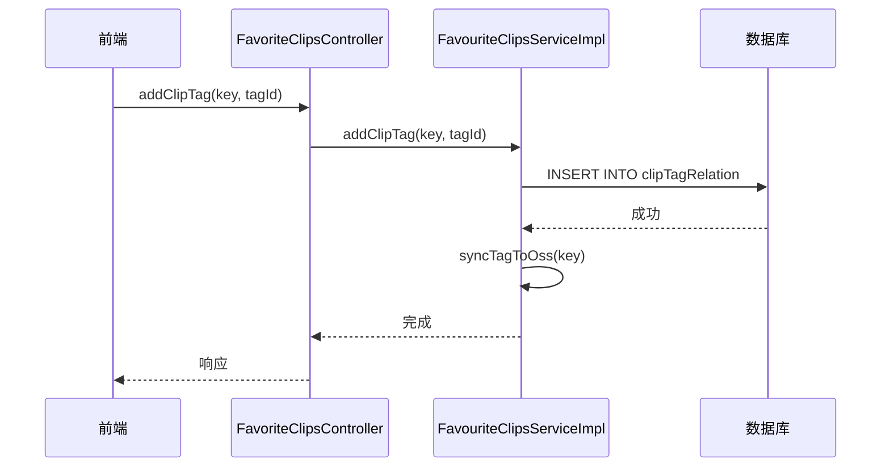
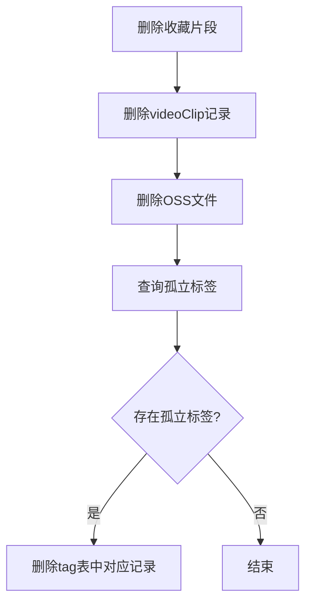
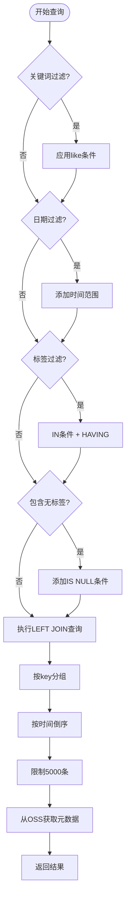

# 标签系统表 (tag & clipTagRelation)

<cite>
**本文档中引用的文件**  
- [tag.ts](file://src/backend/db/tables/tag.ts)
- [clipTagRelation.ts](file://src/backend/db/tables/clipTagRelation.ts)
- [TagController.ts](file://src/backend/controllers/TagController.ts)
- [TagServiceImpl.ts](file://src/backend/services/impl/TagServiceImpl.ts)
- [FavoriteClipsController.ts](file://src/backend/controllers/FavoriteClipsController.ts)
- [FavouriteClipsServiceImpl.ts](file://src/backend/services/impl/FavouriteClipsServiceImpl.ts)
- [dto.ts](file://src/common/api/dto.ts)
- [videoClip.ts](file://src/backend/db/tables/videoClip.ts)
</cite>

## 目录
1. [引言](#引言)
2. [表结构设计](#表结构设计)
3. [标签层级结构与多对多关系实现](#标签层级结构与多对多关系实现)
4. [字段含义说明](#字段含义说明)
5. [收藏夹功能中的标签操作逻辑](#收藏夹功能中的标签操作逻辑)
6. [级联操作处理机制](#级联操作处理机制)
7. [使用Drizzle进行复杂查询示例](#使用drizzle进行复杂查询示例)
8. [总结](#总结)

## 引言
本项目通过 `tag` 表和 `clipTagRelation` 关联表实现了视频片段的标签管理系统。该系统支持标签的增删改查、与收藏夹的集成、多对多关系维护以及基于标签的高级搜索功能。本文将深入解析其数据库设计、业务逻辑实现及复杂查询机制。

**Section sources**
- [tag.ts](file://src/backend/db/tables/tag.ts#L3-L12)
- [clipTagRelation.ts](file://src/backend/db/tables/clipTagRelation.ts#L3-L16)

## 表结构设计

### tag 表
`tag` 表用于存储所有标签的基本信息。



**Diagram sources**
- [tag.ts](file://src/backend/db/tables/tag.ts#L3-L12)

### clipTagRelation 表
`clipTagRelation` 表作为关联表，建立视频片段与标签之间的多对多映射关系。



**Diagram sources**
- [clipTagRelation.ts](file://src/backend/db/tables/clipTagRelation.ts#L3-L16)

### videoClip 表（关联实体）
`videoClip` 表存储收藏的视频片段元数据，是标签关联的目标实体之一。



**Diagram sources**
- [videoClip.ts](file://src/backend/db/tables/videoClip.ts#L3-L20)

## 标签层级结构与多对多关系实现

当前系统中，`tag` 表未包含 `parentId` 字段，因此**不支持标签的层级结构（如父子分类）**。所有标签均为扁平化管理。

多对多关系通过 `clipTagRelation` 表实现：
- 一个视频片段可拥有多个标签
- 一个标签可被多个视频片段使用
- 使用联合主键 `(clip_key, tag_id)` 确保每条关联记录唯一



**Diagram sources**
- [tag.ts](file://src/backend/db/tables/tag.ts#L3-L12)
- [clipTagRelation.ts](file://src/backend/db/tables/clipTagRelation.ts#L3-L16)
- [videoClip.ts](file://src/backend/db/tables/videoClip.ts#L3-L20)

## 字段含义说明

### tag 表字段
- **id**: 标签唯一标识符，自增主键
- **name**: 标签名称，非空且唯一，用于标识标签
- **created_at**: 创建时间，默认为当前时间戳
- **updated_at**: 更新时间，默认为当前时间戳

### clipTagRelation 表字段
- **clip_key**: 视频片段的唯一键，引用 `videoClip.key`
- **tag_id**: 标签ID，引用 `tag.id`
- **created_at**: 关联创建时间
- **updated_at**: 关联更新时间

**Section sources**
- [tag.ts](file://src/backend/db/tables/tag.ts#L3-L12)
- [clipTagRelation.ts](file://src/backend/db/tables/clipTagRelation.ts#L3-L16)

## 收藏夹功能中的标签操作逻辑

标签系统与收藏夹功能深度集成，主要通过 `FavoriteClipsController` 和 `FavouriteClipsServiceImpl` 实现。

### 添加标签到片段
当用户为收藏的视频片段添加标签时，调用 `addClipTag` 方法：
1. 向 `clipTagRelation` 插入新记录
2. 若存在冲突则忽略（`onConflictDoNothing`）
3. 调用 `syncTagToOss` 同步标签至外部存储



**Diagram sources**
- [FavoriteClipsController.ts](file://src/backend/controllers/FavoriteClipsController.ts#L41-L43)
- [FavouriteClipsServiceImpl.ts](file://src/backend/services/impl/FavouriteClipsServiceImpl.ts#L347-L355)

### 查询片段标签
通过 `queryClipTags` 方法查询某片段的所有标签：
1. 联合查询 `clipTagRelation` 与 `tag` 表
2. 过滤指定 `clip_key`
3. 返回标签列表

**Section sources**
- [FavouriteClipsServiceImpl.ts](file://src/backend/services/impl/FavouriteClipsServiceImpl.ts#L337-L344)
- [FavoriteClipsController.ts](file://src/backend/controllers/FavoriteClipsController.ts#L37-L39)

## 级联操作处理机制

系统在删除标签或片段时实现了精细的级联控制。

### 删除标签
- **直接删除**：`TagServiceImpl.deleteTag` 仅删除指定ID的标签
- **自动清理**：当删除最后一个使用某标签的片段时，该标签会被自动删除（见 `deleteClipTag`）

### 删除片段时的标签清理
在 `deleteFavoriteClip` 中：
1. 删除 `videoClip` 记录
2. 删除 OSS 中的文件
3. 查询孤立的标签（不再被任何片段引用）
4. 自动删除这些无用标签



**Diagram sources**
- [FavouriteClipsServiceImpl.ts](file://src/backend/services/impl/FavouriteClipsServiceImpl.ts#L212-L225)

### 删除标签关联时的级联
在 `deleteClipTag` 中使用事务处理：
1. 删除 `clipTagRelation` 中的关联
2. 检查该标签是否仍被其他片段使用
3. 若无其他引用，则删除 `tag` 表中的记录

此机制确保不会留下“孤儿”标签。

**Section sources**
- [FavouriteClipsServiceImpl.ts](file://src/backend/services/impl/FavouriteClipsServiceImpl.ts#L357-L373)

## 使用Drizzle进行复杂查询示例

系统通过 `search` 方法实现基于标签的复杂筛选。

### 查询参数定义
```typescript
type ClipQuery = {
    keyword: string;
    keywordRange: 'context' | 'clip';
    tags: number[];
    tagsRelation: 'and' | 'or';
    date: DateRange;
    includeNoTag: boolean;
}
```

**Section sources**
- [dto.ts](file://src/common/api/dto.ts#L2-L9)

### 按标签筛选片段逻辑


**Diagram sources**
- [FavouriteClipsServiceImpl.ts](file://src/backend/services/impl/FavouriteClipsServiceImpl.ts#L246-L303)

### 示例代码路径
- 构建动态 WHERE 条件：`FavouriteClipsServiceImpl.search`
- 执行多表联查与分组：`db.select().from(videoClip).leftJoin(...)`
- 处理 AND/OR 标签关系：通过 `having` 子句控制聚合条件

## 总结
本系统通过简洁而高效的数据库设计实现了灵活的标签管理功能。虽然当前不支持标签层级，但其扁平化设计配合 `clipTagRelation` 多对多关联表，能够满足大多数场景需求。结合收藏夹功能，实现了标签的增删改查、级联清理和复杂查询能力，尤其在删除操作中通过事务和自动清理机制保障了数据一致性。未来可扩展 `tag` 表增加 `parentId` 字段以支持树形分类结构。

**Section sources**
- [tag.ts](file://src/backend/db/tables/tag.ts#L3-L12)
- [clipTagRelation.ts](file://src/backend/db/tables/clipTagRelation.ts#L3-L16)
- [FavouriteClipsServiceImpl.ts](file://src/backend/services/impl/FavouriteClipsServiceImpl.ts#L212-L225)
- [FavouriteClipsServiceImpl.ts](file://src/backend/services/impl/FavouriteClipsServiceImpl.ts#L246-L303)