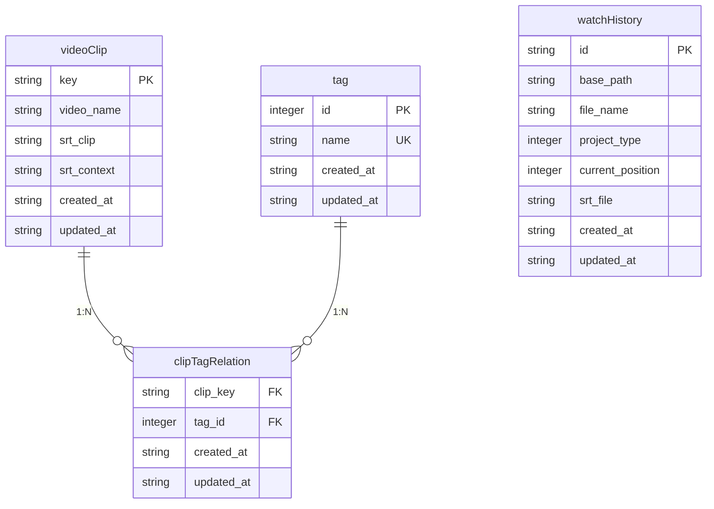

# 视频片段表 (videoClip)

<cite>
**本文档引用的文件**
- [videoClip.ts](file://src/backend/db/tables/videoClip.ts)
- [clipTagRelation.ts](file://src/backend/db/tables/clipTagRelation.ts)
- [tag.ts](file://src/backend/db/tables/tag.ts)
- [watchHistory.ts](file://src/backend/db/tables/watchHistory.ts)
- [FavouriteClipsServiceImpl.ts](file://src/backend/services/impl/FavouriteClipsServiceImpl.ts)
- [FavoriteClipsController.ts](file://src/backend/controllers/FavoriteClipsController.ts)
</cite>

## 目录
1. [简介](#简介)
2. [表结构与字段说明](#表结构与字段说明)
3. [核心实体作用](#核心实体作用)
4. [外键关系](#外键关系)
5. [Drizzle ORM 定义](#drizzle-orm-定义)
6. [DAO 增删改查操作](#dao-增删改查操作)
7. [数据生命周期管理](#数据生命周期管理)

## 简介
`videoClip` 表是 DashPlayer 应用中用于存储用户收藏视频片段的核心数据表。该表不仅记录了片段的基本信息，还通过与其他表的关联实现了标签管理和播放历史追踪功能。本文档详细描述了该表的结构、作用、外键关系以及在系统中的数据操作和生命周期管理策略。

## 表结构与字段说明

`videoClip` 表定义了以下字段：

- **key**: 文本类型，主键，唯一标识一个视频片段。
- **video_name**: 文本类型，存储视频文件的路径或名称。
- **srt_clip**: 文本类型，注释为“收藏的行”，存储被收藏的字幕行内容。
- **srt_context**: 文本类型，注释为“周围的字幕”，存储收藏行周围的上下文字幕内容。
- **created_at**: 文本类型，非空，默认值为当前时间戳，记录片段创建时间。
- **updated_at**: 文本类型，非空，默认值为当前时间戳，记录片段最后更新时间。

这些字段共同构成了视频片段的元数据，支持基于内容的搜索和管理。

**Section sources**
- [videoClip.ts](file://src/backend/db/tables/videoClip.ts#L3-L20)

## 核心实体作用
`videoClip` 表作为系统的核心实体，主要承担以下作用：
1. **收藏管理**：存储用户从视频中收藏的特定片段，包括视频路径、字幕内容等。
2. **内容检索**：通过 `srt_clip` 和 `srt_context` 字段，支持对收藏片段的全文搜索。
3. **元数据持久化**：记录每个片段的创建和更新时间，便于按时间排序和管理。
4. **关联扩展**：通过外键与其他表（如标签、播放历史）关联，实现丰富的功能扩展。

该表是收藏功能的数据基础，所有与收藏相关的操作最终都映射到对该表的增删改查。

**Section sources**
- [videoClip.ts](file://src/backend/db/tables/videoClip.ts#L3-L20)
- [FavouriteClipsServiceImpl.ts](file://src/backend/services/impl/FavouriteClipsServiceImpl.ts#L34-L428)

## 外键关系
`videoClip` 表通过中间表 `clipTagRelation` 与 `tag` 表建立多对多关系，同时与 `watchHistory` 表在业务逻辑上存在关联。

### 与标签表 (tag) 的关系
- **关系类型**：多对多
- **实现方式**：通过 `clipTagRelation` 表建立关联。
- **字段说明**：
  - `clipTagRelation.clip_key`：外键，引用 `videoClip.key`。
  - `clipTagRelation.tag_id`：外键，引用 `tag.id`。
- **作用**：允许为单个视频片段分配多个标签，并支持按标签进行分类和搜索。

### 与播放历史表 (watchHistory) 的关系
- **关系类型**：逻辑关联（非数据库外键）
- **实现方式**：`videoClip` 中的 `video_name` 字段存储视频路径，该路径与 `watchHistory` 表中的 `base_path` 和 `file_name` 组合路径对应。
- **作用**：将收藏的片段与其源视频的播放历史关联起来，支持在播放器中快速定位和回放。



**Diagram sources**
- [videoClip.ts](file://src/backend/db/tables/videoClip.ts#L3-L20)
- [clipTagRelation.ts](file://src/backend/db/tables/clipTagRelation.ts#L3-L16)
- [tag.ts](file://src/backend/db/tables/tag.ts#L3-L12)
- [watchHistory.ts](file://src/backend/db/tables/watchHistory.ts#L3-L18)

## Drizzle ORM 定义
`videoClip` 表使用 Drizzle ORM 进行定义，其 TypeScript 代码如下所示。该定义位于 `src/backend/db/tables/videoClip.ts` 文件中。

```typescript
export const videoClip = sqliteTable('dp_video_clip', {
    key: text('key').primaryKey(),
    video_name: text('video_name'),
    /**
     * 收藏的行
     */
    srt_clip: text('srt_clip'),
    /**
     * 周围的字幕
     */
    srt_context: text('srt_context'),
    created_at: text('created_at')
        .notNull()
        .default(sql`CURRENT_TIMESTAMP`),
    updated_at: text('updated_at')
        .notNull()
        .default(sql`CURRENT_TIMESTAMP`),
});

export type VideoClip = typeof videoClip.$inferSelect; // return type when queried
export type InsertVideoClip = typeof videoClip.$inferInsert; // insert type
```

此定义创建了一个名为 `dp_video_clip` 的 SQLite 表，并导出了用于类型推断的 `VideoClip` 和 `InsertVideoClip` 类型。

**Section sources**
- [videoClip.ts](file://src/backend/db/tables/videoClip.ts#L3-L24)

## DAO 增删改查操作
对 `videoClip` 表的操作主要通过 `FavouriteClipsServiceImpl` 类中的 DAO 方法实现，这些方法封装了 Drizzle ORM 的查询逻辑。

### 查询 (Read)
- **按主键查询**：使用 `db.select().from(videoClip).where(eq(videoClip.key, key))` 检查片段是否存在。
- **条件搜索**：`search` 方法支持根据关键词、标签、日期范围等条件进行复杂查询，利用 `leftJoin` 连接 `clipTagRelation` 和 `tag` 表，并使用 `where`、`having` 子句构建查询条件。

### 插入 (Create)
- **插入或更新**：使用 `db.insert(videoClip).values(...).onConflictDoUpdate(...)` 语句。当 `key` 冲突时，更新 `video_name`、`srt_clip`、`srt_context` 和 `updated_at` 字段。

### 删除 (Delete)
- **删除片段**：调用 `db.delete(videoClip).where(eq(videoClip.key, key))` 删除指定 `key` 的记录。此操作通常与删除 OSS 上的文件和清理无用标签的事务一起执行。

### 更新 (Update)
- **更新元数据**：在 `onConflictDoUpdate` 的 `set` 子句中指定需要更新的字段，如 `video_name` 和 `srt_context`。

这些操作在 `FavouriteClipsServiceImpl` 类中被 `addToDb`、`deleteFavoriteClip` 和 `search` 等业务方法调用。

**Section sources**
- [FavouriteClipsServiceImpl.ts](file://src/backend/services/impl/FavouriteClipsServiceImpl.ts#L102-L102)
- [FavouriteClipsServiceImpl.ts](file://src/backend/services/impl/FavouriteClipsServiceImpl.ts#L282-L298)
- [FavouriteClipsServiceImpl.ts](file://src/backend/services/impl/FavouriteClipsServiceImpl.ts#L317-L317)
- [FavouriteClipsServiceImpl.ts](file://src/backend/services/impl/FavouriteClipsServiceImpl.ts#L215-L218)

## 数据生命周期管理
`videoClip` 表的数据生命周期与收藏和播放历史功能紧密集成，管理策略如下：

### 创建
1. **用户操作**：用户在播放器中选择字幕行并点击收藏。
2. **异步处理**：`FavoriteClipsController` 接收请求，将任务加入 `FavouriteClipsServiceImpl` 的 `taskQueue` 队列。
3. **定时检查**：`checkQueue` 定时任务检查队列，对 `operation` 为 `add` 的任务，调用 `taskAddOperation`。
4. **数据持久化**：`taskAddOperation` 使用 `ffmpeg` 截取视频片段，上传至 OSS，并最终调用 `addToDb` 将元数据插入 `videoClip` 表。

### 更新
- **自动更新**：当用户再次收藏同一片段时，由于使用了 `onConflictDoUpdate`，系统会自动更新 `updated_at` 时间戳和相关元数据。

### 删除
1. **用户删除**：用户在收藏界面删除片段。
2. **级联清理**：`deleteFavoriteClip` 方法在一个事务中执行：
   - 删除 `videoClip` 表中的记录。
   - 删除 OSS 上对应的视频文件。
   - 查询并删除 `clipTagRelation` 表中指向已删除片段的记录。
   - 检查并删除 `tag` 表中不再被任何片段引用的孤立标签。

### 与播放历史的集成
- **播放进度同步**：`WatchHistoryController` 提供 `updateProgress` 接口，用于更新 `watchHistory` 表中的 `current_position`。虽然不直接修改 `videoClip`，但确保了源视频的播放状态是最新的。
- **数据清理**：`WatchHistoryServiceImpl` 的 `cleanDeletedHistory` 方法会清理 `watchHistory` 表中源文件已不存在的记录，间接保证了 `videoClip` 中 `video_name` 引用的视频路径的有效性。

此生命周期管理策略确保了数据的一致性和完整性，同时优化了存储空间的使用。

**Section sources**
- [FavouriteClipsServiceImpl.ts](file://src/backend/services/impl/FavouriteClipsServiceImpl.ts#L34-L428)
- [FavoriteClipsController.ts](file://src/backend/controllers/FavoriteClipsController.ts#L9-L74)
- [WatchHistoryServiceImpl.ts](file://src/backend/services/impl/WatchHistoryServiceImpl.ts#L21-L426)
- [WatchHistoryController.ts](file://src/backend/controllers/WatchHistoryController.ts#L9-L68)