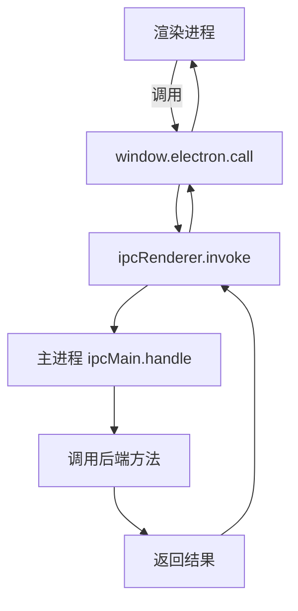
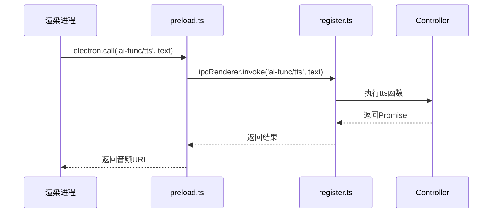
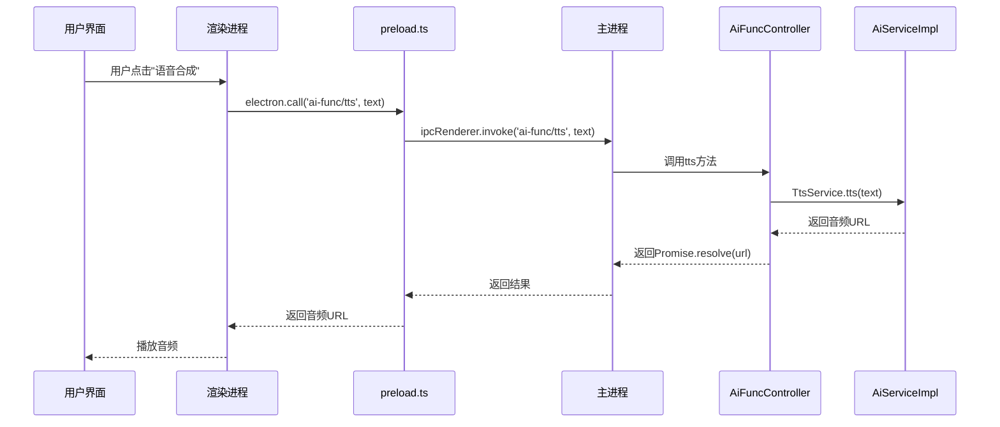

# IPC通信机制

<cite>
**本文档引用的文件**  
- [preload.ts](file://src/preload.ts)
- [api-def.ts](file://src/common/api/api-def.ts)
- [register.ts](file://src/common/api/register.ts)
- [dispatcher.ts](file://src/backend/dispatcher.ts)
- [AiFuncController.ts](file://src/backend/controllers/AiFuncController.ts)
- [DownloadVideoController.ts](file://src/backend/controllers/DownloadVideoController.ts)
- [StorageController.ts](file://src/backend/controllers/StorageController.ts)
- [controller.ts](file://src/backend/interfaces/controller.ts)
</cite>

## 目录
1. [引言](#引言)
2. [IPC通信架构概述](#ipc通信架构概述)
3. [预加载脚本与上下文桥接](#预加载脚本与上下文桥接)
4. [接口契约定义](#接口契约定义)
5. [路由注册机制](#路由注册机制)
6. [请求分发器](#请求分发器)
7. [通信流程时序图](#通信流程时序图)
8. [通信模式与机制](#通信模式与机制)
9. [可用IPC接口列表](#可用ipc接口列表)
10. [错误处理与序列化限制](#错误处理与序列化限制)

## 引言
DashPlayer采用Electron框架构建，其主进程（Node.js环境）与渲染进程（前端UI）之间通过IPC（Inter-Process Communication）机制进行安全通信。本文档全面解析该通信系统的设计与实现，涵盖从UI触发到后端执行再到结果返回的完整流程，重点说明`preload.ts`、`api-def.ts`、`register.ts`和`dispatcher.ts`等核心模块的作用与协作关系。

## IPC通信架构概述
DashPlayer的IPC通信系统采用分层架构设计，主要包括以下组件：
- **渲染进程**：前端UI通过`window.electron`调用暴露的API
- **预加载脚本**：通过`contextBridge`安全暴露Electron IPC接口
- **接口契约**：在`api-def.ts`中定义所有可用接口的类型签名
- **路由注册**：`register.ts`提供统一的IPC处理注册函数
- **控制器层**：各`Controller`类实现具体业务逻辑并注册路由
- **分发器**：`dispatcher.ts`负责初始化所有控制器的路由注册

该架构实现了前后端通信的类型安全、解耦和可维护性。

**Section sources**
- [preload.ts](file://src/preload.ts#L1-L47)
- [api-def.ts](file://src/common/api/api-def.ts#L1-L190)
- [register.ts](file://src/common/api/register.ts#L1-L20)
- [dispatcher.ts](file://src/backend/dispatcher.ts#L1-L13)

## 预加载脚本与上下文桥接
`preload.ts`文件通过Electron的`contextBridge`机制，将主进程的IPC功能安全地暴露给渲染进程。由于渲染进程运行在沙箱环境中，直接访问Node.js和Electron API存在安全风险，因此必须通过预加载脚本来桥接。

`electronHandler`对象暴露了以下方法：
- `call`：用于发起异步请求并等待响应
- `safeCall`：带错误捕获的调用方法，失败时返回null
- `onStoreUpdate`、`onErrorMsg`、`onInfoMsg`：用于订阅主进程发出的事件

这些方法基于`ipcRenderer.invoke`和`ipcRenderer.on`实现，确保了通信的安全性和类型安全性。

**Diagram sources**
- [preload.ts](file://src/preload.ts#L20-L44)

**Section sources**
- [preload.ts](file://src/preload.ts#L1-L47)

## 接口契约定义
`api-def.ts`文件定义了所有IPC接口的类型契约，采用TypeScript的交叉类型（&）将多个功能模块的接口合并为一个统一的`ApiDefinitions`类型。

该文件包含以下接口定义：
- `AiFuncDef`：AI功能相关接口
- `DpTaskDef`：任务管理接口
- `SystemDef`：系统信息与操作接口
- `StorageDef`：本地存储接口
- 以及其他业务模块接口

`ApiMap`类型将这些接口映射为可调用的函数签名，实现了编译时的类型检查，确保前后端接口的一致性。

**Section sources**
- [api-def.ts](file://src/common/api/api-def.ts#L1-L190)

## 路由注册机制
`register.ts`文件提供了`registerRoute`函数，作为统一的IPC路由注册入口。该函数封装了`ipcMain.handle`的调用，添加了日志记录和错误处理逻辑。

当某个Controller注册一个路由时：
1. 调用`registerRoute(path, func)`
2. `ipcMain.handle`监听指定路径的请求
3. 收到请求时记录日志
4. 执行注册的函数
5. 发生错误时记录错误日志并通知渲染进程

这种集中式注册机制确保了所有IPC调用都有统一的日志记录和错误处理。

**Diagram sources**
- [register.ts](file://src/common/api/register.ts#L8-L19)

**Section sources**
- [register.ts](file://src/common/api/register.ts#L1-L20)

## 请求分发器
`dispatcher.ts`文件中的`registerHandler`函数负责初始化整个IPC系统。它通过依赖注入容器获取所有实现了`Controller`接口的实例，并调用它们的`registerRoutes`方法。

该函数接收主窗口引用作为参数，以便某些服务（如`SystemService`）能够访问主窗口对象。这种设计实现了控制反转（IoC），使得新的Controller可以自动被发现和注册，无需修改分发器代码。

**Section sources**
- [dispatcher.ts](file://src/backend/dispatcher.ts#L1-L13)
- [controller.ts](file://src/backend/interfaces/controller.ts#L0-L2)

## 通信流程时序图
以下时序图展示了从UI触发一个AI语音合成请求到后端执行并返回结果的完整流程：

**Diagram sources**
- [preload.ts](file://src/preload.ts#L20-L44)
- [AiFuncController.ts](file://src/backend/controllers/AiFuncController.ts#L12-L129)

## 通信模式与机制
DashPlayer的IPC通信系统支持以下模式：

### 请求/响应模式
使用`ipcRenderer.invoke`和`ipcMain.handle`实现双向通信。渲染进程发起请求，主进程处理并返回结果。这是最常用的通信模式，适用于大多数业务操作。

### 事件订阅模式
使用`ipcRenderer.on`实现单向事件监听。主进程可以随时向渲染进程发送事件，如`store-update`、`error-msg`等。渲染进程通过`onStoreUpdate`等方法订阅这些事件。

### 错误处理
系统采用统一的错误处理机制：
- 主进程捕获异常后记录日志
- 通过`SystemService.sendErrorToRenderer`通知渲染进程
- `safeCall`方法提供静默失败的调用方式

### 序列化限制
由于IPC通信需要序列化数据，存在以下限制：
- 无法传递函数、Symbol等非可序列化对象
- 循环引用对象可能导致序列化失败
- 大数据量传输可能影响性能

**Section sources**
- [preload.ts](file://src/preload.ts#L1-L47)
- [register.ts](file://src/common/api/register.ts#L8-L19)

## 可用IPC接口列表
以下是DashPlayer提供的主要IPC接口：

| 接口路径 | 参数类型 | 返回值类型 | 用途 |
|--------|--------|---------|------|
| `ai-func/tts` | string | string | AI语音合成 |
| `ai-func/phrase-group` | string | number | 短语分组分析 |
| `ai-func/polish` | string | number | 文本润色 |
| `dp-task/detail` | number | DpTask \| null | 获取任务详情 |
| `system/info` | void | SystemInfo | 获取系统信息 |
| `system/select-file` | string[] | string[] | 选择文件 |
| `storage/put` | {key, value} | void | 存储设置 |
| `storage/get` | SettingKey | string | 获取设置 |
| `download-video/url` | {url, cookies} | number | 下载视频 |
| `convert/to-mp4` | string | number | 转换为MP4 |
| `favorite-clips/add` | ClipInfo | void | 添加收藏片段 |
| `tag/add` | string | Tag | 添加标签 |

**Section sources**
- [api-def.ts](file://src/common/api/api-def.ts#L1-L190)

## 错误处理与序列化限制
DashPlayer的IPC系统在`register.ts`中实现了统一的错误处理机制。所有API调用都被包裹在try-catch块中，确保任何未处理的异常都不会导致进程崩溃。

当异常发生时：
1. 错误被记录到日志文件
2. `SystemService`通过`sendErrorToRenderer`方法将错误信息发送到渲染进程
3. 前端可以通过`onErrorMsg`订阅并显示错误

关于序列化限制，系统建议：
- 避免传输大型数据对象，必要时应分块传输
- 不要传递包含函数或原型链的复杂对象
- 对于大数据传输，考虑使用文件或共享内存等替代方案
- 始终处理可能的序列化异常

**Section sources**
- [register.ts](file://src/common/api/register.ts#L8-L19)
- [preload.ts](file://src/preload.ts#L35-L44)