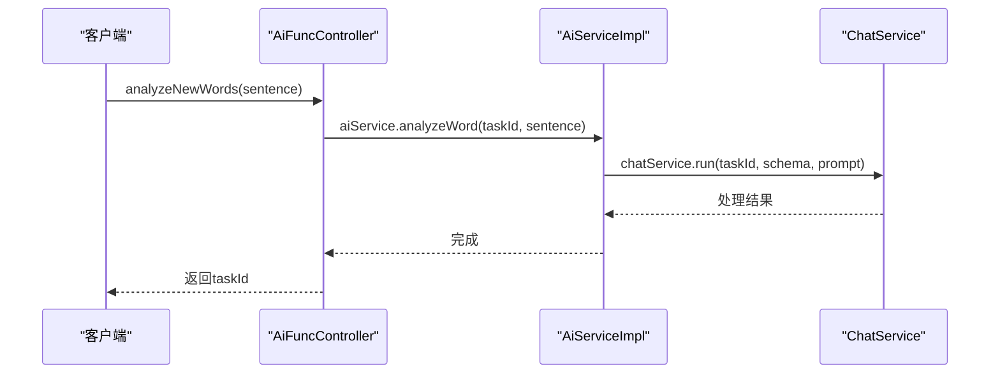

# 依赖注入系统

<cite>
**本文档中引用的文件**  
- [types.ts](file://src/backend/ioc/types.ts)
- [inversify.config.ts](file://src/backend/ioc/inversify.config.ts)
- [AiFuncController.ts](file://src/backend/controllers/AiFuncController.ts)
- [AiServiceImpl.ts](file://src/backend/services/AiServiceImpl.ts)
</cite>

## 目录
1. [简介](#简介)
2. [服务标识符定义](#服务标识符定义)
3. [服务绑定策略](#服务绑定策略)
4. [依赖声明与注入](#依赖声明与注入)
5. [IoC容器初始化流程](#ioc容器初始化流程)
6. [具体注入示例分析](#具体注入示例分析)
7. [DI系统优势](#di系统优势)
8. [调试复杂性与诊断建议](#调试复杂性与诊断建议)

## 简介
DashPlayer项目采用InversifyJS实现依赖注入（DI）系统，通过控制反转（IoC）容器管理组件间的依赖关系。该系统将服务实例的创建与使用解耦，提升代码的可测试性与可维护性。核心机制包括服务标识符定义、服务绑定、依赖注入和容器初始化。

**Section sources**
- [types.ts](file://src/backend/ioc/types.ts)
- [inversify.config.ts](file://src/backend/ioc/inversify.config.ts)

## 服务标识符定义
服务标识符在`types.ts`文件中通过Symbol常量定义，为每个服务提供唯一的类型标识。这些标识符作为依赖查找的键，避免字符串硬编码带来的错误。例如，`AiService`服务通过`Symbol('AiService')`进行标识，确保类型安全和唯一性。

```typescript
const TYPES = {
    AiService: Symbol('AiService'),
    ChatService: Symbol('ChatService'),
    DpTaskService: Symbol('DpTaskService'),
    // 其他服务...
};
```

**Section sources**
- [types.ts](file://src/backend/ioc/types.ts#L0-L31)

## 服务绑定策略
在`inversify.config.ts`中，所有服务均通过`inSingletonScope()`方法绑定为单例模式。这意味着每个服务在整个应用生命周期中仅创建一次实例，后续请求均返回同一实例。例如，`AiServiceImpl`被绑定到`AiService`标识符，并以单例形式存在。

```typescript
container.bind<AiService>(TYPES.AiService).to(AiServiceImpl).inSingletonScope();
```

此策略适用于无状态或共享状态的服务，如缓存、数据库连接、日志等，确保资源高效利用。

**Section sources**
- [inversify.config.ts](file://src/backend/ioc/inversify.config.ts#L0-L108)

## 依赖声明与注入
控制器和服务通过`@inject`装饰器声明其依赖。例如，`AiFuncController`类中声明了对`DpTaskService`、`ChatService`、`AiService`和`WhisperService`的依赖，这些依赖在运行时由IoC容器自动注入。

```typescript
@inject(TYPES.DpTaskService)
private dpTaskService!: DpTaskService;

@inject(TYPES.AiService)
private aiService!: AiServiceImpl;
```

`@injectable()`装饰器标记类可被容器实例化，是使用依赖注入的前提。

**Section sources**
- [AiFuncController.ts](file://src/backend/controllers/AiFuncController.ts#L12-L129)

## IoC容器初始化流程
IoC容器在`inversify.config.ts`中创建并配置所有服务绑定。应用启动时，容器根据绑定配置解析依赖关系图，按需实例化服务。当请求某个控制器（如`AiFuncController`）时，容器递归解析其所有依赖（如`AiService`），并注入已创建的单例实例。整个过程在应用初始化阶段完成，确保运行时依赖可用。

**Section sources**
- [inversify.config.ts](file://src/backend/ioc/inversify.config.ts#L0-L108)

## 具体注入示例分析
以`AiFuncController`注入`AiServiceImpl`为例：`AiFuncController`通过`@inject(TYPES.AiService)`声明依赖，容器在实例化`AiFuncController`时，查找`TYPES.AiService`绑定的`AiServiceImpl`单例并注入。当调用`analyzeNewWords`方法时，`aiService.analyzeWord()`被触发，实现功能调用。



**Diagram sources**
- [AiFuncController.ts](file://src/backend/controllers/AiFuncController.ts#L27-L31)
- [AiServiceImpl.ts](file://src/backend/services/AiServiceImpl.ts#L60-L72)

**Section sources**
- [AiFuncController.ts](file://src/backend/controllers/AiFuncController.ts#L12-L129)
- [AiServiceImpl.ts](file://src/backend/services/AiServiceImpl.ts#L45-L153)

## DI系统优势
依赖注入系统带来三大核心优势：**解耦**、**可测试性**和**可扩展性**。通过接口与实现分离，组件间依赖通过容器管理，降低耦合度；在测试时可轻松替换模拟对象，提升单元测试效率；新增服务只需在容器中绑定，不影响现有代码，增强系统可扩展性。

**Section sources**
- [inversify.config.ts](file://src/backend/ioc/inversify.config.ts#L0-L108)
- [AiFuncController.ts](file://src/backend/controllers/AiFuncController.ts#L12-L129)

## 调试复杂性与诊断建议
DI系统可能增加调试复杂性，尤其是循环依赖或绑定错误时。建议启用InversifyJS的调试日志，检查容器绑定状态。使用`container.isBound()`验证服务是否正确注册，并通过堆栈跟踪定位注入失败的根源。避免过度使用单例，确保服务无状态或正确管理共享状态。

**Section sources**
- [inversify.config.ts](file://src/backend/ioc/inversify.config.ts#L0-L108)
- [AiFuncController.ts](file://src/backend/controllers/AiFuncController.ts#L12-L129)