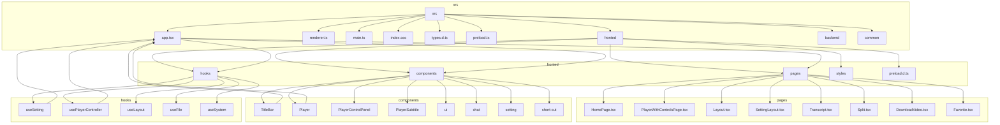
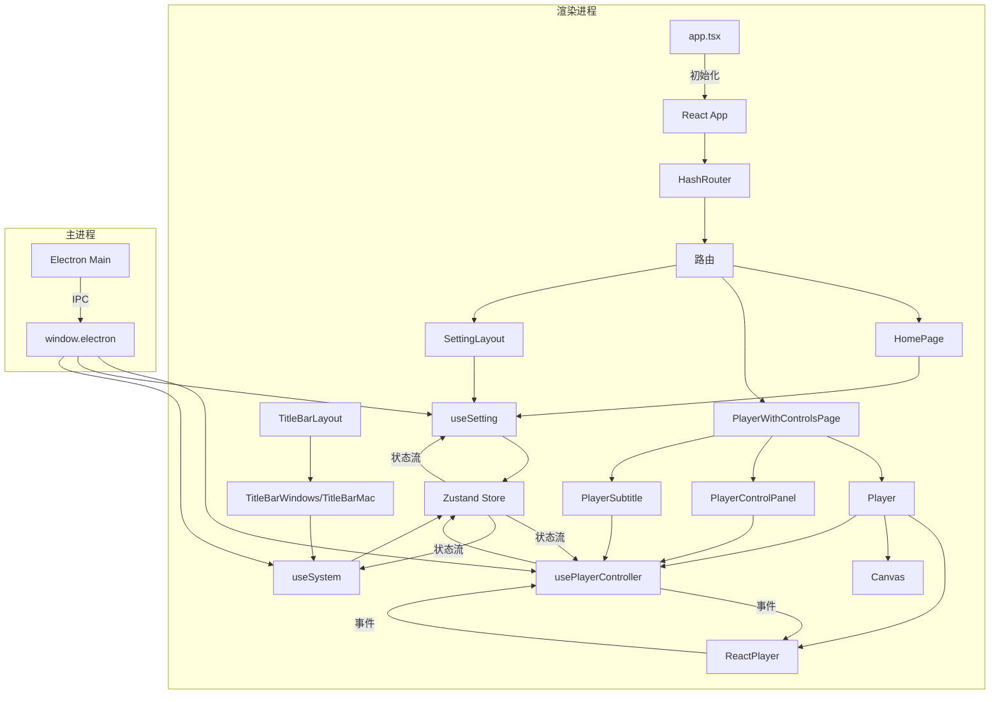
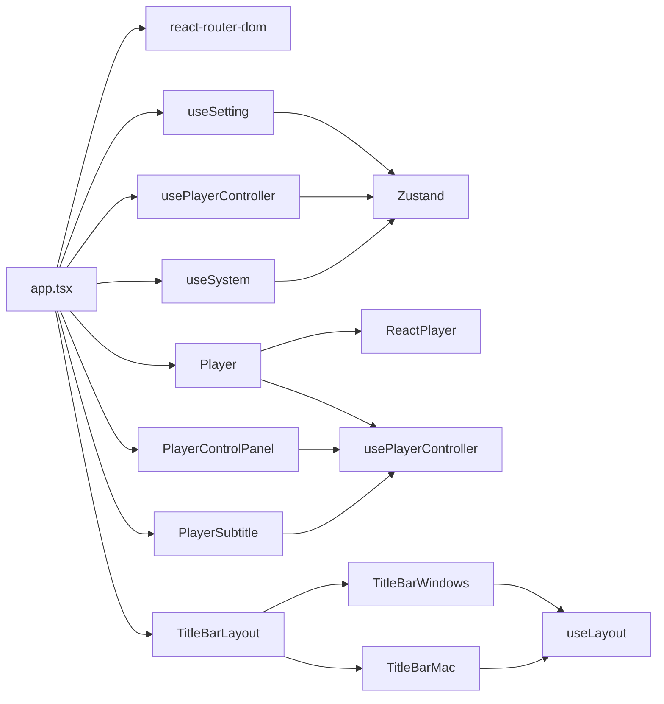

# 前端架构

<cite>
**本文档引用的文件**  
- [app.tsx](file://src/app.tsx)
- [renderer.ts](file://src/renderer.ts)
- [useSetting.ts](file://src/fronted/hooks/useSetting.ts)
- [usePlayerController.ts](file://src/fronted/hooks/usePlayerController.ts)
- [useSystem.ts](file://src/fronted/hooks/useSystem.ts)
- [TitleBarWindows.tsx](file://src/fronted/components/TitleBar/TitleBarWindows.tsx)
- [TitleBarMac.tsx](file://src/fronted/components/TitleBar/TitleBarMac.tsx)
- [Player.tsx](file://src/fronted/components/Player.tsx)
- [PlayerControlPanel.tsx](file://src/fronted/components/PlayerControlPanel.tsx)
- [PlayerSubtitle.tsx](file://src/fronted/components/playerSubtitle/PlayerSubtitle.tsx)
</cite>

## 目录
1. [简介](#简介)
2. [项目结构](#项目结构)
3. [核心组件](#核心组件)
4. [架构概览](#架构概览)
5. [详细组件分析](#详细组件分析)
6. [依赖分析](#依赖分析)
7. [性能考虑](#性能考虑)
8. [故障排除指南](#故障排除指南)
9. [结论](#结论)

## 简介
DashPlayer 是一个基于 Electron 构建的桌面视频播放与学习工具，其前端采用 React + Vite + Tailwind CSS 技术栈，结合 Zustand 状态管理库，实现现代化、响应式、跨平台的用户界面。本架构文档旨在深入解析其前端设计，涵盖应用初始化、组件组织、状态管理、UI 策略及跨平台适配等核心方面。

## 项目结构

**图示来源**  
- [app.tsx](file://src/app.tsx)
- [src/fronted/pages](file://src/fronted/pages)
- [src/fronted/components](file://src/fronted/components)
- [src/fronted/hooks](file://src/fronted/hooks)

**本节来源**  
- [src](file://src)

## 核心组件

前端核心由三大支柱构成：**应用入口**、**状态管理**和**UI 组件库**。`app.tsx` 负责初始化 React 应用并配置路由；`usePlayerController` 和 `useSetting` 等自定义 Hook 通过 Zustand 实现全局状态的集中管理；`components` 目录下的各类组件则构建了完整的用户界面。

**本节来源**  
- [app.tsx](file://src/app.tsx)
- [useSetting.ts](file://src/fronted/hooks/useSetting.ts)
- [usePlayerController.ts](file://src/fronted/hooks/usePlayerController.ts)

## 架构概览

**图示来源**  
- [app.tsx](file://src/app.tsx)
- [renderer.ts](file://src/renderer.ts)
- [usePlayerController.ts](file://src/fronted/hooks/usePlayerController.ts)
- [useSetting.ts](file://src/fronted/hooks/useSetting.ts)
- [useSystem.ts](file://src/fronted/hooks/useSystem.ts)
- [Player.tsx](file://src/fronted/components/Player.tsx)
- [PlayerControlPanel.tsx](file://src/fronted/components/PlayerControlPanel.tsx)
- [PlayerSubtitle.tsx](file://src/fronted/components/playerSubtitle/PlayerSubtitle.tsx)
- [TitleBarWindows.tsx](file://src/fronted/components/TitleBar/TitleBarWindows.tsx)
- [TitleBarMac.tsx](file://src/fronted/components/TitleBar/TitleBarMac.tsx)

## 详细组件分析

### 应用入口与渲染初始化

`app.tsx` 是前端应用的根组件，它使用 `createRoot` 将 React 应用挂载到 `document.body` 上。该文件通过 `HashRouter` 实现客户端路由，定义了从主页、播放页到设置页等所有页面的路由映射。同时，它引入了全局状态 Hook（如 `useSetting`）来响应主题变化，并将 `GlobalShortCut` 和 `Toaster` 等全局组件置于路由之外，确保它们在所有页面中都可用。

`renderer.ts` 是 Vite 在渲染进程中的入口文件。它负责引入全局样式 `index.css`，并最终导入 `app.tsx` 来启动整个 React 应用。此文件是 Electron 渲染进程与 Vite 开发/构建环境之间的桥梁。

**本节来源**  
- [app.tsx](file://src/app.tsx#L1-L132)
- [renderer.ts](file://src/renderer.ts#L1-L32)

### 组件组织结构

项目的前端组件被清晰地组织在 `src/fronted` 目录下，遵循高内聚、低耦合的原则：
- **pages**: 包含顶级路由组件，如 `HomePage`、`PlayerWithControlsPage` 和 `SettingLayout`。这些组件负责组合多个通用组件，形成完整的页面视图。
- **components**: 存放可复用的 UI 组件。例如，`Player` 组件封装了视频播放的核心逻辑，`PlayerControlPanel` 提供播放控制，`PlayerSubtitle` 负责字幕渲染。`ui` 子目录则集成了 Radix UI 的原子化组件。
- **hooks**: 包含所有自定义 Hook，是状态逻辑的核心。`useSetting` 管理应用设置，`usePlayerController` 管理播放器状态，`useLayout` 管理界面布局状态等。这种组织方式将状态逻辑与 UI 逻辑分离，提高了代码的可维护性。

**本节来源**  
- [src/fronted/pages](file://src/fronted/pages)
- [src/fronted/components](file://src/fronted/components)
- [src/fronted/hooks](file://src/fronted/hooks)

### 状态管理机制

DashPlayer 采用 Zustand 作为其全局状态管理解决方案。通过创建多个自定义 Hook（如 `useSetting`、`usePlayerController`），将不同的状态域进行模块化分割。

`useSetting` Hook 使用 `create` 函数初始化一个 Zustand store，其中 `values` 是一个 `Map`，用于存储所有设置项的键值对。`setSetting` 方法不仅更新本地状态，还会通过 `api.call('storage/put', ...)` 将更改持久化到后端数据库，实现了状态的同步。

`usePlayerController` 是一个复合状态 Hook，它通过 `subscribeWithSelector` 和 `create` 将多个状态切片（如 `PlayerSlice`、`SentenceSlice`、`ModeSlice` 等）合并成一个单一的 store。这种“切片模式”使得复杂的状态（如播放器状态）可以被分解和独立管理，同时又能被一个 Hook 统一访问。

**本节来源**  
- [useSetting.ts](file://src/fronted/hooks/useSetting.ts#L16-L36)
- [usePlayerController.ts](file://src/fronted/hooks/usePlayerController.ts#L28-L46)

### UI 组件库与样式策略

项目使用 **Radix UI** 作为其基础 UI 组件库。Radix UI 提供了无样式的、可访问性高的原语组件（如 `Button`、`Slider`、`Dialog`），开发者可以完全控制其外观。这些组件位于 `src/fronted/components/ui` 目录下，通过 Tailwind CSS 进行样式定制。

样式策略采用 **Tailwind CSS + SCSS 混合**模式。Tailwind 用于快速构建布局和应用原子化样式，而 SCSS（如 `TitleBarWindows.scss`）则用于处理复杂的、需要嵌套规则或变量的样式场景，例如标题栏的特定平台样式。这种混合策略兼顾了开发效率和样式的灵活性。

**本节来源**  
- [src/fronted/components/ui](file://src/fronted/components/ui)
- [src/fronted/components/TitleBar/TitleBarWindows.scss](file://src/fronted/components/TitleBar/TitleBarWindows.scss)
- [src/fronted/components/PlayerControlPanel.tsx](file://src/fronted/components/PlayerControlPanel.tsx)

### 响应式设计与跨平台适配

系统通过 `useSystem` Hook 来识别运行平台（Windows 或 Mac）。该 Hook 的 `isWindows` 状态由主进程通过 IPC 通信注入。

基于此状态，应用实现了跨平台的界面适配。最典型的例子是标题栏组件。`TitleBarLayout` 根据 `isWindows` 的值，动态渲染 `TitleBarWindows` 或 `TitleBarMac` 组件。`TitleBarWindows` 显示传统的“最小化、最大化、关闭”按钮（流量灯），而 `TitleBarMac` 则显示 macOS 风格的三个彩色圆点。此外，`TitleBarWindows` 还实现了智能显示逻辑：当鼠标移出侧边栏时，流量灯会在短暂延迟后自动隐藏，以提供更沉浸的视觉体验。

**本节来源**  
- [useSystem.ts](file://src/fronted/hooks/useSystem.ts#L14-L22)
- [TitleBarWindows.tsx](file://src/fronted/components/TitleBar/TitleBarWindows.tsx#L12-L96)
- [TitleBarMac.tsx](file://src/fronted/components/TitleBar/TitleBarMac.tsx#L7-L65)

## 依赖分析

**图示来源**  
- [app.tsx](file://src/app.tsx)
- [useSetting.ts](file://src/fronted/hooks/useSetting.ts)
- [usePlayerController.ts](file://src/fronted/hooks/usePlayerController.ts)
- [useSystem.ts](file://src/fronted/hooks/useSystem.ts)
- [Player.tsx](file://src/fronted/components/Player.tsx)
- [PlayerControlPanel.tsx](file://src/fronted/components/PlayerControlPanel.tsx)
- [PlayerSubtitle.tsx](file://src/fronted/components/playerSubtitle/PlayerSubtitle.tsx)
- [TitleBarWindows.tsx](file://src/fronted/components/TitleBar/TitleBarWindows.tsx)
- [TitleBarMac.tsx](file://src/fronted/components/TitleBar/TitleBarMac.tsx)

## 性能考虑

前端架构在性能方面进行了多项优化：
- **选择性重渲染**: 在 `Player` 和 `PlayerControlPanel` 等组件中，广泛使用 `useShallow` 作为 Zustand 的选择器。这确保了只有当所依赖的特定状态发生变化时，组件才会重新渲染，避免了不必要的性能开销。
- **防抖处理**: `Player` 组件中的 `seekTime` 状态更新使用了 `setTimeout` 进行防抖，防止在用户快速拖动进度条时频繁地调用 `playerRef.current.seekTo`，从而保证了操作的流畅性。
- **动画优化**: 在全屏模式下，`Player` 组件使用 `requestAnimationFrame` 来同步主视频和背景画布（`canvas`）的帧率，并通过 `createImageBitmap` 提升了从视频帧绘制到画布的性能。
- **懒加载**: 路由系统实现了按需加载，用户在访问特定页面（如“转录”或“分割”）时，相关组件才会被加载，减少了初始加载时间。

## 故障排除指南

- **应用启动白屏**: 检查 `renderer.ts` 是否正确导入了 `app.tsx`。确认 Vite 构建配置（`vite.renderer.config.ts`）是否正确。
- **状态不更新**: 确认在使用 Zustand Hook 时是否正确使用了 `useShallow` 或自定义选择器。检查状态更新函数是否正确调用了 `set`。
- **跨平台样式错乱**: 确保 `useSystem` Hook 已正确初始化，并且 `isWindows` 状态已通过 IPC 从主进程正确传递。
- **视频无法播放**: 检查 `Player` 组件中 `ReactPlayer` 的 `url` 是否通过 `UrlUtil.file()` 正确生成。确认 Electron 的 `nodeIntegration` 或 `contextIsolation` 设置是否允许文件协议访问。
- **标题栏流量灯不消失**: 检查 `TitleBarWindows` 中的 `useEffect` 是否正确监听了 `mousemove` 事件，并且 `setTimeout` 的逻辑是否正常工作。

**本节来源**  
- [app.tsx](file://src/app.tsx)
- [renderer.ts](file://src/renderer.ts)
- [usePlayerController.ts](file://src/fronted/hooks/usePlayerController.ts)
- [TitleBarWindows.tsx](file://src/fronted/components/TitleBar/TitleBarWindows.tsx)

## 结论

DashPlayer 的前端架构展现了现代 Electron 应用的良好实践。它通过 React 和 Vite 构建了高效、现代化的开发环境，利用 Zustand 实现了清晰、可维护的状态管理，并通过 Radix UI 和 Tailwind CSS 打造了美观、一致的用户界面。其模块化的组件结构和对跨平台差异的细致处理，确保了应用在不同操作系统上都能提供优秀的用户体验。该架构为未来的功能扩展和维护奠定了坚实的基础。