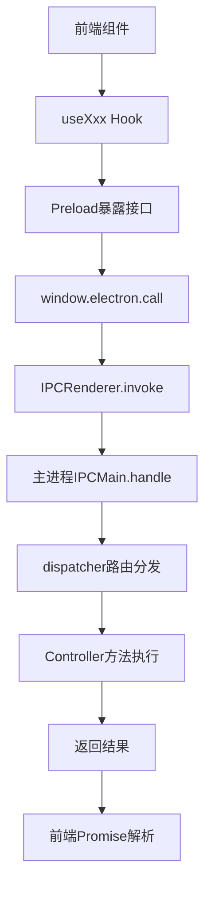
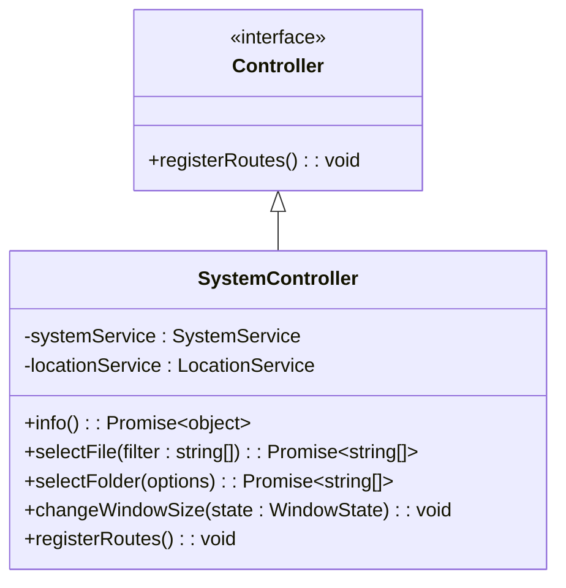
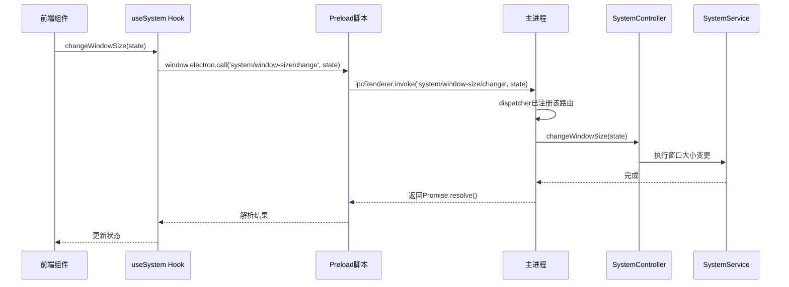
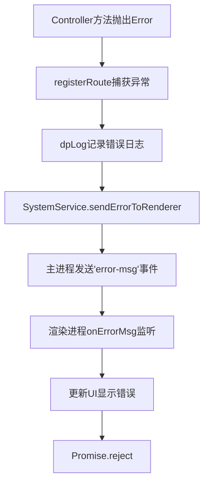

# IPC通信机制

<cite>
**本文档引用的文件**
- [dispatcher.ts](file://src/backend/dispatcher.ts)
- [SystemController.ts](file://src/backend/controllers/SystemController.ts)
- [register.ts](file://src/common/api/register.ts)
- [api-def.ts](file://src/common/api/api-def.ts)
- [preload.ts](file://src/preload.ts)
- [useSystem.ts](file://src/fronted/hooks/useSystem.ts)
</cite>

## 目录
1. [引言](#引言)
2. [IPC通信架构概览](#ipc通信架构概览)
3. [核心分发器dispatcher.ts分析](#核心分发器dispatcherts分析)
4. [Controller路由注册机制](#controller路由注册机制)
5. [完整调用链分析：以SystemController为例](#完整调用链分析以systemcontroller为例)
6. [通信协议设计细节](#通信协议设计细节)
7. [TypeScript类型系统保障接口一致性](#typescript类型系统保障接口一致性)
8. [自定义IPC接口扩展方法](#自定义ipc接口扩展方法)
9. [总结](#总结)

## 引言
DashPlayer基于Electron构建，采用主进程与渲染进程分离的架构。为实现跨进程功能调用，系统设计了一套基于IPC（进程间通信）的请求-响应机制。该机制通过`window.electron.call()`从前端发起请求，经由主进程的路由分发器dispatcher统一处理，并最终映射到具体Controller中的业务方法。本文将深入解析这一通信机制的设计与实现。

## IPC通信架构概览



**Diagram sources**
- [preload.ts](file://src/preload.ts#L20-L44)
- [dispatcher.ts](file://src/backend/dispatcher.ts#L1-L13)
- [SystemController.ts](file://src/backend/controllers/SystemController.ts#L25-L127)

## 核心分发器dispatcher.ts分析

`dispatcher.ts`是整个IPC通信机制的核心中枢，负责初始化所有Controller的路由注册。其主要职责包括：

- 通过Inversify IOC容器获取所有实现了`Controller`接口的Bean实例
- 遍历并调用每个Controller的`registerRoutes()`方法
- 将主窗口引用注入SystemService，便于后续窗口操作

该模块不直接处理任何具体请求，而是作为“注册协调者”，确保所有Controller的API路由在应用启动时被正确绑定至Electron的IPC系统。

**Section sources**
- [dispatcher.ts](file://src/backend/dispatcher.ts#L1-L13)

## Controller路由注册机制

所有Controller需实现`Controller`接口，该接口定义了`registerRoutes()`方法作为统一注册入口：



**Diagram sources**
- [controller.ts](file://src/backend/interfaces/controller.ts#L1-L2)
- [SystemController.ts](file://src/backend/controllers/SystemController.ts#L25-L127)

`registerRoute`函数是路由注册的关键工具，其定义如下：

```ts
export default function registerRoute<K extends keyof ApiMap>(path: K, func: ApiMap[K])
```

它利用TypeScript泛型约束，确保注册的路径必须存在于`ApiMap`类型定义中，且处理函数的参数与返回值类型严格匹配。内部通过`ipcMain.handle`绑定Electron IPC通道，并加入日志记录与错误捕获逻辑，统一处理异常并向渲染进程推送错误信息。

**Section sources**
- [register.ts](file://src/common/api/register.ts#L8-L19)

## 完整调用链分析：以SystemController为例

以`changeWindowSize`为例，展示从前端到后端的完整调用流程：

### 前端调用链
1. 组件中调用`useSystem` Hook提供的状态变更方法
2. Hook内部通过`window.electron.call('system/window-size/change', state)`发起IPC请求
3. Preload脚本通过`ipcRenderer.invoke`转发请求至主进程



**Diagram sources**
- [useSystem.ts](file://src/fronted/hooks/useSystem.ts#L14-L22)
- [preload.ts](file://src/preload.ts#L20-L44)
- [SystemController.ts](file://src/backend/controllers/SystemController.ts#L25-L127)

### 后端处理链
1. `SystemController.registerRoutes()`注册`system/window-size/change`路径
2. `registerRoute`将其绑定至`ipcMain.handle`
3. 请求到达时，调用`this.changeWindowSize(p)`方法
4. 方法委托给`SystemService`完成实际窗口操作

此设计实现了关注点分离：Controller负责接口定义与参数解析，Service负责具体业务逻辑。

## 通信协议设计细节

### 消息格式
- **路径（Path）**：字符串形式的API路径，如`system/select-file`
- **参数（Param）**：可选，任意可序列化的JSON对象
- **响应**：Promise封装的返回值或抛出的Error

### 异步响应处理
所有IPC调用均为异步操作，使用Promise模式：
- 渲染进程通过`await window.electron.call()`等待结果
- 主进程方法可返回Promise或直接值
- 错误通过`throw`抛出，由`registerRoute`统一捕获

### 错误传播机制


该机制确保前后端均能感知错误，同时避免进程崩溃。

**Section sources**
- [register.ts](file://src/common/api/register.ts#L8-L19)
- [SystemController.ts](file://src/backend/controllers/SystemController.ts#L25-L127)

## TypeScript类型系统保障接口一致性

系统通过`api-def.ts`中的`ApiMap`类型实现前后端接口契约的静态检查：

```ts
export type ApiMap = {
    [K in keyof ApiDefinitions]: ApiFunction<ApiDefinitions[K]['params'], Promise<ApiDefinitions[K]['return']>>;
}
```

关键设计点：
- **强类型路径**：`K extends keyof ApiMap`确保路径字符串合法
- **参数类型约束**：调用`call(path, param)`时自动推导`param`类型
- **返回值类型安全**：Promise返回值与定义完全一致
- **编译时检查**：任何类型不匹配将在编译阶段报错

此设计消除了传统IPC通信中常见的字符串拼写错误与类型不一致问题。

**Section sources**
- [api-def.ts](file://src/common/api/api-def.ts#L184-L186)

## 自定义IPC接口扩展方法

扩展新IPC接口的标准化流程如下：

1. **在`api-def.ts`中定义接口**
```ts
interface CustomDef {
    'custom/do-something': { params: { id: string }, return: boolean };
}
// 合并到ApiDefinitions
```

2. **创建新的Controller类**
```ts
@injectable()
export default class CustomController implements Controller {
    public async doSomething(param: { id: string }): Promise<boolean> {
        // 实现逻辑
    }

    public registerRoutes(): void {
        registerRoute('custom/do-something', (p) => this.doSomething(p));
    }
}
```

3. **确保IOC容器扫描到该类**（通过`@injectable()`装饰器）

4. **前端调用**
```ts
const result = await window.electron.call('custom/do-something', { id: '123' });
```

TypeScript将自动验证路径与参数类型，确保端到端类型安全。

**Section sources**
- [api-def.ts](file://src/common/api/api-def.ts#L0-L190)
- [SystemController.ts](file://src/backend/controllers/SystemController.ts#L25-L127)

## 总结
DashPlayer的IPC通信机制通过`dispatcher`统一注册、`registerRoute`类型安全绑定、`Controller`接口规范实现了一套高内聚、低耦合的跨进程调用体系。结合TypeScript的泛型与映射类型，实现了编译时接口契约验证，极大提升了开发效率与系统稳定性。该设计模式可作为Electron应用IPC通信的参考范例。