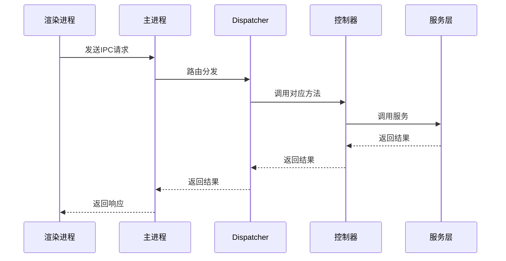
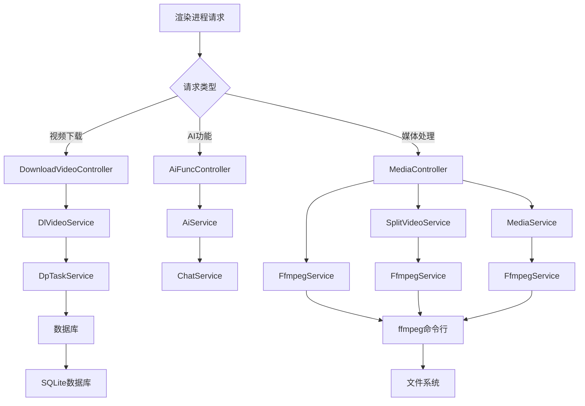
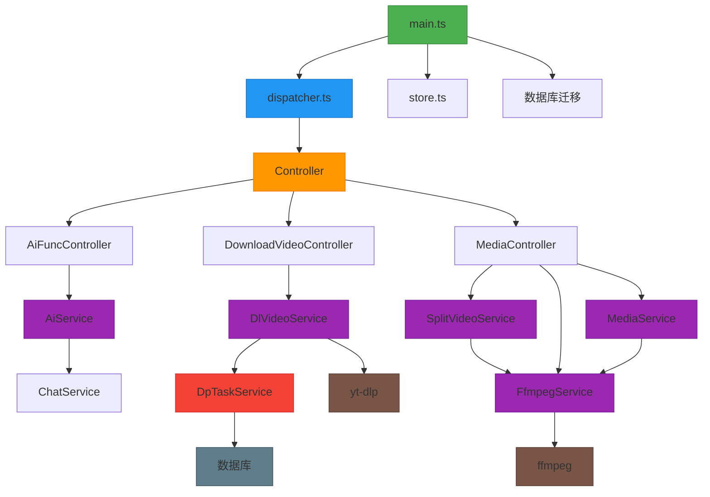

# 后端架构

<cite>
**本文档引用的文件**   
- [main.ts](file://src/main.ts)
- [dispatcher.ts](file://src/backend/dispatcher.ts)
- [store.ts](file://src/backend/store.ts)
- [AiFuncController.ts](file://src/backend/controllers/AiFuncController.ts)
- [DownloadVideoController.ts](file://src/backend/controllers/DownloadVideoController.ts)
- [MediaController.ts](file://src/backend/controllers/MediaController.ts)
- [DpTaskServiceImpl.ts](file://src/backend/services/impl/DpTaskServiceImpl.ts)
- [AiServiceImpl.ts](file://src/backend/services/AiServiceImpl.ts)
- [DlVideoServiceImpl.ts](file://src/backend/services/impl/DlVideoServiceImpl.ts)
- [SplitVideoServiceImpl.ts](file://src/backend/services/impl/SplitVideoServiceImpl.ts)
- [FfmpegServiceImpl.ts](file://src/backend/services/impl/FfmpegServiceImpl.ts)
- [MediaServiceImpl.ts](file://src/backend/services/impl/MediaServiceImpl.ts)
- [controller.ts](file://src/backend/interfaces/controller.ts)
- [DpTaskService.ts](file://src/backend/services/DpTaskService.ts)
- [AiService.ts](file://src/backend/services/AiService.ts)
- [DlVideoService.ts](file://src/backend/services/DlVideoService.ts)
- [SplitVideoService.ts](file://src/backend/services/SplitVideoService.ts)
- [FfmpegService.ts](file://src/backend/services/FfmpegService.ts)
- [MediaService.ts](file://src/backend/services/MediaService.ts)
- [types.ts](file://src/backend/ioc/types.ts)
</cite>

## 目录
1. [主进程生命周期与应用初始化](#主进程生命周期与应用初始化)
2. [窗口创建与协议处理](#窗口创建与协议处理)
3. [IPC路由机制](#ipc路由机制)
4. [MVC架构实现](#mvc架构实现)
5. [全局状态管理](#全局状态管理)
6. [系统资源交互](#系统资源交互)
7. [后端模块关系图](#后端模块关系图)

## 主进程生命周期与应用初始化

DashPlayer的主进程由`main.ts`文件控制，遵循Electron的标准应用生命周期。应用在`app.ready`事件触发时完成初始化，此时执行数据库迁移操作并创建主窗口。应用通过监听`window-all-closed`事件来管理窗口关闭行为，在非macOS系统上，当所有窗口关闭时应用退出；而在macOS系统上，应用保持运行状态直到用户显式退出。`app.activate`事件处理程序确保在macOS上当应用被重新激活时能够重新创建窗口。

**Section sources**
- [main.ts](file://src/main.ts#L1-L98)

## 窗口创建与协议处理

主进程通过`createWindow`函数创建和配置主窗口，设置窗口尺寸、无边框模式和自定义标题栏样式。窗口加载由Vite构建的渲染进程内容，并在开发模式下自动打开开发者工具。主进程注册了`dp://`和`dp-file://`两种自定义协议。`dp://`协议用于处理Base32编码的URL，支持HTTP资源和本地文件的透明访问；`dp-file://`协议则直接映射到本地文件系统路径，实现安全的文件访问。

**Section sources**
- [main.ts](file://src/main.ts#L1-L98)
- [UrlUtil.ts](file://src/common/utils/UrlUtil.ts#L6-L46)

## IPC路由机制

后端通过`dispatcher.ts`文件实现IPC请求的集中路由。`registerHandler`函数从Inversify依赖注入容器中获取所有实现了`Controller`接口的控制器实例，并调用其`registerRoutes`方法进行路由注册。该机制将渲染进程的请求通过`registerRoute`函数映射到具体的控制器方法，实现了请求分发的解耦和可扩展性。



**Diagram sources**
- [dispatcher.ts](file://src/backend/dispatcher.ts#L1-L13)
- [main.ts](file://src/main.ts#L98)

## MVC架构实现

后端采用MVC模式组织代码，其中控制器（Controller）接收并处理来自渲染进程的请求，调用服务层（Service）执行业务逻辑，服务层再操作数据或调用外部系统。例如，`AiFuncController`接收AI功能请求，调用`AiService`执行具体AI任务；`DownloadVideoController`处理视频下载请求，通过`DlVideoService`协调下载流程。这种分层设计实现了关注点分离，提高了代码的可维护性和可测试性。

```mermaid
classDiagram
class Controller {
<<interface>>
+registerRoutes() : void
}
class AiFuncController {
+analyzeNewWords(sentence : string) : Promise~number~
+analyzeNewPhrases(sentence : string) : Promise~number~
+analyzeGrammars(sentence : string) : Promise~number~
+makeSentences(params : {sentence : string, point : string[]}) : Promise~number~
+polish(sentence : string) : Promise~number~
+formatSplit(text : string) : Promise~number~
+phraseGroup(sentence : string) : Promise~number~
+punctuation(params : {no : number, srt : string}) : Promise~number~
+translateWithContext(params : {sentence : string, context : string[]}) : Promise~number~
+tts(string : string) : Promise~string~
+chat(params : {msgs : MsgT[]}) : Promise~number~
+transcript(params : {filePath : string}) : Promise~number~
+explainSelectWithContext(params : {sentence : string, selectedWord : string}) : Promise~number~
+explainSelect(params : {word : string}) : Promise~number~
+registerRoutes() : void
}
class DownloadVideoController {
+downloadVideo(params : {url : string, cookies : COOKIE}) : Promise~number~
+registerRoutes() : void
}
class MediaController {
+previewSplit(str : string) : Promise~ChapterParseResult[]~
+split(params : {videoPath : string, srtPath : string | null, chapters : ChapterParseResult[]}) : Promise~string~
+thumbnail(params : {filePath : string, time : number}) : Promise~string~
+videoLength(filePath : string) : Promise~number~
+registerRoutes() : void
}
class Service {
<<interface>>
}
class AiService {
<<interface>>
+polish(taskId : number, sentence : string) : Promise~void~
+formatSplit(taskId : number, text : string) : Promise~void~
+analyzeWord(taskId : number, sentence : string) : Promise~void~
+analyzePhrase(taskId : number, sentence : string) : Promise~void~
+analyzeGrammar(taskId : number, sentence : string) : Promise~void~
+makeSentences(taskId : number, sentence : string, point : string[]) : Promise~void~
+synonymousSentence(taskId : number, sentence : string) : Promise~void~
+phraseGroup(taskId : number, sentence : string) : Promise~void~
+punctuation(taskId : number, no : number, fullSrt : string) : Promise~void~
+explainSelect(taskId : number, word : string) : Promise~void~
+explainSelectWithContext(taskId : number, sentence : string, selectedWord : string) : Promise~void~
+translateWithContext(taskId : number, sentence : string, context : string[]) : Promise~void~
}
class DlVideoService {
<<interface>>
+dlVideo(taskId : number, url : string, cookies : string, savePath : string) : Promise~void~
}
class SplitVideoService {
<<interface>>
+previewSplit(str : string) : Promise~ChapterParseResult[]~
+splitByChapters(params : {videoPath : string, srtPath : string | null, chapters : ChapterParseResult[]}) : Promise~string~
}
class FfmpegService {
<<interface>>
+splitVideo(params : {inputFile : string, startSecond : number, endSecond : number, outputFile : string}) : Promise~void~
+splitVideoByTimes(params : {inputFile : string, times : number[], outputFolder : string, outputFilePrefix : string}) : Promise~string[]~
+duration(filePath : string) : Promise~number~
+thumbnail(params : {inputFile : string, outputFileName : string, outputFolder : string, time : number}) : Promise~void~
+splitToAudio(params : {taskId : number, inputFile : string, outputFolder : string, segmentTime : number}) : Promise~string[]~
+toMp4(params : {inputFile : string, onProgress? : (progress : number) => void}) : Promise~string~
+mkvToMp4(params : {taskId : number, inputFile : string, onProgress? : (progress : number) => void}) : Promise~string~
+extractSubtitles(params : {taskId : number, inputFile : string, onProgress? : (progress : number) => void, en : boolean}) : Promise~string~
+trimVideo(inputPath : string, startTime : number, endTime : number, outputPath : string) : Promise~void~
}
class MediaService {
<<interface>>
+thumbnail(inputFile : string, time? : number) : Promise~string~
+duration(inputFile : string) : Promise~number~
}
Controller <|.. AiFuncController : 实现
Controller <|.. DownloadVideoController : 实现
Controller <|.. MediaController : 实现
Service <|.. AiService : 定义
Service <|.. DlVideoService : 定义
Service <|.. SplitVideoService : 定义
Service <|.. FfmpegService : 定义
Service <|.. MediaService : 定义
AiFuncController --> AiService : 使用
DownloadVideoController --> DlVideoService : 使用
MediaController --> SplitVideoService : 使用
MediaController --> FfmpegService : 使用
MediaController --> MediaService : 使用
```

**Diagram sources**
- [AiFuncController.ts](file://src/backend/controllers/AiFuncController.ts#L12-L129)
- [DownloadVideoController.ts](file://src/backend/controllers/DownloadVideoController.ts#L9-L35)
- [MediaController.ts](file://src/backend/controllers/MediaController.ts#L9-L56)
- [AiService.ts](file://src/backend/services/AiService.ts#L19-L43)
- [DlVideoService.ts](file://src/backend/services/DlVideoService.ts#L0-L2)
- [SplitVideoService.ts](file://src/backend/services/SplitVideoService.ts#L5-L17)
- [FfmpegService.ts](file://src/backend/services/FfmpegService.ts#L2-L84)
- [MediaService.ts](file://src/backend/services/MediaService.ts#L0-L3)

## 全局状态管理

应用使用`electron-store`库实现全局状态的持久化管理。`store.ts`文件提供了`storeSet`和`storeGet`两个函数，用于设置和获取存储在`electron-store`中的配置项。该机制支持默认值管理，当获取的值为空时返回预设的默认值，并在设置值时进行空值检查，避免不必要的存储操作。

**Section sources**
- [store.ts](file://src/backend/store.ts#L1-L23)
- [store_schema.ts](file://src/common/types/store_schema.ts)

## 系统资源交互

主进程通过服务层与系统资源进行交互。`DpTaskService`管理后台任务的生命周期，包括创建、更新、完成和取消任务，并将任务状态持久化到数据库。`DlVideoService`使用`yt-dlp`和`ffmpeg`工具链下载视频，通过`ChildProcessTask`管理子进程。`FfmpegService`封装了`fluent-ffmpeg`库，提供视频分割、格式转换、字幕提取等多媒体处理功能。`LocationService`统一管理应用的各种路径，确保跨平台兼容性。



**Diagram sources**
- [DpTaskServiceImpl.ts](file://src/backend/services/impl/DpTaskServiceImpl.ts#L13-L192)
- [DlVideoServiceImpl.ts](file://src/backend/services/impl/DlVideoServiceImpl.ts#L32-L90)
- [FfmpegServiceImpl.ts](file://src/backend/services/impl/FfmpegServiceImpl.ts#L16-L355)
- [MediaServiceImpl.ts](file://src/backend/services/impl/MediaServiceImpl.ts#L9-L63)
- [SplitVideoServiceImpl.ts](file://src/backend/services/impl/SplitVideoServiceImpl.ts#L17-L113)
- [AiServiceImpl.ts](file://src/backend/services/AiServiceImpl.ts#L45-L153)

## 后端模块关系图



**Diagram sources**
- [main.ts](file://src/main.ts#L1-L98)
- [dispatcher.ts](file://src/backend/dispatcher.ts#L1-L13)
- [store.ts](file://src/backend/store.ts#L1-L23)
- [AiFuncController.ts](file://src/backend/controllers/AiFuncController.ts#L12-L129)
- [DownloadVideoController.ts](file://src/backend/controllers/DownloadVideoController.ts#L9-L35)
- [MediaController.ts](file://src/backend/controllers/MediaController.ts#L9-L56)
- [DpTaskServiceImpl.ts](file://src/backend/services/impl/DpTaskServiceImpl.ts#L13-L192)
- [AiServiceImpl.ts](file://src/backend/services/AiServiceImpl.ts#L45-L153)
- [DlVideoServiceImpl.ts](file://src/backend/services/impl/DlVideoServiceImpl.ts#L32-L90)
- [SplitVideoServiceImpl.ts](file://src/backend/services/impl/SplitVideoServiceImpl.ts#L17-L113)
- [FfmpegServiceImpl.ts](file://src/backend/services/impl/FfmpegServiceImpl.ts#L16-L355)
- [MediaServiceImpl.ts](file://src/backend/services/impl/MediaServiceImpl.ts#L9-L63)