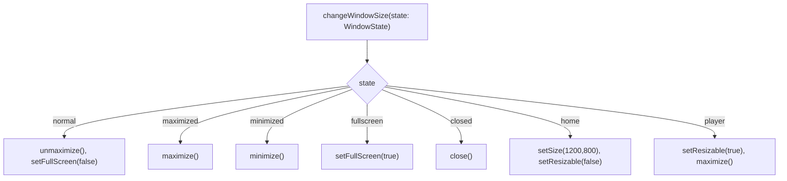
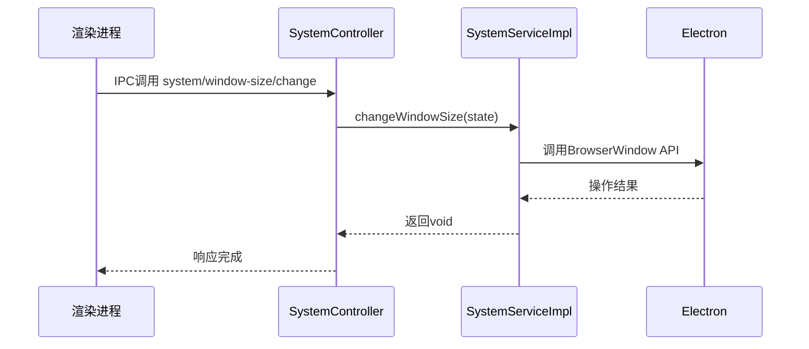
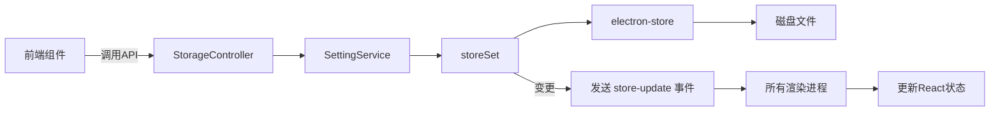

# 服务层架构设计

<cite>
**本文档引用的文件**  
- [SystemService.ts](file://src/backend/services/SystemService.ts)
- [SystemServiceImpl.ts](file://src/backend/services/impl/SystemServiceImpl.ts)
- [inversify.config.ts](file://src/backend/ioc/inversify.config.ts)
- [SystemController.ts](file://src/backend/controllers/SystemController.ts)
- [store.ts](file://src/backend/store.ts)
- [TypeGuards.ts](file://src/backend/utils/TypeGuards.ts)
- [SettingServiceImpl.ts](file://src/backend/services/impl/SettingServiceImpl.ts)
- [StorageController.ts](file://src/backend/controllers/StorageController.ts)
</cite>

## 目录
1. [依赖注入体系](#依赖注入体系)
2. [服务实现与核心功能](#服务实现与核心功能)
3. [服务与控制器的协作模式](#服务与控制器的协作模式)
4. [全局状态管理](#全局状态管理)
5. [生命周期与运行时安全](#生命周期与运行时安全)
6. [服务依赖关系图](#服务依赖关系图)

## 依赖注入体系

DashPlayer后端服务层采用InversifyJS实现依赖注入（DI）与控制反转（IoC），通过`@injectable`和`@inject`装饰器构建松耦合、可测试的架构。`inversify.config.ts`文件中定义了容器（Container）的配置，将接口与具体实现进行绑定，并声明为单例作用域（inSingletonScope），确保服务在整个应用生命周期中唯一存在。

例如，`SystemService`接口被绑定到`SystemServiceImpl`实现类，通过`TYPES.SystemService`符号进行标识。当其他组件需要使用系统服务时，仅需通过`@inject(TYPES.SystemService)`注入，无需关心其实例化过程，由容器自动解析依赖并注入。

```mermaid
classDiagram
class SystemService {
<<interface>>
+changeWindowSize(state : WindowState) void
+windowState() WindowState
+isWindows() boolean
+sendErrorToRenderer(error : Error) void
+sendInfoToRenderer(info : string) void
+mainWindow() Electron.BrowserWindow
+setMainWindow(mainWindowRef : { current : BrowserWindow | null }) void
}
class SystemServiceImpl {
-mainWindowRef : { current : BrowserWindow | null }
+mainWindow() Electron.BrowserWindow
+setMainWindow(mainWindowRef) void
+changeWindowSize(state) void
+windowState() WindowState
+isWindows() boolean
+sendErrorToRenderer(error) void
+sendInfoToRenderer(info) void
+init() void
}
SystemServiceImpl ..|> SystemService : 实现
```

**图表来源**  
- [SystemService.ts](file://src/backend/services/SystemService.ts#L6-L21)
- [SystemServiceImpl.ts](file://src/backend/services/impl/SystemServiceImpl.ts#L8-L84)

**本节来源**  
- [inversify.config.ts](file://src/backend/ioc/inversify.config.ts#L0-L108)
- [SystemService.ts](file://src/backend/services/SystemService.ts#L6-L21)

## 服务实现与核心功能

以`SystemServiceImpl`为例，该服务负责管理主窗口实例、处理窗口状态变更及与渲染进程通信。其核心功能包括：

- **主窗口管理**：通过`mainWindowRef`字段持有主窗口引用，`setMainWindow`方法用于设置引用，`mainWindow`方法通过`TypeGuards.assertNotNull`确保返回的窗口实例非空，避免运行时错误。
- **窗口状态变更**：`changeWindowSize`方法接收`WindowState`枚举值（如'normal'、'maximized'等），调用Electron的`BrowserWindow` API执行相应操作，如最大化、最小化、全屏等。
- **渲染进程通信**：`sendErrorToRenderer`和`sendInfoToRenderer`方法通过`webContents.send`向渲染进程发送消息，实现主进程与渲染进程的双向通信。



**图表来源**  
- [SystemServiceImpl.ts](file://src/backend/services/impl/SystemServiceImpl.ts#L20-L68)

**本节来源**  
- [SystemServiceImpl.ts](file://src/backend/services/impl/SystemServiceImpl.ts#L8-L84)
- [Types.ts](file://src/common/types/Types.ts#L0-L7)

## 服务与控制器的协作模式

服务层与控制器（Controller）遵循清晰的职责分离原则：**控制器仅负责接收请求并路由，业务逻辑由服务层封装**。控制器通过`@inject`注入所需服务，调用服务方法处理业务，并将结果返回。

以`SystemController`为例，其`changeWindowSize`方法接收前端请求参数，直接委托给`SystemService`的同名方法执行，自身不包含任何业务逻辑。控制器通过`registerRoutes`方法将API路径与处理函数绑定，利用`registerRoute`工具函数注册IPC通信句柄。



**图表来源**  
- [SystemController.ts](file://src/backend/controllers/SystemController.ts#L25-L127)
- [SystemServiceImpl.ts](file://src/backend/services/impl/SystemServiceImpl.ts#L20-L30)

**本节来源**  
- [SystemController.ts](file://src/backend/controllers/SystemController.ts#L25-L127)
- [register.ts](file://src/common/api/register.ts#L8-L19)

## 全局状态管理

`store.ts`文件封装了`electron-store`库，提供全局持久化状态的读写接口。`storeSet`和`storeGet`函数用于操作键值对，支持默认值回退和变更检测。该状态存储用于保存用户配置（如API密钥、路径设置等），并通过`SettingService`与前端同步。

`SettingServiceImpl`在调用`storeSet`后，若值发生变更，会通过`systemService`向所有渲染进程发送`'store-update'`事件，通知前端更新状态。前端通过`useSetting`等Hook订阅这些事件，实现状态的实时响应。



**图表来源**  
- [store.ts](file://src/backend/store.ts#L7-L21)
- [SettingServiceImpl.ts](file://src/backend/services/impl/SettingServiceImpl.ts#L12-L16)

**本节来源**  
- [store.ts](file://src/backend/store.ts#L7-L21)
- [SettingServiceImpl.ts](file://src/backend/services/impl/SettingServiceImpl.ts#L9-L21)
- [StorageController.ts](file://src/backend/controllers/StorageController.ts#L9-L37)

## 生命周期与运行时安全

`@postConstruct`装饰器用于标记服务初始化方法，在依赖注入完成后自动执行。`SystemServiceImpl`中的`init`方法使用此装饰器，用于初始化`PathUtil.SEPARATOR`，确保路径分隔符与当前操作系统一致。

`TypeGuards`工具类提供类型断言和运行时安全检查。`assertNotNull`方法在访问`mainWindowRef.current`前进行非空断言，若为`null`或`undefined`则抛出`AssertionError`，防止后续调用空对象方法导致崩溃。该模式广泛应用于代码中，提升健壮性。

```mermaid
flowchart TD
Start([init方法]) --> SetSeparator["PathUtil.SEPARATOR = path.sep"]
SetSeparator --> End([初始化完成])
Subgraph TypeGuards断言
A["mainWindow()"] --> B["const current = mainWindowRef.current"]
B --> C["TypeGuards.assertNotNull(current)"]
C --> |成功| D["return current"]
C --> |失败| E["throw AssertionError"]
end
```

**图表来源**  
- [SystemServiceImpl.ts](file://src/backend/services/impl/SystemServiceImpl.ts#L80-L84)
- [TypeGuards.ts](file://src/backend/utils/TypeGuards.ts#L2-L38)

**本节来源**  
- [SystemServiceImpl.ts](file://src/backend/services/impl/SystemServiceImpl.ts#L80-L84)
- [TypeGuards.ts](file://src/backend/utils/TypeGuards.ts#L2-L38)
- [AssertionError.ts](file://src/backend/errors/AssertionError.ts#L0-L6)

## 服务依赖关系图

以下图表展示了DashPlayer后端核心服务模块的组织结构与依赖关系，体现了基于InversifyJS的依赖注入体系。

```mermaid
graph TD
    subgraph Controllers
        SC[SystemController]
        TC[TagController]
        DVC[DownloadVideoController]
        WC[WatchHistoryController]
        AC[AiFuncController]
        ATC[AiTransController]
        STC[SrtTimeAdjustController]
        MC[MediaController]
        CC[ConvertController]
        FCC[FavoriteClipsController]
        STC2[StorageController]
    end
    
    subgraph Services
        SS[SystemService]
        LS[LocationService]
        TSS[TagService]
       