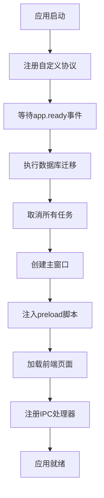
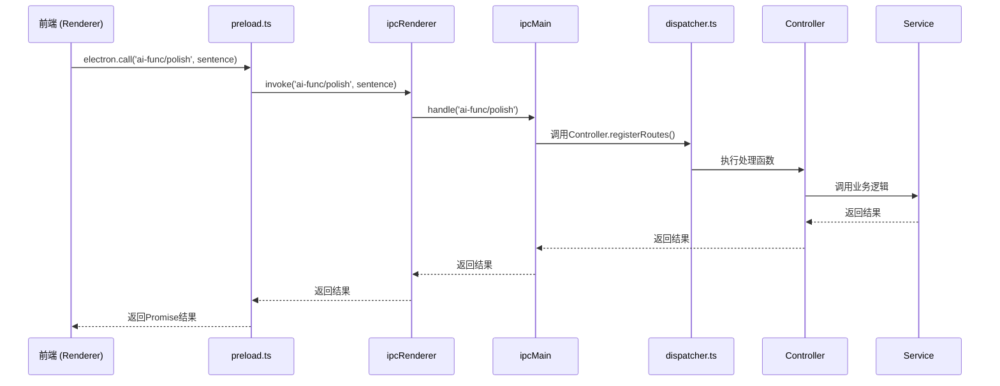
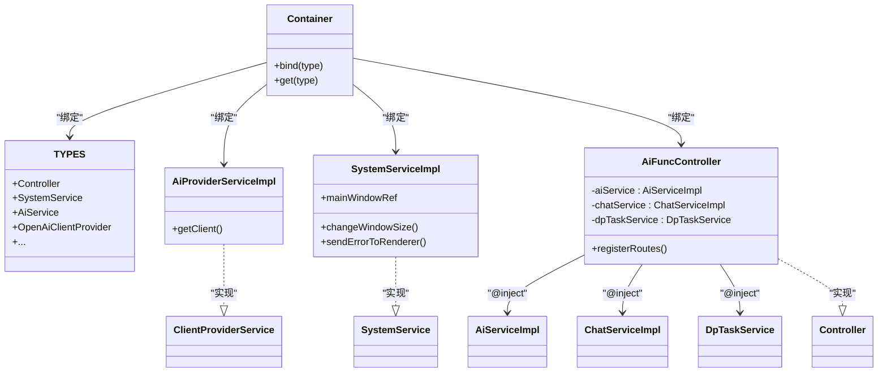
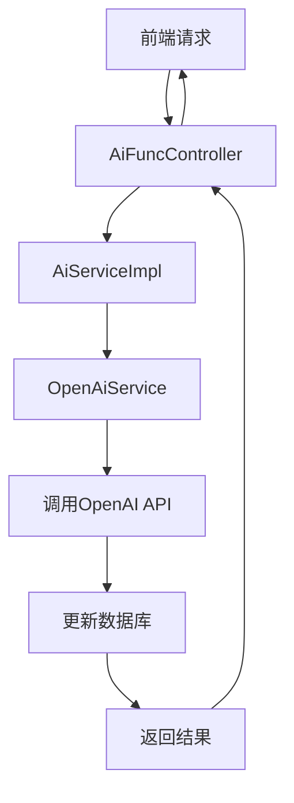
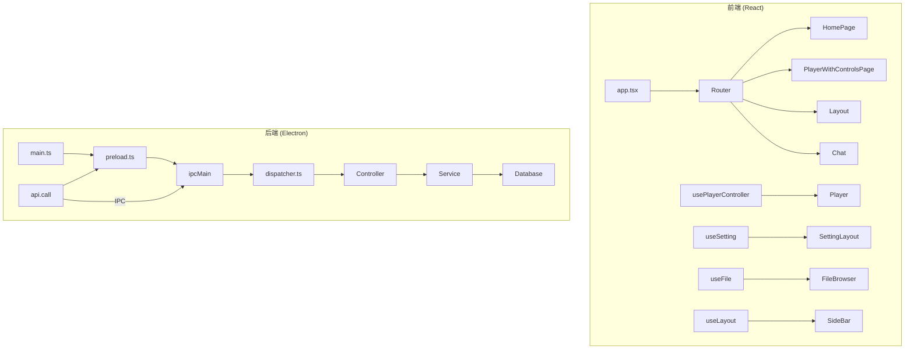

# 架构设计

<cite>
**本文档引用的文件**  
- [main.ts](file://src/main.ts)
- [preload.ts](file://src/preload.ts)
- [dispatcher.ts](file://src/backend/dispatcher.ts)
- [inversify.config.ts](file://src/backend/ioc/inversify.config.ts)
- [AiFuncController.ts](file://src/backend/controllers/AiFuncController.ts)
- [DpTaskController.ts](file://src/backend/controllers/DpTaskController.ts)
- [SystemServiceImpl.ts](file://src/backend/services/impl/SystemServiceImpl.ts)
- [FavouriteClipsServiceImpl.ts](file://src/backend/services/impl/FavouriteClipsServiceImpl.ts)
- [AiProviderServiceImpl.ts](file://src/backend/services/impl/clients/AiProviderServiceImpl.ts)
- [controller.ts](file://src/backend/interfaces/controller.ts)
- [SystemService.ts](file://src/backend/services/SystemService.ts)
- [FavouriteClipsService.ts](file://src/backend/services/FavouriteClipsService.ts)
- [AiServiceImpl.ts](file://src/backend/services/AiServiceImpl.ts)
- [ChatService.ts](file://src/backend/services/ChatService.ts)
- [WhisperService.ts](file://src/backend/services/WhisperService.ts)
- [register.ts](file://src/common/api/register.ts)
- [store.ts](file://src/backend/store.ts)
- [app.tsx](file://src/app.tsx)
- [usePlayerController.ts](file://src/fronted/hooks/usePlayerController.ts)
- [Player.tsx](file://src/fronted/components/Player.tsx)
- [useSetting.ts](file://src/fronted/hooks/useSetting.ts)
- [useFile.ts](file://src/fronted/hooks/useFile.ts)
- [useLayout.ts](file://src/fronted/hooks/useLayout.ts)
- [PlayerWithControlsPage.tsx](file://src/fronted/pages/PlayerWithControlsPage.tsx)
- [Layout.tsx](file://src/fronted/pages/Layout.tsx)
- [HomePage.tsx](file://src/fronted/pages/HomePage.tsx)
- [SideBar.tsx](file://src/fronted/components/SideBar.tsx)
- [FileBrowser.tsx](file://src/fronted/components/FileBrowser.tsx)
- [PlayerSrtLayout.tsx](file://src/fronted/components/PlayerSrtLayout.tsx)
- [Chat.tsx](file://src/fronted/components/chat/Chat.tsx)
- [useChatPanel.ts](file://src/fronted/hooks/useChatPanel.ts)
- [useConvert.ts](file://src/fronted/hooks/useConvert.ts)
- [useDpTask.ts](file://src/fronted/hooks/useDpTask.ts)
- [useFavouriteClip.ts](file://src/fronted/hooks/useFavouriteClip.ts)
- [useDpTaskCenter.ts](file://src/fronted/hooks/useDpTaskCenter.ts)
- [useDpTaskViewer.ts](file://src/fronted/hooks/useDpTaskViewer.ts)
- [useSystem.ts](file://src/fronted/hooks/useSystem.ts)
- [useSplit.ts](file://src/fronted/hooks/useSplit.ts)
- [usePlayerToaster.ts](file://src/fronted/hooks/usePlayerToaster.ts)
- [useSettingForm.ts](file://src/fronted/hooks/useSettingForm.ts)
- [useTranscript.ts](file://src/fronted/hooks/useTranscript.ts)
</cite>

## 目录
1. [项目结构](#项目结构)
2. [Electron主进程启动流程](#electron主进程启动流程)
3. [前后端通信机制](#前后端通信机制)
4. [依赖注入系统](#依赖注入系统)
5. [MVC分层架构](#mvc分层架构)
6. [前端React应用结构](#前端react应用结构)
7. [系统架构图](#系统架构图)

## 项目结构

DashPlayer项目采用分层架构，主要分为`backend`（后端）、`common`（公共模块）、`fronted`（前端）和`assets`（资源）四个核心目录。后端基于Electron主进程运行，使用TypeScript编写，采用InversifyJS实现依赖注入。前端为React应用，使用Zustand进行状态管理，并通过Vite构建。项目通过`src/main.ts`作为Electron主进程入口，`src/renderer`为前端渲染入口。

**本节来源**
- [main.ts](file://src/main.ts#L1-L98)
- [app.tsx](file://src/app.tsx#L32-L121)

## Electron主进程启动流程

Electron主进程的启动由`main.ts`文件控制。应用初始化时，首先注册自定义协议`dp`和`dp-file`，用于安全地加载本地资源和处理加密URL。随后在`app.ready`事件中执行数据库迁移（`runMigrate`），取消所有未完成的任务（`DpTaskServiceImpl.cancelAll()`），然后创建主窗口。

主窗口创建时，通过`webPreferences.preload`选项注入`preload.js`脚本，该脚本在渲染进程加载前执行，用于建立安全的IPC通信桥梁。窗口加载的URL由环境变量`MAIN_WINDOW_VITE_DEV_SERVER_URL`决定，开发模式下连接Vite开发服务器，生产模式下加载打包后的`index.html`。最后，通过`registerHandler`函数注册所有后端路由处理器。



**本节来源**
- [main.ts](file://src/main.ts#L1-L98)

## 前后端通信机制

DashPlayer采用Electron的IPC（进程间通信）机制实现前后端通信。通信的核心是`preload.ts`文件，它通过`contextBridge.exposeInMainWorld`向渲染进程暴露一个名为`electron`的全局对象，其中包含`call`和`safeCall`方法，用于安全地调用主进程的API。

`preload.ts`中定义的`electron.call()`方法封装了`ipcRenderer.invoke()`，允许前端以Promise的形式调用后端API。后端通过`dispatcher.ts`中的`registerHandler`函数，利用Inversify容器获取所有实现了`Controller`接口的控制器，并调用其`registerRoutes`方法。`registerRoute`函数将API路径与处理函数绑定到`ipcMain.handle`上，当`electron.call()`被调用时，`ipcMain`会执行对应的后端逻辑。



**本节来源**
- [preload.ts](file://src/preload.ts#L1-L47)
- [dispatcher.ts](file://src/backend/dispatcher.ts#L1-L13)
- [register.ts](file://src/common/api/register.ts#L8-L19)

## 依赖注入系统

项目使用InversifyJS实现依赖注入（DI），其核心配置位于`inversify.config.ts`。该文件创建一个全局的`Container`实例，并通过`bind`方法将接口（`TYPES`）绑定到具体的实现类上，且大多数服务都以单例模式（`inSingletonScope()`）注册。

例如，`AiProviderServiceImpl`被绑定到`TYPES.OpenAiClientProvider`，`SystemServiceImpl`被绑定到`TYPES.SystemService`。在控制器或服务类中，通过`@inject(TYPES.XXX)`装饰器声明依赖，Inversify容器会在实例化时自动解析并注入相应的服务实例。这种模式实现了控制反转（IoC），降低了组件间的耦合度，提高了代码的可测试性和可维护性。



**本节来源**
- [inversify.config.ts](file://src/backend/ioc/inversify.config.ts#L1-L108)
- [AiFuncController.ts](file://src/backend/controllers/AiFuncController.ts#L12-L129)
- [AiProviderServiceImpl.ts](file://src/backend/services/impl/clients/AiProviderServiceImpl.ts#L8-L30)

## MVC分层架构

DashPlayer后端遵循MVC（Model-View-Controller）分层模式，尽管在Electron应用中“View”主要由前端负责，但后端清晰地划分了Controller（控制器）、Service（服务）和数据访问层。

- **Controller层**：位于`src/backend/controllers`目录，如`AiFuncController`、`DpTaskController`。它们负责接收来自前端的IPC请求，调用相应的Service处理业务逻辑，并返回结果。Controller通过`registerRoutes`方法注册API路由。
- **Service层**：位于`src/backend/services`目录，包含业务逻辑。例如，`AiServiceImpl`处理AI相关的业务，`FavouriteClipsServiceImpl`管理收藏夹的增删改查。Service层会调用更底层的工具类或直接访问数据库。
- **数据访问**：通过Drizzle ORM与SQLite数据库交互，表定义位于`src/backend/db/tables`。Service层通过注入的数据库实例执行CRUD操作。

例如，当用户请求分析一个新单词时，流程为：前端调用`electron.call('ai-func/analyze-new-words')` → `AiFuncController.analyzeNewWords()` → `AiServiceImpl.analyzeWord()` → 最终可能调用OpenAI API并更新数据库。



**本节来源**
- [AiFuncController.ts](file://src/backend/controllers/AiFuncController.ts#L12-L129)
- [AiServiceImpl.ts](file://src/backend/services/AiServiceImpl.ts#L19-L43)
- [FavouriteClipsServiceImpl.ts](file://src/backend/services/impl/FavouriteClipsServiceImpl.ts#L34-L428)
- [SystemServiceImpl.ts](file://src/backend/services/impl/SystemServiceImpl.ts#L8-L84)

## 前端React应用结构

前端应用基于React 18构建，使用Zustand作为状态管理库，通过`create`函数创建多个独立的store，如`usePlayerController`、`useSetting`、`useFile`等，实现了状态的模块化管理。

- **状态管理**：`usePlayerController`整合了播放器、字幕、句子等多个状态切片（slice），集中管理播放逻辑。`useSetting`管理应用设置，其`setSetting`方法会通过`api.call`将变更同步到后端存储。
- **组件组织**：组件按功能组织在`src/fronted/components`目录下，如`Player`、`SideBar`、`FileBrowser`等。页面位于`src/fronted/pages`，通过React Router进行导航。
- **路由**：使用`HashRouter`，路由配置在`app.tsx`中。例如，`/player/:videoId`页面由`PlayerWithControlsPage`渲染，该页面根据URL参数加载视频并初始化播放器。
- **UI库**：集成了Radix UI和Tailwind CSS，提供现代化的UI组件。



**本节来源**
- [app.tsx](file://src/app.tsx#L32-L121)
- [usePlayerController.ts](file://src/fronted/hooks/usePlayerController.ts#L28-L46)
- [useSetting.ts](file://src/fronted/hooks/useSetting.ts#L16-L36)
- [useFile.ts](file://src/fronted/hooks/useFile.ts#L20-L67)
- [useLayout.ts](file://src/fronted/hooks/useLayout.ts#L23-L45)
- [PlayerWithControlsPage.tsx](file://src/fronted/pages/PlayerWithControlsPage.tsx#L25-L263)
- [Layout.tsx](file://src/fronted/pages/Layout.tsx#L7-L58)
- [HomePage.tsx](file://src/fronted/pages/HomePage.tsx#L19-L140)
- [SideBar.tsx](file://src/fronted/components/SideBar.tsx#L13-L105)
- [FileBrowser.tsx](file://src/fronted/components/FileBrowser.tsx#L20-L171)

## 系统架构图

以下是DashPlayer的整体系统架构图，展示了前端、后端、数据库和外部服务之间的关系。

```mermaid
graph TD
subgraph "前端 (Renderer Process)"
A[React App] --> B[Zustand Stores]
B --> C[usePlayerController]
B --> D[useSetting]
B --> E[useFile]
B --> F[useLayout]
C --> G[Player Component]
D --> H[Setting Pages]
E --> I[FileBrowser]
F --> J[SideBar]
A --> K[preload.ts]
K --> L[electron.call()]
end
subgraph "主进程 (Main Process)"
M[main.ts] --> N[BrowserWindow]
N --> O[preload.js]
O --> P[ipcRenderer]
P --> Q[ipcMain]
Q --> R[dispatcher.ts]
R --> S[Controller Layer]
S --> T[Service Layer]
T --> U[Database (SQLite)]
T --> V[外部API (OpenAI, etc.)]
T --> W[文件系统]
end
L -- IPC:invoke --> Q
Q -- IPC:handle --> L
style A fill:#4ECDC4,stroke:#333
style M fill:#FF6B6B,stroke:#333
style U fill:#45B7D1,stroke:#333
style V fill:#96CEB4,stroke:#333
```

**本节来源**
- [main.ts](file://src/main.ts#L1-L98)
- [preload.ts](file://src/preload.ts#L1-L47)
- [dispatcher.ts](file://src/backend/dispatcher.ts#L1-L13)
- [inversify.config.ts](file://src/backend/ioc/inversify.config.ts#L1-L108)
- [app.tsx](file://src/app.tsx#L32-L121)