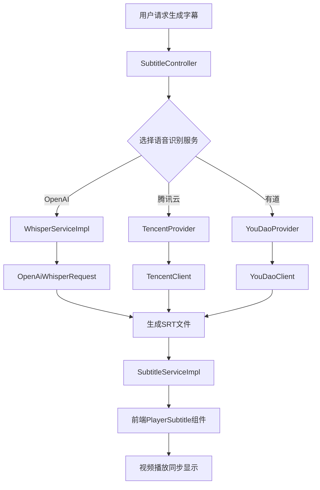
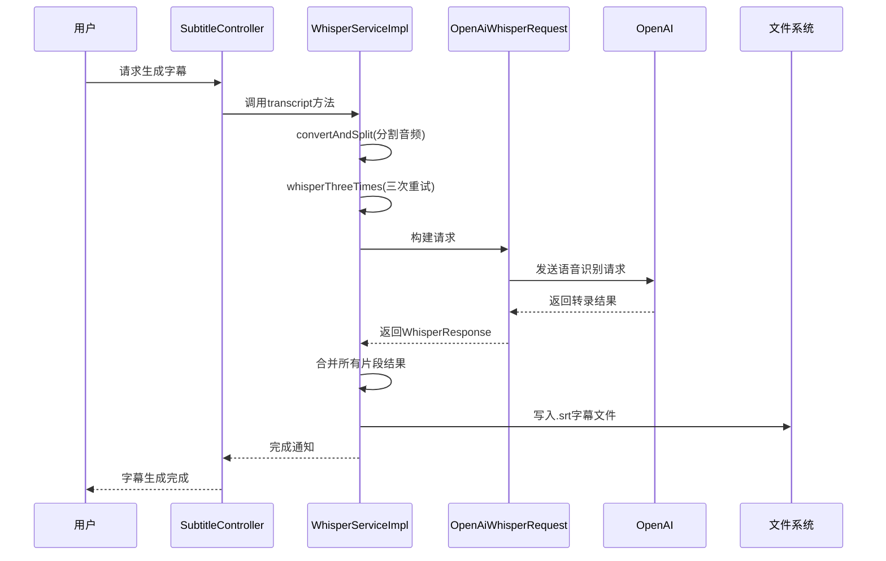
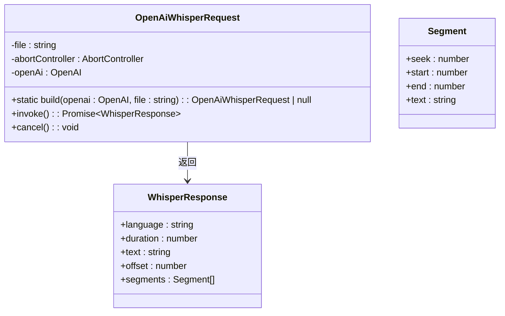
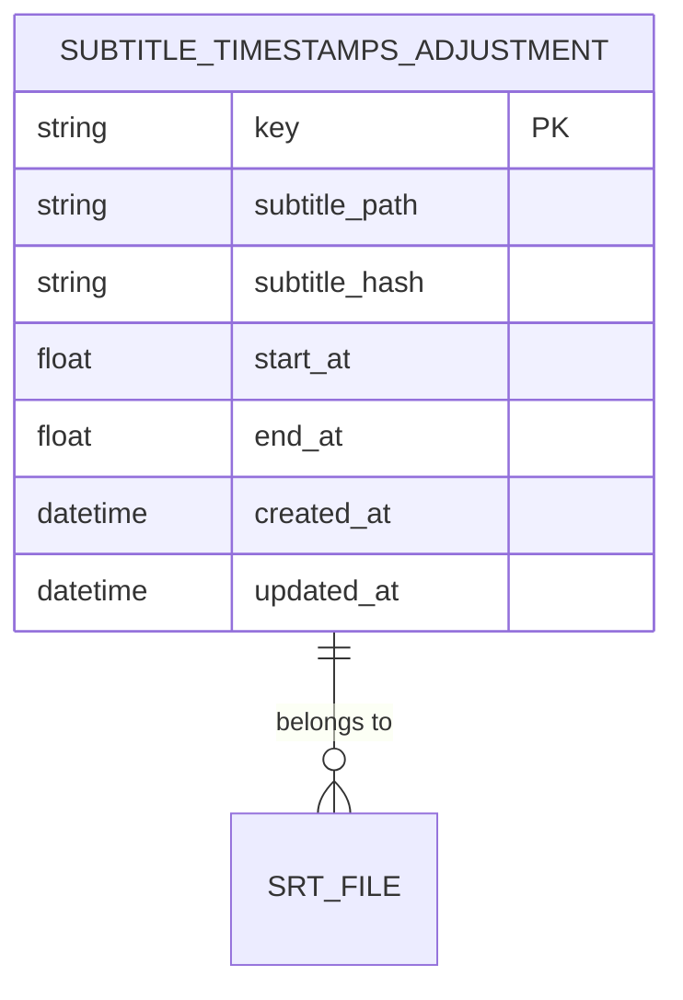
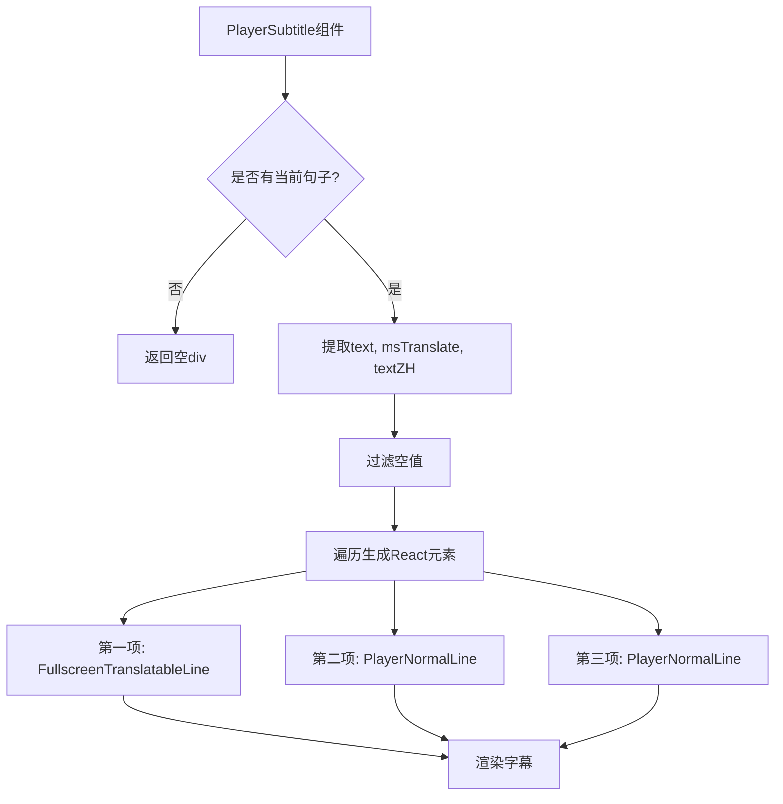

# AI字幕生成

<cite>
**本文档中引用的文件**  
- [SubtitleController.ts](file://src/backend/controllers/SubtitleController.ts)
- [WhisperServiceImpl.ts](file://src/backend/services/impl/WhisperServiceImpl.ts)
- [TencentProvider.ts](file://src/backend/services/impl/clients/TencentProvider.ts)
- [YouDaoProvider.ts](file://src/backend/services/impl/clients/YouDaoProvider.ts)
- [OpenAiWhisperRequest.ts](file://src/backend/objs/OpenAiWhisperRequest.ts)
- [SentenceStruct.ts](file://src/common/types/SentenceStruct.ts)
- [PlayerSubtitle.tsx](file://src/fronted/components/playerSubtitle/PlayerSubtitle.tsx)
- [PlayerSubtitlePanel.tsx](file://src/fronted/components/playerSubtitle/PlayerSubtitlePanel.tsx)
- [SubtitleServiceImpl.ts](file://src/backend/services/impl/SubtitleServiceImpl.ts)
- [SrtTimeAdjustServiceImpl.ts](file://src/backend/services/impl/SrtTimeAdjustServiceImpl.ts)
</cite>

## 目录
1. [简介](#简介)
2. [系统架构与核心流程](#系统架构与核心流程)
3. [字幕生成服务实现](#字幕生成服务实现)
4. [语音识别请求构建](#语音识别请求构建)
5. [双语字幕与时间戳调整](#双语字幕与时间戳调整)
6. [前端字幕渲染机制](#前端字幕渲染机制)
7. [第三方语音识别服务集成](#第三方语音识别服务集成)
8. [配置指南](#配置指南)
9. [服务性能对比](#服务性能对比)
10. [结论](#结论)

## 简介
DashPlayer 提供了基于人工智能的字幕生成功能，支持通过 OpenAI Whisper、腾讯云语音识别和有道语音识别等多种服务将视频音频转换为文本字幕。该功能不仅实现了高精度的语音转录，还支持双语字幕显示、时间戳手动校正以及与视频播放的精确同步。用户可通过配置不同服务商的 API 密钥来启用相应的语音识别服务，系统会根据配置自动选择最优方案进行处理。

## 系统架构与核心流程
AI 字幕生成功能的核心流程包括音频提取、语音识别、字幕文件生成和前端渲染四个主要阶段。整个流程由 `SubtitleController` 发起，调用 `WhisperServiceImpl` 或第三方提供商（如 `TencentProvider`、`YouDaoProvider`）完成语音识别任务，并最终在前端 `PlayerSubtitle` 组件中实现字幕的实时渲染。

**Diagram sources**  
- [SubtitleController.ts](file://src/backend/controllers/SubtitleController.ts#L8-L21)
- [WhisperServiceImpl.ts](file://src/backend/services/impl/WhisperServiceImpl.ts#L46-L155)
- [TencentProvider.ts](file://src/backend/services/impl/clients/TencentProvider.ts#L7-L42)
- [YouDaoProvider.ts](file://src/backend/services/impl/clients/YouDaoProvider.ts#L7-L31)

**Section sources**  
- [SubtitleController.ts](file://src/backend/controllers/SubtitleController.ts#L8-L21)
- [WhisperServiceImpl.ts](file://src/backend/services/impl/WhisperServiceImpl.ts#L46-L155)

## 字幕生成服务实现
`WhisperServiceImpl` 是 OpenAI Whisper 服务的核心实现类，负责将视频文件中的音频部分提取并分段处理，然后调用 OpenAI 的 Whisper 模型进行语音识别。

该服务首先使用 FFmpeg 将视频文件转换为音频格式，并将其分割成不超过 60 秒的片段，以避免单次请求超时。每个音频片段会被独立提交给 Whisper API 进行转录。为了提高成功率，系统实现了三次重试机制（`whisperThreeTimes`），在每次失败后尝试重新发送请求。

**Diagram sources**  
- [WhisperServiceImpl.ts](file://src/backend/services/impl/WhisperServiceImpl.ts#L46-L155)
- [OpenAiWhisperRequest.ts](file://src/backend/objs/OpenAiWhisperRequest.ts#L35-L93)

**Section sources**  
- [WhisperServiceImpl.ts](file://src/backend/services/impl/WhisperServiceImpl.ts#L46-L155)

## 语音识别请求构建
`OpenAiWhisperRequest` 类负责构建和发送对 OpenAI Whisper API 的请求。该类通过静态方法 `build` 创建实例，检查必要的配置项（如 API 密钥和端点地址）是否已设置。若配置缺失，则返回 null 并记录错误。

请求参数包括：
- **file**: 音频文件流
- **model**: 使用 "whisper-1" 模型
- **response_format**: 设置为 "verbose_json" 以获取详细响应
- **timestamp_granularities**: 包含 ["segment"] 以获得分段时间戳

系统还实现了速率限制器（`RateLimiter`）来控制请求频率，防止因频繁调用而导致被限流或封禁。

**Diagram sources**  
- [OpenAiWhisperRequest.ts](file://src/backend/objs/OpenAiWhisperRequest.ts#L35-L93)

**Section sources**  
- [OpenAiWhisperRequest.ts](file://src/backend/objs/OpenAiWhisperRequest.ts#L35-L93)

## 双语字幕与时间戳调整
系统支持双语字幕显示，原始英文文本、微软翻译结果和中文翻译均可同时呈现。`SentenceStruct` 接口定义了句子结构，包含原始文本和按空格划分的块信息，便于后续处理和高亮显示。

用户可手动校正字幕时间戳，调整信息存储在数据库中并通过 `SrtTimeAdjustService` 管理。当加载字幕时，系统会自动应用已保存的时间偏移量，确保播放同步。

**Diagram sources**  
- [SentenceStruct.ts](file://src/common/types/SentenceStruct.ts#L10-L13)
- [SrtTimeAdjustServiceImpl.ts](file://src/backend/services/impl/SrtTimeAdjustServiceImpl.ts#L11-L71)

**Section sources**  
- [SentenceStruct.ts](file://src/common/types/SentenceStruct.ts#L10-L13)
- [SrtTimeAdjustServiceImpl.ts](file://src/backend/services/impl/SrtTimeAdjustServiceImpl.ts#L11-L71)

## 前端字幕渲染机制
前端通过 `PlayerSubtitle` 组件实现字幕的动态渲染。该组件订阅播放器状态，获取当前正在播放的句子对象（`currentSentence`），并根据其内容动态生成字幕行。

支持三种显示模式：
1. **主字幕行**：使用 `FullscreenTranslatableLine` 显示原始文本，支持点击翻译
2. **第二行**：显示机器翻译结果（`msTranslate`）
3. **第三行**：显示中文翻译（`textZH`）

组件通过 `usePlayerController` Hook 监听播放状态变化，并在字幕切换时自动更新 UI。

**Diagram sources**  
- [PlayerSubtitle.tsx](file://src/fronted/components/playerSubtitle/PlayerSubtitle.tsx#L6-L67)
- [PlayerSubtitlePanel.tsx](file://src/fronted/components/playerSubtitle/PlayerSubtitlePanel.tsx#L7-L39)

**Section sources**  
- [PlayerSubtitle.tsx](file://src/fronted/components/playerSubtitle/PlayerSubtitle.tsx#L6-L67)

## 第三方语音识别服务集成
系统支持集成多个第三方语音识别服务，包括腾讯云和有道。这些服务通过 `ClientProviderService` 接口统一管理，实现松耦合设计。

### 腾讯云语音识别（TencentProvider）
`TencentProvider` 类负责管理腾讯云客户端实例。它从全局存储中读取 `apiKeys.tencent.secretId` 和 `apiKeys.tencent.secretKey`，初始化 `TencentClient` 并返回可用客户端。若密钥未配置或为空，则返回 null。

### 有道语音识别（YouDaoProvider）
`YouDaoProvider` 类封装了有道语音识别服务的调用逻辑。通过 `storeGet('apiKeys.youdao.secretId')` 和 `storeGet('apiKeys.youdao.secretKey')` 获取认证信息，并动态更新 `YouDaoClient` 配置。

两种服务均采用懒加载模式，仅在首次调用 `getClient()` 时初始化客户端，提升系统性能。

**Section sources**  
- [TencentProvider.ts](file://src/backend/services/impl/clients/TencentProvider.ts#L7-L42)
- [YouDaoProvider.ts](file://src/backend/services/impl/clients/YouDaoProvider.ts#L7-L31)

## 配置指南
要启用 AI 字幕生成功能，用户需完成以下配置步骤：

### OpenAI 配置
1. 访问 [OpenAI 官网](https://platform.openai.com/) 获取 API 密钥
2. 在 DashPlayer 设置页面进入“OpenAI 设置”
3. 填写 API Key 和 Endpoint（默认为 `https://api.openai.com`）
4. 保存配置

### 腾讯云配置
1. 登录 [腾讯云控制台](https://console.cloud.tencent.com/)
2. 开通“语音识别”服务
3. 获取 SecretId 和 SecretKey
4. 在 DashPlayer 设置中填写对应字段

### 有道智云配置
1. 注册 [有道智云](https://ai.youdao.com/) 账号
2. 创建语音识别应用
3. 获取 App Key 和 Secret Key
4. 在 DashPlayer 设置中完成配置

**Section sources**  
- [Writerside/topics/Config-OpenAI-API.md](file://Writerside/topics/Config-OpenAI-API.md)
- [Writerside/topics/Config-Tencent-API.md](file://Writerside/topics/Config-Tencent-API.md)
- [Writerside/topics/Config-YouDao-API.md](file://Writerside/topics/Config-YouDao-API.md)

## 服务性能对比
| 服务提供商 | 准确率 | 延迟 | 成本 | 支持语言 |
|----------|-------|------|------|---------|
| OpenAI Whisper | 高 | 中等 | 按使用量计费 | 多语言支持 |
| 腾讯云 | 中等 | 低 | 按调用次数计费 | 中文优化 |
| 有道智云 | 中等 | 低 | 免费额度+按量计费 | 中英双语 |

OpenAI Whisper 在多语言识别和准确性方面表现最佳，适合高质量字幕生成；腾讯云和有道在中文语音识别上具有本地化优势，响应速度快，适合实时场景。

## 结论
DashPlayer 的 AI 字幕生成功能通过模块化设计实现了对多种语音识别服务的支持，具备高可靠性、灵活性和可扩展性。系统通过音频分片、重试机制和速率控制保障了转录成功率，同时提供完善的前端交互体验，支持双语显示和时间轴校正。未来可进一步优化缓存策略、增加更多语音识别接口，并支持自定义模型训练，提升个性化服务能力。