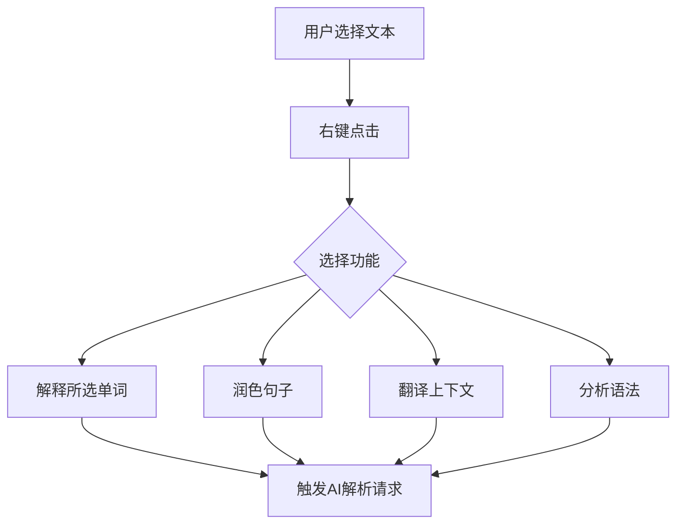
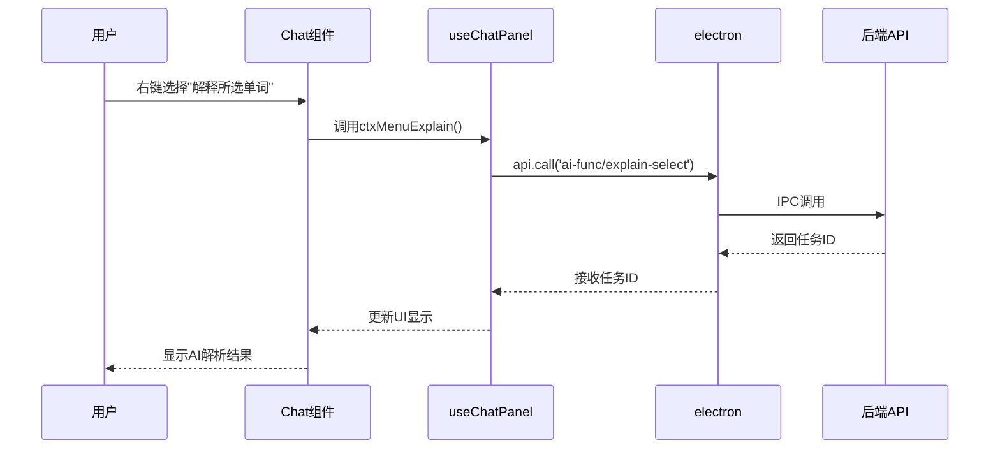
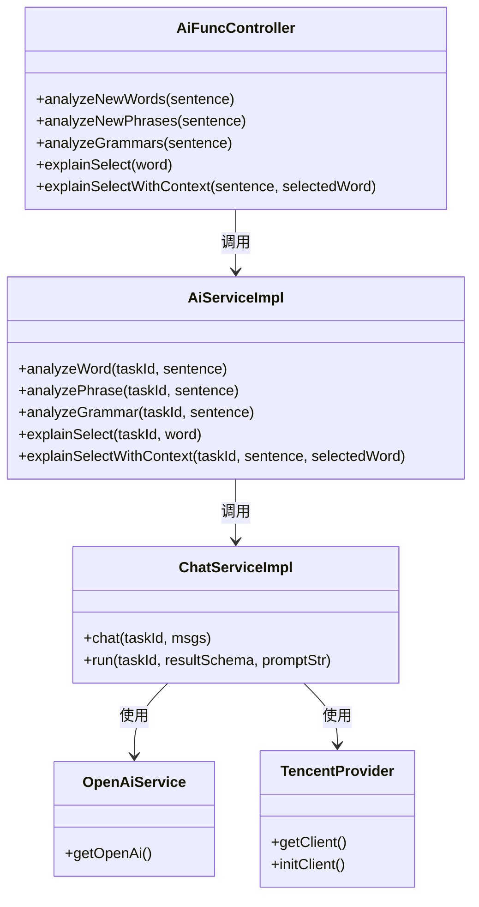
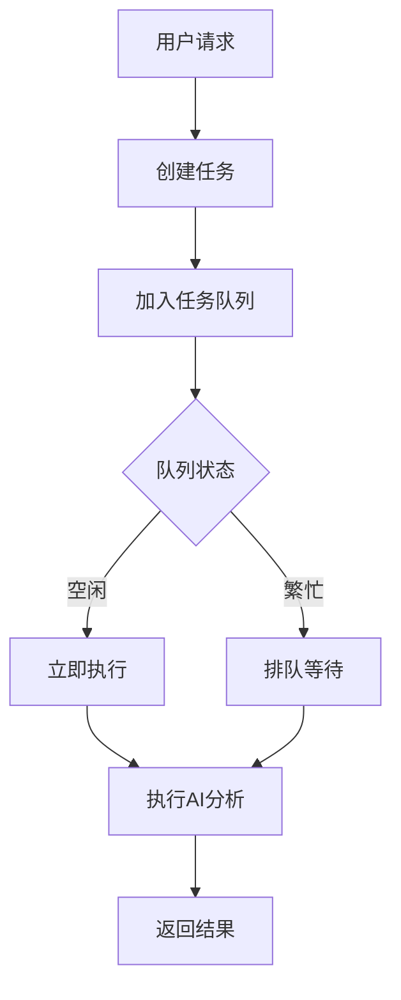

# AI对话与语言分析

<cite>
**本文档中引用的文件**
- [AiFuncController.ts](file://src/backend/controllers/AiFuncController.ts)
- [AiServiceImpl.ts](file://src/backend/services/AiServiceImpl.ts)
- [ChatServiceImpl.ts](file://src/backend/services/impl/ChatServiceImpl.ts)
- [TencentProvider.ts](file://src/backend/services/impl/clients/TencentProvider.ts)
- [CacheService.ts](file://src/backend/services/CacheService.ts)
- [AiAnalyseNewWordsRes.ts](file://src/common/types/aiRes/AiAnalyseNewWordsRes.ts)
- [AiAnalyseGrammarsRes.ts](file://src/common/types/aiRes/AiAnalyseGrammarsRes.ts)
- [AiAnalyseNewPhrasesRes.ts](file://src/common/types/aiRes/AiAnalyseNewPhrasesRes.ts)
- [analyze-word.ts](file://src/backend/services/prompts/analyze-word.ts)
- [analyze-phrases.ts](file://src/backend/services/prompts/analyze-phrases.ts)
- [Chat.tsx](file://src/fronted/components/chat/Chat.tsx)
- [useChatPanel.ts](file://src/fronted/hooks/useChatPanel.ts)
- [register.ts](file://src/common/api/register.ts)
</cite>

## 目录
1. [简介](#简介)
2. [功能触发机制](#功能触发机制)
3. [前端调用流程](#前端调用流程)
4. [后端服务链处理](#后端服务链处理)
5. [AI响应数据结构](#ai响应数据结构)
6. [提示词工程设计](#提示词工程设计)
7. [实际使用场景](#实际使用场景)
8. [性能优化策略](#性能优化策略)
9. [常见问题处理](#常见问题处理)
10. [总结](#总结)

## 简介
DashPlayer是一款集成了AI对话与语言分析功能的多媒体播放器，旨在帮助语言学习者在观看视频时实时获取单词、短语和语法的智能解析。本文档深入讲解该功能的实现机制，从用户交互到后端服务链的完整流程。

**Section sources**
- [AiFuncController.ts](file://src/backend/controllers/AiFuncController.ts#L12-L129)
- [AiServiceImpl.ts](file://src/backend/services/AiServiceImpl.ts#L45-L153)

## 功能触发机制
用户通过右键菜单触发AI解析功能，系统支持多种分析类型：单词解释、短语分析、语法解析、句子润色等。右键菜单项包括"解释所选单词"、"润色句子"、"引用这段文本"等选项。



**Diagram sources**
- [Chat.tsx](file://src/fronted/components/chat/Chat.tsx#L0-L197)
- [useChatPanel.ts](file://src/fronted/hooks/useChatPanel.ts#L134-L439)

**Section sources**
- [Chat.tsx](file://src/fronted/components/chat/Chat.tsx#L0-L197)
- [useChatPanel.ts](file://src/fronted/hooks/useChatPanel.ts#L134-L439)

## 前端调用流程
前端组件通过Electron的IPC机制调用后端AI功能。`Chat.tsx`组件中的右键菜单项绑定事件处理器，调用`useChatPanel`钩子中的相应方法，最终通过`electron.call()`发送API请求。



**Diagram sources**
- [Chat.tsx](file://src/fronted/components/chat/Chat.tsx#L0-L197)
- [useChatPanel.ts](file://src/fronted/hooks/useChatPanel.ts#L134-L439)
- [register.ts](file://src/common/api/register.ts#L0-L20)

**Section sources**
- [Chat.tsx](file://src/fronted/components/chat/Chat.tsx#L0-L197)
- [useChatPanel.ts](file://src/fronted/hooks/useChatPanel.ts#L134-L439)
- [register.ts](file://src/common/api/register.ts#L0-L20)

## 后端服务链处理
AI功能的后端处理采用分层架构，形成清晰的服务调用链：`AiFuncController` → `AiServiceImpl` → `ChatServiceImpl` → `OpenAiService/TencentProvider`。



**Diagram sources**
- [AiFuncController.ts](file://src/backend/controllers/AiFuncController.ts#L12-L129)
- [AiServiceImpl.ts](file://src/backend/services/AiServiceImpl.ts#L45-L153)
- [ChatServiceImpl.ts](file://src/backend/services/impl/ChatServiceImpl.ts#L12-L88)
- [TencentProvider.ts](file://src/backend/services/impl/clients/TencentProvider.ts#L7-L42)

**Section sources**
- [AiFuncController.ts](file://src/backend/controllers/AiFuncController.ts#L12-L129)
- [AiServiceImpl.ts](file://src/backend/services/AiServiceImpl.ts#L45-L153)
- [ChatServiceImpl.ts](file://src/backend/services/impl/ChatServiceImpl.ts#L12-L88)

## AI响应数据结构
系统定义了多种AI响应类型，用于结构化地返回分析结果。这些数据结构确保了前后端数据交互的一致性和可预测性。

### 单词分析响应
```typescript
interface AiAnalyseNewWordsRes {
    hasNewWord: boolean;
    words: {
        word: string;
        phonetic: string;
        meaning: string;
    }[];
}
```

### 语法分析响应
```typescript
type AiAnalyseGrammarsRes = z.infer<typeof AiAnalyseGrammarsPrompt['schema']>;
```

### 短语分析响应
```typescript
interface AiAnalyseNewPhrasesRes {
    hasPhrase: boolean;
    phrases: {
        phrase: string;
        meaning: string;
    }[];
}
```

### 单词解释响应
```typescript
type AiFuncExplainSelectRes = z.infer<typeof AiFuncExplainSelectPrompt['schema']>;
```

### 上下文单词解释响应
```typescript
type AiFuncExplainSelectWithContextRes = z.infer<typeof AiFuncExplainSelectWithContextPrompt['schema']>;
```

### 上下文翻译响应
```typescript
type AiFuncTranslateWithContextRes = z.infer<typeof AiFuncTranslateWithContextPrompt['schema']>;
```

**Section sources**
- [AiAnalyseNewWordsRes.ts](file://src/common/types/aiRes/AiAnalyseNewWordsRes.ts#L10-L17)
- [AiAnalyseGrammarsRes.ts](file://src/common/types/aiRes/AiAnalyseGrammarsRes.ts#L4-L21)
- [AiAnalyseNewPhrasesRes.ts](file://src/common/types/aiRes/AiAnalyseNewPhrasesRes.ts#L0-L6)
- [AiFuncExplainSelectRes.ts](file://src/common/types/aiRes/AiFuncExplainSelectRes.ts#L2-L25)
- [AiFuncExplainSelectWithContextRes.ts](file://src/common/types/aiRes/AiFuncExplainSelectWithContextRes.ts#L2-L35)
- [AiFuncTranslateWithContextRes.ts](file://src/common/types/aiRes/AiFuncTranslateWithContextRes.ts#L2-L22)

## 提示词工程设计
系统通过精心设计的提示词（prompts）来引导AI模型生成符合预期的响应。这些提示词定义了AI的角色、任务要求和输出格式。

### 单词分析提示词
```typescript
const analyzeWordsPrompt = (s:string):string =>
`从句子中找出中等英文水平的人可能不懂的单词, 并给出对应的中文翻译.

${s}
`
```

### 短语分析提示词
```typescript
const analyzePhrasesPrompt = (s:string):string =>
`你正在帮助用户学习英语。从句子中找出词组/短语/固定搭配, 并给出对应的中文翻译.

${s}
`
```

### 语法分析提示词
```typescript
export class AiAnalyseGrammarsPrompt {
    public static schema = z.object({
        hasGrammar: z.boolean().describe('whether the sentence has grammar'),
        grammarsMd: z.string().describe('explain result, must be in Chinese(简体中文), markdown format'),
    });

    public static promptFunc = (s: string) => codeBlock`
        你是一个英语老师，擅长用简洁的语言分析句子中的语法。
        你的回复只需要包含语法解释，不需要包含其他内容。
        用户的显示窗口比较小，所以请尽量简洁，但是不要遗漏重要的内容。
        你的所有回复都会被放到 Markdown 容器中，所以请使用精美的 Markdown 格式书写，以便于用户阅读。

        用中文分析下面句子包含的语法
        """sentence
        ${s}
        """
        `;
}
```

### 单词解释提示词
```typescript
export class AiFuncExplainSelectPrompt {
    public static promptFunc(word: string):string {
        return codeBlock`
        你是一个专业的在线双语词典，你的工作是帮助中文用户理解英文的 单词/短语。
        请解释 "${word}" 这个 单词/短语 并用这个 单词/短语 造三个例句。
        `
    }
}
```

### 上下文单词解释提示词
```typescript
export class AiFuncExplainSelectWithContextPrompt {
    public static promptFunc(text: string, selectedWord: string):string {
        return codeBlock`
        你的任务是帮助中等英文水平的中文用户理解英文句子中的单词/短语。请根据句子解释单词/短语，并用这个单词/短语造三个例句。

        句子："""
        ${text}
        """

        请根据这个句子解释 "${selectedWord}" 这个 单词/短语 并用这个 单词/短语 造三个例句。
        `
    }
}
```

**Section sources**
- [analyze-word.ts](file://src/backend/services/prompts/analyze-word.ts#L0-L4)
- [analyze-phrases.ts](file://src/backend/services/prompts/analyze-phrases.ts#L0-L4)
- [AiAnalyseGrammarsRes.ts](file://src/common/types/aiRes/AiAnalyseGrammarsRes.ts#L4-L21)
- [AiFuncExplainSelectRes.ts](file://src/common/types/aiRes/AiFuncExplainSelectRes.ts#L2-L25)
- [AiFuncExplainSelectWithContextRes.ts](file://src/common/types/aiRes/AiFuncExplainSelectWithContextRes.ts#L2-L35)

## 实际使用场景
学习者在观看英语视频时，可以选中不理解的单词或短语，通过右键菜单选择"解释所选单词"功能，系统会立即调用AI服务进行分析并返回结果。

```mermaid
flowchart LR
A[观看视频] --> B[选中不理解的单词]
B --> C[右键选择"解释所选单词"]
C --> D[系统调用AI服务]
D --> E[AI分析单词含义]
E --> F[返回中文解释和例句]
F --> G[在侧边栏显示结果]
G --> H[学习者理解单词用法]
```

**Diagram sources**
- [Chat.tsx](file://src/fronted/components/chat/Chat.tsx#L0-L197)
- [useChatPanel.ts](file://src/fronted/hooks/useChatPanel.ts#L134-L439)

**Section sources**
- [Chat.tsx](file://src/fronted/components/chat/Chat.tsx#L0-L197)
- [useChatPanel.ts](file://src/fronted/hooks/useChatPanel.ts#L134-L439)

## 性能优化策略
系统采用多种性能优化策略，确保AI功能的响应速度和用户体验。

### 缓存机制
```typescript
export default interface CacheService {
    get<T extends keyof CacheType>(type: T, key: string): CacheType[T] | null;
    set<T extends keyof CacheType>(type: T, key: string, value: CacheType[T]): void;
    delete<T extends keyof CacheType>(type: T, key: string): void;
    clear(): void;
}
```

### 速率限制
系统使用`RateLimiter`来控制API调用频率，防止因频繁调用而导致服务被限流。

```typescript
public async chat(taskId: number, msgs: BaseMessage[]) {
    await RateLimiter.wait('gpt');
    // ...其他逻辑
}
```

### 任务队列
通过`DpTaskService`管理AI任务队列，确保任务有序执行并提供进度反馈。



**Diagram sources**
- [CacheService.ts](file://src/backend/services/CacheService.ts#L6-L11)
- [ChatServiceImpl.ts](file://src/backend/services/impl/ChatServiceImpl.ts#L12-L88)

**Section sources**
- [CacheService.ts](file://src/backend/services/CacheService.ts#L6-L11)
- [ChatServiceImpl.ts](file://src/backend/services/impl/ChatServiceImpl.ts#L12-L88)

## 常见问题处理
系统设计了完善的错误处理机制，确保在各种异常情况下仍能提供良好的用户体验。

### API调用失败处理
当API调用失败时，系统会记录错误日志并通过`SystemService`将错误信息发送到前端渲染进程。

```typescript
export default function registerRoute<K extends keyof ApiMap>(path: K, func: ApiMap[K]) {
    ipcMain.handle(path, (_event, param) => {
        dpLog.log('api-call', path, JSON.stringify(param));
        // eslint-disable-next-line @typescript-eslint/ban-ts-comment
        // @ts-ignore
        return func(param).catch((e: Error) => {
            dpLog.error('api-error', path, e);
            container.get<SystemService>(TYPES.SystemService).sendErrorToRenderer(e);
            throw e
        });
    });
}
```

### 空值检查
在关键路径上进行空值检查，防止因数据缺失导致的运行时错误。

```typescript
public async explainSelect(taskId: number, word: string) {
    if (StrUtil.isBlank(word)) {
        // 处理空值情况
        return;
    }
    await this.chatService.run(taskId, AiFuncExplainSelectPrompt.schema, AiFuncExplainSelectPrompt.promptFunc(word));
}
```

### 客户端配置验证
在调用AI服务前验证客户端配置，确保API密钥等必要信息已正确设置。

```typescript
public getClient(): TencentClient | null {
    const secretId = storeGet('apiKeys.tencent.secretId');
    const secretKey = storeGet('apiKeys.tencent.secretKey');
    if (StrUtil.hasBlank(secretId, secretKey)) {
        return null;
    }
    // ...其他逻辑
}
```

**Section sources**
- [register.ts](file://src/common/api/register.ts#L0-L20)
- [TencentProvider.ts](file://src/backend/services/impl/clients/TencentProvider.ts#L7-L42)
- [AiServiceImpl.ts](file://src/backend/services/AiServiceImpl.ts#L45-L153)

## 总结
DashPlayer的AI对话与语言分析功能通过精心设计的前后端架构，为语言学习者提供了强大的实时辅助工具。从用户友好的右键菜单触发，到高效的后端服务链处理，再到结构化的AI响应和智能的提示词工程，整个系统体现了现代软件工程的最佳实践。通过缓存、速率限制和任务队列等性能优化策略，确保了系统的响应速度和稳定性。完善的错误处理机制则保障了用户体验的连续性。这一功能不仅提升了视频学习的效率，也为AI在教育领域的应用提供了有价值的参考。

**Section sources**
- [AiFuncController.ts](file://src/backend/controllers/AiFuncController.ts#L12-L129)
- [AiServiceImpl.ts](file://src/backend/services/AiServiceImpl.ts#L45-L153)
- [ChatServiceImpl.ts](file://src/backend/services/impl/ChatServiceImpl.ts#L12-L88)
- [Chat.tsx](file://src/fronted/components/chat/Chat.tsx#L0-L197)
- [useChatPanel.ts](file://src/fronted/hooks/useChatPanel.ts#L134-L439)