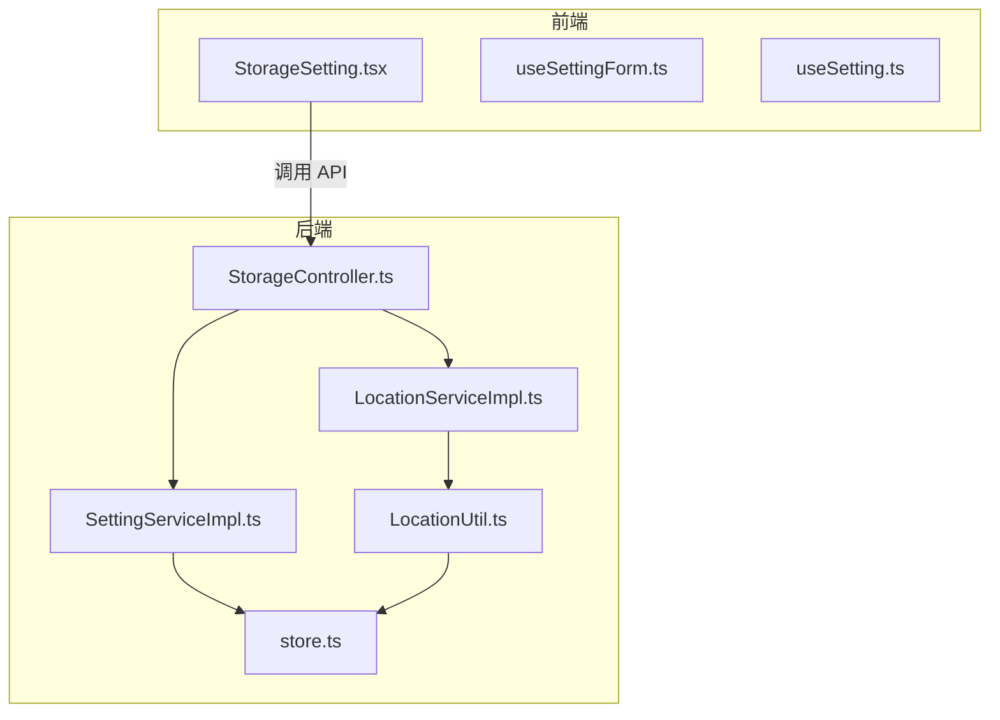
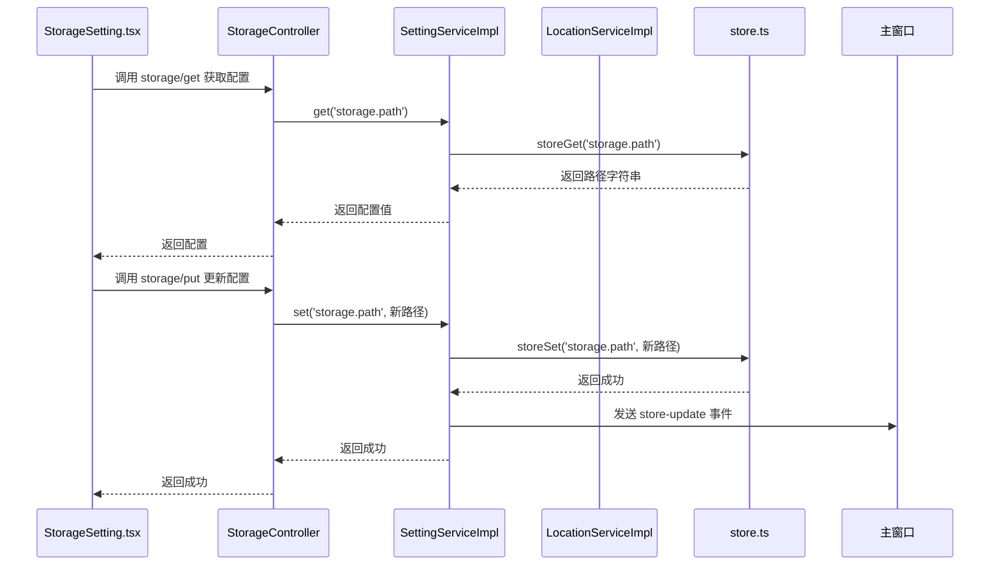
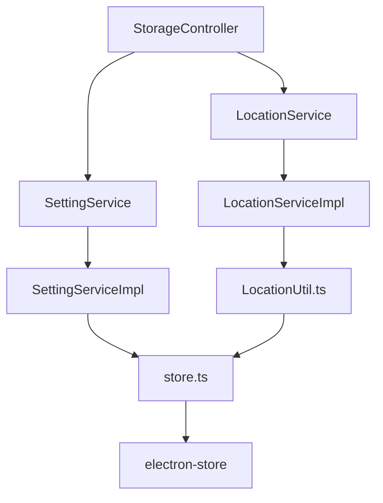

# 存储配置

<cite>
**本文档中引用的文件**  
- [StorageController.ts](file://src/backend/controllers/StorageController.ts)
- [LocationServiceImpl.ts](file://src/backend/services/impl/LocationServiceImpl.ts)
- [SettingServiceImpl.ts](file://src/backend/services/impl/SettingServiceImpl.ts)
- [store.ts](file://src/backend/store.ts)
- [store_schema.ts](file://src/common/types/store_schema.ts)
- [StorageSetting.tsx](file://src/fronted/pages/setting/StorageSetting.tsx)
- [LocationUtil.ts](file://src/backend/utils/LocationUtil.ts)
</cite>

## 目录
1. [简介](#简介)
2. [项目结构](#项目结构)
3. [核心组件](#核心组件)
4. [架构概览](#架构概览)
5. [详细组件分析](#详细组件分析)
6. [依赖分析](#依赖分析)
7. [性能考虑](#性能考虑)
8. [故障排除指南](#故障排除指南)
9. [结论](#结论)

## 简介
本文档全面讲解 DashPlayer 应用中存储配置功能的设计与实现。重点描述 `StorageController` 如何管理应用数据目录、缓存路径和下载目录的设置，`LocationServiceImpl` 如何封装本地路径操作逻辑，`SettingServiceImpl` 与 `store.ts` 如何持久化用户配置（基于 `SettingType` 定义的键值对）。同时结合 `StorageSetting.tsx` 组件展示前端配置界面的实现方式，解释系统如何在启动时初始化默认路径，并支持用户自定义存储位置以优化磁盘空间利用。最后提供配置最佳实践和潜在扩展方案。

## 项目结构
DashPlayer 的存储配置功能主要分布在后端控制器、服务实现、状态管理以及前端设置页面中。核心逻辑位于 `src/backend/controllers` 和 `src/backend/services/impl` 目录下，而用户界面则在 `src/fronted/pages/setting` 中实现。配置的持久化通过 Electron 的 `electron-store` 模块完成，相关类型定义位于 `src/common/types`。



**Diagram sources**
- [StorageSetting.tsx](file://src/fronted/pages/setting/StorageSetting.tsx)
- [StorageController.ts](file://src/backend/controllers/StorageController.ts)
- [SettingServiceImpl.ts](file://src/backend/services/impl/SettingServiceImpl.ts)
- [LocationServiceImpl.ts](file://src/backend/services/impl/LocationServiceImpl.ts)
- [store.ts](file://src/backend/store.ts)
- [LocationUtil.ts](file://src/backend/utils/LocationUtil.ts)

**Section sources**
- [StorageSetting.tsx](file://src/fronted/pages/setting/StorageSetting.tsx)
- [StorageController.ts](file://src/backend/controllers/StorageController.ts)
- [SettingServiceImpl.ts](file://src/backend/services/impl/SettingServiceImpl.ts)

## 核心组件
存储配置功能的核心组件包括 `StorageController`、`SettingServiceImpl`、`LocationServiceImpl` 和 `LocationUtil`。这些组件协同工作，实现了配置的持久化、路径的动态计算以及前端界面的数据绑定。

**Section sources**
- [StorageController.ts](file://src/backend/controllers/StorageController.ts)
- [SettingServiceImpl.ts](file://src/backend/services/impl/SettingServiceImpl.ts)
- [LocationServiceImpl.ts](file://src/backend/services/impl/LocationServiceImpl.ts)
- [LocationUtil.ts](file://src/backend/utils/LocationUtil.ts)

## 架构概览
系统采用前后端分离的架构，前端通过 Electron IPC 调用后端 API 来读写存储配置。后端服务通过依赖注入（Inversify）进行解耦，`SettingService` 负责键值对的持久化，`LocationService` 负责基于配置动态生成文件路径。



**Diagram sources**
- [StorageSetting.tsx](file://src/fronted/pages/setting/StorageSetting.tsx)
- [StorageController.ts](file://src/backend/controllers/StorageController.ts)
- [SettingServiceImpl.ts](file://src/backend/services/impl/SettingServiceImpl.ts)
- [store.ts](file://src/backend/store.ts)

## 详细组件分析

### StorageController 分析
`StorageController` 是存储配置功能的后端入口，负责注册 RESTful 风格的 API 路由，将前端请求转发给相应的服务层。

```mermaid
classDiagram
class StorageController {
+settingService : SettingService
+locationService : LocationService
+storeSet({key, value}) : Promise~void~
+storeGet(key) : Promise~string~
+queryCacheSize() : Promise~string~
+listCollectionPaths() : Promise~string[]~
+registerRoutes() : void
}
class SettingService {
<<interface>>
+set(key : SettingKey, value : string) : Promise~void~
+get(key : SettingKey) : Promise~string~
}
class LocationService {
<<interface>>
+getBaseLibraryPath() : string
+listCollectionPaths() : string[]
}
StorageController --> SettingService : "依赖"
StorageController --> LocationService : "依赖"
```

**Diagram sources**
- [StorageController.ts](file://src/backend/controllers/StorageController.ts)
- [SettingService.ts](file://src/backend/services/SettingService.ts)
- [LocationService.ts](file://src/backend/services/LocationService.ts)

**Section sources**
- [StorageController.ts](file://src/backend/controllers/StorageController.ts)

### SettingServiceImpl 与 store.ts 分析
`SettingServiceImpl` 实现了 `SettingService` 接口，通过 `store.ts` 中的 `storeSet` 和 `storeGet` 函数与 Electron 的持久化存储交互。当配置更新时，会向主窗口发送 `store-update` 事件，通知前端状态变更。

```mermaid
flowchart TD
A[前端调用 storage/put] --> B[StorageController.storeSet]
B --> C[SettingServiceImpl.set]
C --> D{storeSet(key, value)}
D --> |成功| E[systemService.send('store-update')]
D --> |失败| F[返回]
E --> G[前端 useSetting 监听到事件]
G --> H[更新 Zustand 状态]
H --> I[UI 重新渲染]
```

**Diagram sources**
- [SettingServiceImpl.ts](file://src/backend/services/impl/SettingServiceImpl.ts)
- [store.ts](file://src/backend/store.ts)
- [useSetting.ts](file://src/fronted/hooks/useSetting.ts)

**Section sources**
- [SettingServiceImpl.ts](file://src/backend/services/impl/SettingServiceImpl.ts)
- [store.ts](file://src/backend/store.ts)

### LocationServiceImpl 与 LocationUtil 分析
`LocationServiceImpl` 封装了所有与路径相关的逻辑，`LocationUtil` 是一个工具类，负责根据 `storage.path` 配置计算出各个子目录的绝对路径。系统启动时若未设置 `storage.path`，会自动初始化为用户文档目录下的 `DashPlayer` 文件夹。

```mermaid
flowchart LR
A[getStorageBathPath] --> B{storeGet('storage.path')}
B --> |为空| C[使用 app.getPath('documents')]
C --> D[拼接 'DashPlayer']
D --> E[storeSet 默认路径]
E --> F[返回路径]
B --> |不为空| F[返回路径]
F --> G[根据 LocationType 拼接子目录]
G --> H[返回详细路径]
```

**Diagram sources**
- [LocationServiceImpl.ts](file://src/backend/services/impl/LocationServiceImpl.ts)
- [LocationUtil.ts](file://src/backend/utils/LocationUtil.ts)

**Section sources**
- [LocationServiceImpl.ts](file://src/backend/services/impl/LocationServiceImpl.ts)
- [LocationUtil.ts](file://src/backend/utils/LocationUtil.ts)

### StorageSetting.tsx 前端组件分析
`StorageSetting.tsx` 是存储配置的前端界面，使用 React 和 Zustand 状态管理库。它通过 `useSettingForm` Hook 管理表单的本地状态，并在用户点击 "Apply" 时提交到后端。

**Section sources**
- [StorageSetting.tsx](file://src/fronted/pages/setting/StorageSetting.tsx)

## 依赖分析
存储配置功能的组件间依赖关系清晰，遵循了依赖倒置原则。高层模块（如 `StorageController`）依赖于抽象（`SettingService`、`LocationService`），而具体实现（`SettingServiceImpl`、`LocationServiceImpl`）由 IoC 容器注入。



**Diagram sources**
- [StorageController.ts](file://src/backend/controllers/StorageController.ts)
- [SettingServiceImpl.ts](file://src/backend/services/impl/SettingServiceImpl.ts)
- [LocationServiceImpl.ts](file://src/backend/services/impl/LocationServiceImpl.ts)
- [store.ts](file://src/backend/store.ts)
- [LocationUtil.ts](file://src/backend/utils/LocationUtil.ts)

**Section sources**
- [StorageController.ts](file://src/backend/controllers/StorageController.ts)
- [SettingServiceImpl.ts](file://src/backend/services/impl/SettingServiceImpl.ts)
- [LocationServiceImpl.ts](file://src/backend/services/impl/LocationServiceImpl.ts)

## 性能考虑
- **路径缓存**：`LocationUtil` 的路径计算是纯函数，结果可被缓存，避免重复计算。
- **事件驱动更新**：使用 `store-update` 事件而非轮询，确保配置变更时前端能即时响应，同时减少不必要的检查。
- **异步操作**：所有文件系统和存储操作均为异步，避免阻塞主线程，保证 UI 流畅。

## 故障排除指南
- **配置不生效**：检查 `store-update` 事件是否被正确发送和接收，确认 `useSetting` Hook 是否监听了该事件。
- **路径初始化失败**：确保 Electron 的 `app.getPath('documents')` 返回有效路径，检查应用是否有相应目录的读写权限。
- **缓存大小计算错误**：确认 `FileUtil.calculateReadableFolderSize` 方法能正确处理目标目录，检查目录是否存在及可访问。

**Section sources**
- [SettingServiceImpl.ts](file://src/backend/services/impl/SettingServiceImpl.ts)
- [LocationUtil.ts](file://src/backend/utils/LocationUtil.ts)
- [StorageSetting.tsx](file://src/fronted/pages/setting/StorageSetting.tsx)

## 结论
DashPlayer 的存储配置功能设计合理，通过清晰的分层和依赖管理，实现了配置的持久化、路径的动态生成和前端的实时更新。系统在启动时能智能初始化默认路径，并允许用户自定义以优化存储布局。未来可扩展多设备间配置同步功能，通过云存储服务同步 `store.ts` 中的键值对，实现用户配置的无缝迁移。