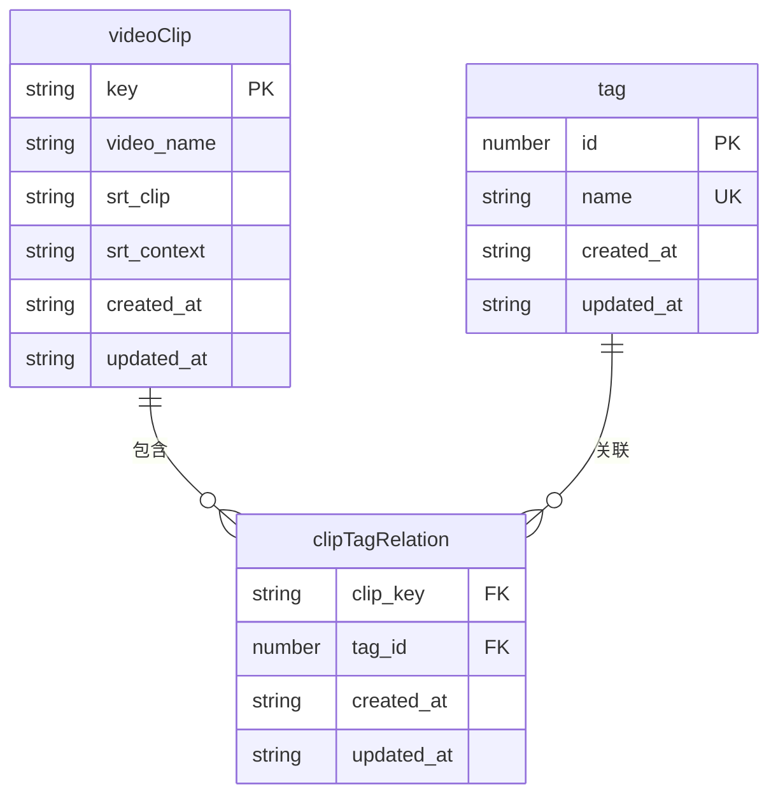
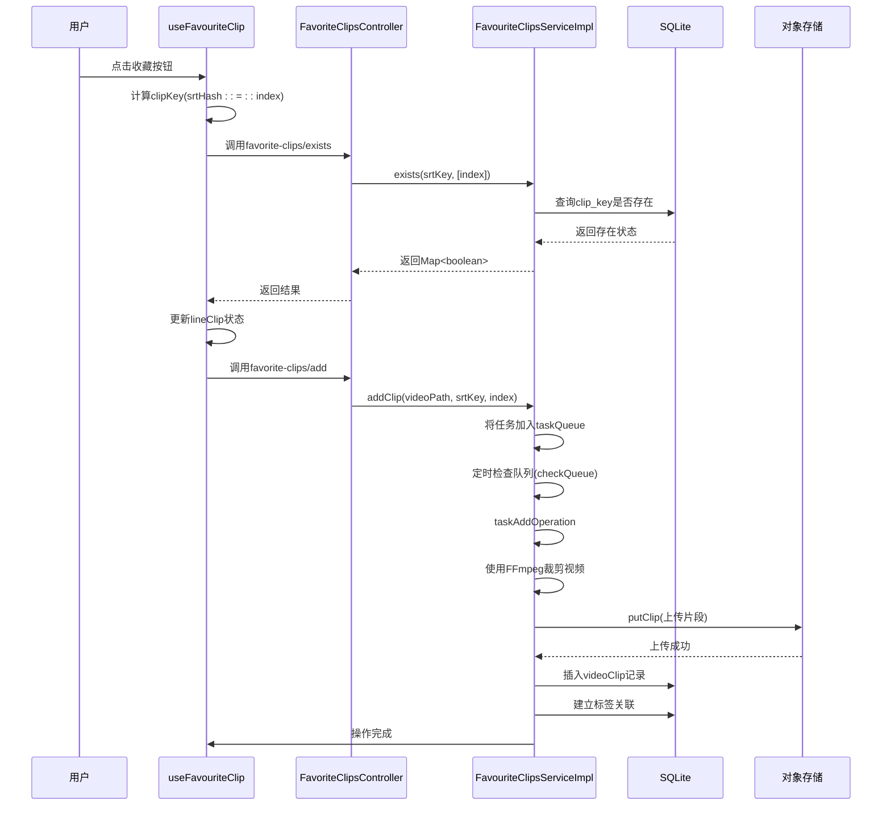
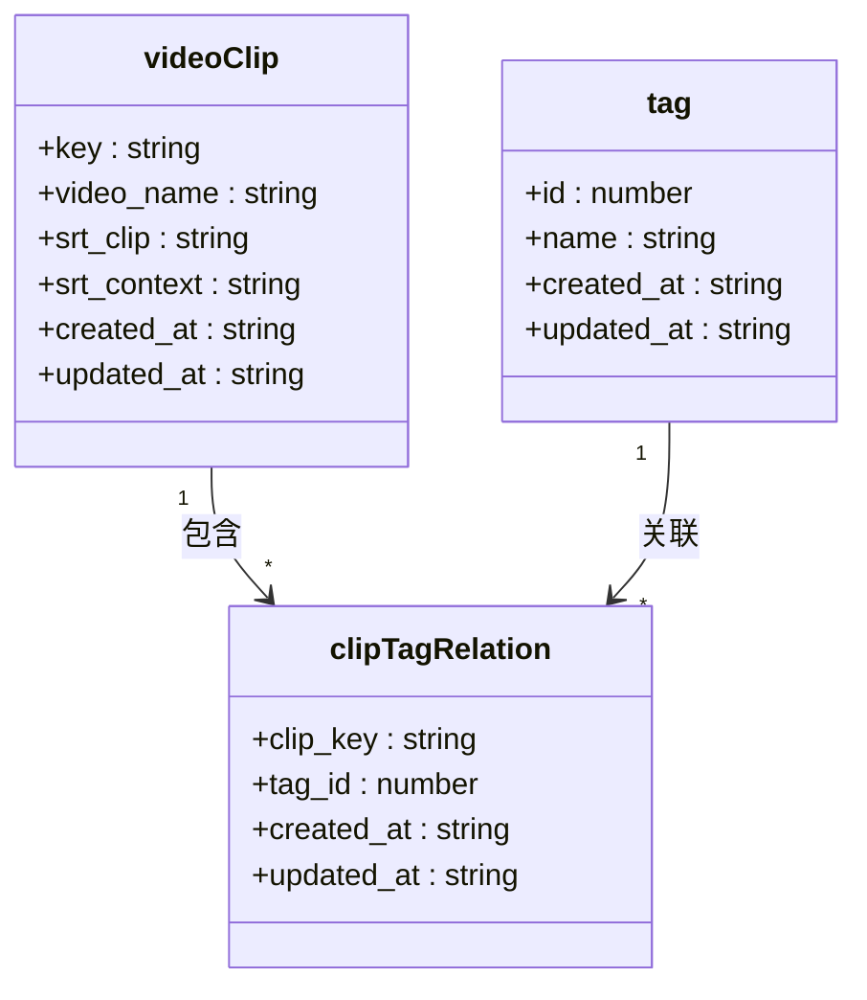
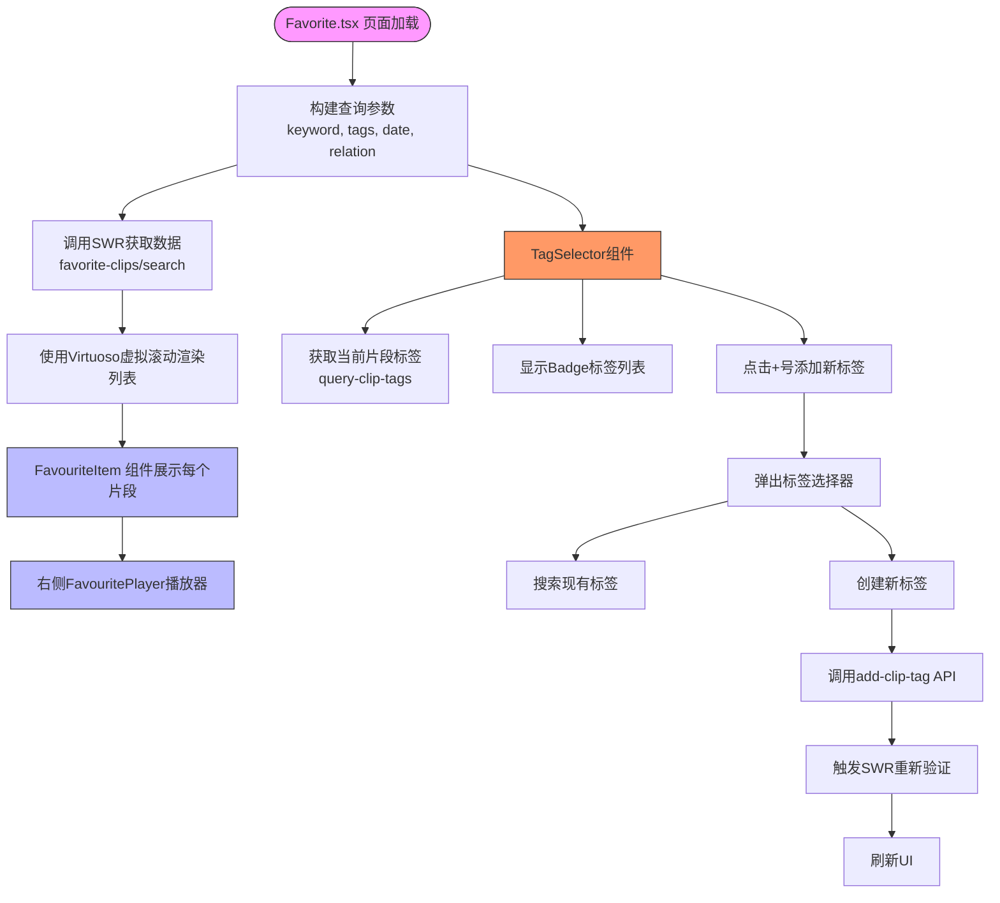
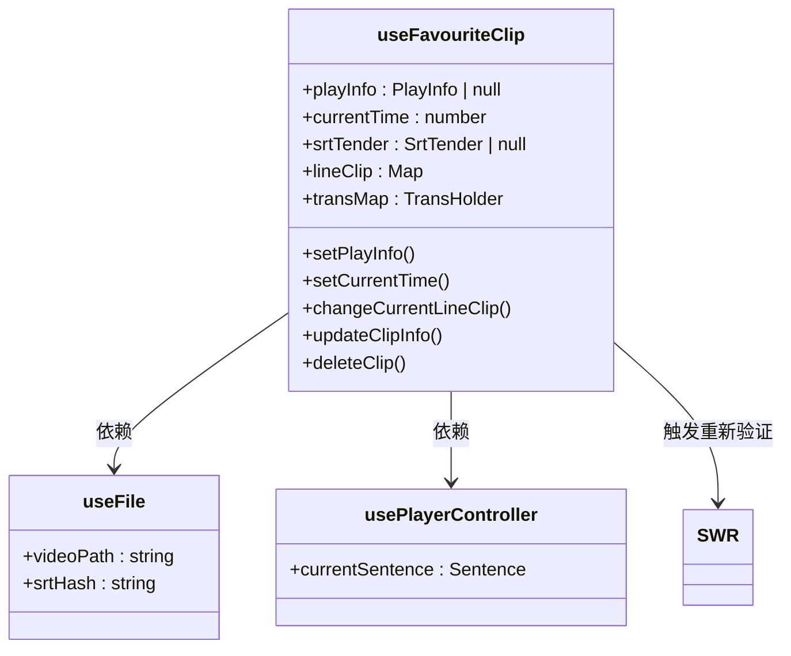

# 收藏夹管理

<cite>
**本文档引用文件**  
- [FavoriteClipsController.ts](file://src/backend/controllers/FavoriteClipsController.ts)
- [FavouriteClipsServiceImpl.ts](file://src/backend/services/impl/FavouriteClipsServiceImpl.ts)
- [videoClip.ts](file://src/backend/db/tables/videoClip.ts)
- [tag.ts](file://src/backend/db/tables/tag.ts)
- [clipTagRelation.ts](file://src/backend/db/tables/clipTagRelation.ts)
- [Favorite.tsx](file://src/fronted/pages/favourite/Favorite.tsx)
- [TagSelector.tsx](file://src/fronted/components/TagSelector.tsx)
- [useFavouriteClip.ts](file://src/fronted/hooks/useFavouriteClip.ts)
- [dto.ts](file://src/common/api/dto.ts)
- [ClipMetaDataV1.ts](file://src/common/types/clipMeta/ClipMetaDataV1.ts)
- [TagService.ts](file://src/backend/services/TagService.ts)
- [TagServiceImpl.ts](file://src/backend/services/impl/TagServiceImpl.ts)
</cite>

## 目录
1. [简介](#简介)
2. [数据模型设计](#数据模型设计)
3. [精彩片段标记与保存流程](#精彩片段标记与保存流程)
4. [多对多标签关系实现](#多对多标签关系实现)
5. [前端收藏列表渲染与标签筛选](#前端收藏列表渲染与标签筛选)
6. [前端状态同步机制](#前端状态同步机制)
7. [使用范例：知识点归类体系](#使用范例：知识点归类体系)
8. [数据一致性与查询性能优化](#数据一致性与查询性能优化)

## 简介
本系统为视频播放器中的收藏夹管理模块，支持用户在播放过程中标记精彩片段，并将片段元数据持久化存储。系统提供标签分类功能，支持通过标签对收藏内容进行高效组织与检索。后端采用SQLite数据库存储结构化数据，结合OSS对象存储管理媒体文件，前端通过React组件与Zustand状态管理实现交互逻辑。

## 数据模型设计



**图示来源**  
- [videoClip.ts](file://src/backend/db/tables/videoClip.ts#L3-L20)
- [tag.ts](file://src/backend/db/tables/tag.ts#L3-L12)
- [clipTagRelation.ts](file://src/backend/db/tables/clipTagRelation.ts#L3-L16)

### 核心表结构说明

| 表名 | 字段 | 类型 | 说明 |
|------|------|------|------|
| **dp_video_clip** | key | TEXT | 主键，基于字幕上下文哈希生成 |
| | video_name | TEXT | 原始视频文件路径 |
| | srt_clip | TEXT | 被收藏的字幕行内容 |
| | srt_context | TEXT | 周围字幕上下文（5行） |
| | created_at | TEXT | 创建时间（UTC） |
| | updated_at | TEXT | 更新时间（UTC） |
| **dp_tag** | id | INTEGER | 主键，自增 |
| | name | TEXT | 标签名称（唯一） |
| | created_at | TEXT | 创建时间 |
| | updated_at | TEXT | 更新时间 |
| **dp_clip_tag_relation** | clip_key | TEXT | 外键，指向videoClip.key |
| | tag_id | INTEGER | 外键，指向tag.id |
| | created_at | TEXT | 创建时间 |
| | updated_at | TEXT | 更新时间 |

**表结构来源**  
- [videoClip.ts](file://src/backend/db/tables/videoClip.ts#L3-L20)
- [tag.ts](file://src/backend/db/tables/tag.ts#L3-L12)
- [clipTagRelation.ts](file://src/backend/db/tables/clipTagRelation.ts#L3-L16)

## 精彩片段标记与保存流程



**流程来源**  
- [useFavouriteClip.ts](file://src/fronted/hooks/useFavouriteClip.ts#L39-L106)
- [FavoriteClipsController.ts](file://src/backend/controllers/FavoriteClipsController.ts#L9-L74)
- [FavouriteClipsServiceImpl.ts](file://src/backend/services/impl/FavouriteClipsServiceImpl.ts#L34-L428)

### 核心处理逻辑
1. **片段识别**：通过`mapToClipKey`方法，基于字幕内容上下文（前后5行）生成唯一哈希作为`clipKey`
2. **异步队列**：使用内存`taskQueue`暂存操作请求，避免阻塞主线程
3. **定时处理**：`checkQueue`方法每秒执行一次，批量处理新增与取消收藏任务
4. **视频裁剪**：调用FFmpeg服务，根据字幕时间轴精确裁剪视频片段
5. **元数据存储**：将片段信息（含字幕JSON）存入OSS，同时在SQLite中建立索引

## 多对多标签关系实现



**关系来源**  
- [clipTagRelation.ts](file://src/backend/db/tables/clipTagRelation.ts#L3-L16)
- [FavouriteClipsServiceImpl.ts](file://src/backend/services/impl/FavouriteClipsServiceImpl.ts#L34-L428)

### 关系映射机制
- **联合主键**：`clipTagRelation`表使用`(clip_key, tag_id)`作为复合主键，确保唯一性
- **级联删除**：当删除标签时，若该标签不再被任何片段引用，则自动清理`tag`表中对应记录
- **事务保障**：`deleteClipTag`操作在数据库事务中执行，确保关联删除的原子性

```typescript
// 删除标签时的事务处理
await db.transaction(async (tx) => {
    await tx.delete(clipTagRelation).where(and(
        eq(clipTagRelation.clip_key, key),
        eq(clipTagRelation.tag_id, tagId)
    ));
    const r = await tx.select({ count: count() })
        .from(clipTagRelation)
        .where(eq(clipTagRelation.tag_id, tagId));
    if (r[0].count === 0) {
        await tx.delete(tag).where(eq(tag.id, tagId));
    }
});
```

**代码来源**  
- [FavouriteClipsServiceImpl.ts](file://src/backend/services/impl/FavouriteClipsServiceImpl.ts#L280-L295)

## 前端收藏列表渲染与标签筛选



**组件来源**  
- [Favorite.tsx](file://src/fronted/pages/favourite/Favorite.tsx#L0-L122)
- [TagSelector.tsx](file://src/fronted/components/TagSelector.tsx#L28-L137)

### 标签筛选功能
- **关系模式**：支持`AND`（同时包含所有标签）与`OR`（包含任一标签）两种逻辑
- **空标签过滤**：可选择是否包含未打标签的片段
- **关键词范围**：支持在"片段内容"或"上下文"中搜索关键词
- **日期筛选**：按收藏时间范围过滤

## 前端状态同步机制



**状态来源**  
- [useFavouriteClip.ts](file://src/fronted/hooks/useFavouriteClip.ts#L39-L106)

### 状态管理要点
1. **Zustand + SWR协同**：本地状态由Zustand管理，服务端状态由SWR缓存
2. **自动同步**：执行`addClip`、`deleteClip`等操作后，自动调用`swrApiMutate`刷新SWR缓存
3. **副作用处理**：通过`subscribe`监听`playInfo.video.clip_content`变化，自动触发字幕翻译
4. **键值映射**：使用`mapClipKey(srtHash, index)`生成唯一键，确保状态一致性

## 使用范例：知识点归类体系

### 场景描述
用户在学习英语视频时，创建两个标签体系：
- **常用表达**：标记高频实用句型
- **听力难点**：标记发音复杂或语速较快的片段

### 操作流程
1. 播放视频，定位到目标句子
2. 点击收藏按钮，系统自动保存该句及上下文
3. 在收藏夹页面，为片段添加"常用表达"或"听力难点"标签
4. 后续可通过标签快速检索同类知识点

### 查询示例
```json
{
  "keyword": "",
  "keywordRange": "clip",
  "tags": [1, 2],
  "tagsRelation": "and",
  "date": { "from": "2023-01-01", "to": "2023-12-31" },
  "includeNoTag": false
}
```
此查询将返回同时包含"常用表达"和"听力难点"标签的收藏片段。

**查询定义来源**  
- [dto.ts](file://src/common/api/dto.ts#L2-L10)

## 数据一致性与查询性能优化

### 数据一致性保障
- **事务控制**：标签删除操作使用数据库事务，确保关联数据一致性
- **定时同步**：提供`syncFromOss`接口，可清除数据库并从OSS重新同步，解决数据不一致问题
- **冲突处理**：插入`videoClip`时使用`onConflictDoUpdate`，避免重复数据

### 大规模收藏查询优化
- **索引策略**：`videoClip.key`为主键，`clipTagRelation`的联合主键提供高效关联查询
- **分页限制**：`search`接口限制返回最多5000条记录，防止内存溢出
- **虚拟滚动**：前端使用`react-virtuoso`实现虚拟滚动，仅渲染可视区域内容
- **缓存机制**：SWR提供客户端缓存，减少重复API调用
- **异步队列**：后端使用`taskQueue`异步处理视频裁剪，避免阻塞HTTP请求

```typescript
// 搜索查询优化
const lines: VideoClip[] = await db
    .select({...})
    .from(videoClip)
    .leftJoin(clipTagRelation, ...)
    .leftJoin(tag, ...)
    .where(where1)
    .groupBy(videoClip.key)
    .having(having1)
    .orderBy(desc(videoClip.created_at))
    .limit(5000); // 限制结果数量
```

**性能优化来源**  
- [FavouriteClipsServiceImpl.ts](file://src/backend/services/impl/FavouriteClipsServiceImpl.ts#L180-L220)
- [Favorite.tsx](file://src/fronted/pages/favourite/Favorite.tsx#L50-L60)