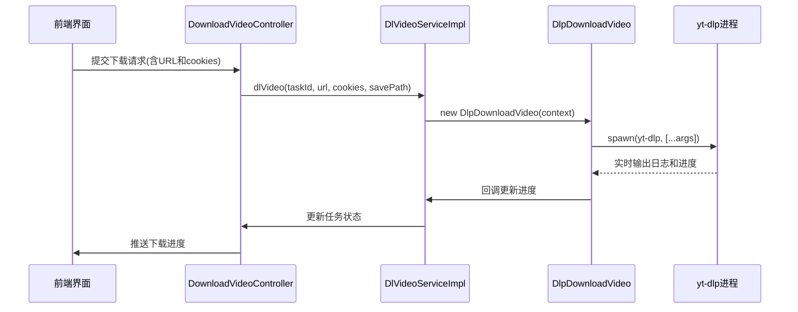
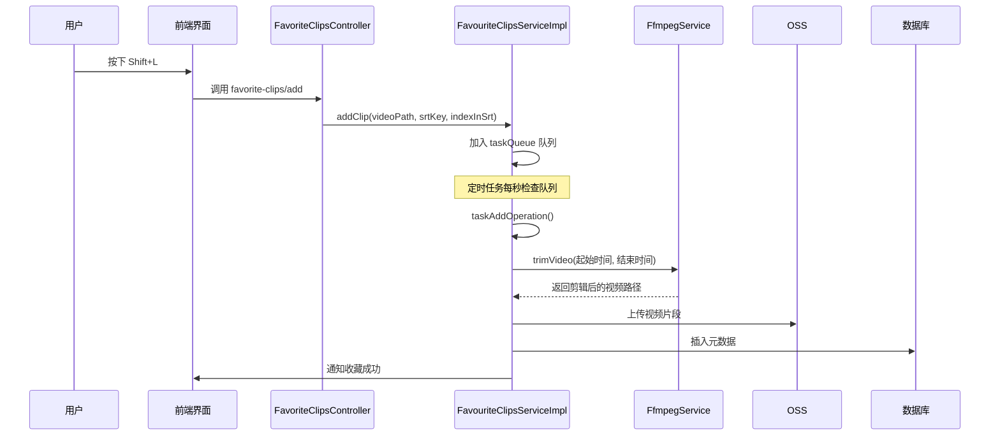

# 核心功能

<cite>
**本文档中引用的文件**  
- [AiFuncController.ts](file://src/backend/controllers/AiFuncController.ts)
- [AiServiceImpl.ts](file://src/backend/services/AiServiceImpl.ts)
- [WhisperServiceImpl.ts](file://src/backend/services/impl/WhisperServiceImpl.ts)
- [DownloadVideoController.ts](file://src/backend/controllers/DownloadVideoController.ts)
- [DlVideoServiceImpl.ts](file://src/backend/services/impl/DlVideoServiceImpl.ts)
- [DlpFetchFileName.ts](file://src/backend/objs/dl-video/DlpFetchFileName.ts)
- [DlpDownloadVideo.ts](file://src/backend/objs/dl-video/DlpDownloadVideo.ts)
- [FavoriteClipsController.ts](file://src/backend/controllers/FavoriteClipsController.ts)
- [FavouriteClipsServiceImpl.ts](file://src/backend/services/impl/FavouriteClipsServiceImpl.ts)
- [StorageController.ts](file://src/backend/controllers/StorageController.ts)
- [SettingServiceImpl.ts](file://src/backend/services/impl/SettingServiceImpl.ts)
- [SplitVideoServiceImpl.ts](file://src/backend/services/impl/SplitVideoServiceImpl.ts)
- [SplitVideoService.ts](file://src/backend/services/SplitVideoService.ts)
- [AI-Chat.md](file://Writerside/topics/AI-Chat.md)
- [AI-Subtitles.md](file://Writerside/topics/AI-Subtitles.md)
- [Download-Video.md](file://Writerside/topics/Download-Video.md)
- [Split-Long-Video.md](file://Writerside/topics/Split-Long-Video.md)
- [favorite.md](file://Writerside/topics/favorite.md)
- [storage.md](file://Writerside/topics/storage.md)
</cite>

## 目录
1. [AI对话与语言分析](#ai对话与语言分析)
2. [AI字幕生成](#ai字幕生成)
3. [视频下载](#视频下载)
4. [长视频分割](#长视频分割)
5. [收藏夹管理](#收藏夹管理)
6. [存储配置](#存储配置)

## AI对话与语言分析

DashPlayer 提供强大的 AI 对话与语言分析功能，帮助用户深入理解视频中的句子结构、词汇、短语和语法。用户可通过快捷键 `?` 调出 AI 学习界面，系统将自动分析当前字幕句子。

该功能通过调用后端 `AiFuncController` 提供的接口实现，支持多种语言分析操作，包括：
- 生词分析（analyzeNewWords）
- 短语分析（analyzeNewPhrases）
- 语法分析（analyzeGrammars）
- 例句生成（makeSentences）
- 句子润色（polish）
- 断句优化（punctuation）
- 上下文翻译（translateWithContext）

技术实现上，`AiFuncController` 接收前端请求后，创建任务并交由 `AiServiceImpl` 处理。`AiServiceImpl` 使用预定义的 Prompt 模板（如 `analyzeWordsPrompt`、`analyzePhrasesPrompt`）调用 `ChatService` 与 AI 模型交互，返回结构化结果。

用户交互流程如下：
1. 用户在播放器中按下 `?` 键
2. 前端通过 `electron.call()` 调用 `ai-func/analyze-grammars` 接口
3. 后端 `AiFuncController.analyzeGrammars()` 处理请求
4. `AiServiceImpl.analyzeGrammar()` 执行分析任务
5. 结果通过 WebSocket 推送至前端展示

**Section sources**
- [AiFuncController.ts](file://src/backend/controllers/AiFuncController.ts#L12-L129)
- [AiServiceImpl.ts](file://src/backend/services/AiServiceImpl.ts#L45-L153)
- [AI-Chat.md](file://Writerside/topics/AI-Chat.md#L0-L23)

## AI字幕生成

DashPlayer 支持通过 AI 自动生成视频字幕，主要集成 OpenAI 的 Whisper 模型。用户可在“Transcript”页面上传视频文件，系统将自动调用 Whisper API 生成 `.srt` 字幕文件。

技术实现流程如下：
1. 用户选择视频文件并点击“转录”
2. 前端调用 `ai-func/transcript` 接口
3. `AiFuncController.transcript()` 接收请求并创建任务
4. `WhisperServiceImpl.transcript()` 执行转录：
   - 使用 `FfmpegService` 将视频分割为 60 秒音频片段
   - 调用 `OpenAiWhisperRequest` 向 OpenAI 发送转录请求
   - 合并多个片段的转录结果并生成 SRT 文件

系统具备容错机制，若单次请求失败，会自动重试最多三次。同时支持任务取消，通过 `AbortController` 中断正在进行的请求。

使用前提：用户需在设置中配置有效的 OpenAI API 密钥和端点。

**Section sources**
- [AiFuncController.ts](file://src/backend/controllers/AiFuncController.ts#L12-L129)
- [WhisperServiceImpl.ts](file://src/backend/services/impl/WhisperServiceImpl.ts#L46-L155)
- [OpenAiWhisperRequest.ts](file://src/backend/objs/OpenAiWhisperRequest.ts#L35-L93)
- [AI-Subtitles.md](file://Writerside/topics/AI-Subtitles.md#L0-L19)

## 视频下载

DashPlayer 内置视频下载功能（Beta），支持从在线平台下载视频到本地。该功能基于 `yt-dlp` 工具，通过 Electron 调用本地可执行文件实现。

核心流程如下：
1. 用户输入视频 URL 并提交
2. 前端调用 `download-video/url` 接口
3. `DownloadVideoController.downloadVideo()` 处理请求
4. `DlVideoServiceImpl.dlVideo()` 执行下载任务：
   - 使用 `DlpFetchFileName` 获取视频文件名
   - 使用 `DlpDownloadVideo` 执行实际下载
   - 支持通过浏览器 Cookie 登录状态下载受保护内容

`DlpFetchFileName` 和 `DlpDownloadVideo` 类均封装了 `yt-dlp` 的命令行调用，支持设置 `--cookies-from-browser` 参数以继承浏览器登录状态。下载进度通过回调函数实时更新至前端。



**Diagram sources**
- [DownloadVideoController.ts](file://src/backend/controllers/DownloadVideoController.ts#L9-L35)
- [DlVideoServiceImpl.ts](file://src/backend/services/impl/DlVideoServiceImpl.ts#L32-L90)
- [DlpDownloadVideo.ts](file://src/backend/objs/dl-video/DlpDownloadVideo.ts#L9-L101)

**Section sources**
- [DownloadVideoController.ts](file://src/backend/controllers/DownloadVideoController.ts#L9-L35)
- [DlVideoServiceImpl.ts](file://src/backend/services/impl/DlVideoServiceImpl.ts#L32-L90)
- [DlpFetchFileName.ts](file://src/backend/objs/dl-video/DlpFetchFileName.ts#L9-L85)
- [DlpDownloadVideo.ts](file://src/backend/objs/dl-video/DlpDownloadVideo.ts#L9-L101)
- [Download-Video.md](file://Writerside/topics/Download-Video.md#L0-L16)

## 长视频分割

对于超长视频（如12小时教程），DashPlayer 提供视频分割功能，可按时间戳或章节信息将视频切分为多个小片段，便于分段观看和管理。

用户需在“Split”页面输入时间戳文本（格式：`01:23:45 标题`），系统将解析并预览分割点。点击“分割”后，后端调用 `SplitVideoService.splitByChapters()` 执行切割。

技术实现：
- `SplitVideoServiceImpl` 接收分割请求
- 使用 `ffmpeg` 按指定时间点切割视频
- 为每个片段生成独立的 `.srt` 字幕文件
- 输出文件保存在原视频同名文件夹下

系统支持 AI 修正输入文本，提升时间戳识别准确率。

```mermaid
flowchart TD
A[用户输入时间戳文本] --> B{SplitVideoController}
B --> C[SplitVideoServiceImpl.previewSplit]
C --> D[解析为ChapterParseResult[]]
D --> E[用户确认并点击分割]
E --> F[SplitVideoServiceImpl.splitByChapters]
F --> G[调用FfmpegService.splitVideoByTimes]
G --> H[生成多个视频片段]
H --> I[为每个片段生成对应字幕]
I --> J[输出到同名文件夹]
```

**Diagram sources**
- [SplitVideoServiceImpl.ts](file://src/backend/services/impl/SplitVideoServiceImpl.ts#L17-L113)
- [SplitVideoService.ts](file://src/backend/services/SplitVideoService.ts#L5-L17)

**Section sources**
- [SplitVideoServiceImpl.ts](file://src/backend/services/impl/SplitVideoServiceImpl.ts#L17-L113)
- [SplitVideoService.ts](file://src/backend/services/SplitVideoService.ts#L5-L17)
- [Split-Long-Video.md](file://Writerside/topics/Split-Long-Video.md#L0-L84)

## 收藏夹管理

用户可通过快捷键 `Shift + L` 快速收藏当前字幕对应的视频片段。系统后台会自动剪辑、压缩并保存该片段至收藏夹。

技术实现流程：
1. 用户按下 `Shift + L`
2. 前端调用 `favorite-clips/add` 接口
3. `FavoriteClipsController.addClip()` 接收请求
4. `FavouriteClipsServiceImpl` 将任务加入队列
5. 定时任务 `checkQueue()` 处理队列：
   - 计算片段起止时间（前后各5行字幕）
   - 调用 `FfmpegService.trimVideo` 剪辑视频
   - 保存至 Oss 并更新数据库

收藏的片段可在“Favorite”页面查看，支持按关键词、标签、时间范围搜索。标签管理支持增删改查，并自动同步至数据库。



**Diagram sources**
- [FavoriteClipsController.ts](file://src/backend/controllers/FavoriteClipsController.ts#L9-L74)
- [FavouriteClipsServiceImpl.ts](file://src/backend/services/impl/FavouriteClipsServiceImpl.ts#L34-L428)

**Section sources**
- [FavoriteClipsController.ts](file://src/backend/controllers/FavoriteClipsController.ts#L9-L74)
- [FavouriteClipsServiceImpl.ts](file://src/backend/services/impl/FavouriteClipsServiceImpl.ts#L34-L428)
- [favorite.md](file://Writerside/topics/favorite.md#L0-L8)

## 存储配置

DashPlayer 的存储配置功能允许用户自定义下载视频和收藏片段的保存路径。系统默认使用“系统下载文件夹”，用户可在设置中修改。

实现原理：
- `StorageController` 提供 `storage/put` 和 `storage/get` 接口
- `SettingServiceImpl` 调用 `storeSet()` 和 `storeGet()` 持久化配置
- 配置变更后通过 `webContents.send('store-update')` 通知前端刷新

用户修改存储路径后建议重启软件，以确保所有模块使用新路径。

**Section sources**
- [StorageController.ts](file://src/backend/controllers/StorageController.ts#L9-L37)
- [SettingServiceImpl.ts](file://src/backend/services/impl/SettingServiceImpl.ts#L9-L21)
- [storage.md](file://Writerside/topics/storage.md#L0-L7)