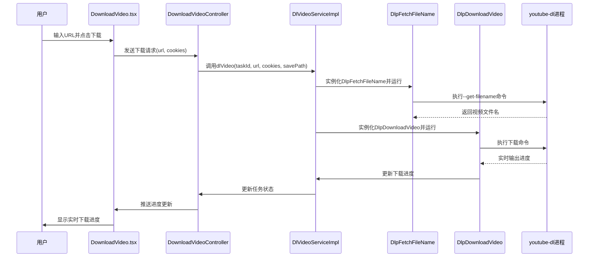
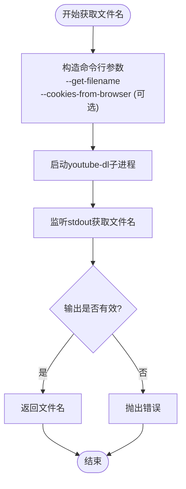
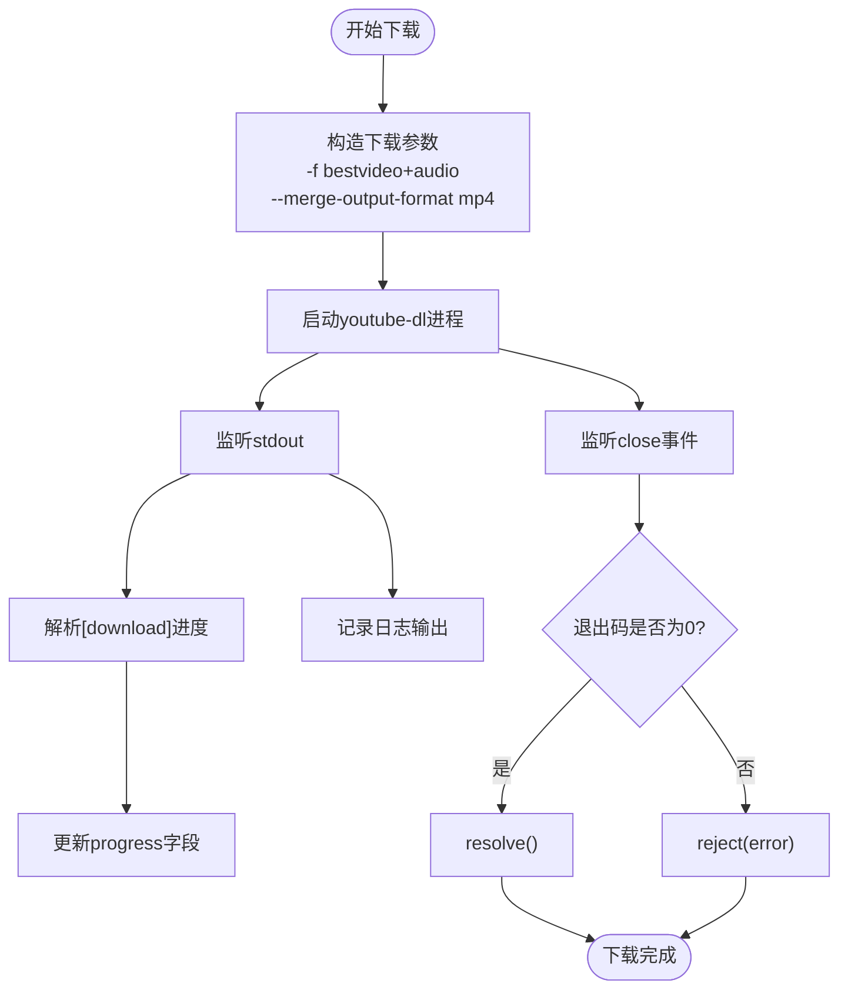
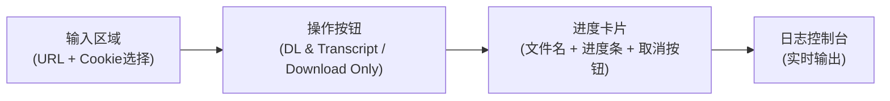

# 视频下载

<cite>
**本文档引用的文件**  
- [DownloadVideoController.ts](file://src/backend/controllers/DownloadVideoController.ts)
- [DlVideoServiceImpl.ts](file://src/backend/services/impl/DlVideoServiceImpl.ts)
- [DlpFetchFileName.ts](file://src/backend/objs/dl-video/DlpFetchFileName.ts)
- [DlpDownloadVideo.ts](file://src/backend/objs/dl-video/DlpDownloadVideo.ts)
- [dl-progress.ts](file://src/common/types/dl-progress.ts)
- [DownloadVideo.tsx](file://src/fronted/pages/DownloadVideo.tsx)
- [download_video.bat](file://scripts/download_video.bat)
- [download_video.sh](file://scripts/download_video.sh)
</cite>

## 目录
1. [简介](#简介)
2. [工作流概述](#工作流概述)
3. [核心组件分析](#核心组件分析)
4. [下载进度反馈机制](#下载进度反馈机制)
5. [错误处理与恢复策略](#错误处理与恢复策略)
6. [前端用户界面逻辑](#前端用户界面逻辑)
7. [批处理脚本调用方式](#批处理脚本调用方式)
8. [使用示例：批量下载YouTube播放列表](#使用示例批量下载youtube播放列表)
9. [大文件下载性能优化建议](#大文件下载性能优化建议)

## 简介
本项目提供了一套完整的视频下载功能，支持从互联网获取视频资源并进行本地存储。系统通过集成`youtube-dl`等工具实现对多种平台（如YouTube）的视频解析与下载，并支持使用浏览器Cookies访问受保护内容。整个流程涵盖从前端用户交互、后端任务调度到实际下载执行的完整链路。

## 工作流概述
视频下载功能的工作流始于用户在前端页面输入视频URL，随后请求被发送至后端控制器处理。整体流程如下：

1. 用户在`DownloadVideo.tsx`页面输入视频链接并选择Cookie源。
2. 前端通过Electron API将请求发送至`DownloadVideoController`。
3. 控制器创建一个任务ID，并调用`DlVideoServiceImpl`服务启动下载。
4. 服务首先使用`DlpFetchFileName`获取视频文件名。
5. 随后使用`DlpDownloadVideo`执行实际下载任务。
6. 下载过程中实时更新进度信息并通过前端展示。
7. 完成后通知用户并可触发后续操作（如字幕生成）。



**Diagram sources**
- [DownloadVideoController.ts](file://src/backend/controllers/DownloadVideoController.ts)
- [DlVideoServiceImpl.ts](file://src/backend/services/impl/DlVideoServiceImpl.ts)
- [DlpFetchFileName.ts](file://src/backend/objs/dl-video/DlpFetchFileName.ts)
- [DlpDownloadVideo.ts](file://src/backend/objs/dl-video/DlpDownloadVideo.ts)
- [DownloadVideo.tsx](file://src/fronted/pages/DownloadVideo.tsx)

## 核心组件分析

### DownloadVideoController
该控制器负责接收前端发起的视频下载请求。它通过依赖注入获取`DlVideoService`和`LocationService`，并在`downloadVideo`方法中处理请求。控制器会生成唯一的任务ID，并将下载任务交由`DlVideoServiceImpl`处理。

**Section sources**
- [DownloadVideoController.ts](file://src/backend/controllers/DownloadVideoController.ts#L9-L35)

### DlVideoServiceImpl
作为核心服务类，`DlVideoServiceImpl`协调整个下载流程。它首先创建下载任务并初始化进度对象，然后依次执行以下步骤：
1. 使用`DlpFetchFileName`获取视频文件名；
2. 注册任务以便后续取消或监控；
3. 使用`DlpDownloadVideo`执行实际下载；
4. 在成功或失败时更新任务状态。

服务还实现了错误捕获机制，确保异常情况下能正确标记任务失败。

**Section sources**
- [DlVideoServiceImpl.ts](file://src/backend/services/impl/DlVideoServiceImpl.ts#L32-L90)

### DlpFetchFileName
此类用于通过`youtube-dl`获取视频的真实文件名。其主要逻辑包括：
- 构造包含`--get-filename`参数的命令行；
- 支持通过`--cookies-from-browser`传递浏览器Cookie；
- 捕获标准输出以提取文件名；
- 提供日志回调接口供进度更新。



**Diagram sources**
- [DlpFetchFileName.ts](file://src/backend/objs/dl-video/DlpFetchFileName.ts#L9-L85)

### DlpDownloadVideo
该类执行实际的视频下载任务。其核心功能包括：
- 使用`bestvideo[height<=1080][height>=?720]+bestaudio/best`格式筛选最佳音视频流；
- 支持Cookie认证；
- 实时解析`[download] 35.2%`格式的进度信息；
- 提供取消功能（通过`ChildProcessTask.cancel()`）；
- 在下载完成后自动合并为MP4格式。



**Diagram sources**
- [DlpDownloadVideo.ts](file://src/backend/objs/dl-video/DlpDownloadVideo.ts#L9-L101)

## 下载进度反馈机制
系统通过`dl-progress.ts`定义的`DlProgress`接口实现进度反馈：

```ts
export interface DlProgress {
    name: string;        // 视频名称
    progress: number;    // 下载进度百分比
    stdOut: string;      // 实时日志输出
}
```

具体实现流程：
1. `DlVideoServiceImpl`创建`DownloadProgress`实例；
2. 将日志回调注册到`DlpFetchFileName`和`DlpDownloadVideo`；
3. 每次收到新日志时更新`stdOut`并推送至`DpTaskService`；
4. 前端通过`useDpTaskViewer`订阅任务状态变化；
5. 实时渲染进度条和控制台输出。

前端使用`<Progress value={progress} />`组件显示进度，并通过`pre`标签滚动显示详细日志。

**Section sources**
- [dl-progress.ts](file://src/common/types/dl-progress.ts#L0-L5)
- [DownloadVideo.tsx](file://src/fronted/pages/DownloadVideo.tsx#L0-L218)

## 错误处理与恢复策略
系统实现了多层次的错误处理机制：

### 异常捕获
- `DlVideoServiceImpl`使用`try-catch`包裹整个下载流程；
- 子进程退出码非0时视为失败；
- 错误信息被记录到`stdOut`并通过任务系统持久化。

### 任务状态管理
通过`DpTaskService`接口统一管理任务状态：
- `process()`: 更新进行中状态
- `finish()`: 标记成功完成
- `fail()`: 标记失败状态
- `cancel()`: 支持用户主动取消

### 网络中断恢复
虽然当前实现未直接支持断点续传，但`youtube-dl`本身具备此能力。当网络中断后重新启动相同任务时，工具会自动检测已下载部分并继续。

**Section sources**
- [DlVideoServiceImpl.ts](file://src/backend/services/impl/DlVideoServiceImpl.ts#L32-L90)
- [DpTaskService.ts](file://src/backend/services/DpTaskService.ts#L4-L26)

## 前端用户界面逻辑
`DownloadVideo.tsx`页面提供了直观的用户交互界面：

### 主要功能
- URL输入框：支持粘贴任意视频链接
- Cookie选择器：支持Chrome、Edge、Firefox、Safari及无Cookie模式
- 双模式按钮：一键下载+转录 / 仅下载
- 实时进度卡：显示文件名和进度条
- 取消按钮：支持中途取消任务
- 日志控制台：滚动显示详细操作日志

### 状态管理
使用`useLocalStorage`持久化保存最近使用的URL和Cookie设置。通过`useDpTaskViewer`监听特定任务的状态变化，并自动滚动日志区域。



**Section sources**
- [DownloadVideo.tsx](file://src/fronted/pages/DownloadVideo.tsx#L0-L218)

## 批处理脚本调用方式
项目提供了跨平台的批处理脚本，便于命令行环境下使用。

### Windows脚本 (download_video.bat)
```bat
download_video.bat "C:\path\to\lib" "https://example.com/video"
```
- 参数1：库路径（包含yt-dlp.exe）
- 参数2：视频URL
- 自动切换到Downloads目录执行
- 设置PATH包含第三方库路径

### Linux/macOS脚本 (download_video.sh)
```bash
./download_video.sh "/path/to/lib" "https://example.com/video"
```
- 功能与Windows版本一致
- 使用`export PATH`添加工具路径
- 下载完成后保持终端打开等待用户确认

两个脚本均使用`-S "res:1080,ext"`参数优先选择1080p分辨率的视频。

**Section sources**
- [download_video.bat](file://scripts/download_video.bat#L0-L38)
- [download_video.sh](file://scripts/download_video.sh#L0-L37)

## 使用示例：批量下载YouTube播放列表
要批量下载YouTube播放列表，只需将播放列表URL传入系统：

```text
https://www.youtube.com/playlist?list=PLxxxxxxxxxxxxxx
```

系统会自动识别为播放列表，并逐个下载其中的视频。由于每个视频都会生成独立任务，用户可以在前端界面中同时监控多个下载进度。

**提示**：建议在非高峰时段进行大批量下载，避免触发平台限流。

## 大文件下载性能优化建议
针对大文件或批量下载场景，建议采取以下优化措施：

1. **并发控制**：避免同时启动过多下载任务，建议限制并发数为3-5个；
2. **带宽管理**：在网络拥塞时降低并发度或暂停部分任务；
3. **存储优化**：确保目标磁盘有足够的连续空间，避免碎片化；
4. **内存监控**：长时间运行时注意Node.js进程内存占用；
5. **日志轮转**：对于超长日志输出，可考虑定期清理或归档；
6. **断点续传**：利用`youtube-dl`内置的`--continue`和`--no-overwrites`参数；
7. **代理设置**：在受限网络环境中配置HTTP/HTTPS代理。

通过合理配置，系统可稳定处理GB级视频文件的下载任务。