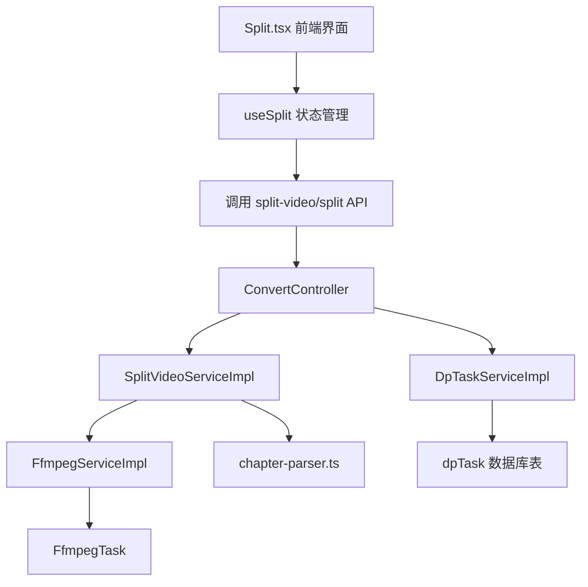
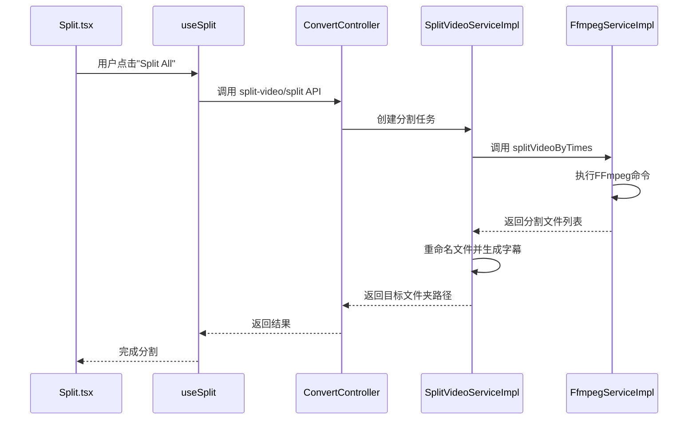
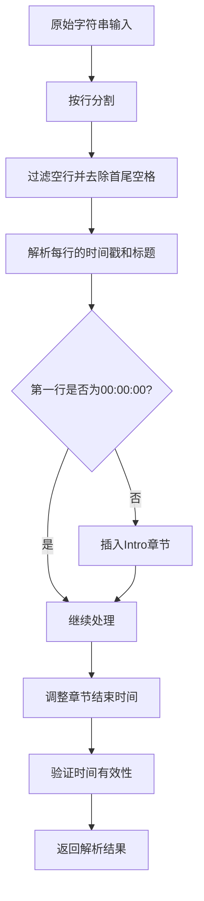
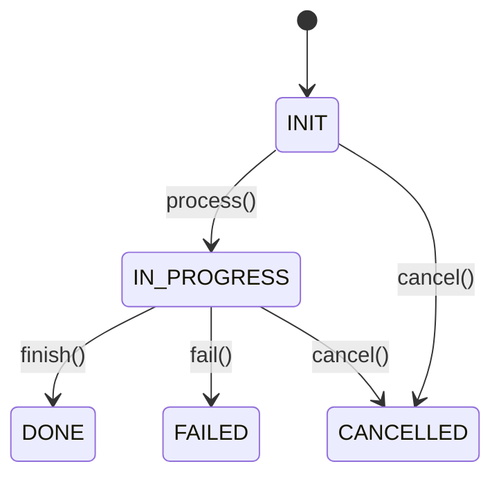
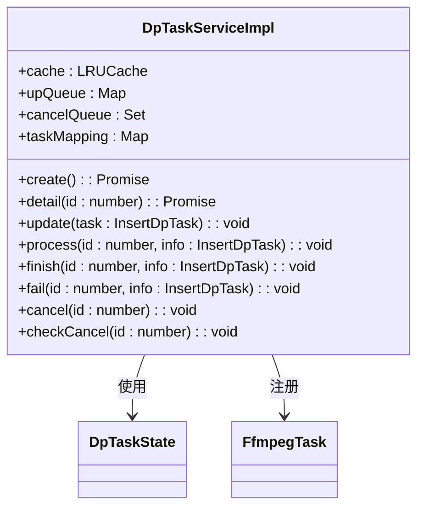
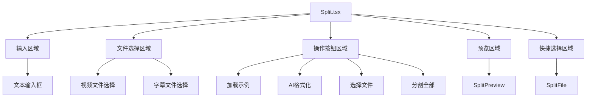
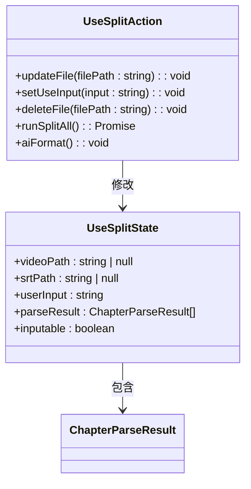

# 长视频分割

<cite>
**本文档引用的文件**
- [ConvertController.ts](file://src/backend/controllers/ConvertController.ts)
- [SplitVideoServiceImpl.ts](file://src/backend/services/impl/SplitVideoServiceImpl.ts)
- [FfmpegServiceImpl.ts](file://src/backend/services/impl/FfmpegServiceImpl.ts)
- [FfmpegTask.ts](file://src/backend/objs/FfmpegTask.ts)
- [DpTaskController.ts](file://src/backend/controllers/DpTaskController.ts)
- [DpTaskServiceImpl.ts](file://src/backend/services/impl/DpTaskServiceImpl.ts)
- [chapter-parser.ts](file://src/common/utils/praser/chapter-parser.ts)
- [chapter-result.ts](file://src/common/types/chapter-result.ts)
- [Split.tsx](file://src/fronted/pages/split/Split.tsx)
- [useSplit.ts](file://src/fronted/hooks/useSplit.ts)
- [dpTask.ts](file://src/backend/db/tables/dpTask.ts)
</cite>

## 目录
1. [简介](#简介)
2. [系统架构与核心流程](#系统架构与核心流程)
3. [核心组件分析](#核心组件分析)
4. [视频分割实现原理](#视频分割实现原理)
5. [章节信息解析机制](#章节信息解析机制)
6. [任务状态管理与进度反馈](#任务状态管理与进度反馈)
7. [前端操作界面](#前端操作界面)
8. [应用场景与优化策略](#应用场景与优化策略)

## 简介
本系统提供长视频分割功能，支持基于用户输入的时间戳或内嵌章节信息将长视频切割为多个片段。系统采用前后端分离架构，通过调用FFmpeg实现高效视频处理，同时提供完整的任务状态管理和进度反馈机制。

## 系统架构与核心流程



**图示来源**
- [Split.tsx](file://src/fronted/pages/split/Split.tsx)
- [useSplit.ts](file://src/fronted/hooks/useSplit.ts)
- [ConvertController.ts](file://src/backend/controllers/ConvertController.ts)
- [SplitVideoServiceImpl.ts](file://src/backend/services/impl/SplitVideoServiceImpl.ts)
- [FfmpegServiceImpl.ts](file://src/backend/services/impl/FfmpegServiceImpl.ts)
- [FfmpegTask.ts](file://src/backend/objs/FfmpegTask.ts)
- [chapter-parser.ts](file://src/common/utils/praser/chapter-parser.ts)
- [DpTaskServiceImpl.ts](file://src/backend/services/impl/DpTaskServiceImpl.ts)
- [dpTask.ts](file://src/backend/db/tables/dpTask.ts)

## 核心组件分析

### 后端控制器
系统通过 `ConvertController` 接收前端请求，协调 `SplitVideoServiceImpl` 执行视频分割任务。控制器负责创建任务ID并返回给前端，实现异步处理。

**组件来源**
- [ConvertController.ts](file://src/backend/controllers/ConvertController.ts#L9-L39)

### 分割服务实现
`SplitVideoServiceImpl` 是视频分割的核心服务，负责解析章节信息、调用FFmpeg服务进行视频切割，并处理字幕文件的同步分割。

**组件来源**
- [SplitVideoServiceImpl.ts](file://src/backend/services/impl/SplitVideoServiceImpl.ts#L17-L113)

### FFmpeg任务管理
`FfmpegTask` 类实现了 `Cancelable` 接口，封装了FFmpeg命令的执行和取消功能，确保长时间运行的任务可以被用户主动终止。

**组件来源**
- [FfmpegTask.ts](file://src/backend/objs/FfmpegTask.ts#L3-L13)

### 任务状态控制器
`DpTaskController` 提供任务详情查询、批量查询和取消功能，通过REST API暴露给前端使用。

**组件来源**
- [DpTaskController.ts](file://src/backend/controllers/DpTaskController.ts#L11-L34)

## 视频分割实现原理

### 分割流程
系统采用以下流程进行视频分割：



**图示来源**
- [Split.tsx](file://src/fronted/pages/split/Split.tsx#L180-L188)
- [useSplit.ts](file://src/fronted/hooks/useSplit.ts#L90-L104)
- [ConvertController.ts](file://src/backend/controllers/ConvertController.ts)
- [SplitVideoServiceImpl.ts](file://src/backend/services/impl/SplitVideoServiceImpl.ts#L27-L81)
- [FfmpegServiceImpl.ts](file://src/backend/services/impl/FfmpegServiceImpl.ts#L61-L88)

### FFmpeg命令执行
系统使用 `fluent-ffmpeg` 库构建和执行FFmpeg命令，核心参数包括：
- `-f segment`：启用分段输出模式
- `-segment_times`：指定分割时间点
- `-c copy`：流复制，避免重新编码
- `-map 0`：映射所有流
- `-reset_timestamps 1`：重置时间戳

**组件来源**
- [FfmpegServiceImpl.ts](file://src/backend/services/impl/FfmpegServiceImpl.ts#L61-L88)

## 章节信息解析机制

### 章节解析流程
系统通过 `chapter-parser.ts` 文件实现章节信息解析，处理流程如下：



**图示来源**
- [chapter-parser.ts](file://src/common/utils/praser/chapter-parser.ts#L8-L44)

### 解析规则
系统支持标准的章节格式：
```
00:00:00 Intro
00:01:55 Chapter 1
00:10:30 Chapter 2
```

解析规则包括：
- 第一列必须是时间戳格式（HH:MM:SS）
- 时间戳后跟空格和章节标题
- 系统会自动为非零点开始的视频添加"Intro Auto Generated"章节
- 章节的结束时间自动设置为下一章节的开始时间

**组件来源**
- [chapter-parser.ts](file://src/common/utils/praser/chapter-parser.ts#L8-L44)
- [chapter-result.ts](file://src/common/types/chapter-result.ts#L1-L8)

## 任务状态管理与进度反馈

### 任务状态机
系统定义了完整的任务状态机，确保任务生命周期的可追踪性：



**图示来源**
- [dpTask.ts](file://src/backend/db/tables/dpTask.ts#L3-L9)

### 状态管理实现
`DpTaskServiceImpl` 类实现了任务状态的完整管理功能：



**组件来源**
- [DpTaskServiceImpl.ts](file://src/backend/services/impl/DpTaskServiceImpl.ts#L13-L192)

### 进度反馈机制
系统通过以下方式提供进度反馈：
1. 任务创建时返回任务ID
2. 前端通过任务ID轮询获取最新状态
3. 后端在任务执行过程中更新进度信息
4. 支持任务取消操作

**组件来源**
- [DpTaskController.ts](file://src/backend/controllers/DpTaskController.ts#L28-L32)
- [DpTaskServiceImpl.ts](file://src/backend/services/impl/DpTaskServiceImpl.ts)

## 前端操作界面

### 界面结构
前端 `Split.tsx` 组件提供了直观的用户界面：



**组件来源**
- [Split.tsx](file://src/fronted/pages/split/Split.tsx#L1-L200)

### 状态管理
`useSplit` Hook 管理了分割功能的所有状态：



**组件来源**
- [useSplit.ts](file://src/fronted/hooks/useSplit.ts#L31-L104)
- [useSplit.ts](file://src/fronted/hooks/useSplit.ts#L22-L28)

## 应用场景与优化策略

### 典型应用场景
1. **教育视频处理**：将一小时的讲座视频按章节拆分为多个小节，便于学生复习
2. **播客内容管理**：将长篇播客按主题分割，提高内容可访问性
3. **会议记录整理**：将会议录像按议程分割，方便后续查阅

### 分割精度优化
系统通过以下方式确保分割精度：
- 使用 `-accurate_seek` 参数实现精确寻址
- 采用流复制模式（`-c copy`）避免重新编码导致的时间偏移
- 在分割点附近进行微调，确保章节边界准确

### 资源占用控制
系统实现了有效的资源占用控制策略：
- 使用 `@WaitLock('ffmpeg')` 装饰器确保同一时间只有一个FFmpeg任务运行
- 通过LRU缓存机制管理任务状态，避免内存泄漏
- 提供任务取消功能，允许用户终止耗时过长的操作

### 性能优化建议
1. **批量处理**：对于大量视频的分割，建议使用批处理模式
2. **硬件加速**：在支持的硬件上启用GPU加速
3. **并发控制**：根据系统资源合理设置并发任务数
4. **存储优化**：定期清理临时文件，避免磁盘空间不足

**组件来源**
- [FfmpegServiceImpl.ts](file://src/backend/services/impl/FfmpegServiceImpl.ts)
- [DpTaskServiceImpl.ts](file://src/backend/services/impl/DpTaskServiceImpl.ts)