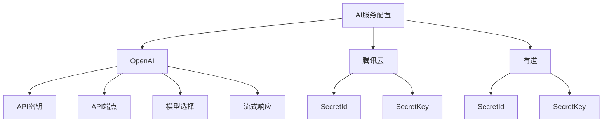
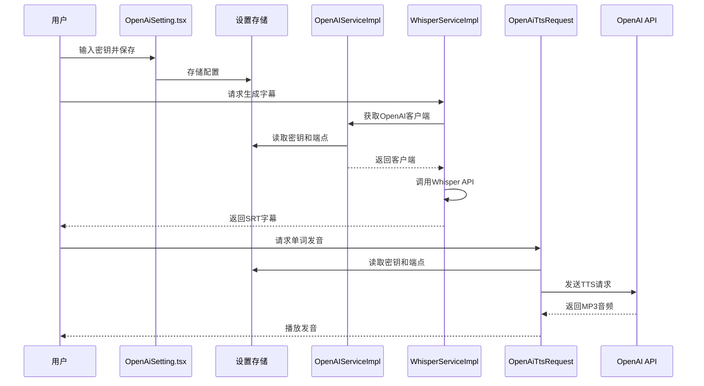
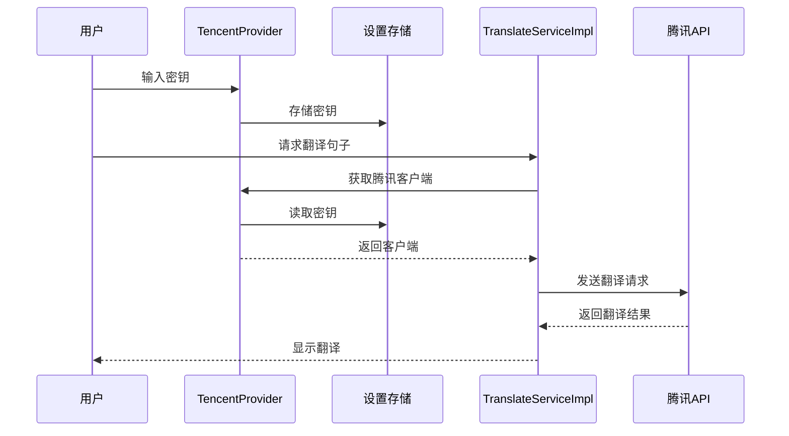
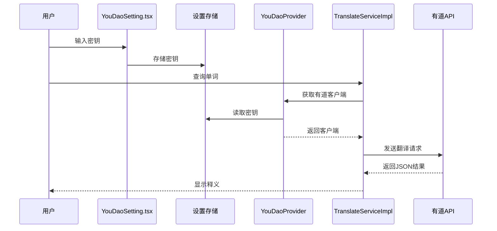
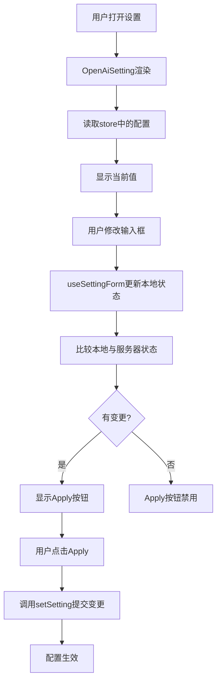

# AI服务配置

<cite>
**本文档中引用的文件**  
- [SettingType.ts](file://src/common/types/SettingType.ts)
- [OpenAiSetting.tsx](file://src/fronted/pages/setting/OpenAiSetting.tsx)
- [YouDaoSetting.tsx](file://src/fronted/pages/setting/YouDaoSetting.tsx)
- [AiProviderServiceImpl.ts](file://src/backend/services/impl/clients/AiProviderServiceImpl.ts)
- [TencentProvider.ts](file://src/backend/services/impl/clients/TencentProvider.ts)
- [YouDaoProvider.ts](file://src/backend/services/impl/clients/YouDaoProvider.ts)
- [OpenAiWhisperRequest.ts](file://src/backend/objs/OpenAiWhisperRequest.ts)
- [OpenAiTtsRequest.ts](file://src/backend/objs/OpenAiTtsRequest.ts)
- [WhisperServiceImpl.ts](file://src/backend/services/impl/WhisperServiceImpl.ts)
- [TranslateServiceImpl.ts](file://src/backend/services/impl/TranslateServiceImpl.ts)
- [OpenAIServiceImpl.ts](file://src/backend/services/impl/OpenAIServiceImpl.ts)
- [store_schema.ts](file://src/common/types/store_schema.ts)
- [Config-OpenAI-API.md](file://Writerside/topics/Config-OpenAI-API.md)
- [Config-YouDao-API.md](file://Writerside/topics/Config-YouDao-API.md)
- [Config-Tencent-API.md](file://Writerside/topics/Config-Tencent-API.md)
</cite>

## 目录
1. [简介](#简介)
2. [AI提供商配置概览](#ai提供商配置概览)
3. [OpenAI 配置](#openai-配置)
4. [腾讯云 配置](#腾讯云-配置)
5. [有道 配置](#有道-配置)
6. [功能应用场景](#功能应用场景)
7. [配置测试与故障排查](#配置测试与故障排查)
8. [性能优化建议](#性能优化建议)
9. [前端配置界面交互逻辑](#前端配置界面交互逻辑)

## 简介
DashPlayer 是一款专为英语学习设计的视频播放器，集成了多种AI服务以增强学习体验。本配置文档旨在详细说明如何集成和配置 OpenAI、腾讯云和有道三大AI提供商的服务，涵盖API密钥设置、模型选择、区域配置、应用场景及故障排查等内容，帮助用户充分发挥AI功能。

## AI提供商配置概览
DashPlayer 支持三种主要AI服务提供商：OpenAI、腾讯云和有道。每种服务通过独立的配置项进行管理，配置信息存储在全局设置中，并通过类型定义 `SettingType` 进行约束。

**Diagram sources**
- [SettingType.ts](file://src/common/types/SettingType.ts)
- [store_schema.ts](file://src/common/types/store_schema.ts)

**Section sources**
- [SettingType.ts](file://src/common/types/SettingType.ts)
- [store_schema.ts](file://src/common/types/store_schema.ts)

## OpenAI 配置
OpenAI 提供强大的语言模型和语音识别功能，用于字幕生成、AI整句学习和TTS（文本转语音）。

### 配置项说明
| 配置项 | 字段名 | 数据类型 | 验证规则 | 默认值 |
|--------|--------|----------|----------|--------|
| API密钥 | `apiKeys.openAi.key` | string | 非空，以 `sk-` 开头 | 无 |
| API端点 | `apiKeys.openAi.endpoint` | string | 有效URL格式 | `https://api.openai.com` |
| 模型选择 | `model.gpt.default` | string | 必须为支持的模型名 | `gpt-4o-mini` |
| 流式响应 | `apiKeys.openAi.stream` | string | 取值为 'on' 或 'off' | `on` |

### 获取API密钥步骤
1. 访问 [OpenAI 官网](https://www.openai.com/) 或使用第三方中转服务（如 one.gptnb.me）。
2. 注册账户并完成支付。
3. 在账户设置中生成API密钥。
4. 将密钥和端点填入 DashPlayer 设置界面。

### 应用场景
- **字幕生成**：调用 `Whisper` 模型将音频转录为SRT字幕。
- **AI整句学习**：使用 `gpt-3.5-turbo` 或 `gpt-4o` 分析句子语法、生成例句。
- **TTS**：通过 `tts-1` 模型生成单词或句子的语音。

**Diagram sources**
- [OpenAiSetting.tsx](file://src/fronted/pages/setting/OpenAiSetting.tsx)
- [OpenAIServiceImpl.ts](file://src/backend/services/impl/OpenAIServiceImpl.ts)
- [WhisperServiceImpl.ts](file://src/backend/services/impl/WhisperServiceImpl.ts)
- [OpenAiWhisperRequest.ts](file://src/backend/objs/OpenAiWhisperRequest.ts)
- [OpenAiTtsRequest.ts](file://src/backend/objs/OpenAiTtsRequest.ts)

**Section sources**
- [OpenAiSetting.tsx](file://src/fronted/pages/setting/OpenAiSetting.tsx)
- [OpenAIServiceImpl.ts](file://src/backend/services/impl/OpenAIServiceImpl.ts)
- [WhisperServiceImpl.ts](file://src/backend/services/impl/WhisperServiceImpl.ts)
- [OpenAiWhisperRequest.ts](file://src/backend/objs/OpenAiWhisperRequest.ts)
- [OpenAiTtsRequest.ts](file://src/backend/objs/OpenAiTtsRequest.ts)
- [Config-OpenAI-API.md](file://Writerside/topics/Config-OpenAI-API.md)

## 腾讯云 配置
腾讯云提供机器翻译服务，用于字幕的中英互译。

### 配置项说明
| 配置项 | 字段名 | 数据类型 | 验证规则 | 默认值 |
|--------|--------|----------|----------|--------|
| SecretId | `apiKeys.tencent.secretId` | string | 非空 | 无 |
| SecretKey | `apiKeys.tencent.secretKey` | string | 非空 | 无 |

### 获取API密钥步骤
1. 登录 [腾讯云官网](https://cloud.tencent.com/)。
2. 完成个人实名认证。
3. 进入 [访问管理](https://console.cloud.tencent.com/cam/capi) 创建子账号。
4. 为子账号授予“机器翻译”权限。
5. 获取 `SecretId` 和 `SecretKey` 并填入设置。

### 应用场景
- **字幕翻译**：将英文SRT字幕翻译为中文，或反之。

**Diagram sources**
- [TencentProvider.ts](file://src/backend/services/impl/clients/TencentProvider.ts)
- [TranslateServiceImpl.ts](file://src/backend/services/impl/TranslateServiceImpl.ts)

**Section sources**
- [TencentProvider.ts](file://src/backend/services/impl/clients/TencentProvider.ts)
- [TranslateServiceImpl.ts](file://src/backend/services/impl/TranslateServiceImpl.ts)
- [Config-Tencent-API.md](file://Writerside/topics/Config-Tencent-API.md)

## 有道 配置
有道提供文本翻译和语音合成功能，用于单词查询和发音。

### 配置项说明
| 配置项 | 字段名 | 数据类型 | 验证规则 | 默认值 |
|--------|--------|----------|----------|--------|
| AppKey (SecretId) | `apiKeys.youdao.secretId` | string | 非空 | 无 |
| SecretKey | `apiKeys.youdao.secretKey` | string | 非空 | 无 |

### 获取API密钥步骤
1. 访问 [有道智云 AI 开放平台](http://ai.youdao.com)。
2. 注册并登录。
3. 创建应用，选择“文本翻译”和“语音合成”服务。
4. 在应用总览中获取 `应用ID` 和 `密钥`。
5. 将 `应用ID` 填入 `SecretId`，`密钥` 填入 `SecretKey`。

### 应用场景
- **查单词**：鼠标悬停在字幕单词上，调用有道API查询释义。
- **单词发音**：调用TTS服务播放单词发音。

**Diagram sources**
- [YouDaoSetting.tsx](file://src/fronted/pages/setting/YouDaoSetting.tsx)
- [YouDaoProvider.ts](file://src/backend/services/impl/clients/YouDaoProvider.ts)
- [TranslateServiceImpl.ts](file://src/backend/services/impl/TranslateServiceImpl.ts)

**Section sources**
- [YouDaoSetting.tsx](file://src/fronted/pages/setting/YouDaoSetting.tsx)
- [YouDaoProvider.ts](file://src/backend/services/impl/clients/YouDaoProvider.ts)
- [TranslateServiceImpl.ts](file://src/backend/services/impl/TranslateServiceImpl.ts)
- [Config-YouDao-API.md](file://Writerside/topics/Config-YouDao-API.md)

## 功能应用场景
| 功能 | 使用的AI服务 | 触发方式 | 说明 |
|------|---------------|----------|------|
| AI字幕生成 | OpenAI (Whisper) | Transcript 页面点击“转录” | 将视频音频转录为SRT字幕 |
| AI整句学习 | OpenAI (gpt-3.5-turbo/gpt-4o) | 播放时按 `?` 键 | 分析当前句子的语法、生词、词组 |
| 查单词 | 有道 | 鼠标悬停字幕单词 | 显示单词释义和发音 |
| 字幕翻译 | 腾讯云 | 自动加载 | 将英文SRT翻译为中文 |
| TTS发音 | OpenAI (tts-1) | 查单词时点击喇叭图标 | 播放单词或句子的语音 |

## 配置测试与故障排查
### 配置测试方法
1. **OpenAI**：进入 Transcript 页面，选择视频并点击“转录”，观察是否生成SRT文件。
2. **腾讯云**：播放有英文字幕的视频，检查是否自动显示中文翻译。
3. **有道**：播放视频，将鼠标悬停在字幕单词上，检查是否弹出释义。

### 常见错误与排查
| 错误 | 可能原因 | 解决方案 |
|------|----------|----------|
| 401 认证失败 | API密钥错误或过期 | 重新生成密钥并更新配置 |
| 模型不可用 | 模型名称拼写错误或服务不支持 | 检查 `model.gpt.default` 是否为 `gpt-3.5-turbo`、`gpt-4o` 或 `gpt-4o-mini` |
| 转录失败 | 网络超时或代理问题 | 关闭流式响应，或检查代理设置 |
| 翻译无响应 | 密钥权限不足 | 检查腾讯云子账号是否仅授予“机器翻译”权限 |

## 性能优化建议
- **请求超时设置**：在 `RateLimiter` 中合理设置 `whisper` 和 `tts` 的请求间隔，避免触发API限流。
- **并发限制**：`WhisperServiceImpl` 采用分片处理音频，建议保持默认的60秒分段，平衡速度与内存占用。
- **缓存策略**：`TranslateServiceImpl` 已实现本地缓存，减少重复API调用，提高响应速度。
- **流式响应**：若使用中转服务遇到连接中断，建议在OpenAI设置中关闭“流式响应”。

## 前端配置界面交互逻辑
前端配置界面基于 `useSettingForm` Hook 实现，支持实时预览和提交。

### 组件结构
- **OpenAiSetting.tsx**：管理OpenAI相关配置，包含密钥、端点、模型选择和流式开关。
- **YouDaoSetting.tsx**：管理有道密钥输入。
- **SettingLayout.tsx**：定义所有配置类型，包括 `'open-ai'`、`'you-dao'` 等。

### 交互流程
1. 用户在输入框修改配置。
2. `useSettingForm` 监听变化，更新本地状态。
3. 点击“Apply”时，比较本地状态与服务器状态，仅提交变更项。
4. 提交后，设置立即生效，无需重启应用。

**Diagram sources**
- [OpenAiSetting.tsx](file://src/fronted/pages/setting/OpenAiSetting.tsx)
- [YouDaoSetting.tsx](file://src/fronted/pages/setting/YouDaoSetting.tsx)
- [useSettingForm.ts](file://src/fronted/hooks/useSettingForm.ts)

**Section sources**
- [OpenAiSetting.tsx](file://src/fronted/pages/setting/OpenAiSetting.tsx)
- [YouDaoSetting.tsx](file://src/fronted/pages/setting/YouDaoSetting.tsx)
- [useSettingForm.ts](file://src/fronted/hooks/useSettingForm.ts)