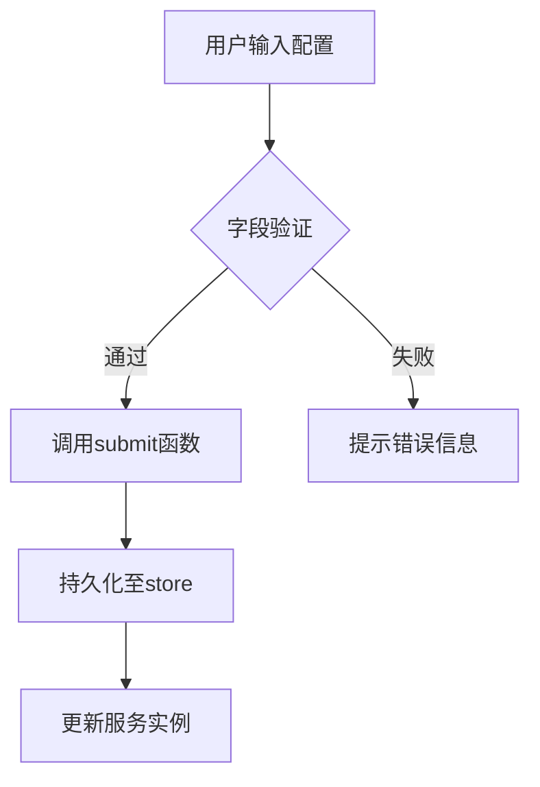
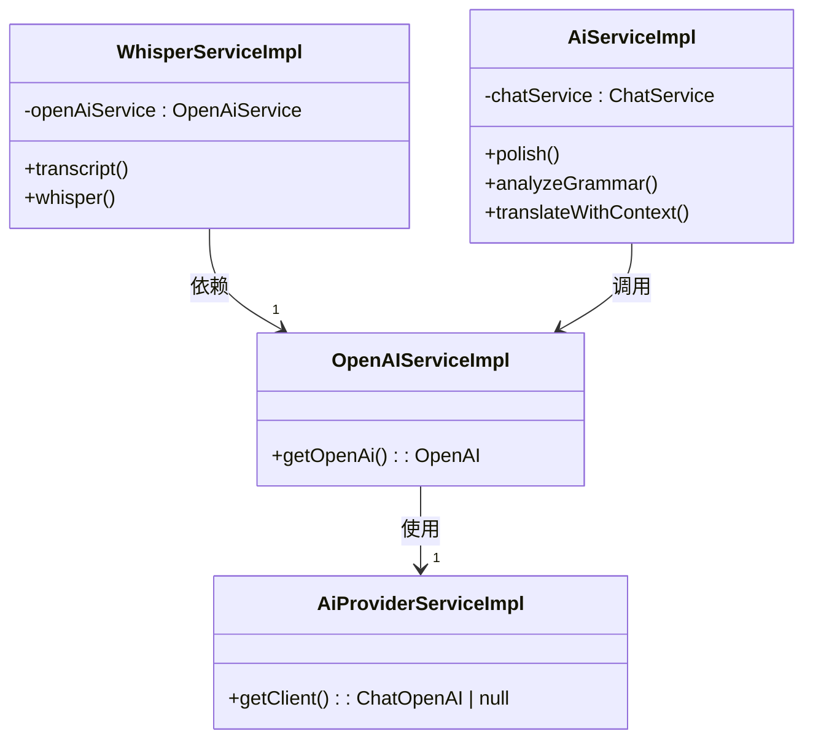
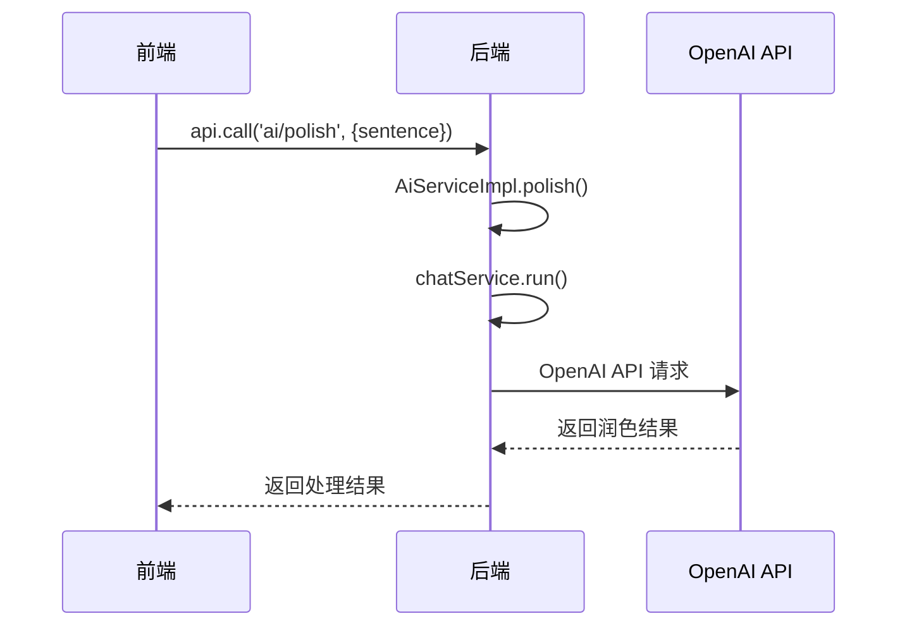

# OpenAI 配置

<cite>
**本文档中引用的文件**  
- [OpenAiSetting.tsx](file://src/fronted/pages/setting/OpenAiSetting.tsx)
- [SettingType.ts](file://src/common/types/SettingType.ts)
- [OpenAIServiceImpl.ts](file://src/backend/services/impl/OpenAIServiceImpl.ts)
- [WhisperServiceImpl.ts](file://src/backend/services/impl/WhisperServiceImpl.ts)
- [AiServiceImpl.ts](file://src/backend/services/AiServiceImpl.ts)
- [AiProviderServiceImpl.ts](file://src/backend/services/impl/clients/AiProviderServiceImpl.ts)
- [OpenAiWhisperRequest.ts](file://src/backend/objs/OpenAiWhisperRequest.ts)
- [OpenAiTtsRequest.ts](file://src/backend/objs/OpenAiTtsRequest.ts)
</cite>

## 目录
1. [简介](#简介)
2. [配置字段说明](#配置字段说明)
3. [获取OpenAI API密钥步骤](#获取openai-api密钥步骤)
4. [AI功能应用场景](#ai功能应用场景)
5. [前端配置界面分析](#前端配置界面分析)
6. [后端服务交互机制](#后端服务交互机制)
7. [配置测试与健康检查](#配置测试与健康检查)
8. [常见错误与排查方案](#常见错误与排查方案)
9. [性能优化建议](#性能优化建议)
10. [IPC调用代码示例](#ipc调用代码示例)

## 简介
本文档详细说明DashPlayer中OpenAI服务的集成与配置方法。通过`open-ai`配置类型，用户可启用AI驱动的字幕转录、语法分析、句子润色、翻译增强和TTS语音合成功能。文档涵盖配置项定义、API密钥获取、前后端交互逻辑及故障排查。

## 配置字段说明

### 核心配置字段
根据`SettingType.ts`和`OpenAiSetting.tsx`中的定义，OpenAI相关配置字段如下：

| 字段 | 路径 | 含义 | 默认值 | 验证规则 |
|------|------|------|--------|----------|
| API密钥 | `apiKeys.openAi.key` | 用于身份验证的OpenAI API密钥 | 无 | 必填，非空字符串 |
| API地址 | `apiKeys.openAi.endpoint` | OpenAI服务的API基础URL | `https://api.openai.com` | 必填，有效URL格式 |
| 流式响应 | `apiKeys.openAi.stream` | 是否启用流式响应 | `off` | 可选值：`on` / `off` |
| 默认模型 | `model.gpt.default` | 默认使用的GPT模型 | `gpt-4o-mini` | 支持`gpt-4o-mini`、`gpt-4o`、`gpt-3.5-turbo` |

**Section sources**
- [SettingType.ts](file://src/common/types/SettingType.ts)
- [OpenAiSetting.tsx](file://src/fronted/pages/setting/OpenAiSetting.tsx)

## 获取OpenAI API密钥步骤

### 步骤一：注册OpenAI账户
1. 访问 [OpenAI官网](https://openai.com)
2. 点击“Sign Up”进行注册
3. 使用邮箱或Google账号登录

### 步骤二：启用API访问权限
1. 登录后进入 [个人设置页面](https://platform.openai.com/account)
2. 在“Billing”选项卡中添加支付方式以激活API使用权限

### 步骤三：生成API密钥
1. 进入 [API Keys页面](https://platform.openai.com/api-keys)
2. 点击“Create new secret key”
3. 输入密钥名称（如：DashPlayer-Key）
4. 点击“Create secret key”
5. **立即复制并安全保存**生成的密钥（仅显示一次）

### 步骤四：在DashPlayer中配置
将复制的密钥粘贴至DashPlayer设置界面的“key”输入框，并确认API地址为`https://api.openai.com`。

## AI功能应用场景

### 1. AI语法分析
调用`analyzeGrammar`方法，对用户选中的句子进行语法结构解析，识别从句、时态、语态等语法点。

[SPEC SYMBOL](file://src/backend/services/AiServiceImpl.ts#L88-L95)

### 2. 句子润色
通过`polish`方法调用GPT模型，对原始句子进行语言优化，提升表达流畅度与地道性。

[SPEC SYMBOL](file://src/backend/services/AiServiceImpl.ts#L51-L53)

### 3. 翻译增强
使用`translateWithContext`方法，在上下文语境中对句子进行翻译，提高翻译准确性。

[SPEC SYMBOL](file://src/backend/services/AiServiceImpl.ts#L150-L152)

### 4. TTS语音合成
利用`OpenAiTtsRequest`类调用`tts-1`模型，将文本转换为自然语音（MP3格式），用于听力训练。

[SPEC SYMBOL](file://src/backend/objs/OpenAiTtsRequest.ts#L10-L61)

### 5. 字幕转录（Whisper）
通过`WhisperServiceImpl`调用`whisper-1`模型，将视频音频自动转录为SRT字幕文件。

[SPEC SYMBOL](file://src/backend/services/impl/WhisperServiceImpl.ts#L59-L92)

**Section sources**
- [AiServiceImpl.ts](file://src/backend/services/AiServiceImpl.ts)
- [WhisperServiceImpl.ts](file://src/backend/services/impl/WhisperServiceImpl.ts)
- [OpenAiTtsRequest.ts](file://src/backend/objs/OpenAiTtsRequest.ts)

## 前端配置界面分析

### UI布局结构
`OpenAiSetting.tsx`组件采用表单布局，包含以下元素：
- 密钥输入框（密码类型）
- API地址输入框
- 模型选择下拉菜单（含推荐选项）
- 流式响应开关
- 文档链接与应用按钮

### 输入验证逻辑
- 所有字段在提交时进行非空校验
- API地址需符合URL格式
- 密钥字段为敏感信息，前端隐藏显示

### 保存机制
通过`useSettingForm` Hook收集配置变更，点击“Apply”按钮后调用`submit`函数持久化至本地存储。



**Diagram sources**
- [OpenAiSetting.tsx](file://src/fronted/pages/setting/OpenAiSetting.tsx)

**Section sources**
- [OpenAiSetting.tsx](file://src/fronted/pages/setting/OpenAiSetting.tsx)

## 后端服务交互机制

### 服务依赖关系


**Diagram sources**
- [OpenAIServiceImpl.ts](file://src/backend/services/impl/OpenAIServiceImpl.ts)
- [AiProviderServiceImpl.ts](file://src/backend/services/impl/clients/AiProviderServiceImpl.ts)
- [WhisperServiceImpl.ts](file://src/backend/services/impl/WhisperServiceImpl.ts)
- [AiServiceImpl.ts](file://src/backend/services/AiServiceImpl.ts)

### 配置加载流程
1. 前端提交配置 → IPC调用后端`SettingService`
2. 配置写入`store`（基于`storeGet`）
3. `OpenAIServiceImpl`在首次调用时读取`apiKeys.openAi.key`和`endpoint`
4. 动态创建`OpenAI`客户端实例

[SPEC SYMBOL](file://src/backend/services/impl/OpenAIServiceImpl.ts#L10-L32)

### 请求构造与发送
- `OpenAiWhisperRequest.build()` 验证配置并创建请求对象
- `invoke()` 方法执行实际API调用，支持取消操作
- 使用`RateLimiter`控制请求频率，避免限流

[SPEC SYMBOL](file://src/backend/objs/OpenAiWhisperRequest.ts#L35-L93)

**Section sources**
- [OpenAIServiceImpl.ts](file://src/backend/services/impl/OpenAIServiceImpl.ts)
- [OpenAiWhisperRequest.ts](file://src/backend/objs/OpenAiWhisperRequest.ts)
- [WhisperServiceImpl.ts](file://src/backend/services/impl/WhisperServiceImpl.ts)

## 配置测试与健康检查
目前系统未提供显式的健康检查接口，可通过以下方式验证配置有效性：
1. 尝试执行一次字幕转录任务
2. 观察日志中是否出现“未设置 OpenAI 密钥”错误
3. 检查网络请求是否成功返回200状态码
4. 查看生成的SRT文件内容是否合理

建议未来实现`/api/ai/health`端点，返回模型可用性与认证状态。

## 常见错误与排查方案

### 401 Unauthorized
- **原因**：API密钥无效或缺失
- **排查**：
  1. 检查`apiKeys.openAi.key`是否正确配置
  2. 确认密钥未过期或被撤销
  3. 验证`storeGet('apiKeys.openAi.key')`能否正确读取

[SPEC SYMBOL](file://src/backend/services/impl/WhisperServiceImpl.ts#L108-L125)

### 404 Model Not Found
- **原因**：请求的模型名不支持
- **排查**：
  1. 确认`model.gpt.default`值为有效模型（如`gpt-3.5-turbo`）
  2. 检查账户是否开通对应模型权限

### 转录失败（Whisper）
- **原因**：音频分片处理异常或API调用失败
- **排查**：
  1. 检查`ffmpegService.splitToAudio`是否正常生成音频片段
  2. 查看`RateLimiter.wait('whisper')`是否阻塞过久
  3. 验证`openAi.audio.transcriptions.create`参数正确性

[SPEC SYMBOL](file://src/backend/services/impl/WhisperServiceImpl.ts#L127-L154)

**Section sources**
- [WhisperServiceImpl.ts](file://src/backend/services/impl/WhisperServiceImpl.ts)
- [OpenAIServiceImpl.ts](file://src/backend/services/impl/OpenAIServiceImpl.ts)

## 性能优化建议

### 1. 调整请求超时
在`OpenAI`客户端配置中增加超时设置：
```ts
new OpenAI({
  timeout: 30000, // 30秒超时
  baseURL: ep + '/v1',
  apiKey: ak
});
```

### 2. 启用缓存机制
对高频请求（如单词释义、例句生成）使用`CacheService`进行结果缓存，减少重复API调用。

### 3. 并行处理音频分片
当前`WhisperServiceImpl`中`files = [files[0]];`限制了仅处理首个分片，应移除此行以实现并行转录。

[SPEC SYMBOL](file://src/backend/services/impl/WhisperServiceImpl.ts#L72)

### 4. 模型选择优化
默认使用轻量级`gpt-4o-mini`模型，在需要高精度时切换至`gpt-4o`，平衡性能与成本。

## IPC调用代码示例
以下为前端通过IPC调用后端AI服务的典型流程：



具体调用方式：
```ts
await api.call('ai/polish', { taskId: 1, sentence: 'Hello world' });
```

**Diagram sources**
- [AiServiceImpl.ts](file://src/backend/services/AiServiceImpl.ts)

**Section sources**
- [AiServiceImpl.ts](file://src/backend/services/AiServiceImpl.ts)