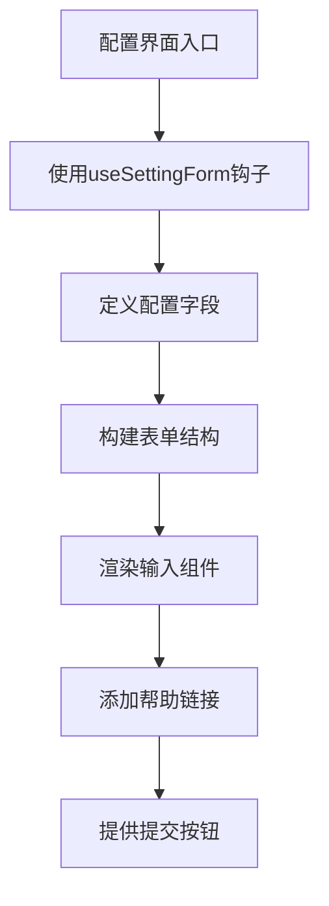
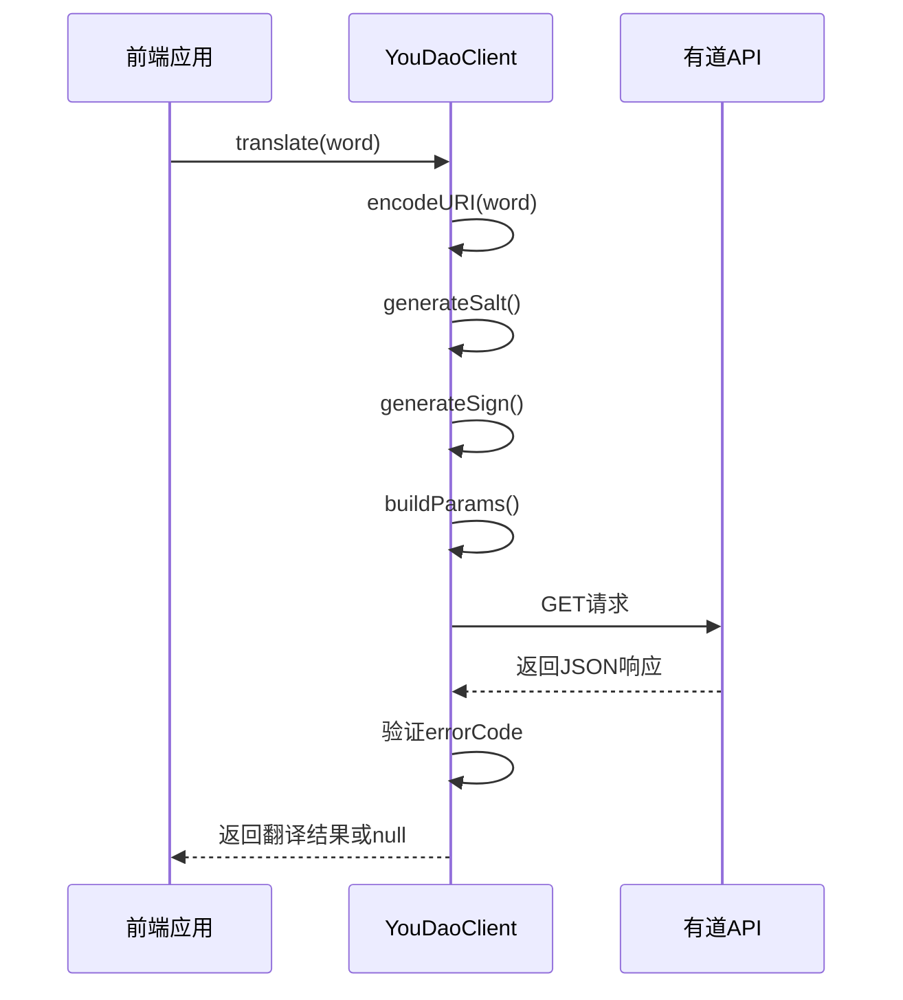
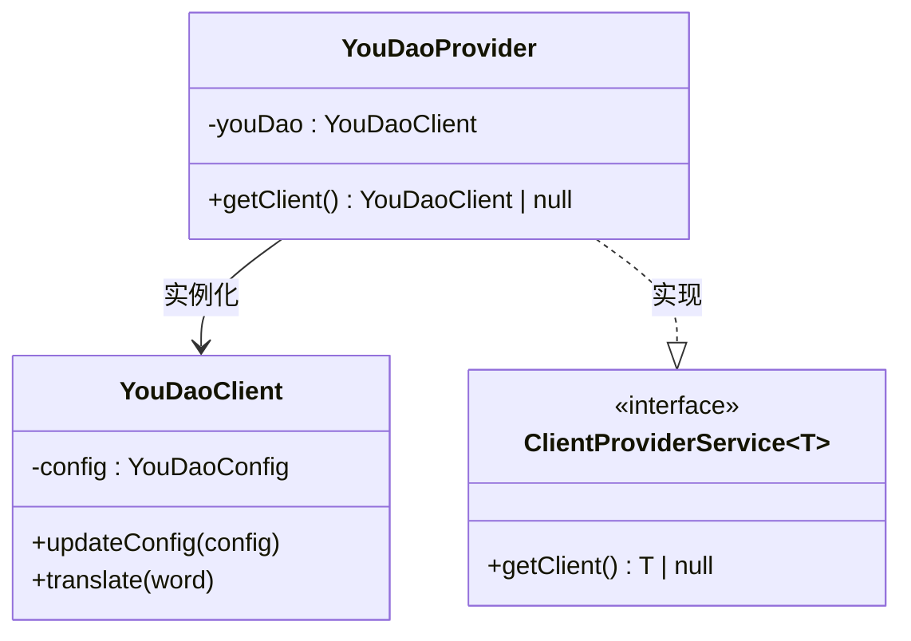
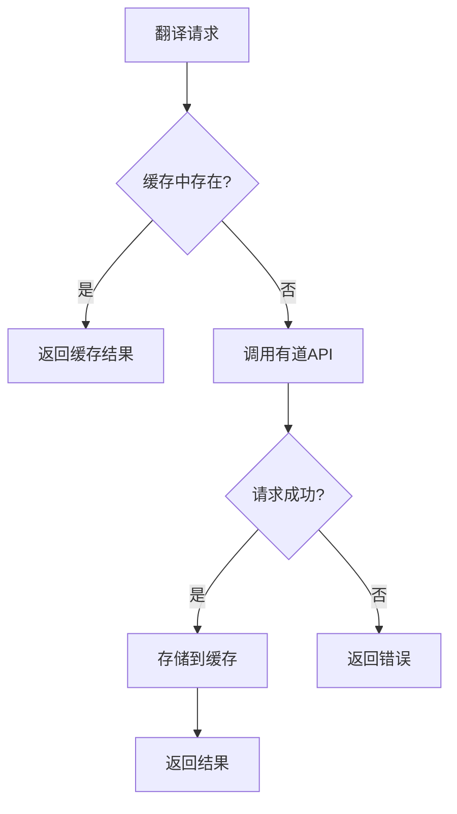

# 有道 AI 配置

<cite>
**本文档引用文件**   
- [YouDaoSetting.tsx](file://src/fronted/pages/setting/YouDaoSetting.tsx)
- [YouDaoClient.ts](file://src/backend/objs/YouDaoClient.ts)
- [YouDaoProvider.ts](file://src/backend/services/impl/clients/YouDaoProvider.ts)
- [SettingType.ts](file://src/common/types/SettingType.ts)
- [SettingServiceImpl.ts](file://src/backend/services/impl/SettingServiceImpl.ts)
- [useSettingForm.ts](file://src/fronted/hooks/useSettingForm.ts)
- [SettingInput.tsx](file://src/fronted/components/setting/SettingInput.tsx)
</cite>

## 目录
1. [简介](#简介)
2. [配置字段说明](#配置字段说明)
3. [有道开放平台接入流程](#有道开放平台接入流程)
4. [前端配置界面实现](#前端配置界面实现)
5. [客户端请求实现](#客户端请求实现)
6. [服务提供者适配](#服务提供者适配)
7. [常见问题与解决方案](#常见问题与解决方案)
8. [性能优化建议](#性能优化建议)

## 简介
本文档详细说明了DashPlayer项目中集成有道AI服务的配置方法，涵盖字幕翻译、单词释义和短语分析三大核心功能。文档将深入解析配置结构、前端界面、后端请求逻辑及服务适配机制，为开发者提供完整的集成指导。

## 配置字段说明
根据`SettingType.ts`中的配置结构，有道AI服务的配置字段如下：

**配置字段定义**
- `apiKeys.youdao.secretId`: 有道应用的App ID，用于标识应用身份
- `apiKeys.youdao.secretKey`: 有道应用的App Secret，用于请求签名验证

这些字段存储在应用的全局设置中，通过`storeGet`和`storeSet`进行读写操作，确保配置在应用重启后持久化。

**Section sources**
- [SettingType.ts](file://src/common/types/SettingType.ts#L0-L60)

## 有道开放平台接入流程
要使用有道AI服务，需完成以下注册和配置步骤：

1. **访问有道智云平台**：打开[有道智云官网](https://ai.youdao.com)
2. **注册/登录账号**：使用手机号或邮箱注册并登录
3. **创建应用**：
   - 进入"控制台" → "我的应用"
   - 点击"创建应用"
   - 填写应用名称、描述等基本信息
4. **开通服务**：
   - 在应用详情页，选择"机器翻译"或"语音识别"服务
   - 提交服务开通申请
5. **获取凭证**：
   - 服务开通后，系统将生成App ID和App Secret
   - 复制这两个值并保存到安全位置
6. **配置回调域名**：如有需要，配置API调用的回调域名白名单

获取到的App ID和App Secret即为配置中的`secretId`和`secretKey`。

## 前端配置界面实现
`YouDaoSetting.tsx`组件实现了有道AI服务的配置界面，采用React函数式组件和TypeScript构建。

**Diagram sources**
- [YouDaoSetting.tsx](file://src/fronted/pages/setting/YouDaoSetting.tsx#L10-L72)

### 表单设计
配置界面采用简洁的表单布局，包含以下元素：

- **标题区域**：显示"查单词"标题和功能描述
- **输入字段**：
  - `secretId`输入框：用于输入App ID
  - `secretKey`输入框：类型为密码，用于安全输入App Secret
- **帮助信息**：提供文档链接，指导用户获取凭证
- **操作按钮**：
  - "查看文档"按钮：跳转到官方文档
  - "Apply"按钮：提交配置更改

### 输入提示与状态反馈
界面通过以下机制提供用户体验优化：

- **实时状态反馈**：`eqServer`状态指示当前配置是否与服务器一致，决定"Apply"按钮的禁用状态
- **密码保护**：`secretKey`字段设置为密码类型，输入内容被隐藏
- **帮助链接**：提供直接跳转到文档的链接，方便用户获取帮助
- **响应式布局**：使用Tailwind CSS实现自适应布局

**Section sources**
- [YouDaoSetting.tsx](file://src/fronted/pages/setting/YouDaoSetting.tsx#L10-L72)
- [SettingInput.tsx](file://src/fronted/components/setting/SettingInput.tsx#L0-L53)
- [useSettingForm.ts](file://src/fronted/hooks/useSettingForm.ts#L0-L54)

## 客户端请求实现
`YouDaoClient.ts`实现了与有道API的通信逻辑，包含请求参数拼接、签名生成和响应解析等核心功能。

**Diagram sources**
- [YouDaoClient.ts](file://src/backend/objs/YouDaoClient.ts#L10-L77)

### 请求参数拼接
客户端通过`generateUrlParams`方法将参数映射转换为URL查询字符串：

**Diagram sources**
- [YouDaoClient.ts](file://src/backend/objs/YouDaoClient.ts#L35-L42)

### 签名生成（MD5）
文档中实际使用的是MD5而非SHA-256进行签名生成：

1. **生成随机盐值**：`getRandomN(1000)`生成0-1000间的随机整数作为salt
2. **构建签名原文**：`appKey + word + salt + secretKey`
3. **MD5加密**：使用Node.js crypto模块进行MD5哈希
4. **返回十六进制结果**：digest('hex')生成32位小写十六进制字符串

签名算法确保了请求的完整性和安全性，防止参数被篡改。

### 响应解析
响应处理流程如下：

1. 发送GET请求到`http://openapi.youdao.com/api`
2. 检查响应中的`errorCode`字段
3. 若`errorCode`不为'0'，记录错误并返回null
4. 若成功，将响应数据JSON序列化后返回

**Section sources**
- [YouDaoClient.ts](file://src/backend/objs/YouDaoClient.ts#L10-L77)

## 服务提供者适配
`YouDaoProvider.ts`实现了`ClientProviderService`接口，作为有道服务的适配层。

**Diagram sources**
- [YouDaoProvider.ts](file://src/backend/services/impl/clients/YouDaoProvider.ts#L7-L31)
- [YouDaoClient.ts](file://src/backend/objs/YouDaoClient.ts#L10-L77)

### 接口适配机制
`YouDaoProvider`通过以下方式适配统一接口：

1. **依赖注入**：使用`@injectable()`装饰器支持IoC容器管理
2. **延迟初始化**：`getClient()`方法在调用时才检查和创建客户端实例
3. **配置管理**：从全局存储读取`secretId`和`secretKey`，动态更新客户端配置
4. **空值处理**：当凭证缺失时返回null，由调用方处理服务不可用情况

### 配置更新流程
1. 调用`storeGet('apiKeys.youdao.secretId')`获取App ID
2. 调用`storeGet('apiKeys.youdao.secretKey')`获取App Secret
3. 检查凭证是否为空，若为空返回null
4. 创建配置对象`YouDaoConfig`
5. 调用`youDao.updateConfig()`更新客户端配置
6. 返回准备就绪的客户端实例

**Section sources**
- [YouDaoProvider.ts](file://src/backend/services/impl/clients/YouDaoProvider.ts#L7-L31)

## 常见问题与解决方案
### 签名错误（errorCode: 102）
**问题原因**：签名生成不正确，通常由以下原因导致：
- App ID或App Secret输入错误
- salt值生成不符合要求
- 签名原文拼接顺序错误
- 编码方式不一致

**解决方案**：
1. 核对App ID和App Secret是否正确复制
2. 确保签名原文为`appKey + q + salt + appSecret`
3. 验证MD5哈希结果为32位小写十六进制字符串
4. 检查请求参数是否经过正确URI编码

### 应用未开通服务（errorCode: 108）
**问题原因**：注册的应用未开通相应的AI服务

**解决方案**：
1. 登录有道智云控制台
2. 进入应用管理页面
3. 选择需要开通的服务（如机器翻译）
4. 提交服务开通申请
5. 等待审核通过

### 凭证无效（errorCode: 101）
**问题原因**：App ID或App Secret格式不正确

**解决方案**：
1. 检查输入框是否有额外空格
2. 确认使用的是正确的应用凭证
3. 重新从有道平台复制凭证

**Section sources**
- [YouDaoClient.ts](file://src/backend/objs/YouDaoClient.ts#L65-L70)
- [YouDaoProvider.ts](file://src/backend/services/impl/clients/YouDaoProvider.ts#L15-L18)

## 性能优化建议
### 批量请求优化
对于大量单词的翻译需求，建议实现批量请求机制：

1. **合并请求**：将多个单词合并到单个请求中
2. **队列管理**：使用队列缓存待翻译单词
3. **定时发送**：设置定时器定期发送批量请求
4. **大小控制**：限制单次请求的单词数量，避免超时

### 本地缓存策略
`TranslateServiceImpl.ts`已实现本地缓存机制，建议进一步优化：

**Diagram sources**
- [TranslateServiceImpl.ts](file://src/backend/services/impl/TranslateServiceImpl.ts#L0-L42)

**优化建议**：
1. **缓存过期策略**：为缓存项设置合理的过期时间
2. **缓存大小限制**：防止内存无限增长
3. **持久化存储**：将高频翻译结果持久化到数据库
4. **预加载机制**：在空闲时预加载常用词汇

通过批量请求和本地缓存的结合，可显著减少API调用次数，提高响应速度并降低服务成本。

**Section sources**
- [TranslateServiceImpl.ts](file://src/backend/services/impl/TranslateServiceImpl.ts#L0-L42)